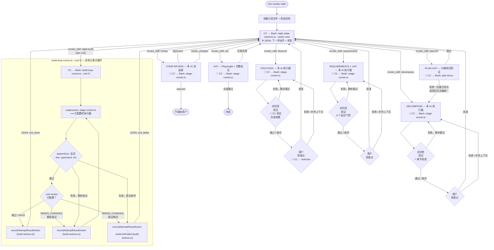
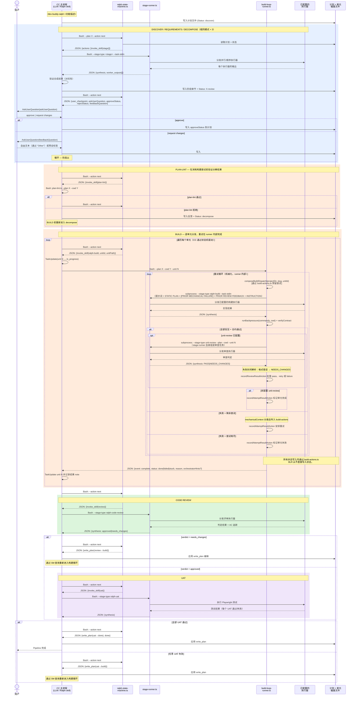
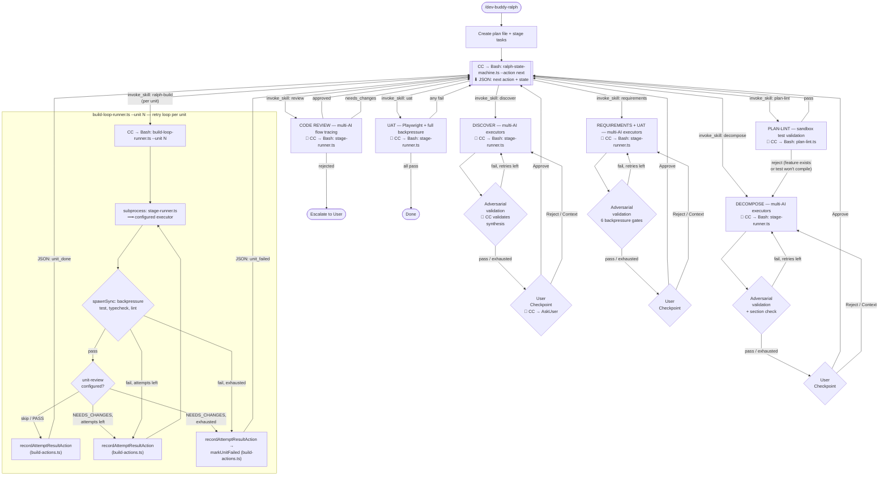
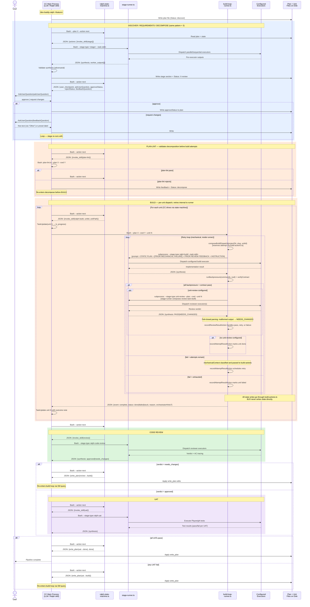

# codex advisor artifact

- Provider: codex
- Exit code: 0
- Created at: 2026-05-30T08:58:51.342Z

## Original task

TASK-20260530-03: 分析4个GitHub项目并评估可借鉴内容

**Context:**
Claude已完成独立分析，结果见：`.omc/collaboration/artifacts/20260530-0848-claude-github-projects-analysis.md`

**Your Task:**
请独立分析以下4个项目，不要先看Claude的分析：

1. https://github.com/Z-M-Huang/vcp/tree/main/plugins/dev-buddy
2. https://github.com/shakacode/claude-code-commands-skills-agents/blob/main/docs/claude-code-with-codex.md
3. https://github.com/doccker/cc-use-exp
4. https://github.com/smart-lty/Claude-Team

**分析要点:**
- 每个项目的核心模式和架构
- 哪些内容值得借鉴到我们的协作机制
- Gemini CLI集成的可行性（用户已安装Gemini CLI）
- 优先级排序（P0/P1/P2）

**输出要求:**
1. 创建独立分析文档：`.omc/collaboration/artifacts/20260530-HHMM-codex-github-projects-analysis.md`
2. 包含你的优先级建议
3. 列出需要与Claude讨论的关键问题
4. 完成后更新协作状态

**协作协议:** 遵循 `.omc/collaboration/protocol.md`

## Final prompt

TASK-20260530-03: 分析4个GitHub项目并评估可借鉴内容

**Context:**
Claude已完成独立分析，结果见：`.omc/collaboration/artifacts/20260530-0848-claude-github-projects-analysis.md`

**Your Task:**
请独立分析以下4个项目，不要先看Claude的分析：

1. https://github.com/Z-M-Huang/vcp/tree/main/plugins/dev-buddy
2. https://github.com/shakacode/claude-code-commands-skills-agents/blob/main/docs/claude-code-with-codex.md
3. https://github.com/doccker/cc-use-exp
4. https://github.com/smart-lty/Claude-Team

**分析要点:**
- 每个项目的核心模式和架构
- 哪些内容值得借鉴到我们的协作机制
- Gemini CLI集成的可行性（用户已安装Gemini CLI）
- 优先级排序（P0/P1/P2）

**输出要求:**
1. 创建独立分析文档：`.omc/collaboration/artifacts/20260530-HHMM-codex-github-projects-analysis.md`
2. 包含你的优先级建议
3. 列出需要与Claude讨论的关键问题
4. 完成后更新协作状态

**协作协议:** 遵循 `.omc/collaboration/protocol.md`

## Raw output

```text
完成。独立分析文档已写入：

[20260530-1654-codex-github-projects-analysis.md](/home/caohui/projects/graduation-leave-system/.omc/collaboration/artifacts/20260530-1654-codex-github-projects-analysis.md)

我未读取 Claude 的分析文件。文档包含了 4 个项目的核心模式、可借鉴点、Gemini CLI 集成可行性、P0/P1/P2 优先级，以及需要与 Claude 讨论的问题。

协作状态也已更新：

- `events.jsonl` 追加了 Codex claim 事件 `id=16` 和 completed 事件 `id=17`
- `state.json` 已更新为 `status: completed`、`active_agent: none`
- 任务文档已标记 `completed`
- 已校验 `events.jsonl` JSON 有效、无重复 id，且 `state.last_event_id=17`

核心建议一句话：P0 先做 Gemini 只读 artifact workflow、三 agent 角色路由、独立分析协议和 journal 校验，不建议一开始引入完整 Ralph pipeline 或用户级 MCP 自动安装。


OpenAI Codex v0.134.0
--------
workdir: /home/caohui/projects/graduation-leave-system
model: gpt-5.5
provider: fox
approval: never
sandbox: danger-full-access
reasoning effort: high
reasoning summaries: none
session id: 019e7812-f30d-7941-9fb7-812a3695a16b
--------
user
TASK-20260530-03: 分析4个GitHub项目并评估可借鉴内容

**Context:**
Claude已完成独立分析，结果见：`.omc/collaboration/artifacts/20260530-0848-claude-github-projects-analysis.md`

**Your Task:**
请独立分析以下4个项目，不要先看Claude的分析：

1. https://github.com/Z-M-Huang/vcp/tree/main/plugins/dev-buddy
2. https://github.com/shakacode/claude-code-commands-skills-agents/blob/main/docs/claude-code-with-codex.md
3. https://github.com/doccker/cc-use-exp
4. https://github.com/smart-lty/Claude-Team

**分析要点:**
- 每个项目的核心模式和架构
- 哪些内容值得借鉴到我们的协作机制
- Gemini CLI集成的可行性（用户已安装Gemini CLI）
- 优先级排序（P0/P1/P2）

**输出要求:**
1. 创建独立分析文档：`.omc/collaboration/artifacts/20260530-HHMM-codex-github-projects-analysis.md`
2. 包含你的优先级建议
3. 列出需要与Claude讨论的关键问题
4. 完成后更新协作状态

**协作协议:** 遵循 `.omc/collaboration/protocol.md`
codex
我会先读取项目里的协作协议和命令规范，然后独立拉取/查看这 4 个仓库内容；我不会打开 Claude 已生成的分析文件。
exec
/bin/bash -lc "pwd && sed -n '1,220p' /home/caohui/.codex/RTK.md" in /home/caohui/projects/graduation-leave-system
 succeeded in 0ms:
/home/caohui/projects/graduation-leave-system
# RTK - Rust Token Killer (Codex CLI)

**Usage**: Token-optimized CLI proxy for shell commands.

## Rule

Always prefix shell commands with `rtk`.

Examples:

```bash
rtk git status
rtk cargo test
rtk npm run build
rtk pytest -q
```

## Meta Commands

```bash
rtk gain            # Token savings analytics
rtk gain --history  # Recent command savings history
rtk proxy <cmd>     # Run raw command without filtering
```

## Verification

```bash
rtk --version
rtk gain
which rtk
```

exec
/bin/bash -lc "sed -n '1,260p' .omc/collaboration/protocol.md" in /home/caohui/projects/graduation-leave-system
 succeeded in 0ms:
# Claude-Codex Collaboration Protocol

Version: 0.2
Status: active
Owner: Claude + Codex

## 1. Purpose

This protocol defines the shared operating contract for Claude-Codex collaboration in this repository. It covers task handoff, shared state, event logging, artifact creation, lock usage, and completion signaling.

Agents must read this file before participating in the collaboration workflow.

## 2. Directory Layout

All collaboration files live under `.omc/collaboration/`.

- `protocol.md`: this protocol.
- `state.json`: current shared workflow state.
- `events.jsonl`: append-only event log.
- `tasks/`: task specifications and task handoff documents.
- `artifacts/`: generated outputs, reviews, summaries, and other durable work products.
- `locks/`: lock files or directories for serialized work.
- `codex-ready.md`: Codex readiness signal.

Filesystem requirements:

- `.omc/collaboration/` MUST live on a filesystem that provides atomic `mkdir` semantics for lock acquisition.
- Local filesystems and NFSv4 are acceptable for this workflow.
- NFSv2, NFSv3, and mounts with weak cache consistency are unsupported.
- Production testing MUST NOT proceed on an unsupported filesystem.

## 3. Authority And Conflicts

This protocol is project-local. Higher-priority system, developer, repository, and direct user instructions override it.

If a conflict is encountered, the active agent must follow the higher-priority instruction and record the conflict in its response or task artifact when material to the collaboration.

Codex-specific repository rules in `AGENTS.md` remain mandatory. Claude-specific repository rules in `CLAUDE.md` remain mandatory.

## 4. Shared State

`state.json` is the latest compact state snapshot. It must remain valid JSON.

`events.jsonl` is the authoritative workflow record. `state.json` is a rebuildable cache derived from the event log. Agents MUST NOT treat `state.json` as more authoritative than `events.jsonl`.

Recommended schema:

```json
{
  "workflow_id": "claude-codex-collab-mvp",
  "current_task": null,
  "active_agent": "none",
  "status": "initialized",
  "last_event_id": 0,
  "updated_at": "2026-05-30T00:00:00.000Z"
}
```

Field meanings:

- `workflow_id`: stable collaboration workflow identifier.
- `current_task`: active task id or `null`.
- `active_agent`: `claude`, `codex`, or `none`.
- `status`: compact workflow status such as `initialized`, `codex_ready`, `task_open`, `in_progress`, `blocked`, `needs_repair`, `completed`.
- `last_event_id`: numeric id of the last event written to `events.jsonl`.
- `updated_at`: UTC ISO-8601 timestamp for the state update.

State updates should be minimal and should not replace durable task or artifact content.

State write rules:

- Any operation that writes `state.json` MUST hold `locks/journal.lock`.
- Agents MUST write state updates to `.omc/collaboration/state.json.tmp.<agent>`.
- Agents MUST validate the temporary file as well-formed JSON before publishing it.
- Agents MUST atomically rename the validated temporary file into place with `mv`.
- After any event append, `state.json.last_event_id` MUST equal the maximum event id in `events.jsonl`.

## 5. Event Log

`events.jsonl` is append-only and is the source of truth for workflow state and event ordering. Each line is one valid JSON object. Do not rewrite previous events unless the user explicitly requests repair of a malformed log.

Required event fields:

```json
{
  "id": 1,
  "type": "codex_ready",
  "agent": "codex",
  "timestamp": "2026-05-30T00:00:00.000Z",
  "summary": "Short event summary."
}
```

Recommended optional fields:

- `task_id`: related task id.
- `artifacts`: array of artifact paths.
- `status`: resulting workflow status.
- `details`: compact structured metadata.

Event id rules:

- Numeric `id` starts at `1` and SHOULD normally increment by `1`.
- New event ids MUST be allocated while holding `locks/journal.lock`.
- The next id MUST be computed as `max(event.id) + 1` from the valid events already present in `events.jsonl`.
- Agents MUST NOT allocate event ids from `state.json.last_event_id`.
- After appending an event, `state.json.last_event_id` MUST equal the maximum event id in `events.jsonl`.
- If duplicate ids or malformed JSONL lines are detected, the agent MUST stop normal collaboration processing and follow the Failure Recovery rules.

Common event types:

- `claude_ready`
- `codex_ready`
- `task_created`
- `task_claimed`
- `artifact_created`
- `handoff_requested`
- `review_requested`
- `blocked`
- `completed`

## 6. Tasks

Task documents belong in `.omc/collaboration/tasks/`.

Recommended task filename:

```text
TASK-YYYYMMDD-NN-short-name.md
```

Recommended task content:

- Task id.
- Owner or requesting agent.
- Objective.
- Scope.
- Inputs and relevant files.
- Expected outputs.
- Constraints and mandatory rules.
- Acceptance criteria.
- Current status.

When claiming a task, the agent MUST use this atomic claim procedure:

1. Acquire `locks/journal.lock`.
2. Validate `events.jsonl` and reconstruct the task lifecycle from events for the target `task_id`.
3. Check whether the task has an active owner. `claimed`, `in_progress`, `waiting`, `blocked`, and `timeout_candidate` are active ownership states for claim purposes.
4. If an active owner exists, abort the claim, release `locks/journal.lock`, and report the owner.
5. If the task is open or recovered, append a `task_claimed` event while still holding `locks/journal.lock`.
6. Update `state.json.active_agent`, `state.json.current_task`, `state.json.status`, and `state.json.last_event_id` while still holding `locks/journal.lock`.
7. Validate `events.jsonl` and `state.json`, then release `locks/journal.lock`.

## 7. Artifacts

Artifacts belong in `.omc/collaboration/artifacts/` unless another project rule requires a different path.

Artifacts should be durable and self-contained enough for the other agent to continue work without relying on chat history.

Recommended artifact filenames:

```text
YYYYMMDD-HHMM-agent-topic.md
```

For formal Codex review or OMC `/ask codex` workflows, the repository's `docs/codex-review-protocol.md` remains mandatory and takes precedence over this generic artifact convention.

## 8. Locks

Locks are files or directories under `.omc/collaboration/locks/`.

Use a lock when two agents might modify the same shared collaboration file at the same time.

Recommended lock filename:

```text
resource-name.lock
```

Recommended lock content:

```json
{
  "agent": "codex",
  "resource": "state.json",
  "created_at": "2026-05-30T00:00:00.000Z",
  "reason": "Updating state after event append."
}
```

Remove locks after the protected write completes. If a stale lock is suspected, inspect its timestamp and coordinate through an event or user-visible response before overriding it.

### Required Journal Lock

Any operation that appends to `events.jsonl` or writes `state.json` MUST first acquire `.omc/collaboration/locks/journal.lock`.

Lock acquisition MUST use an atomic filesystem operation. Preferred command pattern:

```bash
mkdir .omc/collaboration/locks/journal.lock
```

The agent that successfully creates the lock directory owns the lock. Agents MUST NOT use a non-atomic check-then-create sequence.

The lock directory MUST contain `owner.json`:

```json
{
  "agent": "codex",
  "task_id": "TASK-20260530-01",
  "created_at": "2026-05-30T08:00:00.000Z",
  "heartbeat_at": "2026-05-30T08:00:00.000Z",
  "reason": "append event and update state"
}
```

The lock owner MUST hold `journal.lock` for the full read-check-write-validation sequence covering `events.jsonl` and `state.json`. The lock owner MUST remove the lock only after validating the write.

## 9. Failure Recovery

Agents MUST validate `events.jsonl` and `state.json` before using them for workflow decisions.

If `state.json` is invalid but `events.jsonl` is valid, the agent MUST rebuild `state.json` from the valid log while holding `locks/journal.lock`. The rebuild MUST use the atomic state write procedure, and the agent MUST append a `state_rebuilt` event.

If `events.jsonl` contains duplicate event ids, normal collaboration MUST stop. The agent MUST set `state.json.status` to `needs_repair` if state can be written safely, preserve the original log, and create a repair artifact describing the duplicate ids and proposed repair.

If `events.jsonl` contains a malformed JSONL line, normal collaboration MUST stop. The agent MUST preserve the original log, create a repair artifact describing the malformed line and proposed repair, and set `state.json.status` to `needs_repair` if state can be written safely.

Agents MUST NOT continue normal task claiming, handoff, or completion until the repair is complete.

## 10. Handoff Rules

When handing work to the other agent:

1. Write or update the task document.
2. Write any supporting artifact needed for context.
3. Append a `handoff_requested` event.
4. Update `state.json` with the current task, status, active agent, and last event id.
5. State the handoff clearly in the user-facing response when applicable.

Handoffs should include concrete next actions, relevant file paths, and any known blockers.

## 11. Completion Rules

A task is complete only when the requested files are written, verification appropriate to the change has been performed, and completion is reflected in the collaboration log when the task is part of this workflow.

Completion should write a `completed` event and update `state.json.status` to `completed` unless the workflow remains open for the other agent.

## 12. Readiness Signal

Codex readiness is represented by both:

- A `codex_ready` event in `events.jsonl`.
- `.omc/collaboration/codex-ready.md`.

Claude readiness may be represented similarly with `claude_ready` and a corresponding readiness artifact.

## 13. Minimal Operating Checklist

Before collaboration work:

exec
/bin/bash -lc "rtk sed -n '260,520p' .omc/collaboration/protocol.md" in /home/caohui/projects/graduation-leave-system
 succeeded in 0ms:
Before collaboration work:

- Read `AGENTS.md` or `CLAUDE.md`, as applicable.
- Read `.omc/collaboration/protocol.md`.
- Inspect `state.json` and recent `events.jsonl` entries.
- Verify that `.omc/collaboration/` is on a supported filesystem before production testing.

During collaboration work:

- Keep edits scoped to the task.
- Preserve append-only event history.
- Keep shared JSON valid.
- Hold `locks/journal.lock` for all `events.jsonl` and `state.json` writes.
- Create durable artifacts for decisions that must survive chat context.

After collaboration work:

- Append the relevant event.
- Update `state.json`.
- Verify changed files.
- Report completed items and any remaining risk.

codex
协议要求在协作目录里维护事件日志和状态；下一步我会检查当前 state/events，并用 journal lock 记录 Codex 接手这个任务。
exec
/bin/bash -lc 'rtk tail -n 30 .omc/collaboration/events.jsonl' in /home/caohui/projects/graduation-leave-system
 succeeded in 0ms:
{"id":1,"type":"codex_ready","agent":"codex","timestamp":"2026-05-30T07:57:25.000Z","summary":"Codex collaboration configuration completed and ready for Claude-Codex workflow.","artifacts":["AGENTS.md",".omc/collaboration/protocol.md",".omc/collaboration/codex-ready.md"],"status":"codex_ready"}
{"id":2,"type":"task_created","agent":"claude","timestamp":"2026-05-30T08:04:10.000Z","summary":"Created protocol critical review task for Codex.","task_id":"TASK-20260530-01","artifacts":[".omc/collaboration/tasks/TASK-20260530-01-protocol-critical-review.md"],"status":"task_open"}
{"id":3,"type":"task_claimed","agent":"codex","timestamp":"2026-05-30T08:05:20.000Z","summary":"Codex claimed protocol critical review task.","task_id":"TASK-20260530-01","status":"in_progress"}
{"id":4,"type":"completed","agent":"codex","timestamp":"2026-05-30T08:05:20.000Z","summary":"Completed critical review of collaboration protocol and wrote review artifact.","task_id":"TASK-20260530-01","artifacts":[".omc/collaboration/artifacts/20260530-0805-codex-protocol-critical-review.md"],"status":"completed"}
{"id":5,"type":"review_response","agent":"claude","timestamp":"2026-05-30T08:08:45.000Z","summary":"Claude responded to Codex protocol review with critical analysis and questions.","task_id":"TASK-20260530-01","artifacts":[".omc/collaboration/artifacts/20260530-0808-claude-response-to-codex-review.md"],"status":"waiting"}
{"id":6,"type":"review_response","agent":"codex","timestamp":"2026-05-30T08:11:56.000Z","summary":"Codex responded to Claude's second-round protocol review questions and agreed on adjusted P0/P1 priorities.","task_id":"TASK-20260530-01","artifacts":[".omc/collaboration/artifacts/20260530-1611-codex-second-response-to-claude.md"],"status":"waiting"}
{"id":7,"type":"consensus_reached","agent":"claude","timestamp":"2026-05-30T08:14:30.000Z","summary":"Claude and Codex reached consensus on protocol amendments after 2-round iterative review.","task_id":"TASK-20260530-01","artifacts":[".omc/collaboration/artifacts/20260530-0814-protocol-review-consensus.md"],"status":"completed"}
{"id":8,"type":"task_created","agent":"claude","timestamp":"2026-05-30T08:15:00.000Z","summary":"Created P0 protocol amendment implementation task for Codex.","task_id":"TASK-20260530-02","artifacts":[".omc/collaboration/tasks/TASK-20260530-02-implement-p0-amendments.md"],"status":"task_open"}
{"id":9,"type":"task_claimed","agent":"codex","timestamp":"2026-05-30T08:18:38.469Z","summary":"Codex claimed P0 protocol amendment implementation task.","task_id":"TASK-20260530-02","status":"in_progress"}
{"id":10,"type":"completed","agent":"codex","timestamp":"2026-05-30T08:20:59.862Z","summary":"Completed P0 protocol amendments and verified protocol contents.","task_id":"TASK-20260530-02","artifacts":[".omc/collaboration/protocol.md"],"status":"completed","details":{"version":"0.2","p0_items_integrated":7,"p1_items_deferred":["state machine","timeout","YAML front matter"]}}
{"id": 11, "type": "skill_created", "agent": "claude", "timestamp": "2026-05-30T08:43:07.654438+00:00", "summary": "Created claude-codex-collab skill with 5 scripts and protocol template.", "artifacts": [".claude/skills/claude-codex-collab/SKILL.md", ".claude/skills/claude-codex-collab/scripts/", ".claude/skills/claude-codex-collab/assets/protocol.md"], "status": "in_progress"}
{"id": 12, "type": "completed", "agent": "claude", "timestamp": "2026-05-30T08:43:35.420368+00:00", "summary": "Claude-Codex collaboration MVP complete: protocol v0.2 + skill solidified.", "status": "completed"}
{"id": 13, "type": "task_created", "agent": "claude", "timestamp": "2026-05-30T08:46:54.316452+00:00", "summary": "Created task: \u5206\u67904\u4e2aGitHub\u9879\u76ee\u5e76\u8bc4\u4f30\u53ef\u501f\u9274\u5185\u5bb9\uff08\u542bGemini\u96c6\u6210\u8003\u91cf\uff09", "task_id": "TASK-20260530-03", "artifacts": ["/home/caohui/projects/graduation-leave-system/.omc/collaboration/tasks/TASK-20260530-03-\u5206\u67904\u4e2agithub\u9879\u76ee\u5e76\u8bc4\u4f30\u53ef\u501f\u9274\u5185\u5bb9\uff08\u542bgemini\u96c6\u6210.md"], "status": "task_open"}
{"id": 14, "type": "task_claimed", "agent": "claude", "timestamp": "2026-05-30T08:47:03.350308+00:00", "summary": "claude claimed task TASK-20260530-03", "task_id": "TASK-20260530-03", "status": "in_progress"}
{"id": 15, "type": "in_progress", "agent": "claude", "timestamp": "2026-05-30T08:48:59.620879+00:00", "summary": "Claude completed analysis of 4 GitHub projects. Identified 5 integration priorities.", "task_id": "TASK-20260530-03", "artifacts": [".omc/collaboration/artifacts/20260530-0848-claude-github-projects-analysis.md"], "status": "in_progress"}

exec
/bin/bash -lc 'rtk cat .omc/collaboration/state.json' in /home/caohui/projects/graduation-leave-system
 succeeded in 0ms:
{
  "workflow_id": "claude-codex-collab-mvp",
  "current_task": "TASK-20260530-03",
  "active_agent": "none",
  "status": "in_progress",
  "last_event_id": 15,
  "updated_at": "2026-05-30T08:48:59.620879+00:00"
}

exec
/bin/bash -lc "rtk stat -f -c '%T %m' .omc/collaboration" in /home/caohui/projects/graduation-leave-system
 succeeded in 0ms:
ext2/ext3 ?

exec
/bin/bash -lc "rtk sed -n '1,220p' AGENTS.md" in /home/caohui/projects/graduation-leave-system
 succeeded in 0ms:
# Project Agent Instructions

## Mandatory Project Rules

- For every shell command in this project, follow `/home/caohui/.codex/RTK.md`.
- When participating in the Claude-Codex collaboration workflow, read and follow `.omc/collaboration/protocol.md` before acting. Treat it as the project-local contract for task execution, artifact generation, event logging, and shared state management.
- Before performing any Codex review, document review, architecture review, API review, database review, data integration review, or OMC `/ask codex` workflow, read and follow `docs/codex-review-protocol.md`.
- If `docs/codex-review-protocol.md` conflicts with higher-priority system/developer instructions, follow the higher-priority instruction and state the conflict.
- Do not treat review-protocol steps as optional when the user requests a formal review or rule-governed Codex discussion.
- If `.omc/collaboration/protocol.md` conflicts with higher-priority system/developer instructions, follow the higher-priority instruction and state the conflict.

exec
/bin/bash -lc "rtk python3 - <<'PY'
import json, os, sys, time
from pathlib import Path
from datetime import datetime, timezone
base=Path('.omc/collaboration')
lock=base/'locks'/'journal.lock'
try:
    os.mkdir(lock)
except FileExistsError:
    print('journal.lock exists; cannot claim now', file=sys.stderr)
    sys.exit(1)
try:
    now=datetime.now(timezone.utc).isoformat(timespec='milliseconds').replace('+00:00','Z')
    (lock/'owner.json').write_text(json.dumps({
        'agent':'codex','task_id':'TASK-20260530-03','created_at':now,'heartbeat_at':now,
        'reason':'claim task for independent GitHub project analysis'
    }, ensure_ascii=False, indent=2), encoding='utf-8')
    events_path=base/'events.jsonl'
    events=[]
    for i,line in enumerate(events_path.read_text(encoding='utf-8').splitlines(),1):
        if not line.strip():
            continue
        try:
            events.append(json.loads(line))
        except json.JSONDecodeError as e:
            raise SystemExit(f'malformed events.jsonl line {i}: {e}')
    ids=[e.get('id') for e in events]
    if len(ids)"'!=len(set(ids)):
        raise SystemExit('"'duplicate event ids detected')
    next_id=max(ids or [0])+1
    event={
        'id':next_id,
        'type':'task_claimed',
        'agent':'codex',
        'timestamp':now,
        'summary':'Codex claimed TASK-20260530-03 for independent analysis of four GitHub projects.',
        'task_id':'TASK-20260530-03',
        'status':'in_progress',
        'details':{'note':'User explicitly requested independent Codex analysis after Claude analysis artifact was created; Claude artifact was not read.'}
    }
    with events_path.open('a', encoding='utf-8') as f:
        f.write(json.dumps(event, ensure_ascii=False, separators=(',',':'))+'\\n')
    # validate all events after append
    new_events=[]
    for i,line in enumerate(events_path.read_text(encoding='utf-8').splitlines(),1):
        if line.strip():
            new_events.append(json.loads(line))
    max_id=max(e['id'] for e in new_events)
    state={
        'workflow_id':'claude-codex-collab-mvp',
        'current_task':'TASK-20260530-03',
        'active_agent':'codex',
        'status':'in_progress',
        'last_event_id':max_id,
        'updated_at':now
    }
    tmp=base/'state.json.tmp.codex'
    tmp.write_text(json.dumps(state, ensure_ascii=False, indent=2)+'\\n', encoding='utf-8')
    json.loads(tmp.read_text(encoding='utf-8'))
    os.replace(tmp, base/'state.json')
    json.loads((base/'state.json').read_text(encoding='utf-8'))
    print(f'claimed with event id {next_id}')
finally:
    try:
        for child in lock.iterdir():
            child.unlink()
        lock.rmdir()
    except FileNotFoundError:
        pass
PY" in /home/caohui/projects/graduation-leave-system
 succeeded in 0ms:
claimed with event id 16

codex
我已经按协议写入了 Codex 接手事件（未读取 Claude 分析）。现在开始拉取项目材料，只查看目标仓库本身、README/文档/源码结构和相关配置。
  → 收集4个GitHub项目的源码/文档上下文
  • 独立分析核心模式、可借鉴点、Gemini CLI可行性
  • 写入Codex分析artifact并校验
  • 更新协作事件和state为完成
exec
/bin/bash -lc "rtk sed -n '1,220p' .omc/collaboration/tasks/TASK-20260530-03-*" in /home/caohui/projects/graduation-leave-system
 succeeded in 0ms:
---
task_id: TASK-20260530-03
owner: claude
assignee: none
status: open
created_at: 2026-05-30T08:46:54.316172+00:00
updated_at: 2026-05-30T08:46:54.316190+00:00
priority: normal
---

# Task: 分析4个GitHub项目并评估可借鉴内容（含Gemini集成考量）

**Task ID:** TASK-20260530-03
**Status:** open

## Objective

分析4个GitHub项目并评估可借鉴内容（含Gemini集成考量）

## Acceptance Criteria

- [ ] Task completed as described

exec
/bin/bash -lc 'rtk git clone --depth 1 --filter=blob:none https://github.com/smart-lty/Claude-Team.git /tmp/codex-gh-analysis/Claude-Team' in /home/caohui/projects/graduation-leave-system
exec
/bin/bash -lc 'rtk rm -rf /tmp/codex-gh-analysis && rtk mkdir -p /tmp/codex-gh-analysis && rtk git clone --depth 1 --filter=blob:none --sparse https://github.com/Z-M-Huang/vcp.git /tmp/codex-gh-analysis/vcp && cd /tmp/codex-gh-analysis/vcp && rtk git sparse-checkout set plugins/dev-buddy' in /home/caohui/projects/graduation-leave-system
exec
/bin/bash -lc 'rtk git clone --depth 1 --filter=blob:none https://github.com/doccker/cc-use-exp.git /tmp/codex-gh-analysis/cc-use-exp' in /home/caohui/projects/graduation-leave-system
 exited 128 in 943ms:
error: could not lock config file /tmp/codex-gh-analysis/cc-use-exp/.git/config: No such file or directory
error: could not lock config file /tmp/codex-gh-analysis/cc-use-exp/.git/config: No such file or directory
error: could not lock config file /tmp/codex-gh-analysis/cc-use-exp/.git/config: No such file or directory
fatal: could not set 'core.repositoryformatversion' to '0'

 exited 128 in 2128ms:
error: could not lock config file /tmp/codex-gh-analysis/Claude-Team/.git/config: No such file or directory
error: could not lock config file /tmp/codex-gh-analysis/Claude-Team/.git/config: No such file or directory
error: could not lock config file /tmp/codex-gh-analysis/Claude-Team/.git/config: No such file or directory
fatal: could not set 'core.repositoryformatversion' to '0'

 succeeded in 5848ms:
Cloning into '/tmp/codex-gh-analysis/vcp'...
Updating files:  12% (1/8)
Updating files:  25% (2/8)
Updating files:  37% (3/8)
Updating files:  50% (4/8)
Updating files:  62% (5/8)
Updating files:  75% (6/8)
Updating files:  87% (7/8)
Updating files: 100% (8/8)
Updating files: 100% (8/8), done.

codex
拉取时我把清理临时目录和多个 clone 并行放在了一起，导致其中一个 clone 与目录创建竞争失败；我会等待仍在运行的 clone 完成，然后单独重试失败的仓库。
exec
/bin/bash -lc 'rtk find /tmp/codex-gh-analysis/vcp/plugins/dev-buddy -maxdepth 3 -type f | rtk sort' in /home/caohui/projects/graduation-leave-system
 succeeded in 0ms:


+59 more
./ README.md README.zh.md bun.lock package.json tsconfig.json
109F 27D:
docs/ review-guidelines.md workflow.md
ext: .ts(54) .md(43) .json(4) .js(4) .lock(1)
hooks/ hooks.json
mcp-server/ package.json
mcp-server/__tests__/ host-instructions.test.ts state-machine.test.ts state-store.test.ts
mcp-server/bin/ dev-buddy-mcp
mcp-server/prompts/ dev-buddy-build.md dev-buddy-chatroom.md dev-buddy-code-review.md dev-buddy-config.md dev-buddy-decompose.md dev-buddy-discover.md dev-buddy-once.md dev-buddy-plan-lint.md dev-buddy-ralph.md dev-buddy-requirements.md dev-buddy-uat.md
mcp-server/src/ bootstrap.ts host-instructions.ts prompt-registry.ts server.ts
scripts/ README.md api-task-runner.ts build-loop-runner.ts chatroom-config.ts config-server.ts contract-verifier.ts one-shot-runner.ts pipeline-config.ts plan-lint.ts preset-utils.ts ralph-state-machine.ts stage-runner.ts system-prompts.ts
scripts/__tests__/ api-task-runner.test.ts build-loop-runner.test.ts chatroom-config.test.ts contract-verifier.test.ts one-shot-runner.test.ts pipeline-config.test.ts plan-lint.test.ts preset-utils.test.ts prompt-assembly.test.ts

exec
/bin/bash -lc 'rtk rm -rf /tmp/codex-gh-analysis/cc-use-exp && rtk git clone --depth 1 --filter=blob:none https://github.com/doccker/cc-use-exp.git /tmp/codex-gh-analysis/cc-use-exp' in /home/caohui/projects/graduation-leave-system
exec
/bin/bash -lc 'rtk rm -rf /tmp/codex-gh-analysis/Claude-Team && rtk git clone --depth 1 --filter=blob:none https://github.com/smart-lty/Claude-Team.git /tmp/codex-gh-analysis/Claude-Team' in /home/caohui/projects/graduation-leave-system
exec
/bin/bash -lc 'rtk mkdir -p /tmp/codex-gh-analysis/shakacode && rtk curl -L --fail https://raw.githubusercontent.com/shakacode/claude-code-commands-skills-agents/main/docs/claude-code-with-codex.md -o /tmp/codex-gh-analysis/shakacode/claude-code-with-codex.md' in /home/caohui/projects/graduation-leave-system
 succeeded in 1669ms:
 succeeded in 2942ms:
Updating files:   0% (1/480)
Updating files:   1% (5/480)
Updating files:   2% (10/480)
Updating files:   3% (15/480)
Updating files:   4% (20/480)
Updating files:   5% (24/480)
Updating files:   6% (29/480)
Updating files:   7% (34/480)
Updating files:   8% (39/480)
Updating files:   9% (44/480)
Updating files:  10% (48/480)
Updating files:  11% (53/480)
Updating files:  12% (58/480)
Updating files:  13% (63/480)
Updating files:  14% (68/480)
Updating files:  15% (72/480)
Updating files:  16% (77/480)
Updating files:  17% (82/480)
Updating files:  18% (87/480)
Updating files:  19% (92/480)
Updating files:  20% (96/480)
Updating files:  21% (101/480)
Updating files:  22% (106/480)
Updating files:  23% (111/480)
Updating files:  24% (116/480)
Updating files:  25% (120/480)
Updating files:  26% (125/480)
Updating files:  27% (130/480)
Updating files:  28% (135/480)
Updating files:  29% (140/480)
Updating files:  30% (144/480)
Updating files:  31% (149/480)
Updating files:  32% (154/480)
Updating files:  33% (159/480)
Updating files:  34% (164/480)
Updating files:  35% (168/480)
Updating files:  36% (173/480)
Updating files:  37% (178/480)
Updating files:  38% (183/480)
Updating files:  39% (188/480)
Updating files:  40% (192/480)
Updating files:  41% (197/480)
Updating files:  42% (202/480)
Updating files:  43% (207/480)
Updating files:  44% (212/480)
Updating files:  45% (216/480)
Updating files:  46% (221/480)
Updating files:  47% (226/480)
Updating files:  48% (231/480)
Updating files:  49% (236/480)
Updating files:  50% (240/480)
Updating files:  51% (245/480)
Updating files:  52% (250/480)
Updating files:  53% (255/480)
Updating files:  54% (260/480)
Updating files:  55% (264/480)
Updating files:  56% (269/480)
Updating files:  57% (274/480)
Updating files:  58% (279/480)
Updating files:  59% (284/480)
Updating files:  60% (288/480)
Updating files:  61% (293/480)
Updating files:  62% (298/480)
Updating files:  63% (303/480)
Updating files:  64% (308/480)
Updating files:  65% (312/480)
Updating files:  66% (317/480)
Updating files:  67% (322/480)
Updating files:  68% (327/480)
Updating files:  69% (332/480)
Updating files:  70% (336/480)
Updating files:  71% (341/480)
Updating files:  72% (346/480)
Updating files:  73% (351/480)
Updating files:  74% (356/480)
Updating files:  75% (360/480)
Updating files:  76% (365/480)
Updating files:  77% (370/480)
Updating files:  78% (375/480)
Updating files:  79% (380/480)
Updating files:  80% (384/480)
Updating files:  81% (389/480)
Updating files:  82% (394/480)
Updating files:  83% (399/480)
Updating files:  84% (404/480)
Updating files:  85% (408/480)
Updating files:  86% (413/480)
Updating files:  87% (418/480)
Updating files:  88% (423/480)
Updating files:  89% (428/480)
Updating files:  90% (432/480)
Updating files:  91% (437/480)
Updating files:  92% (442/480)
Updating files:  93% (447/480)
Updating files:  94% (452/480)
Updating files:  95% (456/480)
Updating files:  96% (461/480)
Updating files:  97% (466/480)
Updating files:  98% (471/480)
Updating files:  99% (476/480)
Updating files: 100% (480/480)
Updating files: 100% (480/480), done.

 succeeded in 6932ms:
Updating files:   8% (1/12)
Updating files:  16% (2/12)
Updating files:  25% (3/12)
Updating files:  33% (4/12)
Updating files:  41% (5/12)
Updating files:  50% (6/12)
Updating files:  58% (7/12)
Updating files:  66% (8/12)
Updating files:  75% (9/12)
Updating files:  83% (10/12)
Updating files:  91% (11/12)
Updating files: 100% (12/12)
Updating files: 100% (12/12), done.

codex
四个材料源已获取到本地临时目录。接下来我会按项目读取入口文档、配置、脚本目录和测试，重点看它们把多代理协作、命令封装、状态管理和跨 CLI 调用怎么落地。
exec
/bin/bash -lc "rtk sed -n '1,260p' /tmp/codex-gh-analysis/vcp/plugins/dev-buddy/README.zh.md" in /home/caohui/projects/graduation-leave-system
 succeeded in 0ms:
<div align="center">

# Dev Buddy

**打破 AI 回音壁。交付正确的功能。**


</div>

---

## 问题

当一个 AI 编写代码，同一个 AI 又来评审，你得到的只是橡皮图章。同系列模型共享训练偏差和盲点。机械反压（测试、类型检查、lint）能捕获编译错误，但捕获不了语义漂移——代码技术上能工作，但与意图不符。

---

## 解决方案：Ralph 循环架构

Dev Buddy 实现了 **Ralph 循环**工作流（[Ralph Wiggum 技术](https://ghuntley.com/ralph/)）——每次迭代全新上下文，规格写在磁盘上，反复迭代直到正确。





**机械故障上下文**：当分发或反压以非零退出时，runner 会捕获 stdout+stderr 头尾摘录（每段 ≤1000 字符，原文）并传给 `recordAttemptResultAction`，后者将其持久化到 `unit-N.json`，供下次尝试的 `composeBuildDispatch` 调用把它折叠进重试提示的 `--- PRIOR MECHANICAL FAILURE ---` 块。机械上下文与审查反馈跨进程重启存活；跨尝试携带始终基于磁盘，从不驻留在内存中。

**脚本执行边界：**
- **ralph-state-machine.ts**（被动）— 被查询时计算下一步动作。CC 在每次阶段转换前通过 Bash 调用它。读取计划 + 单元文件，返回 JSON 格式的下一步动作。从不主动驱动执行。
- **stage-runner.ts**（分发）— 多执行器分发器。CC 通过 Bash 为所有阶段调用它。加载配置，解析系统提示词，生成执行器（subscription/API/CLI），合成输出。
- **build-loop-runner.ts**（逐单元驱动器）— 通过在进程内调用 `build-actions.ts` 的三个 action 函数运行一个单元的完整循环：`composeBuildDispatch` → subprocess 分发 → 反压 + contract-verify → `recordAttemptResultAction` → （可选）unit-review 分发 → `recordReviewResultAction`。仅拥有 subprocess 分发、I/O 和事件流。零状态转换策略；不直接写入 `unit-N.json` 或 `unit-N.md`。每次状态转换流一条 JSON 事件（`attempt_start`、`review_start`、`review_verdict`、`complete`）；最终 `complete` 行携带终态 `status`（`done|failed|stuck`）。
- **CC 主进程**（LLM）— 驱动 pipeline：查询 SM，调用脚本，验证合成结果，展示用户检查点，更新任务。通过状态机查询和任务管理驱动逐单元构建推进。

**任务面板投影：** CC 编排器为每个阶段创建一个任务并以 `blockedBy` 串联；分解阶段完成后，再为每个分解单元创建一个单元任务，其 `blockedBy` 镜像单元 DAG。批量注册通过 `ralph-state-machine.ts --action register-task-graph` 一次原子写入完成。`--action verify-task-graph` 在每次构建阶段 `next` 查询时对漂移发出警告但不阻塞执行——单元文件中的 `dependsOn` 仍是构建顺序的权威来源；任务面板只是该 DAG 的人类可见投影。

**双嵌套循环 + 评审门控：**
- **内循环（BUILD -> CODE REVIEW）：** 逐单元 Ralph 循环——从磁盘读取全新上下文，实现，机械反压（test/typecheck/lint），可选逐单元语义审查，重试上限 `max_build_attempts`。代码评审可将单元打回重做。逐单元状态持久化在 `.vcp/plan/.state/ralph-{slug}/units/unit-N.json`；unit-N.md 在分解后不可变。单元间推进由 CC 编排器通过 `ralph-state-machine.ts --action next` 驱动；BLR 通过在进程内调用 `ralph/build-actions.ts` 的 action 函数驱动单元内循环（从不直接触碰 `unit-state.ts`）。
- **外循环（UAT）：** 集成 Ralph 循环——对运行中的应用执行 Playwright UAT。失败时定位受影响单元，回到 BUILD 和 CODE REVIEW（上限 `max_outer_iterations`）。
- **用户检查点** 在 Discovery、Requirements 和 Decompose 之后——批准、拒绝或补充上下文。每个阶段在呈现给用户之前先运行内部对抗性验证。

---

## Ralph Pipeline 阶段

| 阶段 | 执行内容 | 多 AI |
|------|----------|-------|
| **Discovery** | 探索代码库 + 运行中的应用。映射代码路径、模式、影响点。截图当前状态。 | 是 |
| **Requirements + UAT** | 定义 AC（Given/When/Then + 误解释）。设计 Playwright UAT 场景。风险注册表。 | 是 |
| **Decomposition** | 分解为约 50 行代码的单元。每个单元有独立的计划文件和精确指令。 | 是 |

exec
/bin/bash -lc "rtk sed -n '1,260p' /tmp/codex-gh-analysis/vcp/plugins/dev-buddy/README.md" in /home/caohui/projects/graduation-leave-system
 succeeded in 0ms:
<div align="center">

# Dev Buddy

**Break the AI echo chamber. Ship correct features.**


</div>

---

## The Problem

When one AI writes your code and the same AI reviews it, you get a rubber stamp. Same-family models share training biases and blind spots. Mechanical backpressure (tests, types, lint) catches compilation errors but not semantic drift — when code technically works but doesn't match intent.

---

## The Solution: Ralph Loop Architecture

Dev Buddy implements a **Ralph loop** workflow ([Ralph Wiggum technique](https://ghuntley.com/ralph/)) — fresh context per iteration, specs on disk, iterate until correct.





**Mechanical failure context:** on a non-zero exit from dispatch or backpressure, the runner captures stdout+stderr head+tail excerpts (≤1000 chars each, verbatim) and passes them to `recordAttemptResultAction`, which persists them into `unit-N.json` for the next attempt's `composeBuildDispatch` call to fold into the retry prompt as a `--- PRIOR MECHANICAL FAILURE ---` block. Mechanical context and review feedback survive process restarts; cross-attempt carry is always disk-backed, never in-memory.

**Script enforcement boundaries:**
- **ralph-state-machine.ts** (passive) — Computes next action when queried. CC calls it via Bash before every stage transition. Reads plan + unit files, returns JSON with the next action. Never drives execution.
- **stage-runner.ts** (dispatch) — Multi-executor dispatcher. CC calls it via Bash for all stages. Loads config, resolves system prompts, spawns executors (subscription/API/CLI), synthesizes outputs.
- **build-loop-runner.ts** (per-unit driver) — Runs one unit's full loop by calling `build-actions.ts`'s three action functions in-process: `composeBuildDispatch` → subprocess dispatch → backpressure + contract-verify → `recordAttemptResultAction` → (optional) unit-review dispatch → `recordReviewResultAction`. Owns subprocess dispatch, I/O, and event streaming only. Zero state-transition policy; zero direct writes to `unit-N.json` or `unit-N.md`. Streams one JSON event per transition (`attempt_start`, `review_start`, `review_verdict`, `complete`); final `complete` line carries terminal `status` (`done|failed|stuck`).
- **CC Main Process** (LLM) — Drives the pipeline: queries SM, invokes scripts, validates synthesis, presents user checkpoints, updates tasks. Drives unit-to-unit build progression via state machine queries and task management.

**Per-unit state layout:** runtime state lives in `.vcp/plan/.state/ralph-{slug}/` — one small JSON per unit, not a single monolith. Layout:
```
.state/ralph-{slug}/
├── plan.json              # plan-level: DAG, status, iterations, completedAt
├── units/
│   ├── unit-1.json        # per-unit: status, attempts, reviewFeedback, mechanicalContext
│   └── unit-N.json
└── progress/
    └── stage-progress-*.json
```
Unit plan files (`unit-N.md`) are immutable after decompose — all dynamic state (review feedback, attempt history, mechanical context) lives in `units/unit-N.json`. Writes go through `ralph/build-actions.ts` action functions (which internally call `ralph/unit-state.ts` with invariant guards); BLR and SM CLI both drive those same three functions so policy lives in one place.

**Retention:** completed plans (those with `plan.json.completedAt` set by the state machine) are auto-archived to `.vcp/plan/.archive/` after 7 days. Configurable via `retention_days` in `~/.vcp/dev-buddy.json` (0 disables). Sweep runs once per 24h (configurable via `sweep_interval_hours`), gated by a `.sweep.marker` file. Archives are recoverable — `mv` the directory back to restore.

**Task-board projection:** the CC orchestrator creates one task per stage with `blockedBy` chaining, then (post-decompose) registers a unit task per decomposition unit with `blockedBy` mirroring the unit DAG. Bulk registration happens via `ralph-state-machine.ts --action register-task-graph` (single atomic state write). `--action verify-task-graph` warns on drift at every subsequent build-stage `next` query without blocking execution — unit-file `dependsOn` remains authoritative for build ordering; the task board is a human-visibility projection of that DAG.


exec
/bin/bash -lc 'rtk find /tmp/codex-gh-analysis/Claude-Team -maxdepth 3 -type f | rtk sort' in /home/caohui/projects/graduation-leave-system
 succeeded in 0ms:


./ LICENSE README.md README_EN.md setup.sh
12F 3D:
ext: .md(7) .png(2) .sh(1) .mp4(1) .none(1)
figures/ demo.mp4 logo.png work.png
templates/ AGENTS.md CLAUDE-codex.md CLAUDE-gemini.md CLAUDE.md GEMINI.md

exec
/bin/bash -lc "rtk find /tmp/codex-gh-analysis/cc-use-exp -maxdepth 2 -type f | rtk sort | rtk sed -n '1,220p'" in /home/caohui/projects/graduation-leave-system
 succeeded in 0ms:


./ CLA.md CONTRIBUTING.md LICENSE NOTICE README.md TRADEMARK.md
44F 4D:
commands/ cache-patch.md check-toolsearch.md commit-msg.md design.md fix.md new-feature.md optimize.md patch.md project-init.md project-scan.md requirement.md review.md ruanzhu.md skill-install.md skill-uninstall.md skill-update.md status.md style-extract.md
ext: .md(22) .sh(7) .svg(6) .png(5) .none(2)
pic/ cache-check.png cc-chrome-plugin-1.png cc-chrome-plugin-2.png cli-claude-code.svg cli-codex-cli.svg cli-copilot.svg cli-cursor.svg cli-gemini-cli.svg codex-unlock.png cover.svg wx-hao.png
tools/ check-cla-gate.sh install-codex.sh install-copilot.sh install-cursor.sh install-gemini.sh patch-toolsearch.py sync-config.bat sync-config.sh sync-skill.sh

exec
/bin/bash -lc "rtk sed -n '1,240p' /tmp/codex-gh-analysis/vcp/plugins/dev-buddy/docs/workflow.md" in /home/caohui/projects/graduation-leave-system
 succeeded in 0ms:
# Dev Buddy Workflow (v0.6.0)

Dev Buddy v0.6.0 has two Ralph paths:

- **Legacy Claude stage-skill path:** production path for full LLM-driven Ralph work today. Skills call `ralph-state-machine.ts`, `stage-runner.ts`, `plan-lint.ts`, and `build-loop-runner.ts`.
- **Cross-host MCP path:** skeleton path for Claude Code and Codex CLI. Tools (`ralph_start`, `ralph_next`, `ralph_list`, `ralph_health`) persist state and advance one skeleton step at a time under `.vcp/ralph/<run-id>/`.

## Core Concepts

```text
Stage Definition (.md) + Role Prompt (.md) + Preset + Model = Executor
Stage = ordered executor list with parallel groups and a final synthesizer
Ralph = six pipeline stages plus plan-lint and optional unit-review gates
```

- **Stage definitions:** `discovery`, `ralph-requirements`, `decomposition`, `ralph-build`, `ralph-code-review`, `ralph-uat`, plus `plan-lint` and optional `unit-review`.
- **Role prompts:** 7 built-ins (`discoverer`, `ralph-requirements-analyst`, `decomposer`, `unit-builder`, `unit-reviewer`, `ralph-code-reviewer`, `uat-evaluator`) plus custom prompts from `~/.vcp/system-prompts/*.md`.
- **Executors:** `system_prompt + preset + model`, configured in `~/.vcp/dev-buddy.json` v5.
- **Plan files:** legacy stage-skill state under `{PROJECT}/.vcp/plan/`.
- **MCP run state:** cross-host skeleton state under `{PROJECT}/.vcp/ralph/<run-id>/`.

## Legacy Stage-Skill Ralph Flow

```text
DISCOVER -> REQUIREMENTS+UAT -> DECOMPOSE -> PLAN-LINT -> BUILD -> CODE REVIEW -> UAT
   |              |                |                         ^          |
   v              v                v                         |          v
user gate      user gate        user gate       needs_changes +---- UAT failure
```

### Discovery / Requirements / Decomposition

The orchestrator queries `ralph-state-machine.ts --action next`, invokes `stage-runner.ts` for the current stage, validates the synthesized output, writes the stage section to the master plan, then pauses at a user checkpoint.

### Plan-Lint

`plan-lint.ts` validates the decomposition before build:
- Rejects units whose red tests already pass at HEAD.
- Rejects uncompilable test/backpressure commands.
- Checks entropy and required unit sections.

Plan-lint does not consume build attempts.

### Build Inner Loop

Per unit:

1. `build-loop-runner.ts --unit N` starts the unit loop.
2. BLR calls `ralph/build-actions.ts:composeBuildDispatch`, which seeds state if needed, reserves an attempt, and returns the build prompt.
3. BLR dispatches `stage-runner.ts --stage-type ralph-build`.
4. BLR runs mechanical backpressure and `contract-verifier.ts`.
5. BLR calls `recordAttemptResultAction`.
6. If `unit-review` has executors, BLR dispatches `stage-runner.ts --stage-type unit-review --unit N`, then records the result with `recordReviewResultAction`.
7. BLR streams JSON events and exits with `done`, `failed`, or `stuck`.

All dynamic per-unit state is persisted in `.vcp/plan/.state/ralph-{slug}/units/unit-N.json`. `unit-N.md` stays immutable after decomposition.

### Review Gate

`ralph-code-review` reviewers trace acceptance criteria at point, path, and intent levels. The synthesized verdict is:

- `approved` -> UAT
- `needs_changes` -> build loop
- `rejected` -> user escalation

### UAT Outer Loop

`ralph-uat` runs Playwright scenarios and full mechanical backpressure. Failures identify affected units and return to build/review until `max_outer_iterations` is reached.

## State Layout

Legacy stage-skill state:

```text
{PROJECT}/.vcp/plan/
├── ralph-{slug}.md
├── ralph/{slug}/unit-N.md
└── .state/ralph-{slug}/
    ├── plan.json
    ├── units/unit-N.json
    └── progress/stage-progress-*.json
```

MCP skeleton state:

```text
{PROJECT}/.vcp/ralph/<run-id>/
├── state.json
├── lease.json
├── events.jsonl
└── subprocess-stderr/
```

## Enforcement Stack

| Layer | Catches |
|-------|---------|
| Unit plan + contracts | Intent drift, missing wiring, wrong source of truth |
| Plan-lint | Already-satisfied tests, uncompilable tests, invalid unit shape |
| Mechanical backpressure | Compilation, type, lint, and test errors |
| Contract verifier | Missing exports, wrong signatures, broken declared interfaces |
| Optional unit-review | Per-unit AC drift after mechanical pass |
| Orchestrator verification | False self-reports and missing required sections |
| Multi-AI code review | Semantic drift, integration gaps, orphan code |
| UAT | Real user scenario failures |
| User checkpoints | Product/intent mismatch |
| Disk-backed JSON state | Context compaction and process restart survival |

exec
/bin/bash -lc "rtk sed -n '260,620p' /tmp/codex-gh-analysis/vcp/plugins/dev-buddy/README.md" in /home/caohui/projects/graduation-leave-system
 succeeded in 0ms:

**Two nested loops + review gate:**
- **Inner (BUILD -> CODE REVIEW):** per-unit Ralph loop — fresh context from disk, implement, mechanical backpressure (test/typecheck/lint), optional per-unit semantic review, retry up to `max_build_attempts`. Code review can send units back for rework. Per-unit state is persisted in `.vcp/plan/.state/ralph-{slug}/units/unit-N.json`; unit-N.md is immutable after decompose. Unit-to-unit progression is driven by the CC orchestrator via `ralph-state-machine.ts --action next`; BLR drives the intra-unit loop via in-process calls to `ralph/build-actions.ts` action functions (never touches `unit-state.ts` directly).
- **Outer (UAT):** integration Ralph loop — real Playwright UAT against running app. Failures identify affected units and loop back through BUILD and CODE REVIEW (up to `max_outer_iterations`).
- **User checkpoints** after Discovery, Requirements, and Decompose — approve, reject, or provide additional context. Each stage runs internal adversarial validation before presenting to the user.

---

## Ralph Pipeline Stages

| Stage | What Happens | Multi-AI |
|-------|-------------|----------|
| **Discovery** | Explore codebase + running app. Map code paths, patterns, impact points. Screenshot current state. | Yes |
| **Requirements + UAT** | Define ACs (Given/When/Then + misinterpretation). Design Playwright UAT scenarios. Risk registry. | Yes |
| **Decomposition** | Break into ~50 LOC units. Each unit gets its own plan file with precise instructions. | Yes |
| **Plan-lint** | Run each unit's backpressure commands against HEAD. Reject if tests pass (feature exists) or won't compile. No build attempts consumed. | No |
| **Build** | Per-unit implementation with fresh context. Runner runs backpressure + optional semantic review. | Configurable |
| **Code Review** | Flow tracing (point + path + intent). Stub/orphan detection. Cross-unit integration. | Yes |
| **UAT** | Execute Playwright tests + all mechanical backpressure against running app. | Single |

Dev Buddy has 8 stage definition files: the 6 pipeline stages above, `plan-lint`, and optional `unit-review`. `unit-review` is disabled by default and runs only when its stage has executors configured.

---

## The 10-Layer Enforcement Stack

```
Layer 1: Unit plan + contracts     <- intent, data flow traces, authoritative sources
Layer 2: Plan-lint                 <- already-satisfied tests, uncompilable tests, bad unit shape
Layer 3: Mechanical backpressure   <- compilation, types, lint errors
Layer 4: Per-unit semantic review  <- AC tracing, contract verification (optional, multi-AI)
Layer 5: Orchestrator verify       <- subagent lies, missing sections, source violations
Layer 6: Code review (multi-AI)    <- flow tracing, stub detection, drift probe
Layer 7: UAT (Playwright)          <- real user scenario failures
Layer 8: User checkpoint           <- everything above missed
Layer 9: TaskManagement            <- process compliance (no skipping)
Layer 10: Disk-backed JSON state   <- state survival after compaction and process restart
```

Each layer catches what the layers above missed. With weaker models, more layers fire. With stronger models, most pass through cleanly.

---

## Quick Start

```bash
# Install Dev Buddy
/plugin install vcp@dev-buddy

# Run the Ralph workflow
/dev-buddy-ralph Add user authentication with JWT

# Configure via web portal
/dev-buddy-config

# Multi-AI debate on any topic
/dev-buddy-chatroom Should we use REST or GraphQL?

# Run a single task with a specific AI
/dev-buddy-once --preset openai-api --model gpt-5.4 "Review auth middleware"
```

---

## MCP Workflow Prompts

Dev Buddy slash-command skills are launchers. The authoritative workflow instructions are exposed by the Dev Buddy MCP server:

- Workflow prompts: `dev_buddy_ralph`, `dev_buddy_once`, `dev_buddy_chatroom`, and one per stage skill
- Workflow resources: `dev-buddy://prompts/<command>`, such as `dev-buddy://prompts/dev-buddy-ralph`
- Fallback tool: `get_prompt({ command, host, arguments, project_path })`

The prompt text may instruct the caller to use Dev Buddy MCP tools such as `ralph_start`, `ralph_next`, `get_run_state`, `get_stage_definition`, and `list_presets`.

### Host Guidance

The Dev Buddy MCP server also exposes caller-specific instructions through:

- Prompt: `host_instructions`
- Tool: `get_host_instructions({ host: "claude" | "codex", command?: "overview" | "ralph" | "config" | "once" | "chatroom" | "legacy-stages" })`
- Resources: `dev-buddy://host-instructions/claude`, `dev-buddy://host-instructions/codex`

Use the tool path when MCP resources are not guaranteed to be auto-injected into model context.

## Skills Reference

| Skill | Command | Description |
|-------|---------|-------------|
| Ralph | `/dev-buddy-ralph <description>` | Full pipeline orchestrator — chains all 6 stages with loop logic |
| Discover | `/dev-buddy-discover` | Discovery stage — multi-AI codebase and running app exploration |
| Requirements | `/dev-buddy-requirements` | Requirements + UAT design — acceptance criteria and test scenarios |
| Decompose | `/dev-buddy-decompose` | Decomposition — break features into small units of work |
| Build | `/dev-buddy-build` | Build stage — per-unit implementation with backpressure |
| Code Review | `/dev-buddy-code-review` | Code review — multi-AI semantic drift detection |
| UAT | `/dev-buddy-uat` | UAT stage — execute tests against the running app |
| Plan Lint | `/dev-buddy-plan-lint` | Validate decomposition output before build attempts are consumed |
| Chatroom | `/dev-buddy-chatroom <topic>` | Multi-AI competitive debate with iterative consensus |
| Once | `/dev-buddy-once` | Run a single task using a specific AI provider and model |
| Config | `/dev-buddy-config` | Web portal for managing stages, presets, system prompts, and settings |

Each stage skill works standalone (reads existing plan files) or as part of the `/dev-buddy-ralph` pipeline.

## Agents Reference

| Agent | Stage | Role |
|-------|-------|------|
| discoverer | Discovery | Codebase + app explorer |
| ralph-requirements-analyst | Requirements | AC + UAT designer |
| decomposer | Decomposition | Task breakdown specialist |
| unit-builder | Build | Focused unit implementer |
| unit-reviewer | Build (review) | Per-unit AC verifier (optional) |
| ralph-code-reviewer | Code Review | Semantic drift detector |
| uat-evaluator | UAT | Pessimistic test executor |

---

## Configuration

The config (`~/.vcp/dev-buddy.json`, version `5.0`) stores:
- **Stages:** Per-stage executor assignments (system prompt + preset + model)
- **Pipeline:** Ralph pipeline (6 stages in fixed order); `plan-lint` and `unit-review` are stage definitions outside the linear pipeline
- **Settings:** config_port, max_iterations, max_build_attempts, max_outer_iterations, max_discovery_iterations, max_requirements_iterations, max_decomposition_iterations, theme

Use the web portal (`/dev-buddy-config`) or edit JSON directly.

<details>
<summary><strong>Example: config v5.0</strong></summary>

```json
{
  "version": "5.0",
  "stages": {
    "discovery": { "executors": [
      { "system_prompt": "discoverer", "preset": "anthropic-subscription", "model": "sonnet", "parallel": true },
      { "system_prompt": "discoverer", "preset": "openai-api", "model": "o3", "parallel": true }
    ]},
    "ralph-requirements": { "executors": [
      { "system_prompt": "ralph-requirements-analyst", "preset": "anthropic-subscription", "model": "opus" }
    ]},
    "decomposition": { "executors": [
      { "system_prompt": "decomposer", "preset": "anthropic-subscription", "model": "opus" }
    ]},
    "ralph-build": { "executors": [
      { "system_prompt": "unit-builder", "preset": "anthropic-subscription", "model": "sonnet" }
    ]},
    "ralph-code-review": { "executors": [
      { "system_prompt": "ralph-code-reviewer", "preset": "anthropic-subscription", "model": "sonnet", "parallel": true },
      { "system_prompt": "ralph-code-reviewer", "preset": "openai-api", "model": "o3", "parallel": true }
    ]},
    "ralph-uat": { "executors": [
      { "system_prompt": "uat-evaluator", "preset": "anthropic-subscription", "model": "sonnet" }
    ]},
    "unit-review": { "executors": [] }
  },
  "pipelines": { "ralph": ["discovery", "ralph-requirements", "decomposition", "ralph-build", "ralph-code-review", "ralph-uat"] },
  "config_port": 8888,
  "max_iterations": 10,
  "max_build_attempts": 3,
  "max_outer_iterations": 3,
  "max_discovery_iterations": 3,
  "max_requirements_iterations": 3,
  "max_decomposition_iterations": 2
}
```

</details>

### Migration from v0.3.x

Configs auto-migrate on first load. Old stage types map to Ralph equivalents:

| Old Stage | New Stage |
|-----------|-----------|
| requirements | ralph-requirements |
| planning | decomposition |
| plan-review | discovery |
| implementation | ralph-build |
| code-review | ralph-code-review |
| rca | discovery |

Presets and models are preserved. Old pipelines are replaced with the `ralph` pipeline.

---

## Prerequisites

- **[Bun](https://bun.sh/)** - Required for Dev Buddy scripts and the MCP server
- **[Claude Code](https://code.claude.com/)** or **[OpenAI Codex CLI v0.124.0+](https://github.com/openai/codex)** - Claude stage skills are the production Ralph path in v0.6.0; Codex can invoke skills and MCP skeleton tools

---

## Documentation

Full documentation is on the **[VCP Wiki](https://github.com/Z-M-Huang/vcp/wiki)**.

---

## License

[Apache License 2.0](../../LICENSE.md)

exec
/bin/bash -lc "rtk sed -n '1,220p' /tmp/codex-gh-analysis/vcp/plugins/dev-buddy/package.json" in /home/caohui/projects/graduation-leave-system
 succeeded in 0ms:
{
  "name": "dev-buddy",
  "version": "0.6.1",
  "dependencies": {
    "ai": "^6.0.0",
    "@modelcontextprotocol/sdk": "^1.29.0",
    "@ai-sdk/openai": "^3.0.0",
    "@ai-sdk/anthropic": "^3.0.0",
    "agentool": "^1.3.0",
    "zod": "^3.23.0"
  },
  "devDependencies": {
    "@types/bun": "^1.3.8",
    "typescript": "^5.9.3"
  }
}

exec
/bin/bash -lc "rtk sed -n '1,260p' /tmp/codex-gh-analysis/vcp/plugins/dev-buddy/scripts/pipeline-config.ts" in /home/caohui/projects/graduation-leave-system
 succeeded in 0ms:
/**
 * Pipeline configuration management (v5 Ralph loop format).
 *
 * Loads and validates ~/.vcp/dev-buddy.json.
 * Auto-migrates from v2, v3, and v4 formats directly to v5 on first load.
 *
 * Usage (CLI mode):
 *   bun pipeline-config.ts validate --cwd <dir>
 *   bun pipeline-config.ts migrate --cwd <dir>
 */

import fs from 'fs';
import path from 'path';
import os from 'os';
import { readPresets } from './preset-utils.ts';
import type { PipelineConfig, DevBuddyConfig, DevBuddyConfigV3, StageExecutor, StageConfig } from '../types/pipeline.ts';
import { STAGE_DEFINITIONS, MODEL_NAME_REGEX, VALID_STAGE_TYPES, OPTIONAL_STAGE_TYPES, LEGACY_STAGE_MAPPING, LEGACY_AGENT_TYPES, VALID_LEGACY_STAGE_TYPES } from '../types/stage-definitions.ts';
import type { StageType, LegacyStageType } from '../types/stage-definitions.ts';
import { discoverSystemPrompts } from './system-prompts.ts';

// Config path: ~/.vcp/dev-buddy.json
export const CONFIG_PATH = path.join(os.homedir(), '.vcp', 'dev-buddy.json');

// ─── Atomic Writes ───────────────────────────────────────────────────────────

/**
 * Write data to filePath atomically using a temp file + rename pattern.
 * Exported for reuse in config-server.ts.
 */
export function atomicWriteFile(filePath: string, data: unknown): void {
  const dir = path.dirname(filePath);
  fs.mkdirSync(dir, { recursive: true });
  const tempPath = `${filePath}.tmp-${process.pid}-${Date.now()}`;
  try {
    fs.writeFileSync(tempPath, JSON.stringify(data, null, 2), 'utf-8');
    fs.renameSync(tempPath, filePath);
  } catch (err) {
    try { fs.unlinkSync(tempPath); } catch { /* ignore cleanup failure */ }
    throw err;
  }
}

// ─── Provider Resolution ─────────────────────────────────────────────────────

/**
 * Get the type of a provider preset by name.
 */
export function getProviderType(presetName: string): 'subscription' | 'api' | 'cli' {
  const presets = readPresets();
  const preset = presets.presets[presetName];
  if (!preset) {
    throw new Error(`Preset '${presetName}' not found`);
  }
  return preset.type;
}

// ─── HTTP Helpers ─────────────────────────────────────────────────────────────

/**
 * HTTP fetch with explicit timeout using AbortController.
 * Exported for reuse in config-server.ts.
 */
export async function fetchWithTimeout(
  url: string,
  options: RequestInit,
  timeoutMs: number
): Promise<Response> {
  const controller = new AbortController();
  const timeoutId = setTimeout(() => controller.abort(), timeoutMs);
  try {
    return await fetch(url, { ...options, signal: controller.signal });
  } finally {
    clearTimeout(timeoutId);
  }
}

// ─── Default Config (v5 Ralph loop) ──────────────────────────────────────────

/** The Ralph pipeline stage order. */
const RALPH_PIPELINE: StageType[] = [
  'discovery', 'ralph-requirements', 'decomposition',
  'ralph-build', 'ralph-code-review', 'ralph-uat',
];

export const DEFAULT_CONFIG: DevBuddyConfig = {
  version: '5.0',
  stages: {
    'discovery': { executors: [{ system_prompt: 'discoverer', preset: 'anthropic-subscription', model: 'sonnet' }] },
    'ralph-requirements': { executors: [{ system_prompt: 'ralph-requirements-analyst', preset: 'anthropic-subscription', model: 'opus' }] },
    'decomposition': { executors: [{ system_prompt: 'decomposer', preset: 'anthropic-subscription', model: 'opus' }] },
    'ralph-build': { executors: [{ system_prompt: 'unit-builder', preset: 'anthropic-subscription', model: 'sonnet' }] },
    'ralph-code-review': { executors: [{ system_prompt: 'ralph-code-reviewer', preset: 'anthropic-subscription', model: 'sonnet' }] },
    'ralph-uat': { executors: [{ system_prompt: 'uat-evaluator', preset: 'anthropic-subscription', model: 'sonnet' }] },
    'unit-review': { executors: [] },
  },
  pipelines: {
    'ralph': RALPH_PIPELINE,
  },
  max_iterations: 10,
  max_build_attempts: 3,
  max_outer_iterations: 3,
  max_discovery_iterations: 3,
  max_requirements_iterations: 3,
  max_decomposition_iterations: 2,
};

// ─── Pipeline Name Validation ────────────────────────────────────────────────

/** Valid pipeline name: lowercase alphanumeric + hyphens, starts with alphanumeric, max 50 chars. */
const PIPELINE_NAME_RE = /^[a-z0-9][a-z0-9-]*$/;

/** Names that would cause prototype pollution if used as object keys. */
const FORBIDDEN_PIPELINE_NAMES = new Set(['__proto__', 'constructor', 'prototype']);

/**
 * Validate a pipeline name.
 * @throws Error if invalid.
 */
function validatePipelineName(name: string): void {
  if (!name || name.length > 50) {
    throw new Error(`Pipeline name must be 1-50 characters, got ${name.length}`);
  }
  if (FORBIDDEN_PIPELINE_NAMES.has(name)) {
    throw new Error(`Pipeline name '${name}' is forbidden (prototype pollution risk)`);
  }
  if (!PIPELINE_NAME_RE.test(name)) {
    throw new Error(`Pipeline name '${name}' is invalid. Must match /^[a-z0-9][a-z0-9-]*$/`);
  }
}

// ─── v5 Validation ──────────────────────────────────────────────────────────

/**
 * Validate a v5 DevBuddyConfig (Ralph loop format).
 */
export function validateDevBuddyConfig(config: DevBuddyConfig): void {
  if (config.version !== '5.0') {
    throw new Error(`Invalid config version: '${config.version}'. Expected '5.0'.`);
  }

  // Discover available system prompts for name validation
  const builtInDir = path.join(import.meta.dir, '..', 'system-prompts', 'built-in');
  let availablePrompts: Set<string>;
  try {
    const prompts = discoverSystemPrompts(builtInDir);
    availablePrompts = new Set(prompts.map(p => p.name));
  } catch {
    availablePrompts = new Set();
  }

  /** Validate executors for a single stage. */
  function validateStageExecutors(stageType: string, stage: StageConfig): void {
    for (let i = 0; i < stage.executors.length; i++) {
      const exec = stage.executors[i];
      if (!exec.system_prompt || typeof exec.system_prompt !== 'string') {
        throw new Error(`Stage '${stageType}' executor[${i}]: system_prompt is required`);
      }
      if (availablePrompts.size > 0 && !availablePrompts.has(exec.system_prompt)) {
        throw new Error(`Stage '${stageType}' executor[${i}]: system_prompt '${exec.system_prompt}' not found. Available: ${[...availablePrompts].join(', ')}`);
      }
      if (!exec.preset || typeof exec.preset !== 'string') {
        throw new Error(`Stage '${stageType}' executor[${i}]: preset is required`);
      }
      try {
        getProviderType(exec.preset);
      } catch {
        throw new Error(`Stage '${stageType}' executor[${i}]: preset '${exec.preset}' not found in ai-presets.json`);
      }
      if (!exec.model || typeof exec.model !== 'string') {
        throw new Error(`Stage '${stageType}' executor[${i}]: model is required`);
      }
      if (!MODEL_NAME_REGEX.test(exec.model)) {
        throw new Error(`Stage '${stageType}' executor[${i}]: invalid model name '${exec.model}'`);
      }
      if (exec.parallel !== undefined && typeof exec.parallel !== 'boolean') {
        throw new Error(`Stage '${stageType}' executor[${i}]: parallel must be a boolean`);
      }
    }
    const def = STAGE_DEFINITIONS[stageType as StageType];
    if (def.max_executors !== undefined && stage.executors.length > def.max_executors) {
      throw new Error(
        `Stage '${stageType}': maximum ${def.max_executors} executor(s) allowed, got ${stage.executors.length}`
      );
    }
  }

  // Validate stages: mandatory require ≥1 executor, optional allow 0
  for (const stageType of VALID_STAGE_TYPES) {
    if (OPTIONAL_STAGE_TYPES.has(stageType)) continue;
    const stage = config.stages[stageType as StageType];
    if (!stage) {
      throw new Error(`Missing stage config for '${stageType}'`);
    }
    if (!Array.isArray(stage.executors)) {
      throw new Error(`Stage '${stageType}': executors must be an array`);
    }
    validateStageExecutors(stageType, stage);
  }

  // Validate optional stages — 0 executors is allowed
  for (const stageType of OPTIONAL_STAGE_TYPES) {
    const stage = config.stages[stageType as StageType];
    if (!stage || !Array.isArray(stage.executors) || stage.executors.length === 0) continue;
    validateStageExecutors(stageType, stage);
  }

  // Validate pipelines object
  if (!config.pipelines || typeof config.pipelines !== 'object' || Array.isArray(config.pipelines)) {
    throw new Error('pipelines must be an object');
  }
  const pipelineNames = Object.keys(config.pipelines);
  if (pipelineNames.length === 0) {
    throw new Error('At least 1 pipeline is required');
  }

  // Collect all stages used in any pipeline for executor-count check
  const stagesInAnyPipeline = new Set<string>();

  for (const [name, pipeline] of Object.entries(config.pipelines)) {
    validatePipelineName(name);
    if (!Array.isArray(pipeline)) {
      throw new Error(`Pipeline '${name}' must be an array`);
    }
    for (let i = 0; i < pipeline.length; i++) {
      if (!VALID_STAGE_TYPES.has(pipeline[i])) {
        throw new Error(`Pipeline '${name}'[${i}]: invalid stage type '${pipeline[i]}'`);
      }
      stagesInAnyPipeline.add(pipeline[i]);
    }
  }

  // Stages in active pipelines must have at least 1 executor
  for (const stageType of stagesInAnyPipeline) {
    const stage = config.stages[stageType as StageType];
    if (stage.executors.length === 0) {
      throw new Error(`Stage '${stageType}': must have at least 1 executor (used in active pipeline)`);
    }
  }

  // Enforce synthesizer rule: last executor in multi-executor stages must be non-parallel
  for (const [, stage] of Object.entries(config.stages)) {
    if (stage.executors.length > 1 && stage.executors[stage.executors.length - 1].parallel) {
      stage.executors[stage.executors.length - 1].parallel = false;
    }
  }

  // Validate numeric fields
  if (!Number.isInteger(config.max_iterations) || config.max_iterations <= 0) {
    throw new Error(`max_iterations must be a positive integer`);
  }
  if (!Number.isInteger(config.max_build_attempts) || config.max_build_attempts <= 0) {
    throw new Error(`max_build_attempts must be a positive integer`);
  }
  if (!Number.isInteger(config.max_outer_iterations) || config.max_outer_iterations <= 0) {
    throw new Error(`max_outer_iterations must be a positive integer`);
  }
  if (!Number.isInteger(config.max_discovery_iterations) || config.max_discovery_iterations <= 0) {
    throw new Error(`max_discovery_iterations must be a positive integer`);
  }
  if (!Number.isInteger(config.max_requirements_iterations) || config.max_requirements_iterations <= 0) {

exec
/bin/bash -lc "rtk sed -n '1,260p' /tmp/codex-gh-analysis/vcp/plugins/dev-buddy/scripts/preset-utils.ts" in /home/caohui/projects/graduation-leave-system
exec
/bin/bash -lc 'rtk rg -n "gemini|codex|claude|subscription|cli|exec|spawn" /tmp/codex-gh-analysis/vcp/plugins/dev-buddy/scripts /tmp/codex-gh-analysis/vcp/plugins/dev-buddy/mcp-server/src /tmp/codex-gh-analysis/vcp/plugins/dev-buddy/mcp-server/prompts -S' in /home/caohui/projects/graduation-leave-system
exec
/bin/bash -lc "rtk sed -n '1,260p' /tmp/codex-gh-analysis/vcp/plugins/dev-buddy/scripts/stage-runner.ts" in /home/caohui/projects/graduation-leave-system
 succeeded in 251ms:
 succeeded in 324ms:
 succeeded in 324ms:
exec
/bin/bash -lc "rtk sed -n '1,160p' /tmp/codex-gh-analysis/vcp/plugins/dev-buddy/mcp-server/src/local/presets.ts" in /home/caohui/projects/graduation-leave-system
 succeeded in 0ms:
import fs from "fs";
import os from "os";
import path from "path";

export interface ApiPreset {
  type: "api";
  name: string;
  base_url: string;
  api_key: string;
  models: string[];
  timeout_ms?: number;
  protocol?: "anthropic" | "openai";
  reasoning_effort?: "" | "minimal" | "low" | "medium" | "high" | "xhigh";
  max_output_tokens?: number;
  max_context_tokens?: number;
}

export interface SubscriptionPreset {
  type: "subscription";
  name: string;
  timeout_ms?: number;
}

export interface CliPreset {
  type: "cli";
  name: string;
  command: string;
  args_template: string;
  resume_args_template?: string;
  one_shot_args_template?: string;
  supports_resume?: boolean;
  supports_reasoning_effort?: boolean;
  reasoning_effort?: "low" | "medium" | "high" | "xhigh";
  timeout_ms?: number;
  models: string[];
}

export type Preset = ApiPreset | SubscriptionPreset | CliPreset;

export interface PresetConfig {
  version: "2.0";
  presets: Record<string, Preset>;
}

const CONFIG_DIR = path.join(os.homedir(), ".vcp");
const PRESETS_PATH = path.join(CONFIG_DIR, "ai-presets.json");

function createDefaultPresets(): PresetConfig {
  fs.mkdirSync(CONFIG_DIR, { recursive: true });
  try {
    fs.chmodSync(CONFIG_DIR, 0o700);
  } catch {
    // Best-effort on platforms/filesystems that support chmod.
  }

  const config: PresetConfig = {
    version: "2.0",
    presets: {
      "anthropic-subscription": {
        type: "subscription",
        name: "Anthropic Subscription",
      },
    },
  };

  fs.writeFileSync(PRESETS_PATH, JSON.stringify(config, null, 2), "utf-8");
  try {
    fs.chmodSync(PRESETS_PATH, 0o600);
  } catch {
    // Best-effort on platforms/filesystems that support chmod.
  }

  return config;
}

export function readPresets(): PresetConfig {
  if (!fs.existsSync(PRESETS_PATH)) {
    return createDefaultPresets();
  }
  return JSON.parse(fs.readFileSync(PRESETS_PATH, "utf-8")) as PresetConfig;
}

function maskApiKey(key: string): string {
  if (key.length <= 4) return "****";
  return key.slice(0, 3) + "***" + key.slice(-4);
}

export function maskPresetKeys(preset: Preset): Preset {
  if (preset.type === "api") {
    return { ...preset, api_key: maskApiKey(preset.api_key) };
  }
  return preset;
}

exec
/bin/bash -lc "rtk sed -n '455,680p' /tmp/codex-gh-analysis/vcp/plugins/dev-buddy/scripts/one-shot-runner.ts" in /home/caohui/projects/graduation-leave-system
 succeeded in 0ms:
// ================== CLI PATH ==================

async function runCliPath(args: ParsedArgs, preset: CliPreset, debugEnabled: boolean): Promise<RunResult> {
  // Validate model against preset
  if (!preset.models.includes(args.model)) {
    return makeError('validation', `Model '${args.model}' not in preset's models: [${preset.models.join(', ')}]`, 1);
  }

  // Use one_shot_args_template if available; otherwise alert user to configure it.
  // Runtime trim guards against whitespace-only values from manual JSON edits.
  const template = preset.one_shot_args_template?.trim() || '';
  if (!template) {
    return makeError(
      'validation',
      `CLI preset '${args.preset}' does not have a 'one_shot_args_template' configured. ` +
      'This template is required for /dev-buddy-once. ' +
      'Add it via /dev-buddy-config. ' +
      'Example: "exec --full-auto -m {model} \\"{prompt}\\""',
      1,
    );
  }

  // Runtime placeholder contract check — catches hand-edited presets that bypass validatePreset()
  const templateErr = validateCliTemplate(template, 'one_shot_args_template', {
    validSet: VALID_ONE_SHOT_PLACEHOLDERS,
    required: REQUIRED_ONE_SHOT_PLACEHOLDERS,
    forbidden: FORBIDDEN_ONE_SHOT_PLACEHOLDERS,
  });
  if (templateErr) {
    return makeError('validation', `CLI preset '${args.preset}' has invalid one_shot_args_template: ${templateErr}`, 1);
  }

  // For CLI executors, --allowed-tools is not structurally enforceable.
  // Append a prompt-level instruction to the task text.
  let effectiveTask = args.task;
  if (args.allowedTools) {
    effectiveTask += `\n\nIMPORTANT: You may ONLY use these tools: ${args.allowedTools}.`;
  }

  // Build placeholders (one-shot only: model, prompt, reasoning_effort)
  const placeholders: Record<string, string> = {
    model: args.model,
    prompt: effectiveTask,
    reasoning_effort: preset.reasoning_effort || 'medium',
  };

  // Tokenize and substitute
  const tokenized = tokenizeTemplate(template);
  if (!tokenized) {
    return makeError('validation', 'Failed to tokenize one_shot_args_template — unbalanced quotes', 1);
  }

  const substitutedArgs = tokenized.map(token => substitutePlaceholders(token, placeholders));
  const timeoutMs = preset.timeout_ms || DEFAULT_CLI_TIMEOUT_MS;

  // Oversized-argv fallback: Linux execve has MAX_ARG_STRLEN = 128KB per argv element
  // (independent of ARG_MAX total). A prompt that embeds large stage context (e.g. a
  // decomposition synthesizer seeing a 125KB Requirements section plus N executor
  // outputs) blows past this and posix_spawn returns E2BIG. If any substituted arg
  // exceeds a safe threshold, rewrite each standalone {prompt} token to "-" and
  // deliver the prompt on stdin. "-" is the POSIX stdin sentinel accepted by Codex
  // (`codex exec` reads PROMPT from stdin when given `-`) and most conforming CLIs.
  const MAX_SAFE_ARG_BYTES = 100_000;
  let stdinPrompt: string | null = null;
  let finalArgs = substitutedArgs;
  const maxArgBytes = substitutedArgs.reduce(
    (max, a) => Math.max(max, Buffer.byteLength(a, 'utf-8')),
    0,
  );

  if (maxArgBytes > MAX_SAFE_ARG_BYTES) {
    const promptTokenIndices: number[] = [];
    for (let i = 0; i < tokenized.length; i++) {
      if (tokenized[i] === '{prompt}') {
        promptTokenIndices.push(i);
      }
    }

    if (promptTokenIndices.length === 0) {
      return makeError(
        'cli_execution',
        `prompt exceeds argv limit (${maxArgBytes} bytes > ${MAX_SAFE_ARG_BYTES}) and template has no standalone {prompt} token for stdin fallback`,
        2,
      );
    }

    finalArgs = substitutedArgs.map((arg, idx) =>
      promptTokenIndices.includes(idx) ? '-' : arg,
    );
    stdinPrompt = effectiveTask;

    await vcpLog(args.cwd, {
      source: 'one-shot-runner', event: 'cli_stdin_fallback', decision: 'info',
      details: `preset=${args.preset} max_arg_bytes=${maxArgBytes} threshold=${MAX_SAFE_ARG_BYTES}`,
    }, debugEnabled);
  }

  await vcpLog(args.cwd, {
    source: 'one-shot-runner', event: 'cli_start', decision: 'info',
    details: `command=${preset.command} model=${args.model}${stdinPrompt !== null ? ' stdin_prompt=true' : ''}`,
  }, debugEnabled);

  // Pipeline mode (outputId set): pipe stdout+stderr for capture, prevent context bloat.
  // Direct mode (no outputId, e.g. /dev-buddy-once): inherit stdout+stderr for terminal visibility.
  const captureOutput = !!outputId;
  const stdinMode: 'pipe' | 'inherit' = stdinPrompt !== null ? 'pipe' : 'inherit';
  const stdioConfig: ['pipe' | 'inherit', 'pipe' | 'inherit', 'pipe' | 'inherit'] = captureOutput
    ? [stdinMode, 'pipe', 'pipe']
    : [stdinMode, 'inherit', 'inherit'];

  // Platform-aware command execution
  return new Promise<RunResult>((resolve) => {
    let timedOut = false;
    const isWindows = os.platform() === 'win32';
    let proc: ReturnType<typeof spawn>;
    const stdoutChunks: Buffer[] = [];
    const stderrChunks: Buffer[] = [];

    if (isWindows) {
      // CWE-78 prevention: escape args for cmd.exe
      const escapedArgs = finalArgs.map(escapeWinArg);
      const fullCommand = `${preset.command} ${escapedArgs.join(' ')}`;
      proc = spawn(fullCommand, [], {
        stdio: stdioConfig,
        shell: true,
        cwd: args.cwd,
      });
    } else {
      // Unix: shell: false — no injection risk, args passed as array
      proc = spawn(preset.command, finalArgs, {
        stdio: stdioConfig,
        shell: false,
        cwd: args.cwd,
      });
    }

    // Deliver oversized prompt via stdin when the fallback is active.
    if (stdinPrompt !== null && proc.stdin) {
      // EPIPE can race if the child exits early — don't crash the parent on it.
      proc.stdin.on('error', (err) => {
        if ((err as NodeJS.ErrnoException).code !== 'EPIPE') {
          vcpLog(args.cwd, {
            source: 'one-shot-runner', event: 'cli_stdin_error', decision: 'info',
            details: `stdin write failed: ${err.message}`,
          }, debugEnabled).catch(() => {});
        }
      });
      proc.stdin.end(stdinPrompt);
    }

    // Collect stdout when piped, and always collect stderr — drain immediately
    if (captureOutput && proc.stdout) {
      proc.stdout.on('data', (chunk: Buffer) => stdoutChunks.push(chunk));
    }
    if (proc.stderr) {
      proc.stderr.on('data', (chunk: Buffer) => stderrChunks.push(chunk));
    }

    // Wall-clock timeout
    const timer = setTimeout(() => {
      timedOut = true;
      proc.kill('SIGTERM');
      setTimeout(() => {
        try { proc.kill('SIGKILL'); } catch { /* already dead */ }
      }, KILL_GRACE_MS);
    }, timeoutMs);

    proc.on('error', (err) => {
      clearTimeout(timer);
      resolve(makeError('cli_execution', `Failed to start '${preset.command}': ${err.message}`, 2));
    });

    proc.on('close', (code) => {
      clearTimeout(timer);

      // Log captured stderr to file (debug-gated); never leaks to parent Bash tool
      const cliStderr = Buffer.concat(stderrChunks).toString('utf-8');
      if (cliStderr.trim()) {
        vcpLog(args.cwd, {
          source: 'one-shot-runner', event: 'cli_stderr', decision: 'info',
          details: `preset=${args.preset} stderr=${cliStderr.slice(0, 100_000)}`,
        }, debugEnabled).catch(() => {});
      }

      if (timedOut) {
        resolve(makeError('cli_execution', 'CLI tool timed out', 3));
        return;
      }
      if (code === 0) {
        if (captureOutput) {
          const captured = Buffer.concat(stdoutChunks).toString('utf-8');
          if (!captured.trim()) {
            resolve(makeError('cli_execution', 'no capturable output', 2));
            return;
          }
          resolve(makeComplete(args.preset, args.model, captured));
        } else {
          resolve(makeComplete(args.preset, args.model, 'CLI task completed successfully'));
        }
      } else {
        // Include stderr excerpt so fatal errors not on stdout are still visible
        const stderrExcerpt = cliStderr.trim() ? ` stderr=${cliStderr.slice(0, 500)}` : '';
        resolve(makeError('cli_execution', `CLI tool exited with code ${code}${stderrExcerpt}`, 2));
      }
    });
  });
}

// ================== MAIN ==================

async function main(): Promise<void> {
  const debugEnabled = await isDebugEnabled();

  let args: ParsedArgs;
  try {
    args = parseArgs(process.argv);
  } catch (err) {
    emitAndExit(makeError('validation', (err as Error).message, 1));
  }

  // Set module-level outputId for emitAndExit
  outputId = args.outputId;

  // Read task from stdin if --task-stdin was set (avoids argv size limits + ps exposure)
  if (args.taskFromStdin) {
    try {

exec
/bin/bash -lc "rtk sed -n '400,520p' /tmp/codex-gh-analysis/vcp/plugins/dev-buddy/mcp-server/src/server.ts" in /home/caohui/projects/graduation-leave-system
 succeeded in 0ms:

      return {
        content: [{
          type: "text",
          text: `dev-buddy MCP server up; uptime ${uptime_ms} ms; ${runs.length} runs (${active.length} active) in ${projectRoot}`,
        }],
        structuredContent: { ...base, project_path: projectRoot, runs: runDetails, active_count: active.length },
      };
    },
  );

  // ─── Resource/tool duality ────────────────────────────────────────
  // Phase 0 probe 12 confirmed Codex does NOT auto-inject MCP
  // resources into the LLM context. Every resource exposed below ALSO
  // has a paired get_*/list_* tool so Codex callers can reach the
  // same data via tool calls.

  server.registerTool(
    "get_run_state",
    {
      description: "Read a Ralph run's state.json. Same content as the dev-buddy://runs/<id>/state resource.",
      inputSchema: {
        project_path: z.string().describe("Absolute path to the user's project."),
        run_id: z.string().describe("The run id."),
      },
    },
    async ({ project_path, run_id }) => {
      const projectRoot = assertProjectPath(project_path, "project_path");
      assertValidRunId(run_id);
      const state = readState(projectRoot, run_id);
      if (!state) {
        return {
          content: [{ type: "text", text: `run ${run_id} not found in ${projectRoot}` }],
          structuredContent: { found: false, run_id, project_path: projectRoot },
          isError: true,
        };
      }
      return {
        content: [{ type: "text", text: JSON.stringify(state, null, 2) }],
        structuredContent: state as unknown as Record<string, unknown>,
      };
    },
  );

  server.registerTool(
    "get_stage_definition",
    {
      description: "Read a Ralph stage definition (frontmatter + body) from plugins/dev-buddy/stages/. Same content as the dev-buddy://stages/<name> resource.",
      inputSchema: {
        stage: z.string().describe("Stage name: discovery, ralph-requirements, decomposition, ralph-build, ralph-code-review, ralph-uat, unit-review."),
      },
    },
    async ({ stage }) => {
      const stageDef = loadStageDefinition(stage, STAGES_DIR);
      if (!stageDef) {
        return {
          content: [{ type: "text", text: `stage definition '${stage}' not found at ${STAGES_DIR}` }],
          structuredContent: { found: false, stage },
          isError: true,
        };
      }
      return {
        content: [{ type: "text", text: stageDef.content }],
        structuredContent: stageDef as unknown as Record<string, unknown>,
      };
    },
  );

  server.registerTool(
    "list_presets",
    {
      description: "List configured AI presets from ~/.vcp/ai-presets.json. API keys are masked. Same content as the dev-buddy://presets resource.",
      inputSchema: {},
    },
    async () => {
      const config = readPresets();
      const masked = Object.fromEntries(
        Object.entries(config.presets).map(([name, preset]) => [name, maskPresetKeys(preset)]),
      );
      const summary = Object.entries(config.presets)
        .map(([name, p]) => `${name} (${p.type})`)
        .join("\n");
      return {
        content: [{ type: "text", text: summary }],
        structuredContent: { version: config.version, presets: masked },
      };
    },
  );

  // ─── Resources (Claude auto-injects; Codex must use the get_*/list_* tools above) ──

  server.registerResource(
    "runs",
    "dev-buddy://runs",
    { description: "All Ralph runs in a project, newest first.", mimeType: "application/json" },
    async (uri) => {
      const url = new URL(uri.href);
      const project_path = url.searchParams.get("project_path");
      if (!project_path) {
        return {
          contents: [{ uri: uri.href, mimeType: "application/json", text: JSON.stringify({ error: "missing project_path query param" }) }],
        };
      }
      let projectRoot: string;
      try {
        projectRoot = assertProjectPath(project_path, "project_path");
      } catch (err) {
        return {
          contents: [{ uri: uri.href, mimeType: "application/json", text: JSON.stringify({ error: (err as Error).message }) }],
        };
      }
      const runs = listRuns(projectRoot);
      return {
        contents: [{ uri: uri.href, mimeType: "application/json", text: JSON.stringify(runs, null, 2) }],
      };
    },
  );

  server.registerResource(
    "presets",
    "dev-buddy://presets",

exec
/bin/bash -lc "rtk sed -n '1,180p' /tmp/codex-gh-analysis/vcp/plugins/dev-buddy/mcp-server/src/host-instructions.ts" in /home/caohui/projects/graduation-leave-system
 succeeded in 0ms:
export const DEV_BUDDY_HOSTS = ["claude", "codex"] as const;
export type DevBuddyHost = typeof DEV_BUDDY_HOSTS[number];

export const DEV_BUDDY_COMMANDS = [
  "overview",
  "ralph",
  "config",
  "once",
  "chatroom",
  "legacy-stages",
] as const;
export type DevBuddyCommand = typeof DEV_BUDDY_COMMANDS[number];

export interface DevBuddyInstructionInput {
  host: DevBuddyHost;
  command?: DevBuddyCommand;
  pluginRoot: string;
}

function hostLabel(host: DevBuddyHost): string {
  return host === "codex" ? "Codex CLI" : "Claude Code";
}

function hostSpecificNotes(host: DevBuddyHost): string {
  if (host === "codex") {
    return [
      "Codex caller notes:",
      "- Pass `host: \"codex\"` when requesting Dev Buddy instructions.",
      "- Do not rely on MCP resources being automatically injected into context; call paired tools such as `get_run_state`, `get_stage_definition`, and `list_presets`.",
      "- If Dev Buddy MCP tools are unavailable, register the `dev-buddy` MCP server from the plugin manifest in `~/.codex/config.toml`, then restart Codex.",
      "- Prefer MCP tools over legacy skills that reference `CLAUDE_PLUGIN_ROOT` or Claude-only Task primitives.",
    ].join("\n");
  }

  return [
    "Claude Code caller notes:",
    "- Pass `host: \"claude\"` when requesting Dev Buddy instructions.",
    "- Claude may surface prompts and resources directly, but tools remain the authoritative execution path.",
    "- If Dev Buddy MCP tools are unavailable, run `/mcp restart dev-buddy` and retry.",
    "- Legacy stage skills still exist for Claude-only workflows, but `/dev-buddy-ralph` should use MCP tools.",
  ].join("\n");
}

function commandNotes(command: DevBuddyCommand): string {
  switch (command) {
    case "ralph":
      return [
        "Ralph workflow:",
        "- Resolve the project path to an absolute path before calling MCP tools.",
        "- Call `ralph_start({ project_path, goal })` once and keep the returned `run_id`.",
        "- Call `ralph_next({ project_path, run_id })` until it reports `status: complete`, `next_step: null`, or `status: failed`.",
        "- Use `get_run_state({ project_path, run_id })` for inspection instead of reading state files directly.",
      ].join("\n");
    case "config":
      return [
        "Config workflow:",
        "- `/dev-buddy-config` starts the localhost-only configuration portal.",
        "- MCP currently exposes config inspection through `list_presets`; portal mutations still run through the skill/script path.",
        "- Keep stdout reserved for MCP framing when adding server-side config tools.",
      ].join("\n");
    case "once":
      return [
        "One-shot workflow:",
        "- `/dev-buddy-once` dispatches a single task through the configured preset.",
        "- API presets run through Vercel AI SDK providers; CLI presets run in the project directory.",
        "- For long CLI runs, use background execution from the skill rather than a foreground shell timeout.",
      ].join("\n");
    case "chatroom":
      return [
        "Chatroom workflow:",
        "- `/dev-buddy-chatroom` fans a topic out to configured AI participants and synthesizes consensus.",
        "- Treat participant repo mutation as possible unless a preset is structurally read-only.",
        "- Use configured system prompts rather than embedding provider-specific prompt text in the caller.",
      ].join("\n");
    case "legacy-stages":
      return [
        "Legacy stage workflow:",
        "- The per-stage skills (`discover`, `requirements`, `decompose`, `build`, `code-review`, `uat`) are legacy/transition paths.",
        "- They still reference Claude-oriented execution in places and should not be the default Codex path.",
        "- Prefer `ralph_start` and `ralph_next` for cross-host orchestration.",
      ].join("\n");
    case "overview":
    default:
      return [
        "Default workflow:",
        "- Use MCP tools as the source of truth for cross-host Dev Buddy behavior.",
        "- Use `ralph_start`, `ralph_next`, `ralph_list`, and `ralph_health` for Ralph runs.",
        "- Use paired resource tools in Codex because resources may not be auto-injected.",
      ].join("\n");
  }
}

export function devBuddyHostInstructions(input: DevBuddyInstructionInput): string {
  const command = input.command ?? "overview";
  return [
    "# Dev Buddy Host Instructions",
    "",
    `Host: ${hostLabel(input.host)}`,
    `Plugin root: ${input.pluginRoot}`,
    `Command focus: ${command}`,
    "",
    "Principle:",
    "The caller supplies the active assistant host. Dev Buddy returns host-specific instructions instead of making slash-skill prose infer Claude vs Codex behavior.",
    "",
    hostSpecificNotes(input.host),
    "",
    commandNotes(command),
  ].join("\n");
}

exec
/bin/bash -lc "rtk sed -n '1,260p' /tmp/codex-gh-analysis/shakacode/claude-code-with-codex.md" in /home/caohui/projects/graduation-leave-system
 succeeded in 0ms:
# Using Claude Code with Codex CLI

This guide covers how to use Anthropic's Claude Code and OpenAI's Codex CLI together effectively. Both are terminal-based AI coding agents, and they complement each other well.

## What Is Codex CLI?

[Codex CLI](https://github.com/openai/codex) is OpenAI's open-source (Apache 2.0) coding agent that runs in your terminal. First released April 2025, it's built in Rust and supports GPT models optimized for coding.

**Install:**

```bash
# npm
npm install -g @openai/codex

# Homebrew (macOS)
brew install --cask codex
```

**Authenticate** via ChatGPT sign-in (works with existing Plus/Pro/Team plans) or API key.

## Key Differences

| | Claude Code | Codex CLI |
|---|---|---|
| **Models** | Claude Opus 4.6, Sonnet 4.5 | GPT-5-Codex |
| **Instructions file** | `CLAUDE.md` | `AGENTS.md` |
| **Sandbox** | macOS Seatbelt, configurable | Sandboxed by default (configurable via `sandbox_mode`) |
| **Approval modes** | Permission rules in settings.json | `approval_policy` + `sandbox_mode` in config.toml; `--auto-edit` / `--full-auto` flags |
| **Multi-agent** | Subagents, agent teams (experimental) | Single agent (parallelize manually) |
| **Slash commands** | Skills/commands system | Not built-in |
| **License** | Proprietary | Apache 2.0 |
| **Config** | `~/.claude/settings.json` | `~/.codex/config.toml` |

## When to Use Which

Both tools are highly capable across all tasks. In practice, use whichever you're more fluent with. Some reasons to reach for one over the other:

- **Claude Code** has built-in multi-agent support (subagents, agent teams), skills/commands, and hooks
- **Codex CLI** is open-source, has strict sandboxing by default, and works with your existing ChatGPT subscription
- When you're stuck with one tool, try the other -- different models sometimes see different solutions

## Shared Instructions: AGENTS.md Strategy

The key to using both tools on the same project is a shared instructions file.

### Option 1: AGENTS.md as the Single Source of Truth

Put universal instructions in `AGENTS.md` and configure both tools to read it:

**For Codex CLI:** Reads `AGENTS.md` automatically.

**For Claude Code:** Add a fallback in `CLAUDE.md`:

```markdown
# Project Instructions
See @AGENTS.md for build commands, architecture, and conventions.

# Claude Code-Specific
- Use `/self-review` before creating PRs
- Use subagents for codebase exploration
```

### Option 2: Symlink

```bash
ln -s AGENTS.md CLAUDE.md
```

Simple but you lose the ability to have tool-specific instructions.

### Option 3: Separate Files with Shared Core

```
AGENTS.md          # Universal instructions (both tools read this)
CLAUDE.md          # @AGENTS.md + Claude-specific features
```

This is the recommended approach -- it gives you cross-tool compatibility while letting you use tool-specific features.

### Codex Fallback Configuration

Codex can also be configured to read `CLAUDE.md` as a fallback in `~/.codex/config.toml`:

```toml
project_doc_fallback_filenames = ["CLAUDE.md", "COPILOT.md"]
```

## AGENTS.md Discovery

Codex discovers `AGENTS.md` using a cascading hierarchy:

1. **Home directory** (`~/.codex/AGENTS.md`): Global defaults
2. **Project root** → **current directory**: Walks down, reads one file per directory
3. **Override files**: `AGENTS.override.md` takes priority over `AGENTS.md` in the same directory

Files are concatenated from root down. The closest file to the edited code wins for conflicting instructions.

See [templates/AGENTS.md](../templates/AGENTS.md) for a starter template.

## Practical Workflows

### 1. Implement with Claude, Review with Codex

```bash
# Session 1: Claude Code implements the feature
claude
> "Implement the CSV export feature described in issue #234"

# Session 2: Codex reviews the implementation
codex "Review the changes on this branch for bugs, security issues, and test coverage"
```

### 2. Cross-Validation

Ask both tools to solve the same problem independently, then compare approaches:

```bash
# Git worktrees keep both isolated
git worktree add ../feature-claude feature-branch-claude
git worktree add ../feature-codex feature-branch-codex

# Terminal 1
cd ../feature-claude && claude

# Terminal 2
cd ../feature-codex && codex
```

### 3. Parallel Agents on Different Tasks

Use git worktrees to run both tools simultaneously on different tasks:

```bash
git worktree add ../task-auth auth-refactor
git worktree add ../task-api api-endpoints

# Run Claude Code on auth refactor
cd ../task-auth && claude

# Run Codex on API endpoints
cd ../task-api && codex
```

### 4. Spec-First Development

1. Write the spec/tests with one tool
2. Implement with the other
3. The implementation tool can't "cheat" because it didn't write the tests

## Codex CLI Quick Reference

### Approval & Sandbox Modes

Configured via `~/.codex/config.toml` with two independent settings:

- **`approval_policy`**: `"untrusted"` (prompts before actions) or `"on-request"` (auto-approves)
- **`sandbox_mode`**: `"read-only"`, `"workspace-write"`, or `"danger-full-access"`

Interactive UX flags:

```bash
codex --auto-edit    # Auto-approve file edits, prompt for commands
codex --full-auto    # No prompts, but sandboxed
```

### Configuration (`~/.codex/config.toml`)

```toml
model = "gpt-5-codex"
approval_policy = "untrusted"
sandbox_mode = "workspace-write"

[profiles.fast]
model = "gpt-5-codex"
approval_policy = "on-request"
```

## Tips

- **Keep AGENTS.md under 150 lines.** Same principle as CLAUDE.md -- long files bury the signal.
- **Wrap commands in backticks** in both files so agents can copy-paste them.
- **Use git worktrees** when running both tools simultaneously to avoid file conflicts.
- **Don't fight the tools.** If one tool is struggling with a task, try the other instead of correcting it repeatedly.
- **Update instructions when things change.** Both tools rely on accurate build/test commands.

## Cost Considerations

Both tools offer subscription-based access and pay-per-token API access. Check current pricing at [claude.ai](https://claude.ai) and [chatgpt.com](https://chatgpt.com) as plans and pricing change frequently.

For teams doing heavy AI-assisted development, having access to both gives you flexibility to use whichever is faster, cheaper, or better for the specific task at hand.

exec
/bin/bash -lc "rtk sed -n '260,620p' /tmp/codex-gh-analysis/shakacode/claude-code-with-codex.md" in /home/caohui/projects/graduation-leave-system
 succeeded in 0ms:
exec
/bin/bash -lc "rtk sed -n '1,220p' /tmp/codex-gh-analysis/cc-use-exp/CLA.md" in /home/caohui/projects/graduation-leave-system
 succeeded in 0ms:
# Contributor License Agreement

本文档提供本项目使用的个人/实体贡献授权协议模板。为避免歧义，维护者可要求贡献者在合并前单独签署并回传本协议；未签署前，维护者可拒绝合并贡献。

本协议仅作为项目治理和授权管理文件，不替代正式法律意见。若你需要按你所在司法辖区、雇佣关系或公司流程做调整，应在提交前与维护者单独确认。

## 1. 当事方

- 维护者 / 受让方：项目维护者或其指定主体
- 贡献者：提交代码、文档、脚本、配置、设计素材、测试、Issue 补丁或其他可合并内容的个人或实体

## 2. 适用范围

本协议适用于贡献者向本项目提交、发送、上传、推送、附带、展示或以其他方式提供的任何贡献，包括但不限于：

- Pull Request、commit、patch、代码片段
- 文档、图片、模板、脚本、配置
- Issue 中附带的可落地修复内容
- 维护者要求补充或修改后再次提交的后续版本

## 3. 贡献者声明与保证

贡献者签署本协议，即声明并保证：

- 其有权提交该贡献，并有权签署本协议。
- 该贡献不会侵犯第三方的版权、专利、商标、商业秘密或其他权利。
- 如贡献由雇佣、外包、学校、资助项目或其他组织关系下完成，贡献者已取得签署和转让所需的全部内部批准。
- 贡献中包含第三方材料的，贡献者已在提交前向维护者完整披露其来源、许可证和权利限制。

## 4. 版权转让

对于被维护者接受、合并或以其他方式采纳的贡献，贡献者在法律允许的最大范围内，不可撤销地向维护者转让该贡献及其全部版权、相关权利和可转让利益，包括但不限于：

- 复制、修改、发行、公开展示、公开传播、信息网络传播和再许可的权利
- 以公开版本、商业版本、私有版本、闭源版本、定制版本、托管服务版本或未来其他版本形式利用该贡献的权利
- 在全球范围内以任何现有或未来的许可模式、商业模式和交付模式使用该贡献的权利

如果适用法律不允许上述转让全部生效，则就未能转让的部分，贡献者同时授予维护者一项永久的、全球范围的、排他的、可转让的、可再许可的、不可撤销的、免版税的许可，允许维护者以与上述转让同等宽度的方式使用、修改、分发、销售、再许可和利用该贡献。

## 5. 人格权与署名

在法律允许的最大范围内，贡献者放弃或承诺不对维护者及其被许可人主张其对贡献享有的人格权、署名权、修改保护权或类似权利；但维护者可自行决定是否保留提交记录、作者信息或致谢信息。

维护者没有义务：

- 合并任何贡献
- 公开发布任何贡献
- 对贡献进行署名、鸣谢、支付报酬或分成
- 继续使用某一贡献或任何派生版本

## 6. 贡献者回授

除贡献者对其自身通用知识、技能、经验和未受保护思想的自然保留外，若第 4 条项下的版权转让生效，维护者授予贡献者一项非独占、不可转让、不可再许可、可撤销的许可，允许贡献者仅为个人作品集、学习研究和非误导性技术展示目的保留其原始提交副本。

该回授不包括：

- 使用本项目商标、Logo、项目名或品牌元素的权利
- 将贡献以“项目官方版本”“授权版本”或足以引起混淆的方式对外发布的权利
- 任何与维护者商业版本、私有版本或专有版本相冲突的额外权利

## 7. 第三方材料限制

未经维护者书面确认，贡献者不得提交会削弱维护者权利控制的第三方材料，包括但不限于：

- `GPL`、`AGPL`、`LGPL`、`MPL`、`EPL` 等 copyleft / reciprocal 许可证材料
- 带署名广告条款、字段用途限制、禁止商业化、禁止再授权、禁止闭源或相同方式共享要求的材料
- 来源不清、权属不明、许可证缺失或与本项目商业化目标冲突的内容

## 8. 商标保留

本协议不授予贡献者对本项目名称、Logo、徽标、域名、品牌标识、视觉资产或其他商标要素的任何权利。相关规则以本仓库的 [TRADEMARK.md](./TRADEMARK.md) 为准。

## 9. 生效与适用

- 本协议自贡献者签署之日生效，并适用于签署后提交的全部贡献。
- 如维护者明确接受，也可书面约定将本协议追溯适用于签署前已提交但尚未明确完成权利清理的贡献。
- 本协议独立于仓库中的 `LICENSE`、`NOTICE`、`README.md` 和 `CONTRIBUTING.md` 存在；如存在冲突，以维护者与贡献者单独签署的书面协议为准。

## 10. 签署信息

建议贡献者在维护者要求时回传以下信息：

```text
Project: cc-use-exp
Contributor name / Entity:
Email:
GitHub account:
Country / Region:
Date:
Signature:
```

如贡献属于职务成果、委托开发成果或由公司统一提交，维护者可进一步要求提供雇主确认、公司授权书或单独的实体版 CLA。

exec
/bin/bash -lc "rtk sed -n '1,280p' /tmp/codex-gh-analysis/cc-use-exp/README.md" in /home/caohui/projects/graduation-leave-system
 succeeded in 0ms:
<div align="center">

# AI 编码助手配置体系

<!-- 封面图 -->


> 保留你熟悉的 CLI/IDE，让 Claude Code、Gemini CLI、Codex、Cursor、GitHub Copilot 开箱即用
>
> 按费力度从低到高，用最少操作获得最大帮助

[](https://github.com/doccker/cc-use-exp)
[](./LICENSE)
[](https://docs.anthropic.com/claude-code)
[](https://github.com/google-gemini/gemini-cli)
[](https://developers.openai.com/codex/)
[](https://www.cursor.com/)
[](https://github.com/doccker/cc-use-exp/pulls)
[](https://github.com/doccker/cc-use-exp/stargazers)
[](https://github.com/doccker/cc-use-exp/network)
[](https://github.com/doccker/cc-use-exp/watchers)

</div>

---

> 不是提示词集合，而是一套可维护的 AI 协作配置系统。

## 适合谁

- 同时使用 Claude Code、Gemini CLI、Codex、Cursor、GitHub Copilot 中的一种或多种 CLI/IDE
- 不想在每个 session 里重复交代技术栈、项目结构和编码规范
- 希望把团队协作方式沉淀成可维护的 rules、skills 和 workflow
- 想降低 AI 常见翻车和危险操作风险

## 核心收益

- 一次维护，五套工具分别同步到各自用户级入口
- 分层加载（rules 常驻 + skills 按需 + workflow 显式调用），减少常驻上下文负担
- 内置防御性规则，降低修改测试适配错误、危险命令、过度重构等常见问题
- 保留你熟悉的 CLI，不强迫切换到新的交互方式

本项目的重点不是继续堆更长的提示词，而是把长期会反复出现的协作约定拆成可维护的结构：全局原则、审批规则、语言技能和任务 workflow 各司其职。

## 常见协作失效模式

一些高频问题并不是业务逻辑复杂，而是前后端接口契约已经漂移，却被临时兼容掩盖了。例如：

- 列表接口返回数组，前端却按分页对象读取
- 筛选项接口返回空数组，但列表里的真实数据明明存在对应状态
- 列表修好了，详情接口或状态选项接口仍然沿用另一套返回格式

这类问题的根因通常不是“前端容错不够”，而是后端没有遵守项目统一成功响应格式，或列表、详情、选项接口各自返回了不同结构。为减少这类问题在不同项目里反复出现，建议把治理拆成三层：

- 全局原则：联调异常先核对接口契约，不默认以前端兼容掩盖后端失配
- 专项 skill：通过 `cc-api-contract-safety` 检查成功响应包装、分页结构、筛选项来源和临时兼容退出条件
- workflow 持久化：在任务模板中记录接口契约确认和兼容清理条件，避免“先兼容，后遗忘”

---

## 快速部署

### 方式 A: 一键安装（推荐）

#### Claude Code

**方式 1：Plugin Marketplace**（推荐，一键安装）

在 Claude Code 会话中执行：
```bash
/plugin marketplace add doccker/cc-use-exp
/plugin install cc-use-exp@cc-use-exp
```

> 💡 **完全自动化**：无需手动下载，Claude Code 会自动从 GitHub 克隆并安装

更新配置：
```bash
/plugin update cc-use-exp@cc-use-exp
```

**方式 2：完整同步**（需要先安装方式 1）

安装方式 1 后，可使用自定义命令进行更完整的同步：
```bash
/skill-install
```

> 💡 **区别**：方式 1 仅安装 skills + commands，方式 2 额外同步 rules + templates，并支持跨工具使用（Gemini/Codex/Cursor）

更新配置：
```bash
/skill-update
```

**两种方式对比**：

| 特性 | 方式 1：Plugin Marketplace | 方式 2：完整同步 |
|------|---------------------------|-----------------|
| 前置条件 | 无 | 需要先安装方式 1 |
| 安装命令 | `/plugin marketplace add` + `/plugin install` | `/skill-install` |
| 同步内容 | skills + commands | rules + skills + commands + templates |
| 跨工具支持 | ❌ 仅 Claude Code | ✅ 支持 Gemini/Codex/Cursor |
| 更新方式 | `/plugin update` | `/skill-update` |
| 适用场景 | 仅需 Claude Code 扩展 | 需要完整配置体系 |

#### Codex CLI

**方式 1：会话内安装**（推荐）

在 Codex 会话中执行：
```bash
$skill-installer install https://github.com/doccker/cc-use-exp/.codex/skills/cc-skill-installer 
```

更新配置：重新执行上述命令

**方式 2：Shell 脚本**（无需进入 Codex 会话）

在终端执行：
```bash
bash <(curl -sL https://raw.githubusercontent.com/doccker/cc-use-exp/main/tools/install-codex.sh)
```

> **说明**：
> - 方式 1 需要在 Codex 会话中执行，适合已经在使用 Codex 的用户
> - 方式 2 可以在任何终端执行，无需进入 Codex 会话

#### Gemini CLI

在终端执行：
```bash
bash <(curl -sL https://raw.githubusercontent.com/doccker/cc-use-exp/main/tools/install-gemini.sh)
```

更新配置：重新运行安装脚本

#### Cursor

在终端执行：
```bash
bash <(curl -sL https://raw.githubusercontent.com/doccker/cc-use-exp/main/tools/install-cursor.sh)
```

更新配置：重新运行安装脚本

#### GitHub Copilot

在终端执行：
```bash
bash <(curl -sL https://raw.githubusercontent.com/doccker/cc-use-exp/main/tools/install-copilot.sh)
```

更新配置：重新运行安装脚本

---

### 方式 B: 手动同步（开发者）

**macOS/Linux**：
```bash
git clone https://github.com/doccker/cc-use-exp.git
cd cc-use-exp
./tools/sync-config.sh
```

**Windows**：
```cmd
git clone https://github.com/doccker/cc-use-exp.git
cd cc-use-exp
tools\sync-config.bat
```

脚本会自动同步五套配置：

- `.claude/` → `~/.claude/`
- `.gemini/` → `~/.gemini/`
- `.codex/global/AGENTS.md` → `~/.codex/AGENTS.md`（受管区块合并）
- `.codex/global/rules/` → `~/.codex/rules/`
- `.codex/instructions/*.md` → `~/.codex/instructions/`
- `.codex/skills/` → `~/.agents/skills/`
- `.codex/profiles/*.toml` → `~/.codex/{profile}.config.toml`
- `.cursor/rules/*.mdc` → `~/.cursor/rules/`（兼容性同步，项目内 `.cursor/rules/` 仍是主路径）
- `.cursor/skills/*` → `~/.cursor/skills/`
- `.cursor/commands/*.md` → `~/.cursor/skills/{name}/SKILL.md`（命令式技能兼容层）
- `.cursor/templates/*` → `~/.cursor/templates/`
- `.github/copilot-instructions.md` → `~/.github/copilot-instructions.md`
- `.github/instructions/*.instructions.md` → `~/.github/instructions/`
- 本地 `AGENTS.md`（若仓库存在）→ `~/.github/AGENTS.md`

其中 Codex 采用**增量部署**：

- 不会整体覆盖 `~/.codex/`
- 不会动 `auth.json`、`history.jsonl`、日志、sqlite、cache 等运行态文件
- 只维护当前项目负责的 `AGENTS` 受管区块、受管 profile 文件、`rules`、`instructions` 和 `skills`

各工具的部署特性：

- **Claude Code**：同步到 `~/.claude/`，并保留历史对话记录和个人配置
- **Gemini CLI**：同步到 `~/.gemini/`，并保留认证信息（如 `oauth_creds.json`）和运行时数据
- **Codex**：对 `~/.codex/AGENTS.md` 使用受管区块合并；增量管理 `~/.codex/rules/`、`~/.codex/instructions/`、`~/.codex/{profile}.config.toml` 与 `~/.agents/skills/` 下当前项目同步出去的受管内容；不改用户已有默认模型、provider 或 `base_url`
- **Cursor**：项目内 `.cursor/rules/` 仍是主路径；脚本会把 skills、templates 和命令式技能兼容层同步到用户级目录，并将 `.cursor/rules/*.mdc` 兼容性同步到 `~/.cursor/rules/`；保留 `~/.cursor` 下的 settings、extensions、cache 等运行态文件

---

### 维护：跨平台 skill 单向同步

新增/更新 skill 时，先在 `.claude/skills/` 编写权威版本，再用 `tools/sync-skill.sh` 单向同步到 Gemini / Cursor / Codex / Copilot：

```bash
./tools/sync-skill.sh                       # 同步全部 Claude skill 到 4 平台
./tools/sync-skill.sh redis-safety          # 只同步指定 skill
./tools/sync-skill.sh --target codex        # 只同步到指定平台
./tools/sync-skill.sh --dry-run             # 仅打印计划，不实际操作
./tools/sync-skill.sh --force               # 覆盖已存在的 skill（默认跳过）
```

同步规则：

| 平台 | 目标路径 | 适配 |
|------|---------|------|
| Gemini | `.gemini/skills/{name}/` | 直接 cp |
| Cursor | `.cursor/skills/{name}/` | 直接 cp |
| Codex | `.codex/skills/cc-{name}/` | 加 `cc-` 前缀，自动替换内部跨 skill 引用，生成 `agents/openai.yaml` |
| Copilot | `.github/instructions/{name}.instructions.md` | 半自动生成框架（applyTo: `**`），带 `AUTO-GENERATED` 注释提示人工精简 |

**安全保障**：
- 单向同步（Claude → 其他），不反向
- 不删除各平台独有的 skill（如 Cursor 的 `ui-ux-pro-max`）
- 默认不覆盖已存在 skill（用 `--force` 强制覆盖）

---

## 支持的工具

| 工具 | 配置目录 | 部署位置 | 安装方式 | 状态 |
|------|---------|---------|---------|------|
| Claude Code | `.claude/` | `~/.claude/` | 会话内或 Plugin | ✅ 完整支持 |
| Codex | `.codex/` | `~/.codex/` + `~/.agents/skills/` | 会话内或 Shell | ✅ 完整支持（增量部署） |
| Gemini CLI | `.gemini/` | `~/.gemini/` | Shell 脚本 | ✅ 完整支持 |
| Cursor | `.cursor/` | 项目内 + 用户级 | Shell 脚本 | ✅ 完整支持 |
| GitHub Copilot | `.github/` + 可选本地 `AGENTS.md` | `~/.github/` + 仓库内 | Shell 脚本 | ✅ 新增支持 |

**安装方式详情**：

<details>
<summary><strong>Claude Code</strong></summary>

- **方式 1**：Plugin Marketplace `/plugin install`（推荐）
  - 一键安装，无需手动下载
  - 同步 skills + commands
- **方式 2**：完整同步 `/skill-install`
  - 需要先安装方式 1
  - 额外同步 rules + templates
  - 支持跨工具使用（Gemini/Codex/Cursor）
  </details>

<details>
<summary><strong>Codex</strong></summary>

- **方式 1**：会话内安装 `$skill-installer install`
  - 在 Codex 会话中执行
- **方式 2**：Shell 脚本
  - 可在任何终端执行
  - 无需进入 Codex 会话
  </details>

<details>
<summary><strong>Gemini CLI / Cursor / GitHub Copilot</strong></summary>

- **Shell 脚本安装**
  - Gemini：`bash <(curl -sL https://raw.githubusercontent.com/doccker/cc-use-exp/main/tools/install-gemini.sh)`
  - Cursor：`bash <(curl -sL https://raw.githubusercontent.com/doccker/cc-use-exp/main/tools/install-cursor.sh)`
  - GitHub Copilot：`bash <(curl -sL https://raw.githubusercontent.com/doccker/cc-use-exp/main/tools/install-copilot.sh)`
  </details>


---

## 项目定位

exec
/bin/bash -lc "rtk find /tmp/codex-gh-analysis/cc-use-exp/commands -maxdepth 1 -type f | rtk sort | rtk xargs -I{} sh -c 'printf \"--- %s ---\\n\" \""'$1"; sed -n "1,140p" "$1"'"' sh {}" in /home/caohui/projects/graduation-leave-system
 exited 123 in 0ms:
sh: 1: printf: Illegal option --
sed: can't read ./ cache-patch.md check-toolsearch.md commit-msg.md design.md fix.md new-feature.md optimize.md patch.md project-init.md project-scan.md requirement.md review.md ruanzhu.md skill-install.md skill-uninstall.md skill-update.md status.md style-extract.md: No such file or directory
sh: 1: printf: Illegal option --
sed: can't read 18F 1D:: No such file or directory

exec
/bin/bash -lc "rtk find /tmp/codex-gh-analysis/cc-use-exp/tools -maxdepth 1 -type f | rtk sort | rtk xargs -I{} sh -c 'printf \"--- %s ---\\n\" \""'$1"; sed -n "1,180p" "$1"'"' sh {}" in /home/caohui/projects/graduation-leave-system
 exited 123 in 0ms:
sh: 1: printf: Illegal option --
sed: can't read ./ check-cla-gate.sh install-codex.sh install-copilot.sh install-cursor.sh install-gemini.sh patch-toolsearch.py sync-config.bat sync-config.sh sync-skill.sh: No such file or directory
sh: 1: printf: Illegal option --
sed: can't read 9F 1D:: No such file or directory
sh: 1: printf: Illegal option --
sed: can't read ext: .sh(7) .bat(1) .py(1): No such file or directory

codex
cc-use-exp 是一个“多工具配置同步体系”，不是单一协作引擎；我会继续查看它的安装/同步脚本和关键命令，判断哪些能转化为我们本仓库的轻量机制。
exec
/bin/bash -lc "rtk sed -n '1,220p' /tmp/codex-gh-analysis/cc-use-exp/tools/sync-config.sh" in /home/caohui/projects/graduation-leave-system
 succeeded in 0ms:
#!/usr/bin/env bash
if [ -z "${BASH_VERSION:-}" ]; then
    exec /usr/bin/env bash "$0" "$@"
fi

set -euo pipefail

# 同步 .claude、.gemini、.codex、.cursor 和 .github Copilot 配置到用户根目录
# 说明：Cursor 的 rules 同步为兼容性补充；项目内 .cursor/rules 仍是主路径。
# 说明：GitHub Copilot 重点同步仓库级 instructions 与 copilot-instructions.md，兼容 coding agent 场景。

# 颜色输出
RED='\033[0;31m'
GREEN='\033[0;32m'
YELLOW='\033[1;33m'
NC='\033[0m'

print_line() {
    printf '%b\n' "$1"
}

SCRIPT_DIR="$(cd "$(dirname "$0")/.." && pwd)"
CODEX_MANAGED_START="<!-- cc-use-exp codex managed:start -->"
CODEX_MANAGED_END="<!-- cc-use-exp codex managed:end -->"
CODEX_PROFILE_START="# cc-use-exp codex profiles:start"
CODEX_PROFILE_END="# cc-use-exp codex profiles:end"
CC_USE_EXP_SYNC_TARGETS="${CC_USE_EXP_SYNC_TARGETS:-}"
SYNC_FAILURES=0

run_sync_section() {
    local section_name="$1"
    shift

    if "$@"; then
        return 0
    fi

    SYNC_FAILURES=$((SYNC_FAILURES + 1))
    print_line "${RED}[${section_name}] 同步失败，但脚本会继续后续分段${NC}"
    return 0
}

should_sync_target() {
    local target="$1"
    local normalized

    [[ -z "$CC_USE_EXP_SYNC_TARGETS" ]] && return 0

    normalized=",${CC_USE_EXP_SYNC_TARGETS// /,},"
    [[ "$normalized" == *",$target,"* ]]
}

run_selected_sync_section() {
    local target="$1"
    local section_name="$2"
    shift 2

    if should_sync_target "$target"; then
        run_sync_section "$section_name" "$@"
    else
        print_line "${YELLOW}[${section_name}] 按 CC_USE_EXP_SYNC_TARGETS 跳过${NC}"
    fi
}

merge_managed_block() {
    local src_file="$1"
    local dst_file="$2"
    local start_marker="$3"
    local end_marker="$4"
    local tmp_file

    tmp_file="$(mktemp)"

    if [[ -f "$dst_file" ]]; then
        awk -v start="$start_marker" -v end="$end_marker" '
            $0 == start { skip = 1; next }
            $0 == end { skip = 0; next }
            !skip { print }
        ' "$dst_file" > "$tmp_file"
    fi

    if [[ -s "$tmp_file" ]]; then
        printf '\n' >> "$tmp_file"
    fi

    printf '%s\n' "$start_marker" >> "$tmp_file"
    cat "$src_file" >> "$tmp_file"
    if [[ -s "$src_file" && -n "$(tail -c 1 "$src_file" 2>/dev/null)" ]]; then
        printf '\n' >> "$tmp_file"
    fi
    printf '%s\n' "$end_marker" >> "$tmp_file"

    mv "$tmp_file" "$dst_file"
}

remove_managed_block() {
    local dst_file="$1"
    local start_marker="$2"
    local end_marker="$3"
    local tmp_file

    [[ -f "$dst_file" ]] || return 0

    tmp_file="$(mktemp)"
    awk -v start="$start_marker" -v end="$end_marker" '
        $0 == start { skip = 1; next }
        $0 == end { skip = 0; next }
        !skip { print }
    ' "$dst_file" > "$tmp_file"

    if cmp -s "$dst_file" "$tmp_file"; then
        rm -f "$tmp_file"
        return 0
    fi

    mv "$tmp_file" "$dst_file"
    print_line "${YELLOW}  已移除 ~/.codex/config.toml 中旧式 profiles 受管区块${NC}"
}

sync_managed_codex_profiles() {
    local src_dir="$1"
    local dst_dir="$2"
    local config_file="$3"
    local manifest_file="$dst_dir/.cc-use-exp-profiles"
    local new_manifest
    local profile_file
    local profile_list
    local profile_name
    local profile_target
    local profile_names

    CODEX_PROFILES_SYNCED=0
    mkdir -p "$dst_dir"
    new_manifest="$(mktemp)"
    profile_list="$(mktemp)"
    profile_names="$(mktemp)"

    find "$src_dir" -maxdepth 1 -type f -name '*.toml' | LC_ALL=C sort > "$profile_list"

    while IFS= read -r profile_file; do
        [[ -n "$profile_file" ]] || continue
        profile_name="$(basename "$profile_file" .toml)"
        profile_target="${profile_name}.config.toml"

        if [[ ! "$profile_name" =~ ^[A-Za-z0-9_-]+$ ]]; then
            print_line "${RED}  profile 文件名非法: ${profile_name}${NC}"
            rm -f "$new_manifest" "$profile_list" "$profile_names"
            return 1
        fi

        if grep -Eq '^[[:space:]]*\[profiles\.' "$profile_file"; then
            print_line "${RED}  profile 仍使用旧式 [profiles.*] 表: ${profile_file}${NC}"
            rm -f "$new_manifest" "$profile_list" "$profile_names"
            return 1
        fi

        validate_toml_file "$profile_file"
        cp "$profile_file" "$dst_dir/$profile_target"
        printf '%s\n' "$profile_target" >> "$new_manifest"
        printf '%s\n' "$profile_name" >> "$profile_names"
        CODEX_PROFILES_SYNCED=$((CODEX_PROFILES_SYNCED + 1))
    done < "$profile_list"

    if [[ -f "$manifest_file" ]]; then
        while IFS= read -r profile_target; do
            [[ -n "$profile_target" ]] || continue
            if ! grep -Fxq "$profile_target" "$new_manifest"; then
                rm -f "$dst_dir/$profile_target"
            fi
        done < "$manifest_file"
    fi

    mv "$new_manifest" "$manifest_file"
    remove_managed_block "$config_file" "$CODEX_PROFILE_START" "$CODEX_PROFILE_END"
    remove_conflicting_profile_tables "$config_file" "$profile_names"
    rm -f "$profile_list" "$profile_names"
}

remove_conflicting_profile_tables() {
    local config_file="$1"
    local names_file="$2"
    local tmp_file

    [[ -f "$config_file" && -s "$names_file" ]] || return 0

    tmp_file="$(mktemp)"

    awk -v names_file="$names_file" '
        BEGIN {
            while ((getline profile_name < names_file) > 0) {
                managed_profiles[profile_name] = 1
            }
        }

        function codex_profile_name(line, profile_name) {
            profile_name = line
            if (profile_name ~ /^\[profiles\."[^"]+"\][[:space:]]*$/) {
                sub(/^\[profiles\."/, "", profile_name)
                sub(/"\][[:space:]]*$/, "", profile_name)
                return profile_name
            }
            if (profile_name ~ /^\[profiles\.[A-Za-z0-9_-]+\][[:space:]]*$/) {
                sub(/^\[profiles\./, "", profile_name)
                sub(/\][[:space:]]*$/, "", profile_name)
                return profile_name
            }
            return ""
        }

        /^\[/ {
            current_profile = codex_profile_name($0)
            skip_table = current_profile != "" && current_profile in managed_profiles
        }

        !skip_table { print }
    ' "$config_file" > "$tmp_file"

    if cmp -s "$config_file" "$tmp_file"; then
        rm -f "$tmp_file"
        return 0

exec
/bin/bash -lc "rtk sed -n '280,620p' /tmp/codex-gh-analysis/cc-use-exp/README.md" in /home/caohui/projects/graduation-leave-system
 succeeded in 0ms:
## 项目定位

### 使用架构

```
本项目                      用户目录                               其他项目
├── .claude/  ──覆盖──>    ~/.claude/  <──读取──                 .claude/ (空)
├── .gemini/  ──覆盖──>    ~/.gemini/  <──读取──                 .gemini/ (空)
├── .codex/   ──增量部署──> ~/.codex/ + ~/.agents/skills/ <──读取── .codex/ (空)
├── .cursor/  ──项目内 rules + 用户级兼容同步──> ~/.cursor/skills/ + ~/.cursor/templates/ <──读取── .cursor/ (空)
└── .github/ + 可选本地 AGENTS.md ──覆盖/兜底──> ~/.github/ <──读取── .github/ + 本地 AGENTS.md
```

- **本项目**：配置开发/维护环境，不参与实际业务开发
- **用户目录**：实际生效的配置
- **其他项目**：配置目录为空，自动使用用户目录配置

### 四套配置的关系

| 目录 | 服务对象 | 说明 |
|------|---------|------|
| `.claude/` | Claude Code | Anthropic 的 CLI 工具 |
| `.gemini/` | Gemini CLI | Google 的 CLI 工具 |
| `.codex/` | Codex | OpenAI 的 CLI 工具，项目内维护权威源，部署时分发到 `~/.codex/` 和 `~/.agents/skills/` |
| `.github/` + 可选本地 `AGENTS.md` | GitHub Copilot | GitHub Copilot / coding agent 的仓库级配置；若项目本地存在 `AGENTS.md`，可作为额外兜底配置 |
| `.cursor/` | Cursor | AI IDE，项目内 `.cursor/rules/` 为主；用户级复用 `~/.cursor/skills/`、`~/.cursor/templates/`，并兼容性同步 `~/.cursor/rules/` |

**四者相互独立**：
- Claude Code 只读取 `~/.claude/`，不读取 `~/.gemini/`
- Gemini CLI 只读取 `~/.gemini/`，不读取 `~/.claude/`
- Codex 的全局入口是 `~/.codex/AGENTS.md`、`~/.codex/rules/`、`~/.codex/instructions/` 和 `~/.agents/skills/`
- Cursor 以当前项目 `.cursor/rules/` 为主；跨项目复用的技能和命令式技能主要通过 `~/.cursor/skills/` 提供
- 配置内容可能相似（如禁止行为、技术栈偏好），但这不是重复，而是各自需要的独立配置

### 配置能力差异

| 特性 | Claude Code | Gemini CLI | Codex | Cursor |
|------|-------------|------------|-------|--------|
| 主配置文件 | `.claude/CLAUDE.md` | `.gemini/GEMINI.md` | `.codex/global/AGENTS.md` → `~/.codex/AGENTS.md` | 无（规则即配置） |
| 规则目录 | `.claude/rules/` ✅ | `.gemini/rules/` ✅（通过 @import） | `.codex/global/rules/` → `~/.codex/rules/` | `.cursor/rules/` ✅（.mdc 格式） |
| 技能目录 | `.claude/skills/` ✅ | `.gemini/skills/` ✅（v0.24.0+） | `.codex/skills/` → `~/.agents/skills/` | `.cursor/skills/` ✅ |
| 命令目录 | `.claude/commands/` (.md) | `.gemini/commands/` (.toml) | 无独立命令目录，使用显式 workflow skills | `.cursor/commands/` (.md) |
| 命令格式 | Markdown | TOML | `SKILL.md` + `agents/openai.yaml` | Markdown（部署为 SKILL.md） |

**规则同步方式**：
- Claude Code：规则拆分到 `rules/` 目录，按文件组织；技能放 `skills/` 按需加载
- Gemini CLI：核心规则在 `GEMINI.md`；详细规范通过 `skills/` 按需激活（v0.24.0+）
- Codex：全局仅保留极薄 `AGENTS.md` 和审批 `rules`；绝大多数通用规范放进 `skills`，通过渐进式披露按需加载
- Cursor：规则用 `.mdc` 格式支持 `alwaysApply` / `globs` / 智能匹配；技能通过 `description` 语义匹配按需加载；用户级 `~/.cursor/rules/` 同步仅作为兼容性补充

> 如需在多个工具间同步规则（如禁止行尾注释），需分别在 `.claude/rules/bash-style.md`、`.gemini/GEMINI.md`、`.cursor/rules/bash-style.mdc` 中维护。

---

# Part 1: Claude Code 配置

> 📖 **[完整指南](./docs/guides/claude-code.md)** - Rules、Skills、Commands 详解、最佳实践、常见问题

<div align="center">

</div>

> 上图展示从 `claude` 命令输入到 Sonnet 模型输出的完整链路：① 启动加载 `settings.json` + `CLAUDE.md` + `~/.claude/rules/*.md`（cc-use-exp 防御性规则始终注入），② Skills 渐进式披露（描述常驻、命中后加载完整 SKILL.md），③ `/slash` 命令显式触发 workflow，PostToolUse Hook 守卫落盘。

---

## 快速开始

### 零费力（自动生效）- Rules

这些规则始终自动加载，在后台默默保护你：

- **防御性规则**：防止测试篡改、过度工程化、中途放弃
- **文件行数限制**：超限时自动警告，提供简化选项
- **运维安全**：危险命令确认、回滚方案、风险提示
- **文档同步**：配置变更时提醒更新文档
- **Bash 规范**：禁止行尾注释等核心规范

### 低费力（自动触发）- Skills

操作相关文件时自动加载对应的开发规范：

- **设计技能**：`code-quality-principles`
- **语言技能**：`go-dev`、`java-dev`、`frontend-dev`、`python-dev`、`rust-dev`
- **安全技能**：`ops-safety`、`redis-safety`、`api-design-safety`、`api-contract-safety`、`storage-url-safety`、`query-performance-safety`、`async-task-pattern`、`time-zone-safety`
- **重构技能**：`refactor-safety`、`field-mapping-safety`
- **工具技能**：`bash-style`、`size-check`

### 中费力（显式调用）- Commands

输入 `/命令名` 执行工作流：

**高频命令**：`/fix`、`/review`、`/review quick`、`/commit-msg`

**中频命令**：`/optimize`、`/new-feature`、`/design`、`/requirement`

**低频命令**：`/skill-install`、`/skill-update`、`/skill-uninstall`、`/project-init`、`/patch`、`/status`

---

## 补丁工具

`/cache-patch` 验证效果：


注：`/patch` 只是让 CC 绕过 Chrome 订阅检查。如需要自定义渠道的插件，可以扫码联系作者免费获取插件地址，仅供学习使用。


Claude Code 联动 Chrome 扩展效果图：


---

## 推荐插件

本项目通过 `.claude/plugins.json` 声明了推荐的插件：

- `context7` - 精准第三方库文档查询
- `frontend-design` - 生成高质量前端界面代码
- `gopls-lsp` / `jdtls-lsp` / `pyright-lsp` / `typescript-lsp` - 语言 LSP 支持
- `superpowers` - 结构化开发框架
- `code-review` - 多审查者代码审查

**安装方式**：运行 `./tools/sync-config.sh`，脚本会自动检测缺失的插件并引导你一键安装。

---

# Part 2: Gemini CLI 配置（前端设计）

> 📖 **[完整指南](./docs/guides/gemini-cli.md)** - 前端场景速查、UI 风格约束、Vue 组件规范、MCP 工具使用

<div align="center">

</div>

> 上图展示从 `gemini` 命令输入到 Gemini 3 模型输出的完整链路：① `GEMINI.md` 分层拼接（Global → Project → 子目录 JIT），通过 `@import` 注入 cc-use-exp 的 5 个 rules 文件；② Agent Skills（v0.24+）调用 `activate_skill` 工具弹确认后加载完整 SKILL.md；③ TOML Commands（如 `/layout`）和 Extensions（context7、chrome-devtools-mcp）显式介入。

---

## 快速开始

### 零费力（自动生效）- GEMINI.md

GEMINI.md 自动加载，提供以下保护：

- **UI 风格约束**：禁止霓虹渐变、玻璃拟态、赛博风
- **代码质量**：完整实现，禁止 MVP/占位/TODO
- **中文交流**：统一使用中文回复和注释
- **MCP 工具指南**：规范工具调用，避免滥用

### 低费力（自动触发）- Skills

操作相关文件时自动加载对应的开发规范：

- **前端技能**：`frontend-safety`（数据绑定保护、布局一致性）
- **设计技能**：`code-quality-principles`
- **语言技能**：`go-dev`、`java-dev`、`python-dev`、`rust-dev`
- **安全技能**：`ops-safety`、`api-design-safety`、`api-contract-safety`、`storage-url-safety`、`query-performance-safety`、`async-task-pattern`、`time-zone-safety`
- **工具技能**：`bash-style`

### 中费力（显式调用）- Commands

输入 `/命令名` 执行工作流：

**前端专用**：`/layout`、`/layout-check`、`/vue-split`、`/patch-http`

**通用命令**：`/fix`、`/debug`、`/code-review`、`/quick-review`、`/commit-msg`、`/new-feature`

---

## 推荐扩展

本项目通过 `.gemini/extensions.json` 声明了推荐的扩展：

- `context7` - 精准第三方库文档查询
- `chrome-devtools-mcp` - 前端页面真机调试、Lighthouse 审计

**安装方式**：运行 `./tools/sync-config.sh`，脚本会自动检测缺失的扩展并引导你一键安装。

---

# Part 3: Codex 配置

> 📖 **[完整指南](./docs/guides/codex.md)** - 渐进式 Skills 配置、Profile 切换、审批规则、最佳实践

<div align="center">

</div>

> 上图展示从 `codex --profile cc-balanced` 启动到 GPT-5.5 输出的完整链路：① `AGENTS.md` 链按 root → cwd 顺序合并，cc-use-exp 通过受管区块写入 `~/.codex/AGENTS.md`，并同步独立 profile 文件到 `~/.codex/{profile}.config.toml`，不动用户 auth/history；② Skills 渐进式披露（初始列表 ≤ 2% 上下文，命中后加载完整 SKILL.md）；③ Workflow Skills 通过 `$` 前缀显式触发，任务持久化到 `.codex/tasks/`。

---

## 快速开始

### 一键安装

**方式 1：会话内安装**

在 Codex 会话中执行：
```bash
$skill-installer install https://github.com/doccker/cc-use-exp/.codex/skills/cc-skill-installer
```

**方式 2：Shell 脚本**

在终端执行：
```bash
bash <(curl -sL https://raw.githubusercontent.com/doccker/cc-use-exp/main/tools/install-codex.sh)
```

### 零费力（自动生效）- Global AGENTS + Rules

同步配置后自动生效：

- **Global AGENTS**：极薄全局原则（先读代码、最小改动、验证、分层）
- **Rules**：审批与危险命令控制
- **Profiles**：`cc-fast-api`、`cc-balanced`、`cc-deep`、`cc-custom-instructions`

### 低费力（自动触发）- Skills

操作相关文件时自动加载对应的开发规范：

- **设计技能**：`code-quality-principles`
- **语言技能**：`go-dev`、`java-dev`、`frontend-dev`、`python-dev`、`rust-dev`
- **安全技能**：`ops-safety`、`redis-safety`、`api-design-safety`、`api-contract-safety`、`storage-url-safety`、`query-performance-safety`、`async-task-pattern`、`time-zone-safety`
- **重构技能**：`refactor-safety`、`field-mapping-safety`
- **工具技能**：`bash-style`、`size-check`

### 中费力（显式调用）- Workflow Skills

输入 `$workflow-name` 执行工作流：

**高频工作流**：`$cc-fix`、`$cc-review`、`$cc-commit-msg`

**中频工作流**：`$optimize`、`$cc-new-feature`、`$design`、`$requirement`、`$cc-task-state`

**低频工作流**：`$skill-update`、`$project-init`、`$project-scan`、`$status`

兼容入口：`$cc-project-init` 等价于 `$project-init`，用于照顾按 cc-use-exp 前缀调用的习惯。

项目级任务状态默认持久化到当前项目的 `.codex/tasks/`：

- `$project-init` 用于生成项目级 `AGENTS.md`，并补齐项目级 `.codex` 最小骨架
- `$project-scan` 用于扫描当前项目，生成或刷新项目级 `AGENTS.md` / `README.md`
- `$cc-new-feature` 用于完整功能开发与任务推进
- `$cc-task-state` 用于沉淀“还没开始 / 被打断 / 待恢复”的任务状态，避免进展只留在对话里

使用 `codex --profile cc-custom-instructions`


### 大陆网络下 `gpt` 频繁 `reconnecting`

如果你在大陆网络环境下使用 Codex，并且在 `gpt` 会话里频繁看到 `reconnecting`，可以先尝试为 Codex 增加代理环境变量。

仓库已提供可直接参考的模板文件：[`.codex/.env`](./.codex/.env)

```env
HTTP_PROXY="http://127.0.0.1:7897"
HTTPS_PROXY="http://127.0.0.1:7897"
NO_PROXY="localhost,127.0.0.1"
```

使用方式：

- 按你的本地代理实际端口修改 `127.0.0.1:7897`
- 复制到 `~/.codex/.env`，让其他项目也能复用这份全局配置
- 如果你只想对单个项目生效，也可以放到该项目的 `.codex/.env`

> **说明**：
> - 这份 `.env` 是模板，不会被 `tools/sync-config.sh` 自动同步到 `~/.codex/.env`
> - 这样做是为了避免覆盖用户已有的机器本地代理配置
> - 该方案来自实际使用验证，适合先作为网络层排查手段


---

# Part 4: Cursor 配置

> 📖 **[完整指南](./docs/guides/cursor.md)** - Rules 配置、Skills 语义匹配、Commands 使用、最佳实践

<div align="center">

</div>

> 上图展示从 Cursor Chat（⌘L）输入到 Cursor Agent 输出的完整链路：① 优先级 Team → Project → User，cc-use-exp 在 `.cursor/rules/` 提供 6 个 `.mdc` 文件；② `.mdc` Frontmatter 决定加载方式：`alwaysApply` 始终生效（defensive）、`globs` 文件匹配（ops-safety）、`description` 由 Agent 语义匹配；③ Skills 通过 description 自动激活，Commands 通过 `/` 显式触发，仅作用于 Agent / Inline Edit。

---

## 快速开始

### 一键安装

在项目根目录执行：

- **macOS/Linux**: `./tools/sync-config.sh`
- **Windows**: `tools\sync-config.bat`

### 零费力（自动生效）- Rules

项目内 `.cursor/rules/` 中的规则会自动生效：

- **Always Apply**：`defensive.mdc`（防止测试篡改、过度工程化）
- **Glob 匹配**：`ops-safety.mdc`、`bash-style.mdc`、`doc-sync.mdc`、`file-size-limit.mdc`

### 低费力（自动触发）- Skills

Cursor Agent 根据 `description` 语义匹配，自动加载对应技能：

- **设计技能**：`code-quality-principles`
- **语言技能**：`go-dev`、`java-dev`、`frontend-dev`、`python-dev`、`rust-dev`
- **安全技能**：`ops-safety`、`redis-safety`、`api-design-safety`、`api-contract-safety`、`storage-url-safety`、`query-performance-safety`、`async-task-pattern`、`time-zone-safety`
- **重构技能**：`refactor-safety`、`field-mapping-safety`
- **工具技能**：`bash-style`、`size-check`、`ruanzhu`、`ui-ux-pro-max`

### 中费力（显式调用）- Commands

在 Cursor 对话中输入 `/命令名`：

**高频命令**：`/fix`、`/review`、`/commit-msg`

**中频命令**：`/new-feature`、`/design`、`/requirement`、`/optimize`、`/style-extract`

**低频命令**：`/skill-update`、`/project-init`、`/status`

---

# Part 5: GitHub Copilot 配置

> 📖 **完整指南**：本仓库 `.github/copilot-instructions.md` + `.github/instructions/*.instructions.md` + 仓库根 `AGENTS.md`

<div align="center">

</div>

> 上图展示从 VS Code Chat / Copilot CLI / Cloud Agent 输入到 Copilot 模型输出的完整链路：① 仓库级 `.github/copilot-instructions.md` 保存即生效（Personal > Repository > Organization 优先级）；② Path-specific `.github/instructions/*.instructions.md` 按 `applyTo` 字段匹配文件路径自动注入；③ 仓库根 `AGENTS.md` 由 Coding Agent 优先读取，作为兜底配置（可与 copilot-instructions.md 共存）。

---

exec
/bin/bash -lc "rtk sed -n '1,220p' /tmp/codex-gh-analysis/cc-use-exp/commands/skill-install.md" in /home/caohui/projects/graduation-leave-system
 succeeded in 0ms:
---
description: 一键安装 cc-use-exp 配置体系
---

# cc-use-exp 安装器

一键安装 cc-use-exp AI 编码助手配置体系到 Claude Code。

---

## 执行步骤

### 第 1 步：检查安装状态

```bash
# 检查三种可能的安装位置
EXTERNAL_DIR="$HOME/.claude/external/cc-use-exp"
PLUGIN_INSTALLED="$HOME/.claude/plugins/installed/cc-use-exp@cc-use-exp"
PLUGIN_CACHE=$(find "$HOME/.claude/plugins/cache" -name "cc-use-exp" -type d 2>/dev/null | head -1)

if [ -n "$PLUGIN_CACHE" ] || [ -d "$PLUGIN_INSTALLED" ]; then
  echo "✅ 检测到通过 Plugin Marketplace 安装"
  echo ""
  echo "安装位置: ${PLUGIN_CACHE:-$PLUGIN_INSTALLED}"
  echo ""
  echo "📝 说明："
  echo "- Plugin Marketplace 安装会自动同步 skills 和 commands"
  echo "- 如需完整配置（rules、templates 等），请继续执行同步"
  echo ""
  echo "是否执行完整同步？"
  INSTALL_DIR="${PLUGIN_CACHE:-$PLUGIN_INSTALLED}"
elif [ -d "$EXTERNAL_DIR" ]; then
  echo "✅ 检测到通过 external 方式安装"
  echo ""
  echo "安装位置: $EXTERNAL_DIR"
  echo ""
  cd "$EXTERNAL_DIR"
  echo "当前版本:"
  git log -1 --pretty=format:"%h - %s (%ar)" 2>/dev/null || echo "无法获取版本信息"
  echo ""
  echo ""
  echo "是否更新到最新版本？"
  INSTALL_DIR="$EXTERNAL_DIR"
fi
```

如果已安装，询问用户：
- Plugin Marketplace 安装 → 询问是否执行完整同步
- External 安装 → 询问是否更新
- 用户回答"是" → 继续执行
- 用户回答"否" → 退出

### 第 2 步：Clone 仓库（仅全新安装）

**仅在未检测到任何安装时执行此步骤。**

```bash
echo "📦 开始安装 cc-use-exp..."
echo ""

# 创建外部扩展目录
INSTALL_DIR="$HOME/.claude/external/cc-use-exp"
mkdir -p "$HOME/.claude/external"

# Clone 仓库
git clone https://github.com/doccker/cc-use-exp.git "$INSTALL_DIR"

if [ $? -ne 0 ]; then
  echo "❌ 克隆失败，请检查网络连接"
  exit 1
fi

echo "✓ 仓库克隆完成"
```

### 第 3 步：执行同步脚本

```bash
echo ""
echo "🔧 同步配置到 Claude Code..."
echo ""

cd "$INSTALL_DIR"

# 执行同步脚本
if [ -f "./tools/sync-config.sh" ]; then
  ./tools/sync-config.sh
else
  echo "❌ 错误：找不到同步脚本"
  exit 1
fi
```

### 第 4 步：显示安装结果

```bash
echo ""
echo "✅ 安装完成！"
echo ""
echo "📝 已同步配置到："
echo "  - ~/.claude/rules/"
echo "  - ~/.claude/skills/"
echo "  - ~/.claude/commands/"
echo "  - ~/.claude/templates/"
echo ""
echo "🔄 配置已生效，无需重启"
echo ""
echo "💡 后续操作："
echo "  - 更新配置：/skill-update"
echo "  - 查看状态：/status"
echo "  - 卸载：手动删除 $INSTALL_DIR 和 ~/.claude/ 下的配置"
echo ""
echo "📖 文档：https://github.com/doccker/cc-use-exp"
```

---

## 错误处理

**网络错误**：
```bash
if ! git clone ...; then
  echo "❌ 网络错误，请检查："
  echo "  1. 网络连接是否正常"
  echo "  2. 是否可以访问 GitHub"
  echo "  3. 是否需要配置代理"
  exit 1
fi
```

**权限错误**：
```bash
if [ ! -w "$HOME/.claude" ]; then
  echo "❌ 权限错误：无法写入 ~/.claude/"
  echo "请检查目录权限"
  exit 1
fi
```

---

## 注意事项

- 安装位置：`~/.claude/external/cc-use-exp/`
- 配置同步到：`~/.claude/rules/`、`~/.claude/skills/`、`~/.claude/commands/`、`~/.claude/templates/`
- 不会覆盖用户自定义配置（sync-config.sh 使用增量同步）
- 支持重复安装（自动检测并提示更新）

---

## 规则溯源

```
> 📋 本回复遵循：`skill-install` - cc-use-exp 安装器
```

exec
/bin/bash -lc "rtk sed -n '1,220p' /tmp/codex-gh-analysis/cc-use-exp/commands/project-scan.md" in /home/caohui/projects/graduation-leave-system
 succeeded in 0ms:
---
description: 扫描项目生成配置（CLAUDE.md/restart.sh/ignore/Docker）
---

扫描当前项目，自动识别技术栈并生成全套配置文件。

## ⚠️ 必须生成以下所有文件

| 序号 | 文件 | 用途 | 模板位置 |
|------|------|------|---------|
| 1 | `.claude/CLAUDE.md` | 项目配置 | 直接生成 |
| 2 | `restart.sh` | 前后端打包+启动脚本 | 直接生成 |
| 3 | `.claudeignore` | Claude Code 忽略 | 直接生成 |
| 4 | `.geminiignore` | Gemini CLI 忽略 | **必须生成**，内容复制自 `.claudeignore` |
| 5 | `.gitignore` | Git 忽略 | 直接生成 |
| 6 | `.dockerignore` | Docker 忽略 | 直接生成 |
| 7 | `Dockerfile` | 容器构建 | 直接生成 |
| 8 | `docker-compose.yml` | 容器编排 | 直接生成 |
| 9 | `README.md` | 项目说明 | 直接生成（如不存在或用户选择覆盖） |

---

## 忽略文件内容规范

### .claudeignore / .geminiignore（必须包含）

```
# 依赖目录
node_modules/
vendor/

# 构建产物
dist/
build/
*.exe

# IDE 和编辑器
.idea/
.vscode/
*.swp

# 系统文件
.DS_Store
Thumbs.db

# 日志和临时文件
*.log
tmp/

# MCP 插件缓存
.playwright-mcp/

# 数据库文件（按需）
*.db
*.sqlite
```

### .gitignore（在上述基础上增加）

```
# 环境配置
.env
.env.local

# 敏感文件
*.pem
*.key
```

### .dockerignore（在上述基础上增加）

```
# Git
.git/
.gitignore

# 文档
*.md
LICENSE

# 测试
*_test.go
__tests__/
```

---

## 执行步骤

### 步骤 1：扫描项目类型

检测文件确定技术栈：

| 检测文件 | 项目类型 |
|---------|---------|
| `go.mod` | Go |
| `pom.xml` | Java + Maven |
| `build.gradle` | Java + Gradle |
| `package.json` | Node.js / 前端 |
| `web/` 或 `frontend/` 目录 | 前后端分离 |

检测数据库依赖（在 go.mod 或代码中搜索）：

| 关键词 | 依赖 |
|--------|------|
| `sqlite` | SQLite |
| `mysql` | MySQL |
| `postgres` | PostgreSQL |
| `redis`, `go-redis` | Redis |

### 步骤 2：显示扫描结果并确认

```
## 项目扫描结果

**项目类型**: [检测结果]
**数据库**: [检测结果]
**前后端分离**: [是/否]

即将生成 9 个文件，是否继续？[Y/n]
```

### 步骤 3：逐个生成文件

对于每个文件：

1. **检查是否存在**
2. **如已存在** → 询问用户：
   ```
   文件 [filename] 已存在，请选择：
   1. 覆盖
   2. 跳过
   ```
3. **如不存在** → 读取对应模板，根据项目类型调整后生成

**模板选择规则**：

| 项目类型 | restart.sh | Dockerfile | docker-compose.yml |
|---------|------------|------------|-------------------|
| Go | `restart-go.sh.tmpl` | `Dockerfile-go.tmpl` | 根据数据库选择 |
| Go + 前端 | `restart-go.sh.tmpl` | `Dockerfile-go-frontend.tmpl` | 根据数据库选择 |
| Java | `restart-java.sh.tmpl` | 自行生成 | 根据数据库选择 |

| 数据库 | docker-compose 模板 |
|--------|-------------------|
| SQLite | `docker-compose-sqlite.yml.tmpl` |
| MySQL | `docker-compose-mysql.yml.tmpl` |
| Redis | `docker-compose-redis.yml.tmpl` |
| MySQL + Redis | 合并两个模板 |

### 步骤 4：设置执行权限

```bash
chmod +x restart.sh
```

### 步骤 5：输出摘要

```
## 生成完成

已生成文件：
✅ .claude/CLAUDE.md
✅ restart.sh
✅ .claudeignore
✅ .geminiignore
✅ .gitignore
✅ .dockerignore
✅ Dockerfile
✅ docker-compose.yml
✅ README.md

跳过文件：
⏭️ [用户选择跳过的文件]

下一步：
1. 检查生成的文件是否符合项目实际情况
2. 修改 docker-compose.yml 中的默认密码
3. 测试 ./restart.sh 是否正常工作
```

---

## restart.sh 使用说明

```bash
# 默认管理员账密
./restart.sh

# 自定义管理员账密
ADMIN_USER=myuser ADMIN_PASS=mypass ./restart.sh
```

---

## 注意事项

- 生成后务必检查文件内容是否符合项目实际
- `docker-compose.yml` 中的密码应在生产环境修改
- 如项目结构特殊，可能需要手动调整模板

---

## README.md 生成规范

### ⚠️ 增量更新原则（重要）

**如果 README.md 已存在**，必须遵循以下规则：

1. **读取现有内容**，识别 `<!-- AUTO:xxx -->` 标记的区块
2. **只更新标记区块**内的内容，保留区块外的手写内容
3. **无标记区块时**，询问用户：
   ```
   README.md 已存在且无自动更新标记。请选择：
   1. 全量覆盖（推荐首次使用）
   2. 追加标记区块到文件末尾
   3. 跳过 README.md
   ```

### 可用的标记区块

exec
/bin/bash -lc "rtk sed -n '220,520p' /tmp/codex-gh-analysis/cc-use-exp/tools/sync-config.sh" in /home/caohui/projects/graduation-leave-system
 succeeded in 0ms:
        return 0
    fi

    cp "$config_file" "${config_file}.cc-use-exp.bak"
    mv "$tmp_file" "$config_file"
    print_line "${YELLOW}  已移除 ~/.codex/config.toml 中同名旧 profile，并备份到 config.toml.cc-use-exp.bak${NC}"
}

validate_toml_file() {
    local toml_file="$1"

    if ! command -v python3 &>/dev/null; then
        return 0
    fi

    python3 - "$toml_file" <<'PY'
import sys

try:
    import tomllib
except ModuleNotFoundError:
    sys.exit(0)

with open(sys.argv[1], "rb") as toml_file:
    tomllib.load(toml_file)
PY
}

sync_managed_rules() {
    local src_dir="$1"
    local dst_dir="$2"
    local manifest_file="$dst_dir/.cc-use-exp-managed"
    local new_manifest
    local rule_file
    local rule_name
    local rule_list

    CODEX_RULES_SYNCED=0
    mkdir -p "$dst_dir"
    new_manifest="$(mktemp)"
    rule_list="$(mktemp)"

    find "$src_dir" -maxdepth 1 -type f -name '*.rules' | LC_ALL=C sort > "$rule_list"

    while IFS= read -r rule_file; do
        [[ -n "$rule_file" ]] || continue
        rule_name="$(basename "$rule_file")"
        printf '%s\n' "$rule_name" >> "$new_manifest"
        cp "$rule_file" "$dst_dir/$rule_name"
        CODEX_RULES_SYNCED=$((CODEX_RULES_SYNCED + 1))
    done < "$rule_list"

    rm -f "$rule_list"

    if [[ -f "$manifest_file" ]]; then
        while IFS= read -r rule_name; do
            [[ -n "$rule_name" ]] || continue
            if ! grep -Fxq "$rule_name" "$new_manifest"; then
                rm -f "$dst_dir/$rule_name"
            fi
        done < "$manifest_file"
    fi

    mv "$new_manifest" "$manifest_file"
}

sync_managed_instruction_files() {
    local src_dir="$1"
    local dst_dir="$2"
    local manifest_file="$dst_dir/.cc-use-exp-managed"
    local new_manifest
    local instruction_file
    local instruction_name
    local instruction_list

    CODEX_INSTRUCTIONS_SYNCED=0
    mkdir -p "$dst_dir"
    new_manifest="$(mktemp)"
    instruction_list="$(mktemp)"

    find "$src_dir" -maxdepth 1 -type f -name '*.md' | LC_ALL=C sort > "$instruction_list"

    while IFS= read -r instruction_file; do
        [[ -n "$instruction_file" ]] || continue
        instruction_name="$(basename "$instruction_file")"
        printf '%s\n' "$instruction_name" >> "$new_manifest"
        cp "$instruction_file" "$dst_dir/$instruction_name"
        CODEX_INSTRUCTIONS_SYNCED=$((CODEX_INSTRUCTIONS_SYNCED + 1))
    done < "$instruction_list"

    rm -f "$instruction_list"

    if [[ -f "$manifest_file" ]]; then
        while IFS= read -r instruction_name; do
            [[ -n "$instruction_name" ]] || continue
            if ! grep -Fxq "$instruction_name" "$new_manifest"; then
                rm -f "$dst_dir/$instruction_name"
            fi
        done < "$manifest_file"
    fi

    mv "$new_manifest" "$manifest_file"
}

sync_managed_skills() {
    local src_dir="$1"
    local dst_dir="$2"
    local manifest_file="$dst_dir/.cc-use-exp-managed"
    local new_manifest
    local skill_dir
    local skill_name
    local skill_list

    CODEX_SKILLS_SYNCED=0
    mkdir -p "$dst_dir"
    new_manifest="$(mktemp)"
    skill_list="$(mktemp)"

    find "$src_dir" -mindepth 1 -maxdepth 1 -type d | LC_ALL=C sort > "$skill_list"

    while IFS= read -r skill_dir; do
        [[ -n "$skill_dir" ]] || continue
        skill_name="$(basename "$skill_dir")"
        printf '%s\n' "$skill_name" >> "$new_manifest"
        rm -rf "$dst_dir/$skill_name"
        cp -R "$skill_dir" "$dst_dir/$skill_name"
        CODEX_SKILLS_SYNCED=$((CODEX_SKILLS_SYNCED + 1))
    done < "$skill_list"

    rm -f "$skill_list"

    if [[ -f "$manifest_file" ]]; then
        while IFS= read -r skill_name; do
            [[ -n "$skill_name" ]] || continue
            if ! grep -Fxq "$skill_name" "$new_manifest"; then
                rm -rf "$dst_dir/$skill_name"
            fi
        done < "$manifest_file"
    fi

    mv "$new_manifest" "$manifest_file"
}

sync_managed_optional_tree() {
    local src_dir="$1"
    local dst_dir="$2"
    local manifest_file="$dst_dir/.cc-use-exp-managed"
    local new_manifest
    local rel_path
    local path_list

    mkdir -p "$dst_dir"
    new_manifest="$(mktemp)"
    path_list="$(mktemp)"

    if [[ -d "$src_dir" ]]; then
        find "$src_dir" -mindepth 1 \( -type f -o -type d \) | sed "s#^$src_dir/##" | LC_ALL=C sort > "$path_list"

        while IFS= read -r rel_path; do
            [[ -n "$rel_path" ]] || continue
            printf '%s\n' "$rel_path" >> "$new_manifest"

            if [[ -d "$src_dir/$rel_path" ]]; then
                mkdir -p "$dst_dir/$rel_path"
                continue
            fi

            mkdir -p "$(dirname "$dst_dir/$rel_path")"
            cp "$src_dir/$rel_path" "$dst_dir/$rel_path"
        done < "$path_list"
    fi

    if [[ -f "$manifest_file" ]]; then
        while IFS= read -r rel_path; do
            [[ -n "$rel_path" ]] || continue
            if ! grep -Fxq "$rel_path" "$new_manifest"; then
                rm -rf "$dst_dir/$rel_path"
            fi
        done < "$manifest_file"
    fi

    rm -f "$path_list"
    mv "$new_manifest" "$manifest_file"
}

sync_codex_tasks_skeleton() {
    local src_dir="$1"
    local dst_dir="$2"
    local manifest_file="$dst_dir/.cc-use-exp-managed"
    local new_manifest
    local rel_path

    mkdir -p "$dst_dir/archived"
    new_manifest="$(mktemp)"

    for rel_path in ".gitkeep" "archived/.gitkeep"; do
        if [[ -f "$src_dir/$rel_path" ]]; then
            mkdir -p "$(dirname "$dst_dir/$rel_path")"
            cp "$src_dir/$rel_path" "$dst_dir/$rel_path"
            printf '%s\n' "$rel_path" >> "$new_manifest"
        fi
    done

    if [[ -f "$manifest_file" ]]; then
        while IFS= read -r rel_path; do
            [[ -n "$rel_path" ]] || continue
            if ! grep -Fxq "$rel_path" "$new_manifest" && [[ -f "$dst_dir/$rel_path" ]]; then
                rm -f "$dst_dir/$rel_path"
            fi
        done < "$manifest_file"
    fi

    mv "$new_manifest" "$manifest_file"
}

sync_codex_project_skeleton() {
    local dst_dir="${HOME}/.codex/project-template"

    mkdir -p "$dst_dir/.codex/tasks/archived" "$dst_dir/.codex/templates"
    cp "${SCRIPT_DIR}/.codex/tasks/.gitkeep" "$dst_dir/.codex/tasks/.gitkeep"
    cp "${SCRIPT_DIR}/.codex/tasks/archived/.gitkeep" "$dst_dir/.codex/tasks/archived/.gitkeep"
    cp "${SCRIPT_DIR}/.codex/templates/.gitkeep" "$dst_dir/.codex/templates/.gitkeep"
}

print_line "${GREEN}=== 配置同步工具 ===${NC}"
print_line "源目录: ${SCRIPT_DIR}"
print_line "目标目录: ${HOME}"
printf '\n'

sync_claude_code() {
    if [[ ! -d "${SCRIPT_DIR}/.claude" ]]; then
        print_line "${YELLOW}[Claude Code] 源目录不存在，跳过${NC}"
        return 0
    fi

    print_line "${GREEN}[Claude Code] 开始同步${NC}"

    # 确保目标目录存在
    mkdir -p ~/.claude

    # 删除旧配置目录（保留历史记录、projects 等）
    rm -rf ~/.claude/rules ~/.claude/skills ~/.claude/commands ~/.claude/templates ~/.claude/tasks ~/.claude/tools
    print_line "${YELLOW}  已清理旧配置目录${NC}"

    # 复制配置目录
    cp -r "${SCRIPT_DIR}/.claude/rules" ~/.claude/
    cp -r "${SCRIPT_DIR}/.claude/skills" ~/.claude/
    cp -r "${SCRIPT_DIR}/.claude/commands" ~/.claude/
    cp -r "${SCRIPT_DIR}/.claude/templates" ~/.claude/
    cp -r "${SCRIPT_DIR}/.claude/tasks" ~/.claude/
    [[ -d "${SCRIPT_DIR}/.claude/tools" ]] && cp -r "${SCRIPT_DIR}/.claude/tools" ~/.claude/
    cp "${SCRIPT_DIR}/.claude/CLAUDE.md" ~/.claude/

    print_line "${GREEN}  ✓ rules/ skills/ commands/ templates/ tasks/ tools/ CLAUDE.md${NC}"

    # --- Claude Code 插件检测 ---
    PLUGIN_JSON="${SCRIPT_DIR}/.claude/plugins.json"
    INSTALLED_JSON="${HOME}/.claude/plugins/installed_plugins.json"
    if ! command -v claude &>/dev/null; then
        printf '\n'
        print_line "${YELLOW}[Claude Code] 未检测到 claude 命令，跳过插件检测${NC}"
        print_line "${YELLOW}  安装方式: npm install -g @anthropic-ai/claude-code${NC}"
    elif ! command -v python3 &>/dev/null; then
        printf '\n'
        print_line "${YELLOW}[Claude Code] 未检测到 python3，跳过插件检测${NC}"
        print_line "${YELLOW}  插件检测需要 python3 解析 JSON，请安装后重试${NC}"
        print_line "${YELLOW}  macOS: brew install python3 | Ubuntu: sudo apt install python3${NC}"
    elif [[ -f "$PLUGIN_JSON" ]]; then
        printf '\n'
        print_line "${YELLOW}[Claude Code] 正在检测推荐插件...${NC}"

        # 使用 python3 解析 JSON 检查缺失插件
        MISSING_PLUGINS=$(python3 -c "
import json, sys
try:
    with open(sys.argv[1]) as f:
        recommended = json.load(f)
    installed = {}
    try:
        with open(sys.argv[2]) as f:
            installed = json.load(f).get('plugins', {})
    except (FileNotFoundError, json.JSONDecodeError):
        pass
    for p in recommended.get('recommendations', []):
        key = p['id'] + '@' + p['marketplace']
        if key not in installed:
            print(p['id'] + '|' + p['name'] + '|' + p['marketplace'])
except Exception:
    pass
" "$PLUGIN_JSON" "$INSTALLED_JSON")

        if [[ -n "$MISSING_PLUGINS" ]]; then
            print_line "${YELLOW}检测到以下推荐插件尚未安装：${NC}"
            IFS=$'\n'
            for item in $MISSING_PLUGINS; do
                IFS='|' read -r id name marketplace <<< "$item"
                print_line "  - ${YELLOW}$name${NC} ($id)"
            done

            printf '\n'
            read -p "是否现在安装上述缺失的插件？[Y/n] " confirm

exec
/bin/bash -lc "rtk sed -n '1,260p' /tmp/codex-gh-analysis/cc-use-exp/tools/install-gemini.sh" in /home/caohui/projects/graduation-leave-system
 succeeded in 0ms:
#!/bin/bash
set -e

# Gemini CLI 一键安装脚本
# 用法: bash <(curl -sL https://raw.githubusercontent.com/doccker/cc-use-exp/main/tools/install-gemini.sh)

echo "=== cc-use-exp Gemini CLI 安装器 ==="
echo ""

# 依赖检查
check_dependencies() {
    local missing_deps=()

    if ! command -v git &> /dev/null; then
        missing_deps+=("git")
    fi

    if ! command -v rsync &> /dev/null; then
        missing_deps+=("rsync")
    fi

    if [ ${#missing_deps[@]} -ne 0 ]; then
        echo "❌ 缺少依赖：${missing_deps[*]}"
        echo ""
        echo "请先安装："
        for dep in "${missing_deps[@]}"; do
            echo "  - $dep"
        done
        exit 1
    fi
}

echo "🔍 检查依赖..."
check_dependencies
echo "  ✓ git"
echo "  ✓ rsync"
echo ""

# 检查是否已安装
INSTALL_DIR="$HOME/.gemini/.cc-use-exp"
if [ -d "$INSTALL_DIR" ]; then
    echo "⚠️  检测到已安装"
    echo ""
    echo "安装位置: $INSTALL_DIR"
    cd "$INSTALL_DIR"
    echo "当前版本: $(git log -1 --pretty=format:'%h - %s (%ar)' 2>/dev/null || echo '无法获取版本信息')"
    echo ""
    echo "是否更新到最新版本？(y/N)"
    read -r response
    if [[ ! "$response" =~ ^[Yy]$ ]]; then
        echo "❌ 取消安装"
        exit 0
    fi
    echo ""
    echo "🔄 更新现有安装..."
    if ! git pull origin main; then
        echo "❌ 更新失败，请检查网络连接或手动更新"
        exit 1
    fi
else
    echo "📦 开始安装..."
    echo ""

    # 检查目录权限
    if [ ! -w "$HOME" ]; then
        echo "❌ 权限错误：无法写入 $HOME"
        exit 1
    fi

    # 创建父目录
    mkdir -p "$HOME/.gemini"

    # Clone 到 Gemini 配置目录
    if ! git clone https://github.com/doccker/cc-use-exp.git "$INSTALL_DIR"; then
        echo "❌ 克隆失败，请检查："
        echo "  1. 网络连接是否正常"
        echo "  2. 是否可以访问 GitHub"
        echo "  3. 是否需要配置代理"
        exit 1
    fi
    cd "$INSTALL_DIR"
    echo "  ✓ 仓库克隆完成"
fi

echo ""
echo "🔧 同步配置到 Gemini CLI..."

# 执行同步脚本（只同步 Gemini 部分）
if [ -f "./tools/sync-config.sh" ]; then
    GEMINI_DIR="$HOME/.gemini"

    mkdir -p "$GEMINI_DIR/commands"
    mkdir -p "$GEMINI_DIR/skills"
    mkdir -p "$GEMINI_DIR/rules"
    mkdir -p "$GEMINI_DIR/policies"

    # 同步 commands
    if [ -d ".gemini/commands" ]; then
        rsync -a --delete .gemini/commands/ "$GEMINI_DIR/commands/"
        echo "  ✓ commands/"
    fi

    # 同步 skills
    if [ -d ".gemini/skills" ]; then
        rsync -a --delete .gemini/skills/ "$GEMINI_DIR/skills/"
        echo "  ✓ skills/"
    fi

    # 同步 rules
    if [ -d ".gemini/rules" ]; then
        rsync -a .gemini/rules/ "$GEMINI_DIR/rules/"
        echo "  ✓ rules/"
    fi

    # 同步 policies
    if [ -d ".gemini/policies" ]; then
        rsync -a .gemini/policies/ "$GEMINI_DIR/policies/"
        echo "  ✓ policies/"
    fi

    # 同步 GEMINI.md（如果不存在）
    if [ -f ".gemini/GEMINI.md" ] && [ ! -f "$GEMINI_DIR/GEMINI.md" ]; then
        cp .gemini/GEMINI.md "$GEMINI_DIR/GEMINI.md"
        echo "  ✓ GEMINI.md"
    fi

    # 同步 settings.json（如果不存在）
    if [ -f ".gemini/settings.json" ] && [ ! -f "$GEMINI_DIR/settings.json" ]; then
        cp .gemini/settings.json "$GEMINI_DIR/settings.json"
        echo "  ✓ settings.json"
    fi

    # 创建 manifest 标记
    echo "cc-use-exp" > "$GEMINI_DIR/commands/.cc-use-exp-managed"
    echo "cc-use-exp" > "$GEMINI_DIR/skills/.cc-use-exp-managed"
    echo "cc-use-exp" > "$GEMINI_DIR/rules/.cc-use-exp-managed"
else
    echo "❌ 错误：找不到同步脚本"
    exit 1
fi

echo ""
echo "✅ 安装完成！"
echo ""
echo "📝 已同步配置到："
echo "  - $GEMINI_DIR/commands/"
echo "  - $GEMINI_DIR/skills/"
echo "  - $GEMINI_DIR/rules/"
echo "  - $GEMINI_DIR/policies/"
echo ""

# 安装验证
echo "🔍 验证安装..."
verify_success=true

if [ ! -d "$GEMINI_DIR/skills" ] || [ -z "$(ls -A "$GEMINI_DIR/skills" 2>/dev/null)" ]; then
    echo "  ⚠️  skills/ 目录为空"
    verify_success=false
fi

if [ ! -d "$GEMINI_DIR/rules" ] || [ -z "$(ls -A "$GEMINI_DIR/rules" 2>/dev/null)" ]; then
    echo "  ⚠️  rules/ 目录为空"
    verify_success=false
fi

if [ "$verify_success" = true ]; then
    echo "  ✓ 配置文件完整"
    echo ""
    echo "🔄 配置已生效，无需重启"
else
    echo ""
    echo "⚠️  部分配置可能未同步成功，请检查上述目录"
fi

echo ""
echo "💡 提示："
echo "  - 更新配置：重新运行此脚本"
echo "  - 验证安装：在 Gemini CLI 中执行 /skills list"
echo "  - 卸载：删除 $INSTALL_DIR 和上述配置目录"
echo ""
echo "📖 文档：https://github.com/doccker/cc-use-exp"

exec
/bin/bash -lc "rtk sed -n '1,240p' /tmp/codex-gh-analysis/cc-use-exp/tools/sync-skill.sh" in /home/caohui/projects/graduation-leave-system
 succeeded in 0ms:
#!/usr/bin/env bash
# sync-skill.sh - 单向同步 Claude skills 到其他 4 平台
#
# Usage:
#   ./tools/sync-skill.sh                    # 同步所有 Claude skill
#   ./tools/sync-skill.sh redis-safety       # 只同步指定 skill
#   ./tools/sync-skill.sh --target codex     # 只同步到指定平台
#   ./tools/sync-skill.sh --dry-run          # 仅打印计划，不实际操作
#   ./tools/sync-skill.sh --force            # 覆盖已存在的 skill
#
# Codex 长模板保护：
#   sync_to_codex 默认生成短模板（name + description + implicit: true），
#   适用于 safety / dev 类隐式触发 skill。
#   若目标 .codex/skills/cc-*/agents/openai.yaml 已存在且含 default_prompt
#   （workflow 类显式触发 skill，如 cc-commit-msg、cc-fix 等），
#   即使加 --force 也会保留该 yaml 原内容，仅同步 SKILL.md / references 等其他文件。
#   如需强制重置长模板为短模板，请手动 rm -rf 目标目录后再 sync。

set -euo pipefail

SCRIPT_DIR="$(cd "$(dirname "${BASH_SOURCE[0]}")" && pwd)"
REPO_ROOT="$(cd "${SCRIPT_DIR}/.." && pwd)"

SRC_DIR="${REPO_ROOT}/.claude/skills"
GEMINI_DIR="${REPO_ROOT}/.gemini/skills"
CURSOR_DIR="${REPO_ROOT}/.cursor/skills"
CODEX_DIR="${REPO_ROOT}/.codex/skills"
COPILOT_DIR="${REPO_ROOT}/.github/instructions"

DRY_RUN=0
FORCE=0
TARGET="all"
SKILL_NAME=""

while [[ $# -gt 0 ]]; do
    case "$1" in
        --dry-run)
            DRY_RUN=1
            shift
            ;;
        --force)
            FORCE=1
            shift
            ;;
        --target)
            TARGET="$2"
            shift 2
            ;;
        --target=*)
            TARGET="${1#*=}"
            shift
            ;;
        -h|--help)
            grep -E '^# ' "$0" | sed 's/^# //'
            exit 0
            ;;
        -*)
            echo "❌ 未知参数: $1" >&2
            exit 1
            ;;
        *)
            SKILL_NAME="$1"
            shift
            ;;
    esac
done

case "${TARGET}" in
    all|gemini|cursor|codex|copilot) ;;
    *)
        echo "❌ --target 必须是 all/gemini/cursor/codex/copilot 之一" >&2
        exit 1
        ;;
esac

if [[ ! -d "${SRC_DIR}" ]]; then
    echo "❌ 源目录不存在: ${SRC_DIR}" >&2
    exit 1
fi

log() {
    local prefix=""
    [[ "${DRY_RUN}" -eq 1 ]] && prefix="[DRY] "
    printf '%s%s\n' "${prefix}" "$1"
}

run() {
    if [[ "${DRY_RUN}" -eq 1 ]]; then
        printf '[DRY] %s\n' "$*"
    else
        "$@"
    fi
}

skill_exists_at_target() {
    local target_path="$1"
    [[ -e "${target_path}" ]]
}

should_sync() {
    local target_path="$1"
    local skill="$2"
    local platform="$3"
    if skill_exists_at_target "${target_path}" && [[ "${FORCE}" -eq 0 ]]; then
        log "⏭️  跳过 ${platform}/${skill}（已存在，--force 强制覆盖）"
        return 1
    fi
    return 0
}

sync_to_gemini() {
    local skill="$1"
    local src="${SRC_DIR}/${skill}"
    local dst="${GEMINI_DIR}/${skill}"

    should_sync "${dst}" "${skill}" "gemini" || return 0

    log "📦 Gemini ← ${skill}"
    run mkdir -p "${GEMINI_DIR}"
    run rm -rf "${dst}"
    run cp -R "${src}" "${dst}"
}

sync_to_cursor() {
    local skill="$1"
    local src="${SRC_DIR}/${skill}"
    local dst="${CURSOR_DIR}/${skill}"

    should_sync "${dst}" "${skill}" "cursor" || return 0

    log "📦 Cursor ← ${skill}"
    run mkdir -p "${CURSOR_DIR}"
    run rm -rf "${dst}"
    run cp -R "${src}" "${dst}"
}

sync_to_codex() {
    local skill="$1"
    local src="${SRC_DIR}/${skill}"
    local cc_name="cc-${skill}"
    local dst="${CODEX_DIR}/${cc_name}"

    should_sync "${dst}" "${cc_name}" "codex" || return 0

    local existing_long_yaml=""
    if [[ -f "${dst}/agents/openai.yaml" ]] && grep -q "default_prompt" "${dst}/agents/openai.yaml"; then
        existing_long_yaml="$(cat "${dst}/agents/openai.yaml")"
        log "🛡️  保护 codex/${cc_name}/agents/openai.yaml（含 default_prompt，长模板需人工维护，将保留原内容）"
    fi

    log "📦 Codex ← ${cc_name}"
    run mkdir -p "${CODEX_DIR}"
    run rm -rf "${dst}"
    run cp -R "${src}" "${dst}"

    if [[ "${DRY_RUN}" -eq 1 ]]; then
        log "  - frontmatter name 改为 ${cc_name}"
        log "  - 替换内部跨 skill 引用为 cc- 前缀"
        if [[ -n "${existing_long_yaml}" ]]; then
            log "  - 保留原 agents/openai.yaml（长模板）"
        else
            log "  - 生成 agents/openai.yaml（短模板）"
        fi
        return 0
    fi

    sed -i.bak "s/^name: ${skill}$/name: ${cc_name}/" "${dst}/SKILL.md"
    rm -f "${dst}/SKILL.md.bak"

    local other_skills
    other_skills="$(find "${SRC_DIR}" -mindepth 1 -maxdepth 1 -type d -exec basename {} \; \
        | grep -vFx "${skill}" | LC_ALL=C sort -u)"

    while IFS= read -r other; do
        [[ -n "${other}" ]] || continue
        find "${dst}" -type f \( -name '*.md' -o -name '*.yaml' \) -print0 \
            | xargs -0 sed -i.bak \
                -e "s/\`${other}\`/\`cc-${other}\`/g" \
                -e "s|/${other}/|/cc-${other}/|g" \
                -e "s|/${other})|/cc-${other})|g"
    done <<< "${other_skills}"

    find "${dst}" -type f -name '*.bak' -delete

    sed -i.bak "s/\`${skill}\`/\`${cc_name}\`/g" "${dst}/SKILL.md"
    rm -f "${dst}/SKILL.md.bak"

    mkdir -p "${dst}/agents"
    if [[ -n "${existing_long_yaml}" ]]; then
        printf '%s\n' "${existing_long_yaml}" > "${dst}/agents/openai.yaml"
    else
        local desc
        desc="$(awk '/^description:/{sub(/^description: */,""); print; exit}' "${src}/SKILL.md")"
        cat > "${dst}/agents/openai.yaml" <<YAML
name: ${cc_name}
description: ${desc}
implicit: true
YAML
    fi
}

sync_to_copilot() {
    local skill="$1"
    local src="${SRC_DIR}/${skill}/SKILL.md"
    local dst="${COPILOT_DIR}/${skill}.instructions.md"

    should_sync "${dst}" "${skill}" "copilot" || return 0

    log "📦 Copilot ← ${skill}.instructions.md（半自动，需人工精简）"
    run mkdir -p "${COPILOT_DIR}"

    if [[ "${DRY_RUN}" -eq 1 ]]; then
        log "  - 提取 SKILL.md 主体生成精简版（applyTo: **）"
        return 0
    fi

    local title body
    title="$(awk '/^# /{sub(/^# */,""); print; exit}' "${src}")"
    body="$(awk 'BEGIN{p=0} /^# /{if(p==0){p=1;next}} /^## (规则溯源|相关 skill|与其他 skill 的边界)/{p=0} p==1{print}' "${src}")"

    {
        echo "---"
        echo "applyTo: \"**\""
        echo "---"
        echo ""
        echo "<!-- AUTO-GENERATED by tools/sync-skill.sh from .claude/skills/${skill}/SKILL.md -->"
        echo "<!-- 建议人工精简到 ~50 行以下，符合 Copilot 仓库级指令风格 -->"
        echo ""
        echo "# ${title}"
        echo ""
        echo "${body}"
    } > "${dst}"
}

list_skills_to_sync() {
    if [[ -n "${SKILL_NAME}" ]]; then
        if [[ ! -d "${SRC_DIR}/${SKILL_NAME}" ]]; then
            echo "❌ skill 不存在: ${SRC_DIR}/${SKILL_NAME}" >&2
            exit 1
        fi

exec
/bin/bash -lc "rtk sed -n '1,220p' /tmp/codex-gh-analysis/cc-use-exp/tools/install-codex.sh" in /home/caohui/projects/graduation-leave-system
 succeeded in 0ms:
#!/bin/bash
set -e

# Codex CLI 一键安装脚本
# 用法: bash <(curl -sL https://raw.githubusercontent.com/doccker/cc-use-exp/main/tools/install-codex.sh)

echo "=== cc-use-exp Codex CLI 安装器 ==="
echo ""

# 依赖检查
check_dependencies() {
    local missing_deps=()

    if ! command -v git &> /dev/null; then
        missing_deps+=("git")
    fi

    if [ ${#missing_deps[@]} -ne 0 ]; then
        echo "❌ 缺少依赖：${missing_deps[*]}"
        echo ""
        echo "请先安装："
        for dep in "${missing_deps[@]}"; do
            echo "  - $dep"
        done
        exit 1
    fi
}

echo "🔍 检查依赖..."
check_dependencies
echo "  ✓ git"
echo ""

# 检查是否已安装
INSTALL_DIR="$HOME/.codex/.cc-use-exp"
if [ -d "$INSTALL_DIR" ]; then
    echo "⚠️  检测到已安装"
    echo ""
    echo "安装位置: $INSTALL_DIR"
    cd "$INSTALL_DIR"
    echo "当前版本: $(git log -1 --pretty=format:'%h - %s (%ar)' 2>/dev/null || echo '无法获取版本信息')"
    echo ""
    echo "是否更新到最新版本？(y/N)"
    read -r response
    if [[ ! "$response" =~ ^[Yy]$ ]]; then
        echo "❌ 取消安装"
        exit 0
    fi
    echo ""
    echo "🔄 更新现有安装..."
    if ! git pull origin main; then
        echo "❌ 更新失败，请检查网络连接或手动更新"
        exit 1
    fi
else
    echo "📦 开始安装..."
    echo ""

    # 检查目录权限
    if [ ! -w "$HOME" ]; then
        echo "❌ 权限错误：无法写入 $HOME"
        exit 1
    fi

    # 创建父目录
    mkdir -p "$HOME/.codex"

    # Clone 到 Codex 配置目录
    if ! git clone https://github.com/doccker/cc-use-exp.git "$INSTALL_DIR"; then
        echo "❌ 克隆失败，请检查："
        echo "  1. 网络连接是否正常"
        echo "  2. 是否可以访问 GitHub"
        echo "  3. 是否需要配置代理"
        exit 1
    fi
    cd "$INSTALL_DIR"
    echo "  ✓ 仓库克隆完成"
fi

echo ""
echo "🔧 同步配置到 Codex CLI..."
echo ""

if [ -f "./tools/sync-config.sh" ]; then
    CC_USE_EXP_SYNC_TARGETS=codex ./tools/sync-config.sh
else
    echo "❌ 错误：找不到同步脚本"
    exit 1
fi

CODEX_DIR="$HOME/.codex"
AGENTS_SKILLS_DIR="$HOME/.agents/skills"

echo ""
echo "✅ 安装完成！"
echo ""
echo "📝 已同步配置到："
echo "  - $CODEX_DIR/AGENTS.md"
echo "  - $CODEX_DIR/rules/"
echo "  - $CODEX_DIR/instructions/"
echo "  - $CODEX_DIR/*.config.toml"
echo "  - $AGENTS_SKILLS_DIR/"
echo ""

# 安装验证
echo "🔍 验证安装..."
verify_success=true

if [ ! -d "$AGENTS_SKILLS_DIR" ] || [ -z "$(ls -A "$AGENTS_SKILLS_DIR" 2>/dev/null)" ]; then
    echo "  ⚠️  skills/ 目录为空"
    verify_success=false
fi

if [ ! -d "$CODEX_DIR/rules" ] || [ -z "$(ls -A "$CODEX_DIR/rules" 2>/dev/null)" ]; then
    echo "  ⚠️  rules/ 目录为空"
    verify_success=false
fi

if [ ! -f "$CODEX_DIR/cc-balanced.config.toml" ]; then
    echo "  ⚠️  cc-balanced profile 未同步"
    verify_success=false
fi

if [ "$verify_success" = true ]; then
    echo "  ✓ 配置文件完整"
    echo ""
    echo "🔄 配置已生效，无需重启"
else
    echo ""
    echo "⚠️  部分配置可能未同步成功，请检查上述目录"
fi

echo ""
echo "💡 提示："
echo "  - 更新配置：重新运行此脚本"
echo "  - 会话内安装：在 Codex 中执行 \$skill-installer install"
echo "  - 卸载：删除 $INSTALL_DIR 和上述配置目录"
echo ""
echo "📖 文档：https://github.com/doccker/cc-use-exp"

exec
/bin/bash -lc "rtk sed -n '1,220p' /tmp/codex-gh-analysis/cc-use-exp/.gemini/GEMINI.md" in /home/caohui/projects/graduation-leave-system
exec
/bin/bash -lc "rtk proxy find /tmp/codex-gh-analysis/cc-use-exp/.gemini -maxdepth 3 -type f | sort | sed -n '1,180p'" in /home/caohui/projects/graduation-leave-system
 succeeded in 0ms:
/tmp/codex-gh-analysis/cc-use-exp/.gemini/.env.example
/tmp/codex-gh-analysis/cc-use-exp/.gemini/GEMINI.md
/tmp/codex-gh-analysis/cc-use-exp/.gemini/commands/code-review.toml
/tmp/codex-gh-analysis/cc-use-exp/.gemini/commands/commit-msg.toml
/tmp/codex-gh-analysis/cc-use-exp/.gemini/commands/debug.toml
/tmp/codex-gh-analysis/cc-use-exp/.gemini/commands/fix.toml
/tmp/codex-gh-analysis/cc-use-exp/.gemini/commands/layout-check.toml
/tmp/codex-gh-analysis/cc-use-exp/.gemini/commands/layout.toml
/tmp/codex-gh-analysis/cc-use-exp/.gemini/commands/new-feature.toml
/tmp/codex-gh-analysis/cc-use-exp/.gemini/commands/patch-http.toml
/tmp/codex-gh-analysis/cc-use-exp/.gemini/commands/quick-review.toml
/tmp/codex-gh-analysis/cc-use-exp/.gemini/commands/vue-split.toml
/tmp/codex-gh-analysis/cc-use-exp/.gemini/extensions.json
/tmp/codex-gh-analysis/cc-use-exp/.gemini/policies/git-rules.toml
/tmp/codex-gh-analysis/cc-use-exp/.gemini/policies/help-rules.toml
/tmp/codex-gh-analysis/cc-use-exp/.gemini/rules/defensive.md
/tmp/codex-gh-analysis/cc-use-exp/.gemini/rules/doc-sync.md
/tmp/codex-gh-analysis/cc-use-exp/.gemini/rules/file-size-limit.md
/tmp/codex-gh-analysis/cc-use-exp/.gemini/rules/frontend-style.md
/tmp/codex-gh-analysis/cc-use-exp/.gemini/rules/ops-safety.md
/tmp/codex-gh-analysis/cc-use-exp/.gemini/scripts/patch-http.sh
/tmp/codex-gh-analysis/cc-use-exp/.gemini/settings.json
/tmp/codex-gh-analysis/cc-use-exp/.gemini/skills/api-design-safety/SKILL.md
/tmp/codex-gh-analysis/cc-use-exp/.gemini/skills/async-task-pattern/SKILL.md
/tmp/codex-gh-analysis/cc-use-exp/.gemini/skills/bash-style/SKILL.md
/tmp/codex-gh-analysis/cc-use-exp/.gemini/skills/code-quality-principles/SKILL.md
/tmp/codex-gh-analysis/cc-use-exp/.gemini/skills/field-mapping-safety/SKILL.md
/tmp/codex-gh-analysis/cc-use-exp/.gemini/skills/frontend-dev/SKILL.md
/tmp/codex-gh-analysis/cc-use-exp/.gemini/skills/frontend-safety/SKILL.md
/tmp/codex-gh-analysis/cc-use-exp/.gemini/skills/go-dev/SKILL.md
/tmp/codex-gh-analysis/cc-use-exp/.gemini/skills/java-dev/SKILL.md
/tmp/codex-gh-analysis/cc-use-exp/.gemini/skills/multi-tenant-safety/SKILL.md
/tmp/codex-gh-analysis/cc-use-exp/.gemini/skills/ops-safety/SKILL.md
/tmp/codex-gh-analysis/cc-use-exp/.gemini/skills/payment-callback-safety/SKILL.md
/tmp/codex-gh-analysis/cc-use-exp/.gemini/skills/pic-business/SKILL.md
/tmp/codex-gh-analysis/cc-use-exp/.gemini/skills/pic-cartoon/SKILL.md
/tmp/codex-gh-analysis/cc-use-exp/.gemini/skills/python-dev/SKILL.md
/tmp/codex-gh-analysis/cc-use-exp/.gemini/skills/query-performance-safety/SKILL.md
/tmp/codex-gh-analysis/cc-use-exp/.gemini/skills/redis-safety/SKILL.md
/tmp/codex-gh-analysis/cc-use-exp/.gemini/skills/refactor-safety/SKILL.md
/tmp/codex-gh-analysis/cc-use-exp/.gemini/skills/rust-dev/SKILL.md
/tmp/codex-gh-analysis/cc-use-exp/.gemini/skills/size-check/SKILL.md
/tmp/codex-gh-analysis/cc-use-exp/.gemini/skills/time-zone-safety/SKILL.md
/tmp/codex-gh-analysis/cc-use-exp/.gemini/tasks/.gitkeep
/tmp/codex-gh-analysis/cc-use-exp/.gemini/tasks/archived/.gitkeep

exec
/bin/bash -lc "rtk sed -n '1,220p' /tmp/codex-gh-analysis/cc-use-exp/.codex/global/AGENTS.md" in /home/caohui/projects/graduation-leave-system
exec
/bin/bash -lc "rtk proxy find /tmp/codex-gh-analysis/cc-use-exp/.codex -maxdepth 3 -type f | sort | sed -n '1,200p'" in /home/caohui/projects/graduation-leave-system
 succeeded in 111ms:
/tmp/codex-gh-analysis/cc-use-exp/.codex/.env
/tmp/codex-gh-analysis/cc-use-exp/.codex/global/AGENTS.md
/tmp/codex-gh-analysis/cc-use-exp/.codex/global/rules/cc-dangerous-ops.rules
/tmp/codex-gh-analysis/cc-use-exp/.codex/global/rules/cc-file-size-limit.rules
/tmp/codex-gh-analysis/cc-use-exp/.codex/global/rules/cc-safe-default.rules
/tmp/codex-gh-analysis/cc-use-exp/.codex/instructions/README.md
/tmp/codex-gh-analysis/cc-use-exp/.codex/instructions/custom.md
/tmp/codex-gh-analysis/cc-use-exp/.codex/manifests/sync-map.md
/tmp/codex-gh-analysis/cc-use-exp/.codex/profiles/cc-balanced.toml
/tmp/codex-gh-analysis/cc-use-exp/.codex/profiles/cc-custom-instructions.toml
/tmp/codex-gh-analysis/cc-use-exp/.codex/profiles/cc-deep.toml
/tmp/codex-gh-analysis/cc-use-exp/.codex/profiles/cc-fast-api.toml
/tmp/codex-gh-analysis/cc-use-exp/.codex/skills/cc-api-contract-safety/SKILL.md
/tmp/codex-gh-analysis/cc-use-exp/.codex/skills/cc-api-design-safety/SKILL.md
/tmp/codex-gh-analysis/cc-use-exp/.codex/skills/cc-async-task-pattern/SKILL.md
/tmp/codex-gh-analysis/cc-use-exp/.codex/skills/cc-bash-style/SKILL.md
/tmp/codex-gh-analysis/cc-use-exp/.codex/skills/cc-code-quality-principles/SKILL.md
/tmp/codex-gh-analysis/cc-use-exp/.codex/skills/cc-commit-msg/SKILL.md
/tmp/codex-gh-analysis/cc-use-exp/.codex/skills/cc-core-defensive/SKILL.md
/tmp/codex-gh-analysis/cc-use-exp/.codex/skills/cc-design/SKILL.md
/tmp/codex-gh-analysis/cc-use-exp/.codex/skills/cc-field-mapping-safety/SKILL.md
/tmp/codex-gh-analysis/cc-use-exp/.codex/skills/cc-fix/SKILL.md
/tmp/codex-gh-analysis/cc-use-exp/.codex/skills/cc-frontend-dev/SKILL.md
/tmp/codex-gh-analysis/cc-use-exp/.codex/skills/cc-go-dev/SKILL.md
/tmp/codex-gh-analysis/cc-use-exp/.codex/skills/cc-java-dev/SKILL.md
/tmp/codex-gh-analysis/cc-use-exp/.codex/skills/cc-multi-tenant-safety/SKILL.md
/tmp/codex-gh-analysis/cc-use-exp/.codex/skills/cc-new-feature/SKILL.md
/tmp/codex-gh-analysis/cc-use-exp/.codex/skills/cc-ops-safety/SKILL.md
/tmp/codex-gh-analysis/cc-use-exp/.codex/skills/cc-optimize/SKILL.md
/tmp/codex-gh-analysis/cc-use-exp/.codex/skills/cc-payment-callback-safety/SKILL.md
/tmp/codex-gh-analysis/cc-use-exp/.codex/skills/cc-project-init-alias/SKILL.md
/tmp/codex-gh-analysis/cc-use-exp/.codex/skills/cc-project-init/SKILL.md
/tmp/codex-gh-analysis/cc-use-exp/.codex/skills/cc-project-scan/SKILL.md
/tmp/codex-gh-analysis/cc-use-exp/.codex/skills/cc-python-dev/SKILL.md
/tmp/codex-gh-analysis/cc-use-exp/.codex/skills/cc-query-performance-safety/SKILL.md
/tmp/codex-gh-analysis/cc-use-exp/.codex/skills/cc-redis-safety/SKILL.md
/tmp/codex-gh-analysis/cc-use-exp/.codex/skills/cc-refactor-safety/SKILL.md
/tmp/codex-gh-analysis/cc-use-exp/.codex/skills/cc-requirement/SKILL.md
/tmp/codex-gh-analysis/cc-use-exp/.codex/skills/cc-review/SKILL.md
/tmp/codex-gh-analysis/cc-use-exp/.codex/skills/cc-rust-dev/SKILL.md
/tmp/codex-gh-analysis/cc-use-exp/.codex/skills/cc-size-check/SKILL.md
/tmp/codex-gh-analysis/cc-use-exp/.codex/skills/cc-skill-installer/SKILL.md
/tmp/codex-gh-analysis/cc-use-exp/.codex/skills/cc-status/SKILL.md
/tmp/codex-gh-analysis/cc-use-exp/.codex/skills/cc-task-state/SKILL.md
/tmp/codex-gh-analysis/cc-use-exp/.codex/skills/cc-time-zone-safety/SKILL.md
/tmp/codex-gh-analysis/cc-use-exp/.codex/tasks/.gitkeep
/tmp/codex-gh-analysis/cc-use-exp/.codex/tasks/archived/.gitkeep
/tmp/codex-gh-analysis/cc-use-exp/.codex/templates/.gitkeep

 succeeded in 124ms:
 succeeded in 148ms:
exec
/bin/bash -lc "rtk proxy find /tmp/codex-gh-analysis/Claude-Team/templates -maxdepth 2 -type f | sort | sed -n '1,80p'" in /home/caohui/projects/graduation-leave-system
 succeeded in 0ms:
/tmp/codex-gh-analysis/Claude-Team/templates/AGENTS.md
/tmp/codex-gh-analysis/Claude-Team/templates/CLAUDE-codex.md
/tmp/codex-gh-analysis/Claude-Team/templates/CLAUDE-gemini.md
/tmp/codex-gh-analysis/Claude-Team/templates/CLAUDE.md
/tmp/codex-gh-analysis/Claude-Team/templates/GEMINI.md

exec
/bin/bash -lc "rtk sed -n '1,280p' /tmp/codex-gh-analysis/Claude-Team/README.md" in /home/caohui/projects/graduation-leave-system
 succeeded in 0ms:
<div align="center">

<table border="0">
<tr>
<td width="150" align="center">

</td>
<td>

# Claude-Team

**Claude × Codex × Gemini = 超级生产力**

</td>
</tr>
</table>

[](https://claude.ai)
[](https://openai.com)
[](https://ai.google.dev)

⭐ **觉得有帮助？给我们一个 Star 吧！** 您的每一个 Star 都是我们前进的动力 🚀

**[⚡️ 快速开始](#快速开始) · [🎬 Demo 演示](#demo-演示)**

**中文** | [English](README_EN.md)

</div>

---

## 💡 Claude-Team 项目简介

还在多个AI工具间疲于奔命？论文读不完、代码写不动、数据理不清……**Claude-Team** 为你组建一支7×24待命的AI梦之队：

- **📖 Claude**：深度理解与全局统筹，负责阅读长文、撰写论文、协调团队
- **💻 Codex**：代码实现与调试专家，从算法原型到生产级代码一气呵成
- **🔍 Gemini**：超长文本处理专家，分析代码仓库、扫描千行日志、研读海量文档

你只需一个入口提出需求，三位AI自动分工协作，将完整结果呈现眼前。**从此告别工具切换，专注伟大构想。**

<div align="center">

</div>

---

## 🎬 Demo 演示

<div align="center">
  

https://github.com/user-attachments/assets/f8eae51e-93bc-4e81-80a1-748b1c4aea70


*实际使用演示：看 Claude-Team 如何协调三个 AI 完成任务*

</div>

---

## 🚀 快速开始

### 步骤 1：安装 AI CLI 工具

```bash
# 1. 安装 Claude Code（必需）
npm install -g @anthropic-ai/claude-code

# 2. 安装 Codex 或 Gemini（至少选一个，两个都装更好）
npm install -g @openai/codex         # 代码实现与调试专家
npm install -g @google/gemini-cli    # 超长文本处理专家（需要 Node.js 20+）
```

**验证安装：**

```bash
claude --version
codex --version    # 如果安装了 Codex
gemini --version   # 如果安装了 Gemini
```

**更多资源**：
- 📚 [Claude Code 官方文档](https://github.com/anthropics/claude-code)
- 📚 [OpenAI Codex 官方文档](https://github.com/openai/codex)
- 📚 [Gemini CLI 官方文档](https://github.com/google-gemini/gemini-cli)

---

### 步骤 2：配置 CLI 工具

#### 配置 Claude Code

```bash
claude # 按照提示完成认证
```


#### 配置 Codex（如果已安装）

```bash
codex # 选择 "Sign in with ChatGPT" 或使用 API 密钥
```

#### 配置 Gemini CLI（如果已安装）

```bash
gemini # 选择 "Login with Google" 或使用 API 密钥
```

> **提示**：测试每个工具是否能正常对话，确认配置成功后再进行下一步。

---

### 步骤 3：配置 Claude-Team 协作环境

```bash
git clone https://github.com/smart-lty/Claude-Team.git
cd Claude-Team
bash setup.sh
```

配置脚本会自动完成：检测已安装工具 → 配置 MCP 服务器 → 安装协作模板 → 验证环境

---

### 步骤 4：开始使用

```bash
# 启动 Claude Code
claude

# Claude 会根据任务自动调用 Codex 或 Gemini，例如：
> "分析这个代码仓库的架构"          # 可能调用 Gemini
> "帮我实现一个快速排序算法"        # 可能调用 Codex
> "分析 logs/training.log 中的错误" # 可能调用 Gemini
```

**工作原理**：您只需和 Claude 对话，它会自动决定何时调用 Codex 或 Gemini，三个 AI 无缝协作。

---

## 🙏 致谢

本项目的实现离不开以下优秀的开源项目和服务：
- **[Claude Code](https://github.com/anthropics/claude-code)** - Anthropic 提供的强大 AI 编程助手
- **[OpenAI Codex](https://github.com/openai/codex)** - OpenAI 的代码生成和调试专家
- **[Gemini CLI](https://github.com/google-gemini/gemini-cli)** - Google 的超长文本处理利器
- **[codexmcp](https://github.com/GuDaStudio/codexmcp)** - 为 Claude Code 提供 Codex 集成的 MCP 服务器
- **[gemini-mcp-tool](https://github.com/jamubc/gemini-mcp-tool)** - 为 Claude Code 提供 Gemini 集成的 MCP 服务器

### 设计资源

- **Logo 和配图** 由 Nano Banana Pro 生成

---

<div align="center">

**⭐ 如果这个项目对你有帮助，请给我们一个 Star！**

Made with ❤️ for researchers

---

*本项目 README 由 Claude-Team 生成*

</div>

exec
/bin/bash -lc "rtk sed -n '1,260p' /tmp/codex-gh-analysis/Claude-Team/setup.sh" in /home/caohui/projects/graduation-leave-system
 succeeded in 0ms:
#!/usr/bin/env bash

# =============================================================================
# Research Workflow Setup Script
# Claude + Codex + Gemini Configuration Wizard
# =============================================================================

set -euo pipefail

# Colors for beautiful UI
readonly RED='\033[0;31m'
readonly GREEN='\033[0;32m'
readonly YELLOW='\033[1;33m'
readonly BLUE='\033[0;34m'
readonly MAGENTA='\033[0;35m'
readonly CYAN='\033[0;36m'
readonly BOLD='\033[1m'
readonly NC='\033[0m' # No Color

# Icons
readonly CHECK="✓"
readonly CROSS="✗"
readonly ARROW="→"
readonly STAR="★"
readonly INFO="ℹ"
readonly WARN="⚠"

# Log file
readonly LOG_FILE="/tmp/claude-team-setup.log"

# =============================================================================
# Logging Functions
# =============================================================================

log() {
    echo "[$(date '+%Y-%m-%d %H:%M:%S')] $*" >> "$LOG_FILE"
}

log_error() {
    echo "[$(date '+%Y-%m-%d %H:%M:%S')] ERROR: $*" >> "$LOG_FILE"
}

log_success() {
    echo "[$(date '+%Y-%m-%d %H:%M:%S')] SUCCESS: $*" >> "$LOG_FILE"
}

# =============================================================================
# UI Functions
# =============================================================================

print_header() {
    echo -e "\n${CYAN}${BOLD}╔════════════════════════════════════════════════════════════╗${NC}"
    echo -e "${CYAN}${BOLD}║${NC}  ${STAR} ${MAGENTA}${BOLD}Research Workflow Setup Wizard${NC}                    ${CYAN}${BOLD}║${NC}"
    echo -e "${CYAN}${BOLD}║${NC}     Claude + Codex + Gemini Integration               ${CYAN}${BOLD}║${NC}"
    echo -e "${CYAN}${BOLD}╚════════════════════════════════════════════════════════════╝${NC}\n"
}

print_step() {
    echo -e "${BLUE}${BOLD}${ARROW} $1${NC}"
    log "STEP: $1"
}

print_success() {
    echo -e "${GREEN}${CHECK} $1${NC}"
    log_success "$1"
}

print_error() {
    echo -e "${RED}${CROSS} $1${NC}"
    log_error "$1"
}

print_warning() {
    echo -e "${YELLOW}${WARN} $1${NC}"
    log "WARNING: $1"
}

print_info() {
    echo -e "${CYAN}${INFO} $1${NC}"
    log "INFO: $1"
}

print_separator() {
    echo -e "${CYAN}────────────────────────────────────────────────────────────${NC}"
}

# =============================================================================
# Utility Functions
# =============================================================================

command_exists() {
    command -v "$1" >/dev/null 2>&1
}

ask_yes_no() {
    local prompt="$1"
    local default="${2:-n}"

    if [[ "$default" == "y" ]]; then
        prompt="$prompt [Y/n]: "
    else
        prompt="$prompt [y/N]: "
    fi

    while true; do
        echo -ne "${YELLOW}${prompt}${NC}"
        read -r response

        case "${response:-$default}" in
            [yY]|[yY][eE][sS])
                return 0
                ;;
            [nN]|[nN][oO])
                return 1
                ;;
            *)
                echo -e "${RED}Please answer yes or no.${NC}"
                ;;
        esac
    done
}

backup_file() {
    local file="$1"

    if [[ -f "$file" ]]; then
        local backup="${file}.backup.$(date +%Y%m%d_%H%M%S)"
        cp "$file" "$backup"
        print_warning "Backed up existing file: $file → $backup"
        log "Backup created: $backup"
        return 0
    fi
    return 1
}

# =============================================================================
# Tool Detection
# =============================================================================

detect_tools() {
    print_step "Detecting installed tools..."
    print_separator

    local has_claude=false
    local has_codex=false
    local has_gemini=false

    # Check Claude
    if command_exists claude; then
        print_success "Claude CLI detected: $(which claude)"
        has_claude=true
    else
        print_error "Claude CLI not found"
        has_claude=false
    fi

    # Check Codex
    if command_exists codex; then
        print_success "Codex CLI detected: $(which codex)"
        has_codex=true

        # Check uvx dependency
        if ! command_exists uvx; then
            print_warning "Codex detected, but 'uvx' installer not found"
            print_info "Codex MCP installation may fail without uvx"
            print_info "Install uv: https://docs.astral.sh/uv/getting-started/installation/"
        fi
    else
        print_warning "Codex CLI not found"
        has_codex=false
    fi

    # Check Gemini
    if command_exists gemini; then
        print_success "Gemini CLI detected: $(which gemini)"
        has_gemini=true

        # Check npx dependency
        if ! command_exists npx; then
            print_warning "Gemini detected, but 'npx' installer not found"
            print_info "Gemini MCP installation may fail without npx"
            print_info "Install Node.js and npm: https://nodejs.org/"
        fi
    else
        print_warning "Gemini CLI not found"
        has_gemini=false
    fi

    print_separator

    # Validate tool combinations
    if [[ "$has_claude" == false ]]; then
        print_error "Claude CLI is required but not installed!"
        print_info "Please install Claude CLI first: https://docs.claude.com/docs/claude-code"
        log_error "Claude CLI not found - aborting"
        exit 1
    fi

    if [[ "$has_codex" == false ]] && [[ "$has_gemini" == false ]]; then
        print_error "Neither Codex nor Gemini CLI is installed!"
        print_info "Please install at least one of the following:"
        print_info "  - Codex: https://developers.openai.com/codex/quickstart"
        print_info "  - Gemini: https://github.com/google-gemini/gemini-cli"
        log_error "No Codex or Gemini found - aborting"
        exit 1
    fi

    echo -e "\n${GREEN}${BOLD}${CHECK} Tool Detection Complete${NC}\n"

    # Return values via global variables
    TOOLS_DETECTED="claude"
    [[ "$has_codex" == true ]] && TOOLS_DETECTED="${TOOLS_DETECTED}+codex"
    [[ "$has_gemini" == true ]] && TOOLS_DETECTED="${TOOLS_DETECTED}+gemini"

    export HAS_CODEX="$has_codex"
    export HAS_GEMINI="$has_gemini"
}

# =============================================================================
# MCP Configuration
# =============================================================================

setup_codex_mcp() {
    print_step "Setting up Codex MCP..."

    # Check if already installed
    if claude mcp list 2>/dev/null | grep -q "^codex:"; then
        print_info "Codex MCP already installed"
        if ask_yes_no "Reinstall Codex MCP?"; then
            print_info "Removing existing Codex MCP..."
            claude mcp remove codex || true
        else
            print_success "Skipped Codex MCP installation"
            log "Codex MCP installation skipped by user"
            return 0
        fi
    fi

    print_info "Installing Codex MCP (this may take a moment)..."
    if claude mcp add codex -s user --transport stdio -- uvx --from git+https://github.com/GuDaStudio/codexmcp.git codexmcp; then
        print_success "Codex MCP installed successfully"
        log_success "Codex MCP installed"
    else
        print_error "Failed to install Codex MCP"
        log_error "Codex MCP installation failed"
        return 1
    fi
}

setup_gemini_mcp() {
    print_step "Setting up Gemini MCP..."

    # Check if already installed
    if claude mcp list 2>/dev/null | grep -q "^gemini-cli:"; then
        print_info "Gemini MCP already installed"
        if ask_yes_no "Reinstall Gemini MCP?"; then
            print_info "Removing existing Gemini MCP..."
            claude mcp remove gemini-cli || true
        else
            print_success "Skipped Gemini MCP installation"

exec
/bin/bash -lc "rtk sed -n '1,280p' /tmp/codex-gh-analysis/Claude-Team/README_EN.md" in /home/caohui/projects/graduation-leave-system
 succeeded in 0ms:
<div align="center">

<table border="0">
<tr>
<td width="150" align="center">

</td>
<td>

# Claude-Team

**Claude × Codex × Gemini = Super Productivity**

</td>
</tr>
</table>

[](https://claude.ai)
[](https://openai.com)
[](https://ai.google.dev)

⭐ **Find this helpful? Give us a Star!** Every star fuels our motivation 🚀

**[⚡️ Quick Start](#quick-start) · [🎬 Demo](#demo)**

[中文](README.md) | **English**

</div>

---

## 💡 About Claude-Team

Tired of juggling multiple AI tools? Papers piling up, code not working, data overwhelming... **Claude-Team** assembles your 24/7 AI dream team:

- **📖 Claude**: Deep understanding & orchestration, handling long documents, writing papers, coordinating the team
- **💻 Codex**: Code implementation & debugging expert, from algorithm prototypes to production-grade code
- **🔍 Gemini**: Ultra-long context specialist, analyzing codebases, scanning logs, processing massive documents

One interface, three AI experts working in harmony. **Say goodbye to context switching, focus on your vision.**

<div align="center">

</div>

---

## 🎬 Demo

<div align="center">
  


https://github.com/user-attachments/assets/32b43902-c850-49a0-bddc-045627fbb706


*Live demonstration: Watch Claude-Team coordinate three AIs to complete tasks*
</div>

---

## 🚀 Quick Start

### Step 1: Install AI CLI Tools

```bash
# 1. Install Claude Code (Required)
npm install -g @anthropic-ai/claude-code

# 2. Install Codex or Gemini (at least one, both recommended)
npm install -g @openai/codex         # Code implementation & debugging expert
npm install -g @google/gemini-cli    # Ultra-long context specialist (requires Node.js 20+)
```

**Verify Installation:**

```bash
claude --version
codex --version    # if Codex installed
gemini --version   # if Gemini installed
```

**More Resources**:
- 📚 [Claude Code Official Docs](https://github.com/anthropics/claude-code)
- 📚 [OpenAI Codex Official Docs](https://github.com/openai/codex)
- 📚 [Gemini CLI Official Docs](https://github.com/google-gemini/gemini-cli)

---

### Step 2: Configure CLI Tools

#### Configure Claude Code

```bash
claude # Follow prompts to authenticate
```

#### Configure Codex (if installed)

```bash
codex # Choose "Sign in with ChatGPT" or use API key
```

#### Configure Gemini CLI (if installed)

```bash
gemini # Choose "Login with Google" or use API key
```

> **Tip**: Test each tool to ensure they can chat normally before proceeding.

> **Recommended**: Don't have official paid accounts for Codex and Claude Code? Try these mirrors!<br>
Codex: [codexzh.com](https://codexzh.com/?ref=D181A8) <br>
Claude Code: [ccodezh.com](https://ccodezh.com/)

---

### Step 3: Configure Claude-Team Environment

```bash
git clone https://github.com/smart-lty/Claude-Team.git
cd Claude-Team
bash setup.sh
```

The setup script will automatically: Detect tools → Configure MCP servers → Install collaboration templates → Verify environment

---

### Step 4: Start Using

```bash
# Launch Claude Code
claude

# Claude will automatically invoke Codex or Gemini based on tasks, e.g.:
> "Analyze this codebase architecture"        # May invoke Gemini
> "Implement a quicksort algorithm for me"    # May invoke Codex
> "Analyze errors in logs/training.log"       # May invoke Gemini
```

**How it works**: You only talk to Claude, which automatically decides when to call Codex or Gemini. Three AIs collaborate seamlessly.

---

## 🙏 Acknowledgments

This project wouldn't be possible without these excellent open-source projects and services:
- **[Claude Code](https://github.com/anthropics/claude-code)** - Anthropic's powerful AI programming assistant
- **[OpenAI Codex](https://github.com/openai/codex)** - OpenAI's code generation and debugging expert
- **[Gemini CLI](https://github.com/google-gemini/gemini-cli)** - Google's ultra-long context processing tool
- **[codexmcp](https://github.com/GuDaStudio/codexmcp)** - MCP server providing Codex integration for Claude Code
- **[gemini-mcp-tool](https://github.com/jamubc/gemini-mcp-tool)** - MCP server providing Gemini integration for Claude Code

### Design Resources

- **Logo and graphics** generated by Nano Banana Pro

---

<div align="center">

**⭐ If this project helps you, please give us a Star!**

Made with ❤️ for researchers

---

*This README was generated by Claude-Team*

</div>

exec
/bin/bash -lc "rtk sed -n '260,620p' /tmp/codex-gh-analysis/Claude-Team/setup.sh" in /home/caohui/projects/graduation-leave-system
 succeeded in 0ms:
            print_success "Skipped Gemini MCP installation"
            log "Gemini MCP installation skipped by user"
            return 0
        fi
    fi

    print_info "Installing Gemini MCP (this may take a moment)..."
    if claude mcp add gemini-cli -- npx -y gemini-mcp-tool; then
        print_success "Gemini MCP installed successfully"
        log_success "Gemini MCP installed"
    else
        print_error "Failed to install Gemini MCP"
        log_error "Gemini MCP installation failed"
        return 1
    fi
}

verify_mcp_installation() {
    print_step "Verifying MCP installation..."
    print_separator

    local all_verified=true

    if [[ "$HAS_CODEX" == true ]]; then
        if claude mcp list 2>/dev/null | grep -q "^codex:"; then
            print_success "Codex MCP successfully verified"
        else
            print_error "Codex MCP verification failed!"
            all_verified=false
        fi
    fi

    if [[ "$HAS_GEMINI" == true ]]; then
        if claude mcp list 2>/dev/null | grep -q "^gemini-cli:"; then
            print_success "Gemini MCP successfully verified"
        else
            print_error "Gemini MCP verification failed!"
            all_verified=false
        fi
    fi

    print_separator

    if [[ "$all_verified" == true ]]; then
        print_success "All installed MCPs verified successfully"
    else
        print_warning "Some MCPs could not be verified. Please check the output above"
    fi
}

# =============================================================================
# Template Installation
# =============================================================================

get_install_location() {
    echo -e "\n${CYAN}${BOLD}Where would you like to install the configuration templates?${NC}\n"
    echo -e "  ${BOLD}1)${NC} User directory (~/.claude/, ~/.codex/, ~/.gemini/)"
    echo -e "  ${BOLD}2)${NC} Current directory (./.claude/, ./.codex/, ./.gemini/)"
    echo -e "  ${BOLD}3)${NC} Custom location"
    echo -e "  ${BOLD}4)${NC} Skip template installation\n"

    while true; do
        echo -ne "${YELLOW}Enter your choice [1-4]: ${NC}"
        read -r choice

        case "$choice" in
            1)
                INSTALL_BASE="$HOME"
                print_success "Installing to user directory: $HOME"
                log "Install location: user directory ($HOME)"
                return 0
                ;;
            2)
                INSTALL_BASE="$(pwd)"
                print_success "Installing to current directory: $(pwd)"
                log "Install location: current directory ($(pwd))"
                return 0
                ;;
            3)
                echo -ne "${YELLOW}Enter custom path: ${NC}"
                read -r custom_path

                # Expand ~ if present
                custom_path="${custom_path/#\~/$HOME}"

                if [[ ! -d "$custom_path" ]]; then
                    if ask_yes_no "Directory $custom_path does not exist. Create it?"; then
                        mkdir -p "$custom_path"
                        print_success "Created directory: $custom_path"
                    else
                        continue
                    fi
                fi

                INSTALL_BASE="$custom_path"
                print_success "Installing to custom location: $custom_path"
                log "Install location: custom ($custom_path)"
                return 0
                ;;
            4)
                print_info "Skipping template installation"
                log "Template installation skipped by user"
                return 1
                ;;
            *)
                echo -e "${RED}Invalid choice. Please enter 1-4.${NC}"
                ;;
        esac
    done
}

install_templates() {
    local script_dir="$(cd "$(dirname "${BASH_SOURCE[0]}")" && pwd)"
    local templates_dir="${script_dir}/templates"

    print_step "Installing configuration templates..."
    print_separator

    # Determine which templates to install based on available tools
    local claude_template=""
    local need_agents=false
    local need_gemini=false

    if [[ "$HAS_CODEX" == true ]] && [[ "$HAS_GEMINI" == true ]]; then
        print_info "Installing full workflow: Claude + Codex + Gemini"
        claude_template="CLAUDE.md"
        need_agents=true
        need_gemini=true
    elif [[ "$HAS_CODEX" == true ]]; then
        print_info "Installing Claude + Codex workflow"
        claude_template="CLAUDE-codex.md"
        need_agents=true
        need_gemini=false
    elif [[ "$HAS_GEMINI" == true ]]; then
        print_info "Installing Claude + Gemini workflow"
        claude_template="CLAUDE-gemini.md"
        need_agents=false
        need_gemini=true
    fi

    # Install CLAUDE.md
    local claude_dest="${INSTALL_BASE}/.claude/CLAUDE.md"
    mkdir -p "$(dirname "$claude_dest")"

    backup_file "$claude_dest"
    cp "$templates_dir/$claude_template" "$claude_dest"
    print_success "Installed: $claude_dest"
    log_success "Installed CLAUDE.md from $claude_template"

    # Install AGENTS.md if needed
    if [[ "$need_agents" == true ]]; then
        local agents_dest="${INSTALL_BASE}/.codex/AGENTS.md"
        mkdir -p "$(dirname "$agents_dest")"

        backup_file "$agents_dest"
        cp "$templates_dir/AGENTS.md" "$agents_dest"
        print_success "Installed: $agents_dest"
        log_success "Installed AGENTS.md"
    fi

    # Install GEMINI.md if needed
    if [[ "$need_gemini" == true ]]; then
        local gemini_dest="${INSTALL_BASE}/.gemini/GEMINI.md"
        mkdir -p "$(dirname "$gemini_dest")"

        backup_file "$gemini_dest"
        cp "$templates_dir/GEMINI.md" "$gemini_dest"
        print_success "Installed: $gemini_dest"
        log_success "Installed GEMINI.md"
    fi

    print_separator
    print_success "Template installation complete!"
}

# =============================================================================
# Main Workflow
# =============================================================================

main() {
    # Clear screen and show header
    clear
    print_header

    log "========================================="
    log "Setup script started"
    log "========================================="

    # Step 1: Detect tools
    detect_tools

    # Step 2: Setup MCP
    echo -e "\n${MAGENTA}${BOLD}${STAR} MCP Configuration${NC}\n"

    if [[ "$HAS_CODEX" == true ]]; then
        setup_codex_mcp
    fi

    if [[ "$HAS_GEMINI" == true ]]; then
        setup_gemini_mcp
    fi

    echo ""
    verify_mcp_installation

    # Step 3: Template installation
    echo -e "\n${MAGENTA}${BOLD}${STAR} Template Configuration${NC}\n"

    if ask_yes_no "Would you like to install the configuration templates?" "y"; then
        if get_install_location; then
            install_templates
        fi
    else
        print_info "Template installation skipped"
        log "Template installation skipped by user"
    fi

    # Final summary
    echo -e "\n${GREEN}${BOLD}╔════════════════════════════════════════════════════════════╗${NC}"
    echo -e "${GREEN}${BOLD}║${NC}  ${CHECK} ${BOLD}Setup Complete!${NC}                                     ${GREEN}${BOLD}║${NC}"
    echo -e "${GREEN}${BOLD}╚════════════════════════════════════════════════════════════╝${NC}\n"

    print_info "Configuration summary:"
    echo -e "  • Tools: ${BOLD}${TOOLS_DETECTED}${NC}"
    [[ "$HAS_CODEX" == true ]] && echo -e "  • Codex MCP: ${GREEN}${CHECK} Installed${NC}"
    [[ "$HAS_GEMINI" == true ]] && echo -e "  • Gemini MCP: ${GREEN}${CHECK} Installed${NC}"

    if [[ -n "${INSTALL_BASE:-}" ]]; then
        echo -e "  • Templates: ${GREEN}${CHECK} Installed to ${INSTALL_BASE}${NC}"
    fi

    echo -e "\n${CYAN}${INFO} Log file: ${LOG_FILE}${NC}"
    echo -e "${CYAN}${INFO} To verify installation, run: ${BOLD}claude mcp list${NC}\n"

    log "========================================="
    log "Setup script completed successfully"
    log "Tools: $TOOLS_DETECTED"
    log "========================================="
}

# =============================================================================
# Script Entry Point
# =============================================================================

main "$@"

exec
/bin/bash -lc "rtk sed -n '1,260p' /tmp/codex-gh-analysis/Claude-Team/templates/CLAUDE.md" in /home/caohui/projects/graduation-leave-system
exec
/bin/bash -lc "rtk sed -n '1,260p' /tmp/codex-gh-analysis/Claude-Team/templates/CLAUDE-codex.md" in /home/caohui/projects/graduation-leave-system
 succeeded in 0ms:
# CLAUDE.md – Research Workflow (Claude + Codex)

## 0. Global tool rule

For **any research task that is more than a trivial edit**, you MUST:

- Ask yourself:
  > "Can Codex help with code / experiments here?"
- If the answer is "yes":
  - Call that MCP tool **before** giving a final answer.
  - If you skip a tool, briefly explain why.

**Tool usage is the default.**

---

## 1. Language & scope

- The user may speak Chinese or English.
- All formal expressions (code, configs, experiments, logs, paper writing, LaTeX) must be in **English**.
- Your thinking, planning, coding could be in English.
- Routine communication, progress reports, and discussions must be in **Chinese**.

---

## 2. Roles

- **You (Claude)** – orchestrator
  - Understand the research goal.
  - Split work: read → plan → implement → run → analyze → write.
  - Decide when to call Codex.
  - Apply final code changes and write final text.

- **Codex (`codex` mcp tool)** – senior engineer
  - Non-trivial code / experiment tasks: design, implementation, debugging, refactor, experiment pipeline.

Think independently. Codex is an advisor, not an authority.

---

## 3. Typical loop for research tasks

For reproduction, new ideas, ablations, validation, and paper writing:

1. **Understand & plan**
   - Clarify goal, dataset, baselines, metrics, constraints.
   - Summarize a short initial plan.
   - **Call Codex** to refine requirements, implementation and experiment design.

2. **Implement & run**
   - For any non-trivial code or pipeline change:
     - **Ask Codex for a unified diff prototype** (do not let Codex apply it).
     - You manually rewrite / improve and apply the final code.
   - Run experiments with clear configs and logs.

3. **Review & analyze**
   - After meaningful changes or runs:
     - **Call Codex** for code / design review vs the goal.

4. **Write**
   - Use Codex for code / pseudo-code snippets and checking method–implementation consistency.
   - You write and polish the final English paper text.

---

## 4. Codex MCP usage (short rules)

Tool name: `codex`. Follow the MCP schema; additionally:

- **Models**
  - Analysis / planning / review → prefer **`gpt-5.1`**
  - Action / implementation (code, refactors, pipelines) → prefer **`gpt-5.1-codex`**

- **Sandbox & context**
  - Default `sandbox = "danger-full-access"`
    （the user constrains Codex further via AGENTS.md / environment）。
  - Always set `return_all_messages = false`.

---

## 5. Attitude

- Be a careful, critical collaborator.
- Use Codex **aggressively** for deeper analysis and cross-checks.
- But the final plan, code, experiments, and claims must:
  - pass your own reasoning,
  - be clearly explained,
  - and be consistent with the data and implementation.

## 6. Others
- 每次行动之后不需要生成一个总结文档

exec
/bin/bash -lc "rtk sed -n '1,260p' /tmp/codex-gh-analysis/Claude-Team/templates/CLAUDE-gemini.md" in /home/caohui/projects/graduation-leave-system
 succeeded in 0ms:
# CLAUDE.md – Research Workflow (Claude + Gemini)

## 0. Global tool rule

For **any research task that is more than a trivial edit**, you MUST:

- Ask yourself:
  > "Can Gemini help with large-context analysis here?"
- If the answer is "yes":
  - Call that MCP tool **before** giving a final answer.
  - If you skip a tool, briefly explain why.

**Tool usage is the default.**

---

## 1. Language & scope

- The user may speak Chinese or English.
- All formal expressions (code, configs, experiments, logs, paper writing, LaTeX) must be in **English**.
- Your thinking, planning, coding could be in English.
- Routine communication, progress reports, and discussions must be in **Chinese**.

---

## 2. Roles

- **You (Claude)** – orchestrator
  - Understand the research goal.
  - Split work: read → plan → implement → run → analyze → write.
  - Decide when to call Gemini.
  - Apply final code changes and write final text.

- **Gemini (`gemini-cli` mcp tool)** – large-context analyst
  - Many papers, long docs, big codebases, long logs, many runs: global view and pattern finding.

Think independently. Gemini is an advisor, not an authority.

---

## 3. Typical loop for research tasks

For reproduction, new ideas, ablations, validation, and paper writing:

1. **Understand & plan**
   - Clarify goal, dataset, baselines, metrics, constraints.
   - Summarize a short initial plan.
   - If many files / papers / logs are involved, **call Gemini** for a global view.

2. **Implement & run**
   - Run experiments with clear configs and logs.

3. **Review & analyze**
   - After meaningful changes or runs:
     - For many runs / long logs / big tables, **call Gemini** to find patterns and suggest ablations.

4. **Write**
   - Use Gemini for literature & long-text summarization.
   - You write and polish the final English paper text.

---

## 4. Gemini MCP usage (short rules)

Tool name: `gemini-cli`. Follow the MCP schema; additionally:

- **Model**
  - Always use **`gemini-2.5-pro`**

Treat Gemini as **read-only analyst** by default. Implementation and final decisions always go through you.

---

## 5. Attitude

- Be a careful, critical collaborator.
- Use Gemini **aggressively** for deeper analysis and cross-checks.
- But the final plan, code, experiments, and claims must:
  - pass your own reasoning,
  - be clearly explained,
  - and be consistent with the data and implementation.

## 6. Others
- 每次行动之后不需要生成一个总结文档

 succeeded in 123ms:
exec
/bin/bash -lc "rtk sed -n '1,220p' /tmp/codex-gh-analysis/Claude-Team/templates/AGENTS.md" in /home/caohui/projects/graduation-leave-system
 succeeded in 0ms:
# AGENTS.md

## 0) Scope & Principles

Rules for how the agent (“codex”) communicates, researches, writes code, uses tools, manages files, logs work, and interacts with git inside this repo.

---

## 1) Communication & Verification (non-negotiable)

* **Language parity:** Answer in the language used by the user.
* **Factfulness:** Verify inputs; correct mistakes directly.
* **No guessing:** If any parameter/constraint is unknown, **ask first**.
* **Stepwise:** Break broad tasks into small, verifiable steps.

---

## 2) Workflow (Plan → Research → Design → Implement → Verify)

1. **Plan** the smallest useful increment; note assumptions/risks.
2. **Research** before design/coding; cite when relevant.
3. **Design** the simplest maintainable approach; confirm ambiguities.
4. **Implement** minimally; no scope creep without explicit request.
5. **Verify** quickly (checks/tests); surface diffs, outputs, open questions.

---

## 3) Code & Scope

* **Precision:** Short, clear identifiers; few moving parts; maintainable.
* **No unsolicited edits:** Don’t change existing code unless asked.
* **Keep it small:** Prefer composable utilities over frameworks.

---

## 4) Tools First

Use the most appropriate existing tool; don’t re-implement what reliable tools already do well.

---

## 5) Workspace Layout (everything under `.tmp/`)

All files the agent creates **must** live under `.tmp/`:

```
.tmp/
  codex.log            # machine-readable log (JSON Lines)
  logs/                # human-readable daily notes
  work/                # intermediate artifacts
  artifacts/           # final outputs for handoff
  cache/               # ephemeral caches
  scripts/             # small utilities (bash/python)
  reports/             # rendered summaries (md/html/ipynb)
  tests/               # test code
```

exec
/bin/bash -lc "rtk sed -n '1,220p' /tmp/codex-gh-analysis/Claude-Team/templates/GEMINI.md" in /home/caohui/projects/graduation-leave-system
 succeeded in 0ms:
# AGENTS.md

## 0) Scope & Principles

Rules for how the agent (gemini) communicates, researches, writes code, uses tools, manages files, logs work, and interacts with git inside this repo.

---

## 1) Communication & Verification (non-negotiable)

* **Language parity:** Answer in the language used by the user.
* **Factfulness:** Verify inputs; correct mistakes directly.
* **No guessing:** If any parameter/constraint is unknown, **ask first**.
* **Stepwise:** Break broad tasks into small, verifiable steps.

---

## 2) Workflow (Plan → Research → Design → Implement → Verify)

1. **Plan** the smallest useful increment; note assumptions/risks.
2. **Research** before design/coding; cite when relevant.
3. **Design** the simplest maintainable approach; confirm ambiguities.
4. **Implement** minimally; no scope creep without explicit request.
5. **Verify** quickly (checks/tests); surface diffs, outputs, open questions.

---

## 3) Code & Scope

* **Precision:** Short, clear identifiers; few moving parts; maintainable.
* **No unsolicited edits:** Don’t change existing code unless asked.
* **Keep it small:** Prefer composable utilities over frameworks.

---

## 4) Tools First

Use the most appropriate existing tool; don’t re-implement what reliable tools already do well.

---

## 5) Workspace Layout (everything under `.tmp/`)

All files the agent creates **must** live under `.tmp/`:

```
.tmp/
  codex.log            # machine-readable log (JSON Lines)
  logs/                # human-readable daily notes
  work/                # intermediate artifacts
  artifacts/           # final outputs for handoff
  cache/               # ephemeral caches
  scripts/             # small utilities (bash/python)
  reports/             # rendered summaries (md/html/ipynb)
  tests/               # test code
```

exec
/bin/bash -lc 'rtk rg -n "codex|gemini|mcp|claude mcp|danger-full-access|return_all_messages|gemini-2.5|gpt-5" /tmp/codex-gh-analysis/Claude-Team -S' in /home/caohui/projects/graduation-leave-system
 succeeded in 0ms:
/tmp/codex-gh-analysis/Claude-Team/README.md:12:**Claude × Codex × Gemini = 超级生产力**
/tmp/codex-gh-analysis/Claude-Team/README.md:19:[](https://openai.com)
/tmp/codex-gh-analysis/Claude-Team/README.md:20:[](https://ai.google.dev)
/tmp/codex-gh-analysis/Claude-Team/README.md:37:- **💻 Codex**：代码实现与调试专家，从算法原型到生产级代码一气呵成
/tmp/codex-gh-analysis/Claude-Team/README.md:38:- **🔍 Gemini**：超长文本处理专家，分析代码仓库、扫描千行日志、研读海量文档
/tmp/codex-gh-analysis/Claude-Team/README.md:71:# 2. 安装 Codex 或 Gemini（至少选一个，两个都装更好）
/tmp/codex-gh-analysis/Claude-Team/README.md:72:npm install -g @openai/codex         # 代码实现与调试专家
/tmp/codex-gh-analysis/Claude-Team/README.md:73:npm install -g @google/gemini-cli    # 超长文本处理专家（需要 Node.js 20+）
/tmp/codex-gh-analysis/Claude-Team/README.md:80:codex --version    # 如果安装了 Codex
/tmp/codex-gh-analysis/Claude-Team/README.md:81:gemini --version   # 如果安装了 Gemini
/tmp/codex-gh-analysis/Claude-Team/README.md:86:- 📚 [OpenAI Codex 官方文档](https://github.com/openai/codex)
/tmp/codex-gh-analysis/Claude-Team/README.md:87:- 📚 [Gemini CLI 官方文档](https://github.com/google-gemini/gemini-cli)
/tmp/codex-gh-analysis/Claude-Team/README.md:100:#### 配置 Codex（如果已安装）
/tmp/codex-gh-analysis/Claude-Team/README.md:103:codex # 选择 "Sign in with ChatGPT" 或使用 API 密钥
/tmp/codex-gh-analysis/Claude-Team/README.md:106:#### 配置 Gemini CLI（如果已安装）
/tmp/codex-gh-analysis/Claude-Team/README.md:109:gemini # 选择 "Login with Google" 或使用 API 密钥
/tmp/codex-gh-analysis/Claude-Team/README.md:124:配置脚本会自动完成：检测已安装工具 → 配置 MCP 服务器 → 安装协作模板 → 验证环境
/tmp/codex-gh-analysis/Claude-Team/README.md:134:# Claude 会根据任务自动调用 Codex 或 Gemini，例如：
/tmp/codex-gh-analysis/Claude-Team/README.md:135:> "分析这个代码仓库的架构"          # 可能调用 Gemini
/tmp/codex-gh-analysis/Claude-Team/README.md:136:> "帮我实现一个快速排序算法"        # 可能调用 Codex
/tmp/codex-gh-analysis/Claude-Team/README.md:137:> "分析 logs/training.log 中的错误" # 可能调用 Gemini
/tmp/codex-gh-analysis/Claude-Team/README.md:140:**工作原理**：您只需和 Claude 对话，它会自动决定何时调用 Codex 或 Gemini，三个 AI 无缝协作。
/tmp/codex-gh-analysis/Claude-Team/README.md:148:- **[OpenAI Codex](https://github.com/openai/codex)** - OpenAI 的代码生成和调试专家
/tmp/codex-gh-analysis/Claude-Team/README.md:149:- **[Gemini CLI](https://github.com/google-gemini/gemini-cli)** - Google 的超长文本处理利器
/tmp/codex-gh-analysis/Claude-Team/README.md:150:- **[codexmcp](https://github.com/GuDaStudio/codexmcp)** - 为 Claude Code 提供 Codex 集成的 MCP 服务器
/tmp/codex-gh-analysis/Claude-Team/README.md:151:- **[gemini-mcp-tool](https://github.com/jamubc/gemini-mcp-tool)** - 为 Claude Code 提供 Gemini 集成的 MCP 服务器
/tmp/codex-gh-analysis/Claude-Team/README_EN.md:12:**Claude × Codex × Gemini = Super Productivity**
/tmp/codex-gh-analysis/Claude-Team/README_EN.md:19:[](https://openai.com)
/tmp/codex-gh-analysis/Claude-Team/README_EN.md:20:[](https://ai.google.dev)
/tmp/codex-gh-analysis/Claude-Team/README_EN.md:37:- **💻 Codex**: Code implementation & debugging expert, from algorithm prototypes to production-grade code
/tmp/codex-gh-analysis/Claude-Team/README_EN.md:38:- **🔍 Gemini**: Ultra-long context specialist, analyzing codebases, scanning logs, processing massive documents
/tmp/codex-gh-analysis/Claude-Team/README_EN.md:70:# 2. Install Codex or Gemini (at least one, both recommended)
/tmp/codex-gh-analysis/Claude-Team/README_EN.md:71:npm install -g @openai/codex         # Code implementation & debugging expert
/tmp/codex-gh-analysis/Claude-Team/README_EN.md:72:npm install -g @google/gemini-cli    # Ultra-long context specialist (requires Node.js 20+)
/tmp/codex-gh-analysis/Claude-Team/README_EN.md:79:codex --version    # if Codex installed
/tmp/codex-gh-analysis/Claude-Team/README_EN.md:80:gemini --version   # if Gemini installed
/tmp/codex-gh-analysis/Claude-Team/README_EN.md:85:- 📚 [OpenAI Codex Official Docs](https://github.com/openai/codex)
/tmp/codex-gh-analysis/Claude-Team/README_EN.md:86:- 📚 [Gemini CLI Official Docs](https://github.com/google-gemini/gemini-cli)
/tmp/codex-gh-analysis/Claude-Team/README_EN.md:98:#### Configure Codex (if installed)
/tmp/codex-gh-analysis/Claude-Team/README_EN.md:101:codex # Choose "Sign in with ChatGPT" or use API key
/tmp/codex-gh-analysis/Claude-Team/README_EN.md:104:#### Configure Gemini CLI (if installed)
/tmp/codex-gh-analysis/Claude-Team/README_EN.md:107:gemini # Choose "Login with Google" or use API key
/tmp/codex-gh-analysis/Claude-Team/README_EN.md:112:> **Recommended**: Don't have official paid accounts for Codex and Claude Code? Try these mirrors!<br>
/tmp/codex-gh-analysis/Claude-Team/README_EN.md:113:Codex: [codexzh.com](https://codexzh.com/?ref=D181A8) <br>
/tmp/codex-gh-analysis/Claude-Team/README_EN.md:126:The setup script will automatically: Detect tools → Configure MCP servers → Install collaboration templates → Verify environment
/tmp/codex-gh-analysis/Claude-Team/README_EN.md:136:# Claude will automatically invoke Codex or Gemini based on tasks, e.g.:
/tmp/codex-gh-analysis/Claude-Team/README_EN.md:137:> "Analyze this codebase architecture"        # May invoke Gemini
/tmp/codex-gh-analysis/Claude-Team/README_EN.md:138:> "Implement a quicksort algorithm for me"    # May invoke Codex
/tmp/codex-gh-analysis/Claude-Team/README_EN.md:139:> "Analyze errors in logs/training.log"       # May invoke Gemini
/tmp/codex-gh-analysis/Claude-Team/README_EN.md:142:**How it works**: You only talk to Claude, which automatically decides when to call Codex or Gemini. Three AIs collaborate seamlessly.
/tmp/codex-gh-analysis/Claude-Team/README_EN.md:150:- **[OpenAI Codex](https://github.com/openai/codex)** - OpenAI's code generation and debugging expert
/tmp/codex-gh-analysis/Claude-Team/README_EN.md:151:- **[Gemini CLI](https://github.com/google-gemini/gemini-cli)** - Google's ultra-long context processing tool
/tmp/codex-gh-analysis/Claude-Team/README_EN.md:152:- **[codexmcp](https://github.com/GuDaStudio/codexmcp)** - MCP server providing Codex integration for Claude Code
/tmp/codex-gh-analysis/Claude-Team/README_EN.md:153:- **[gemini-mcp-tool](https://github.com/jamubc/gemini-mcp-tool)** - MCP server providing Gemini integration for Claude Code
/tmp/codex-gh-analysis/Claude-Team/templates/CLAUDE-gemini.md:1:# CLAUDE.md – Research Workflow (Claude + Gemini)
/tmp/codex-gh-analysis/Claude-Team/templates/CLAUDE-gemini.md:8:  > "Can Gemini help with large-context analysis here?"
/tmp/codex-gh-analysis/Claude-Team/templates/CLAUDE-gemini.md:10:  - Call that MCP tool **before** giving a final answer.
/tmp/codex-gh-analysis/Claude-Team/templates/CLAUDE-gemini.md:31:  - Decide when to call Gemini.
/tmp/codex-gh-analysis/Claude-Team/templates/CLAUDE-gemini.md:34:- **Gemini (`gemini-cli` mcp tool)** – large-context analyst
/tmp/codex-gh-analysis/Claude-Team/templates/CLAUDE-gemini.md:37:Think independently. Gemini is an advisor, not an authority.
/tmp/codex-gh-analysis/Claude-Team/templates/CLAUDE-gemini.md:48:   - If many files / papers / logs are involved, **call Gemini** for a global view.
/tmp/codex-gh-analysis/Claude-Team/templates/CLAUDE-gemini.md:55:     - For many runs / long logs / big tables, **call Gemini** to find patterns and suggest ablations.
/tmp/codex-gh-analysis/Claude-Team/templates/CLAUDE-gemini.md:58:   - Use Gemini for literature & long-text summarization.
/tmp/codex-gh-analysis/Claude-Team/templates/CLAUDE-gemini.md:63:## 4. Gemini MCP usage (short rules)
/tmp/codex-gh-analysis/Claude-Team/templates/CLAUDE-gemini.md:65:Tool name: `gemini-cli`. Follow the MCP schema; additionally:
/tmp/codex-gh-analysis/Claude-Team/templates/CLAUDE-gemini.md:68:  - Always use **`gemini-2.5-pro`**
/tmp/codex-gh-analysis/Claude-Team/templates/CLAUDE-gemini.md:70:Treat Gemini as **read-only analyst** by default. Implementation and final decisions always go through you.
/tmp/codex-gh-analysis/Claude-Team/templates/CLAUDE-gemini.md:77:- Use Gemini **aggressively** for deeper analysis and cross-checks.
/tmp/codex-gh-analysis/Claude-Team/templates/AGENTS.md:5:Rules for how the agent (“codex”) communicates, researches, writes code, uses tools, manages files, logs work, and interacts with git inside this repo.
/tmp/codex-gh-analysis/Claude-Team/templates/AGENTS.md:48:  codex.log            # machine-readable log (JSON Lines)
/tmp/codex-gh-analysis/Claude-Team/templates/CLAUDE.md:1:# CLAUDE.md – Research Workflow (Claude + Codex + Gemini)
/tmp/codex-gh-analysis/Claude-Team/templates/CLAUDE.md:8:  > “Can Codex help with code / experiments here?  
/tmp/codex-gh-analysis/Claude-Team/templates/CLAUDE.md:9:  > Can Gemini help with large-context analysis here?”
/tmp/codex-gh-analysis/Claude-Team/templates/CLAUDE.md:11:  - Call that MCP tool **before** giving a final answer.
/tmp/codex-gh-analysis/Claude-Team/templates/CLAUDE.md:32:  - Decide when to call Codex / Gemini.  
/tmp/codex-gh-analysis/Claude-Team/templates/CLAUDE.md:35:- **Codex (`codex` mcp tool)** – senior engineer  
/tmp/codex-gh-analysis/Claude-Team/templates/CLAUDE.md:38:- **Gemini (`gemini-cli` mcp tool)** – large-context analyst  
/tmp/codex-gh-analysis/Claude-Team/templates/CLAUDE.md:52:   - **Call Codex** to refine requirements, implementation and experiment design.
/tmp/codex-gh-analysis/Claude-Team/templates/CLAUDE.md:53:   - If many files / papers / logs are involved, **call Gemini** for a global view.
/tmp/codex-gh-analysis/Claude-Team/templates/CLAUDE.md:57:     - **Ask Codex for a unified diff prototype** (do not let Codex apply it).
/tmp/codex-gh-analysis/Claude-Team/templates/CLAUDE.md:63:     - **Call Codex** for code / design review vs the goal.
/tmp/codex-gh-analysis/Claude-Team/templates/CLAUDE.md:64:     - For many runs / long logs / big tables, **call Gemini** to find patterns and suggest ablations.
/tmp/codex-gh-analysis/Claude-Team/templates/CLAUDE.md:65:   - If Codex and Gemini disagree, ask each to respond to the other, then give your own conclusion.
/tmp/codex-gh-analysis/Claude-Team/templates/CLAUDE.md:68:   - Use Gemini for literature & long-text summarization.  
/tmp/codex-gh-analysis/Claude-Team/templates/CLAUDE.md:69:   - Use Codex for code / pseudo-code snippets and checking method–implementation consistency.  
/tmp/codex-gh-analysis/Claude-Team/templates/CLAUDE.md:74:## 4. Codex MCP usage (short rules)
/tmp/codex-gh-analysis/Claude-Team/templates/CLAUDE.md:76:Tool name: `codex`. Follow the MCP schema; additionally:
/tmp/codex-gh-analysis/Claude-Team/templates/CLAUDE.md:79:  - Analysis / planning / review → prefer **`gpt-5.1`**  
/tmp/codex-gh-analysis/Claude-Team/templates/CLAUDE.md:80:  - Action / implementation (code, refactors, pipelines) → prefer **`gpt-5.1-codex`**
/tmp/codex-gh-analysis/Claude-Team/templates/CLAUDE.md:83:  - Default `sandbox = "danger-full-access"`  
/tmp/codex-gh-analysis/Claude-Team/templates/CLAUDE.md:84:    （the user constrains Codex further via AGENTS.md / environment）。
/tmp/codex-gh-analysis/Claude-Team/templates/CLAUDE.md:85:  - Always set `return_all_messages = false`.
/tmp/codex-gh-analysis/Claude-Team/templates/CLAUDE.md:89:## 5. Gemini MCP usage (short rules)
/tmp/codex-gh-analysis/Claude-Team/templates/CLAUDE.md:91:Tool name: `gemini-cli`. Follow the MCP schema; additionally:
/tmp/codex-gh-analysis/Claude-Team/templates/CLAUDE.md:94:  - Always use **`gemini-2.5-pro`**
/tmp/codex-gh-analysis/Claude-Team/templates/CLAUDE.md:96:Treat Gemini as **read-only analyst** by default. Implementation and final decisions always go through you (and Codex when needed).
/tmp/codex-gh-analysis/Claude-Team/templates/CLAUDE.md:103:- Use Codex and Gemini **aggressively** for deeper analysis and cross-checks.  
/tmp/codex-gh-analysis/Claude-Team/templates/GEMINI.md:5:Rules for how the agent (gemini) communicates, researches, writes code, uses tools, manages files, logs work, and interacts with git inside this repo.
/tmp/codex-gh-analysis/Claude-Team/templates/GEMINI.md:48:  codex.log            # machine-readable log (JSON Lines)
/tmp/codex-gh-analysis/Claude-Team/templates/CLAUDE-codex.md:1:# CLAUDE.md – Research Workflow (Claude + Codex)
/tmp/codex-gh-analysis/Claude-Team/templates/CLAUDE-codex.md:8:  > "Can Codex help with code / experiments here?"
/tmp/codex-gh-analysis/Claude-Team/templates/CLAUDE-codex.md:10:  - Call that MCP tool **before** giving a final answer.
/tmp/codex-gh-analysis/Claude-Team/templates/CLAUDE-codex.md:31:  - Decide when to call Codex.
/tmp/codex-gh-analysis/Claude-Team/templates/CLAUDE-codex.md:34:- **Codex (`codex` mcp tool)** – senior engineer
/tmp/codex-gh-analysis/Claude-Team/templates/CLAUDE-codex.md:37:Think independently. Codex is an advisor, not an authority.
/tmp/codex-gh-analysis/Claude-Team/templates/CLAUDE-codex.md:48:   - **Call Codex** to refine requirements, implementation and experiment design.
/tmp/codex-gh-analysis/Claude-Team/templates/CLAUDE-codex.md:52:     - **Ask Codex for a unified diff prototype** (do not let Codex apply it).
/tmp/codex-gh-analysis/Claude-Team/templates/CLAUDE-codex.md:58:     - **Call Codex** for code / design review vs the goal.
/tmp/codex-gh-analysis/Claude-Team/templates/CLAUDE-codex.md:61:   - Use Codex for code / pseudo-code snippets and checking method–implementation consistency.
/tmp/codex-gh-analysis/Claude-Team/templates/CLAUDE-codex.md:66:## 4. Codex MCP usage (short rules)
/tmp/codex-gh-analysis/Claude-Team/templates/CLAUDE-codex.md:68:Tool name: `codex`. Follow the MCP schema; additionally:
/tmp/codex-gh-analysis/Claude-Team/templates/CLAUDE-codex.md:71:  - Analysis / planning / review → prefer **`gpt-5.1`**
/tmp/codex-gh-analysis/Claude-Team/templates/CLAUDE-codex.md:72:  - Action / implementation (code, refactors, pipelines) → prefer **`gpt-5.1-codex`**
/tmp/codex-gh-analysis/Claude-Team/templates/CLAUDE-codex.md:75:  - Default `sandbox = "danger-full-access"`
/tmp/codex-gh-analysis/Claude-Team/templates/CLAUDE-codex.md:76:    （the user constrains Codex further via AGENTS.md / environment）。
/tmp/codex-gh-analysis/Claude-Team/templates/CLAUDE-codex.md:77:  - Always set `return_all_messages = false`.
/tmp/codex-gh-analysis/Claude-Team/templates/CLAUDE-codex.md:84:- Use Codex **aggressively** for deeper analysis and cross-checks.
/tmp/codex-gh-analysis/Claude-Team/setup.sh:5:# Claude + Codex + Gemini Configuration Wizard
/tmp/codex-gh-analysis/Claude-Team/setup.sh:54:    echo -e "${CYAN}${BOLD}║${NC}     Claude + Codex + Gemini Integration               ${CYAN}${BOLD}║${NC}"
/tmp/codex-gh-analysis/Claude-Team/setup.sh:145:    local has_codex=false
/tmp/codex-gh-analysis/Claude-Team/setup.sh:146:    local has_gemini=false
/tmp/codex-gh-analysis/Claude-Team/setup.sh:157:    # Check Codex
/tmp/codex-gh-analysis/Claude-Team/setup.sh:158:    if command_exists codex; then
/tmp/codex-gh-analysis/Claude-Team/setup.sh:159:        print_success "Codex CLI detected: $(which codex)"
/tmp/codex-gh-analysis/Claude-Team/setup.sh:160:        has_codex=true
/tmp/codex-gh-analysis/Claude-Team/setup.sh:164:            print_warning "Codex detected, but 'uvx' installer not found"
/tmp/codex-gh-analysis/Claude-Team/setup.sh:165:            print_info "Codex MCP installation may fail without uvx"
/tmp/codex-gh-analysis/Claude-Team/setup.sh:169:        print_warning "Codex CLI not found"
/tmp/codex-gh-analysis/Claude-Team/setup.sh:170:        has_codex=false
/tmp/codex-gh-analysis/Claude-Team/setup.sh:173:    # Check Gemini
/tmp/codex-gh-analysis/Claude-Team/setup.sh:174:    if command_exists gemini; then
/tmp/codex-gh-analysis/Claude-Team/setup.sh:175:        print_success "Gemini CLI detected: $(which gemini)"
/tmp/codex-gh-analysis/Claude-Team/setup.sh:176:        has_gemini=true
/tmp/codex-gh-analysis/Claude-Team/setup.sh:180:            print_warning "Gemini detected, but 'npx' installer not found"
/tmp/codex-gh-analysis/Claude-Team/setup.sh:181:            print_info "Gemini MCP installation may fail without npx"
/tmp/codex-gh-analysis/Claude-Team/setup.sh:185:        print_warning "Gemini CLI not found"
/tmp/codex-gh-analysis/Claude-Team/setup.sh:186:        has_gemini=false
/tmp/codex-gh-analysis/Claude-Team/setup.sh:199:    if [[ "$has_codex" == false ]] && [[ "$has_gemini" == false ]]; then
/tmp/codex-gh-analysis/Claude-Team/setup.sh:200:        print_error "Neither Codex nor Gemini CLI is installed!"
/tmp/codex-gh-analysis/Claude-Team/setup.sh:202:        print_info "  - Codex: https://developers.openai.com/codex/quickstart"
/tmp/codex-gh-analysis/Claude-Team/setup.sh:203:        print_info "  - Gemini: https://github.com/google-gemini/gemini-cli"
/tmp/codex-gh-analysis/Claude-Team/setup.sh:204:        log_error "No Codex or Gemini found - aborting"
/tmp/codex-gh-analysis/Claude-Team/setup.sh:212:    [[ "$has_codex" == true ]] && TOOLS_DETECTED="${TOOLS_DETECTED}+codex"
/tmp/codex-gh-analysis/Claude-Team/setup.sh:213:    [[ "$has_gemini" == true ]] && TOOLS_DETECTED="${TOOLS_DETECTED}+gemini"
/tmp/codex-gh-analysis/Claude-Team/setup.sh:215:    export HAS_CODEX="$has_codex"
/tmp/codex-gh-analysis/Claude-Team/setup.sh:216:    export HAS_GEMINI="$has_gemini"
/tmp/codex-gh-analysis/Claude-Team/setup.sh:220:# MCP Configuration
/tmp/codex-gh-analysis/Claude-Team/setup.sh:223:setup_codex_mcp() {
/tmp/codex-gh-analysis/Claude-Team/setup.sh:224:    print_step "Setting up Codex MCP..."
/tmp/codex-gh-analysis/Claude-Team/setup.sh:227:    if claude mcp list 2>/dev/null | grep -q "^codex:"; then
/tmp/codex-gh-analysis/Claude-Team/setup.sh:228:        print_info "Codex MCP already installed"
/tmp/codex-gh-analysis/Claude-Team/setup.sh:229:        if ask_yes_no "Reinstall Codex MCP?"; then
/tmp/codex-gh-analysis/Claude-Team/setup.sh:230:            print_info "Removing existing Codex MCP..."
/tmp/codex-gh-analysis/Claude-Team/setup.sh:231:            claude mcp remove codex || true
/tmp/codex-gh-analysis/Claude-Team/setup.sh:233:            print_success "Skipped Codex MCP installation"
/tmp/codex-gh-analysis/Claude-Team/setup.sh:234:            log "Codex MCP installation skipped by user"
/tmp/codex-gh-analysis/Claude-Team/setup.sh:239:    print_info "Installing Codex MCP (this may take a moment)..."
/tmp/codex-gh-analysis/Claude-Team/setup.sh:240:    if claude mcp add codex -s user --transport stdio -- uvx --from git+https://github.com/GuDaStudio/codexmcp.git codexmcp; then
/tmp/codex-gh-analysis/Claude-Team/setup.sh:241:        print_success "Codex MCP installed successfully"
/tmp/codex-gh-analysis/Claude-Team/setup.sh:242:        log_success "Codex MCP installed"
/tmp/codex-gh-analysis/Claude-Team/setup.sh:244:        print_error "Failed to install Codex MCP"
/tmp/codex-gh-analysis/Claude-Team/setup.sh:245:        log_error "Codex MCP installation failed"
/tmp/codex-gh-analysis/Claude-Team/setup.sh:250:setup_gemini_mcp() {
/tmp/codex-gh-analysis/Claude-Team/setup.sh:251:    print_step "Setting up Gemini MCP..."
/tmp/codex-gh-analysis/Claude-Team/setup.sh:254:    if claude mcp list 2>/dev/null | grep -q "^gemini-cli:"; then
/tmp/codex-gh-analysis/Claude-Team/setup.sh:255:        print_info "Gemini MCP already installed"
/tmp/codex-gh-analysis/Claude-Team/setup.sh:256:        if ask_yes_no "Reinstall Gemini MCP?"; then
/tmp/codex-gh-analysis/Claude-Team/setup.sh:257:            print_info "Removing existing Gemini MCP..."
/tmp/codex-gh-analysis/Claude-Team/setup.sh:258:            claude mcp remove gemini-cli || true
/tmp/codex-gh-analysis/Claude-Team/setup.sh:260:            print_success "Skipped Gemini MCP installation"
/tmp/codex-gh-analysis/Claude-Team/setup.sh:261:            log "Gemini MCP installation skipped by user"
/tmp/codex-gh-analysis/Claude-Team/setup.sh:266:    print_info "Installing Gemini MCP (this may take a moment)..."
/tmp/codex-gh-analysis/Claude-Team/setup.sh:267:    if claude mcp add gemini-cli -- npx -y gemini-mcp-tool; then
/tmp/codex-gh-analysis/Claude-Team/setup.sh:268:        print_success "Gemini MCP installed successfully"
/tmp/codex-gh-analysis/Claude-Team/setup.sh:269:        log_success "Gemini MCP installed"
/tmp/codex-gh-analysis/Claude-Team/setup.sh:271:        print_error "Failed to install Gemini MCP"
/tmp/codex-gh-analysis/Claude-Team/setup.sh:272:        log_error "Gemini MCP installation failed"
/tmp/codex-gh-analysis/Claude-Team/setup.sh:277:verify_mcp_installation() {
/tmp/codex-gh-analysis/Claude-Team/setup.sh:278:    print_step "Verifying MCP installation..."
/tmp/codex-gh-analysis/Claude-Team/setup.sh:283:    if [[ "$HAS_CODEX" == true ]]; then
/tmp/codex-gh-analysis/Claude-Team/setup.sh:284:        if claude mcp list 2>/dev/null | grep -q "^codex:"; then
/tmp/codex-gh-analysis/Claude-Team/setup.sh:285:            print_success "Codex MCP successfully verified"
/tmp/codex-gh-analysis/Claude-Team/setup.sh:287:            print_error "Codex MCP verification failed!"
/tmp/codex-gh-analysis/Claude-Team/setup.sh:292:    if [[ "$HAS_GEMINI" == true ]]; then
/tmp/codex-gh-analysis/Claude-Team/setup.sh:293:        if claude mcp list 2>/dev/null | grep -q "^gemini-cli:"; then
/tmp/codex-gh-analysis/Claude-Team/setup.sh:294:            print_success "Gemini MCP successfully verified"
/tmp/codex-gh-analysis/Claude-Team/setup.sh:296:            print_error "Gemini MCP verification failed!"
/tmp/codex-gh-analysis/Claude-Team/setup.sh:304:        print_success "All installed MCPs verified successfully"
/tmp/codex-gh-analysis/Claude-Team/setup.sh:306:        print_warning "Some MCPs could not be verified. Please check the output above"
/tmp/codex-gh-analysis/Claude-Team/setup.sh:316:    echo -e "  ${BOLD}1)${NC} User directory (~/.claude/, ~/.codex/, ~/.gemini/)"
/tmp/codex-gh-analysis/Claude-Team/setup.sh:317:    echo -e "  ${BOLD}2)${NC} Current directory (./.claude/, ./.codex/, ./.gemini/)"
/tmp/codex-gh-analysis/Claude-Team/setup.sh:381:    local need_gemini=false
/tmp/codex-gh-analysis/Claude-Team/setup.sh:383:    if [[ "$HAS_CODEX" == true ]] && [[ "$HAS_GEMINI" == true ]]; then
/tmp/codex-gh-analysis/Claude-Team/setup.sh:384:        print_info "Installing full workflow: Claude + Codex + Gemini"
/tmp/codex-gh-analysis/Claude-Team/setup.sh:387:        need_gemini=true
/tmp/codex-gh-analysis/Claude-Team/setup.sh:388:    elif [[ "$HAS_CODEX" == true ]]; then
/tmp/codex-gh-analysis/Claude-Team/setup.sh:389:        print_info "Installing Claude + Codex workflow"
/tmp/codex-gh-analysis/Claude-Team/setup.sh:390:        claude_template="CLAUDE-codex.md"
/tmp/codex-gh-analysis/Claude-Team/setup.sh:392:        need_gemini=false
/tmp/codex-gh-analysis/Claude-Team/setup.sh:393:    elif [[ "$HAS_GEMINI" == true ]]; then
/tmp/codex-gh-analysis/Claude-Team/setup.sh:394:        print_info "Installing Claude + Gemini workflow"
/tmp/codex-gh-analysis/Claude-Team/setup.sh:395:        claude_template="CLAUDE-gemini.md"
/tmp/codex-gh-analysis/Claude-Team/setup.sh:397:        need_gemini=true
/tmp/codex-gh-analysis/Claude-Team/setup.sh:411:        local agents_dest="${INSTALL_BASE}/.codex/AGENTS.md"
/tmp/codex-gh-analysis/Claude-Team/setup.sh:420:    # Install GEMINI.md if needed
/tmp/codex-gh-analysis/Claude-Team/setup.sh:421:    if [[ "$need_gemini" == true ]]; then
/tmp/codex-gh-analysis/Claude-Team/setup.sh:422:        local gemini_dest="${INSTALL_BASE}/.gemini/GEMINI.md"
/tmp/codex-gh-analysis/Claude-Team/setup.sh:423:        mkdir -p "$(dirname "$gemini_dest")"
/tmp/codex-gh-analysis/Claude-Team/setup.sh:425:        backup_file "$gemini_dest"
/tmp/codex-gh-analysis/Claude-Team/setup.sh:426:        cp "$templates_dir/GEMINI.md" "$gemini_dest"
/tmp/codex-gh-analysis/Claude-Team/setup.sh:427:        print_success "Installed: $gemini_dest"
/tmp/codex-gh-analysis/Claude-Team/setup.sh:428:        log_success "Installed GEMINI.md"
/tmp/codex-gh-analysis/Claude-Team/setup.sh:451:    # Step 2: Setup MCP
/tmp/codex-gh-analysis/Claude-Team/setup.sh:452:    echo -e "\n${MAGENTA}${BOLD}${STAR} MCP Configuration${NC}\n"
/tmp/codex-gh-analysis/Claude-Team/setup.sh:454:    if [[ "$HAS_CODEX" == true ]]; then
/tmp/codex-gh-analysis/Claude-Team/setup.sh:455:        setup_codex_mcp
/tmp/codex-gh-analysis/Claude-Team/setup.sh:458:    if [[ "$HAS_GEMINI" == true ]]; then
/tmp/codex-gh-analysis/Claude-Team/setup.sh:459:        setup_gemini_mcp
/tmp/codex-gh-analysis/Claude-Team/setup.sh:463:    verify_mcp_installation
/tmp/codex-gh-analysis/Claude-Team/setup.sh:484:    [[ "$HAS_CODEX" == true ]] && echo -e "  • Codex MCP: ${GREEN}${CHECK} Installed${NC}"
/tmp/codex-gh-analysis/Claude-Team/setup.sh:485:    [[ "$HAS_GEMINI" == true ]] && echo -e "  • Gemini MCP: ${GREEN}${CHECK} Installed${NC}"
/tmp/codex-gh-analysis/Claude-Team/setup.sh:492:    echo -e "${CYAN}${INFO} To verify installation, run: ${BOLD}claude mcp list${NC}\n"

codex
我已看完三类模式：Dev Buddy 的状态机/多执行器、cc-use-exp 的跨工具配置同步、Claude-Team 的 Claude 入口 + MCP 转发。现在补充本地可行性检查（Gemini/Codex/Claude 命令和 MCP 状态）再写分析文档。
exec
/bin/bash -lc "rtk date '+%Y%m%d-%H%M %Z %z'" in /home/caohui/projects/graduation-leave-system
 succeeded in 0ms:
20260530-1654 CST +0800

exec
/bin/bash -lc 'rtk git -C /tmp/codex-gh-analysis/vcp rev-parse HEAD && rtk git -C /tmp/codex-gh-analysis/cc-use-exp rev-parse HEAD && rtk git -C /tmp/codex-gh-analysis/Claude-Team rev-parse HEAD' in /home/caohui/projects/graduation-leave-system
 succeeded in 0ms:
bf26f5472dcf771666a19b5582b660559b8755f2
983787adc1005ab727444414ca4c4979bac72180
7936b9bb0d6e04263d36cb4eb2176e9ba3d6e8ed

exec
/bin/bash -lc 'rtk which codex && rtk codex --version && rtk which claude && rtk claude --version' in /home/caohui/projects/graduation-leave-system
exec
/bin/bash -lc 'rtk which gemini && rtk gemini --version' in /home/caohui/projects/graduation-leave-system
 succeeded in 513ms:
codex-cli 0.134.0
/home/caohui/.local/bin/claude
2.1.150 (Claude Code)

 succeeded in 2718ms:
0.44.1

exec
/bin/bash -lc 'rtk claude mcp list' in /home/caohui/projects/graduation-leave-system
 succeeded in 1025ms:
Checking MCP server health…

plugin:oh-my-claudecode:t: node /home/caohui/.claude/plugins/cache/omc/oh-my-claudecode/4.14.0/bridge/mcp-server.cjs - ✓ Connected
plugin:claude-mem:mcp-search: sh -c _C="$HOME/.claude"; _E="${PLUGIN_ROOT:-}"; _P=$({ [ -n "$_E" ] && printf '%s\n' "$_E"; printf '%s\n' "$PWD/plugin" "$PWD"; ls -dt "$HOME/.codex/plugins/cache/claude-mem-local/claude-mem"/[0-9]*/ "$HOME/.codex/plugins/cache/thedotmack/claude-mem"/[0-9]*/ "$_C/plugins/cache/thedotmack/claude-mem"/[0-9]*/ 2>/dev/null; printf '%s\n' "$_C/plugins/marketplaces/thedotmack/plugin"; } | while IFS= read -r _R; do [ -d "$_R/plugin/scripts" ] && _Q="$_R/plugin" || _Q="$_R"; [ -f "$_Q/scripts/mcp-server.cjs" ] && { printf '%s\n' "$_Q"; break; }; done); [ -n "$_P" ] || { echo "claude-mem: mcp server not found" >&2; exit 1; }; exec node "$_P/scripts/mcp-server.cjs" - ✓ Connected

exec
/bin/bash -lc "rtk gemini --help | rtk sed -n '1,180p'" in /home/caohui/projects/graduation-leave-system
 succeeded in 2345ms:
Usage: gemini [options] [command]

Gemini CLI - Defaults to interactive mode. Use -p/--prompt for non-interactive (headless) mode.

Commands:
  gemini mcp                   Manage MCP servers
  gemini extensions <command>  Manage Gemini CLI extensions.  [aliases: extension]
  gemini skills <command>      Manage agent skills.  [aliases: skill]
  gemini hooks <command>       Manage Gemini CLI hooks.  [aliases: hook]
  gemini gemma                 Manage local Gemma model routing
  gemini [query..]             Launch Gemini CLI  [default]

Positionals:
  query  Initial prompt. Runs in interactive mode by default; use -p/--prompt for non-interactive.

Options:
  -d, --debug                     Run in debug mode (open debug console with F12)  [boolean] [default: false]
  -m, --model                     Model  [string]
  -p, --prompt                    Run in non-interactive (headless) mode with the given prompt. Appended to input on stdin (if any).  [string]
  -i, --prompt-interactive        Execute the provided prompt and continue in interactive mode  [string]
      --skip-trust                Trust the current workspace for this session.  [boolean] [default: false]
  -w, --worktree                  Start Gemini in a new git worktree. If no name is provided, one is generated automatically.  [string]
  -s, --sandbox                   Run in sandbox?  [boolean]
  -y, --yolo                      Automatically accept all actions (aka YOLO mode, see https://www.youtube.com/watch?v=xvFZjo5PgG0 for more details)?  [boolean] [default: false]
      --approval-mode             Set the approval mode: default (prompt for approval), auto_edit (auto-approve edit tools), yolo (auto-approve all tools), plan (read-only mode)  [string] [choices: "default", "auto_edit", "yolo", "plan"]
      --policy                    Additional policy files or directories to load (comma-separated or multiple --policy)  [array]
      --admin-policy              Additional admin policy files or directories to load (comma-separated or multiple --admin-policy)  [array]
      --acp                       Starts the agent in ACP mode  [boolean]
      --experimental-acp          Starts the agent in ACP mode (deprecated, use --acp instead)  [boolean]
      --allowed-mcp-server-names  Allowed MCP server names  [array]
      --allowed-tools             [DEPRECATED: Use Policy Engine instead See https://geminicli.com/docs/core/policy-engine] Tools that are allowed to run without confirmation  [array]
  -e, --extensions                A list of extensions to use. If not provided, all extensions are used.  [array]
  -l, --list-extensions           List all available extensions and exit.  [boolean]
  -r, --resume                    Resume a previous session. Use "latest" for most recent or index number (e.g. --resume 5)  [string]
      --session-file              Load a session from a JSON file  [string]
      --session-id                Start a new session with a manually provided UUID.  [string]
      --list-sessions             List available sessions for the current project and exit.  [boolean]
      --delete-session            Delete a session by index number (use --list-sessions to see available sessions).  [string]
      --include-directories       Additional directories to include in the workspace (comma-separated or multiple --include-directories)  [array]
      --screen-reader             Enable screen reader mode for accessibility.  [boolean]
  -o, --output-format             The format of the CLI output.  [string] [choices: "text", "json", "stream-json"]
      --raw-output                Disable sanitization of model output (e.g. allow ANSI escape sequences). WARNING: This can be a security risk if the model output is untrusted.  [boolean]
      --accept-raw-output-risk    Suppress the security warning when using --raw-output.  [boolean]
  -v, --version                   Show version number  [boolean]
  -h, --help                      Show help  [boolean]

exec
/bin/bash -lc 'rtk ls -la .omc/collaboration' in /home/caohui/projects/graduation-leave-system
 succeeded in 0ms:
artifacts/
backup-20260530-084231/
locks/
tasks/
codex-ready.md  468B
events.jsonl  4.9K
protocol.md  10.3K
state.json  206B

exec
/bin/bash -lc 'rtk find .omc/collaboration -maxdepth 3 -type f | rtk sort' in /home/caohui/projects/graduation-leave-system
 succeeded in 0ms:


./ codex-ready.md events.jsonl protocol.md state.json
14F 4D:
artifacts/ 20260530-0805-codex-protocol-critical-review.md 20260530-0808-claude-response-to-codex-review.md 20260530-0814-protocol-review-consensus.md 20260530-0848-claude-github-projects-analysis.md 20260530-1611-codex-second-response-to-claude.md
backup-20260530-084231/ events.jsonl state.json
ext: .md(10) .json(2) .jsonl(2)
tasks/ TASK-20260530-01-protocol-critical-review.md TASK-20260530-02-implement-p0-amendments.md TASK-20260530-03-分析4个github项目并评估可借鉴内容（含gemini集成.md

codex
我准备写入独立分析 artifact。文档会明确说明未读取 Claude 的分析，并把建议分成 P0/P1/P2 与待讨论问题，避免把参考项目的大型机制直接照搬进当前轻量协议。
apply patch
patch: completed
/home/caohui/projects/graduation-leave-system/.omc/collaboration/artifacts/20260530-1654-codex-github-projects-analysis.md
diff --git a/.omc/collaboration/artifacts/20260530-1654-codex-github-projects-analysis.md b/.omc/collaboration/artifacts/20260530-1654-codex-github-projects-analysis.md
new file mode 100644
index 0000000000000000000000000000000000000000..b45497fbf0551160d45b1656f7e9770dd0d7b90e
--- /dev/null
+++ b/.omc/collaboration/artifacts/20260530-1654-codex-github-projects-analysis.md
@@ -0,0 +1,264 @@
+# Codex 独立分析：4 个 GitHub 项目可借鉴内容
+
+任务：TASK-20260530-03  
+作者：Codex  
+时间：2026-05-30 16:54 CST  
+说明：本分析未读取 `.omc/collaboration/artifacts/20260530-0848-claude-github-projects-analysis.md`。我只查看了目标 GitHub 项目源码/文档、当前协作协议与本地 CLI/MCP 状态。
+
+## 0. 输入与本地核验
+
+已检查来源：
+
+- `Z-M-Huang/vcp` 的 `plugins/dev-buddy`，commit `bf26f5472dcf771666a19b5582b660559b8755f2`
+- `doccker/cc-use-exp`，commit `983787adc1005ab727444414ca4c4979bac72180`
+- `smart-lty/Claude-Team`，commit `7936b9bb0d6e04263d36cb4eb2176e9ba3d6e8ed`
+- `shakacode/claude-code-commands-skills-agents` 的 `docs/claude-code-with-codex.md`，通过 raw GitHub 文件获取
+
+本地环境核验：
+
+- `gemini` 已安装：`/home/caohui/.local/share/mise/installs/node/latest/bin/gemini`，版本 `0.44.1`
+- `codex` 已安装：`codex-cli 0.134.0`
+- `claude` 已安装：`2.1.150 (Claude Code)`
+- `claude mcp list` 当前未显示 `codex` 或 `gemini-cli` MCP；只有现有插件 MCP 已连接
+- `gemini --help` 显示可用 `-p/--prompt` 非交互模式、`--approval-mode plan` 只读计划模式、`--output-format text|json|stream-json`
+
+## 1. 项目一：Dev Buddy
+
+地址：https://github.com/Z-M-Huang/vcp/tree/main/plugins/dev-buddy
+
+### 核心模式与架构
+
+Dev Buddy 是四个项目里工程化程度最高的多 AI 协作编排系统。核心是 Ralph loop：把一次功能开发拆成 `Discovery -> Requirements+UAT -> Decomposition -> Plan-lint -> Build -> Code Review -> UAT`，通过磁盘计划文件和 JSON 状态在每个阶段之间传递上下文。
+
+关键设计：
+
+- 被动状态机：`ralph-state-machine.ts` 只计算下一步动作，不主动驱动执行。
+- 多执行器分发：`stage-runner.ts` 加载 stage 配置，按 subscription/API/CLI preset 分发给多个模型/工具，再合成结果。
+- 单元级构建循环：`build-loop-runner.ts` 针对一个 unit 做实现、测试/typecheck/lint 反压、可选 unit review、重试与失败记录。
+- 磁盘状态：`.vcp/plan/.state/ralph-{slug}/plan.json`、`units/unit-N.json`、`progress/*.json`，支持上下文压缩和进程重启后恢复。
+- 明确边界：LLM 主进程负责协调与用户 checkpoint；脚本负责状态、分发、校验和事件输出。
+- Codex 适配意识：MCP server 里有 `host: "claude" | "codex"` 指令分支，并明确 Codex 不一定自动注入 MCP resources，所以提供 paired tools。
+
+### 值得借鉴
+
+- **P0 借鉴：状态机被动化**。我们当前协议已经有 `events.jsonl` + `state.json`，但任务生命周期判断仍靠人工执行。可增加一个小型 `next-action`/`validate-journal` 脚本，只返回建议动作，不执行写入。
+- **P0 借鉴：失败上下文持久化**。Dev Buddy 把机械失败、review feedback 持久化到 unit JSON，避免下一轮丢失。我们的协作任务也应把阻塞原因、验证输出、未决问题写入 artifact 或 task state，而不是只留在聊天里。
+- **P1 借鉴：阶段化 gate**。Discovery、Requirements、Decompose 后设置用户/对方 agent checkpoint；我们不必全量照搬 Ralph，但可以给“需求/设计/实现/审查/验收”定义可选状态。
+- **P1 借鉴：multi-executor + synthesizer**。对高风险任务，可让 Claude/Codex/Gemini 独立产出 artifact，再由一个 agent 写 synthesis，而不是同时修改同一文件。
+- **P2 借鉴：任务面板投影与归档**。Dev Buddy 的 task-board projection 和 archive 机制适合规模化后再做。
+
+### 不建议直接照搬
+
+Dev Buddy 的完整 Ralph pipeline、Bun/TypeScript MCP server、配置门户、unit DAG 对当前 `.omc/collaboration` 过重。我们现在更需要 2-3 个小脚本：日志校验、任务状态推进、Gemini 只读分析入口。
+
+### Gemini CLI 集成可行性
+
+可行性高。Dev Buddy 的 CLI preset 模式可以映射到 Gemini：
+
+- `command: "gemini"`
+- `one_shot_args_template` 类似 `-p "{prompt}" --approval-mode plan --output-format text`
+- 大上下文时应走 stdin 或文件路径，避免超长 argv
+
+对本仓库更实用的第一步不是引入 Dev Buddy，而是实现一个只读 Gemini advisor workflow：给 Gemini 输入文件清单/问题，输出 `.omc/collaboration/artifacts/*-gemini-*.md`，禁止它直接改仓库。
+
+## 2. 项目二：shakacode Claude Code with Codex
+
+地址：https://github.com/shakacode/claude-code-commands-skills-agents/blob/main/docs/claude-code-with-codex.md
+
+### 核心模式与架构
+
+这是实践指南，不是框架。它的核心是把 Claude Code 与 Codex CLI 视为两个互补工具，通过共享项目指令和 git worktree 隔离来降低冲突。
+
+关键模式：
+
+- `AGENTS.md` 做跨工具共同事实源，`CLAUDE.md` 只保留 Claude-specific 扩展。
+- Codex 的 `AGENTS.md` 采用层级发现，项目根与子目录可叠加。
+- 推荐工作流包括：Claude 实现 / Codex review、两个工具独立解题后对比、不同 worktree 并行、spec-first。
+- 强调工具差异：Claude 有 commands/skills/subagents；Codex 更强调 sandbox、approval policy、开源 CLI。
+
+### 值得借鉴
+
+- **P0 借鉴：共享核心指令，工具特化外置**。本项目已经有 `AGENTS.md` 与协作协议。若加入 Gemini，应避免三套互相矛盾的说明。建议新增一个短的 `docs/ai-collaboration-routing.md` 或协议章节，定义 Claude/Codex/Gemini 的共同规则与角色边界。
+- **P0 借鉴：独立分析再合成**。本次任务本身就是这个模式。应固化为协议：当用户要求独立意见时，agent 不读对方 artifact；完成后再由指定 agent 对比。
+- **P1 借鉴：worktree 隔离**。当 Claude 和 Codex/Gemini 都可能改代码时，必须使用 worktree 或只读 artifact，避免共享工作区互踩。
+- **P1 借鉴：spec-first**。可要求一方写验收标准/测试方案，另一方实现或审查，减少自证正确。
+
+### 不建议直接照搬
+
+文档偏通用，缺少事件日志、锁、状态恢复等机制。我们已有 `.omc/collaboration/protocol.md`，不应退化成只靠操作建议。
+
+### Gemini CLI 集成可行性
+
+中高。该文档主要讲 Claude+Codex，但模式可扩展到 Gemini：
+
+- Gemini 负责大上下文读代码、日志、文档和方案分歧分析。
+- Codex 负责实现、diff review、测试风险。
+- Claude 或当前主 agent 负责调度与最终合成。
+
+需要补足的是具体调用契约：Gemini 输出必须落 artifact，不应直接修改仓库，除非用户明确授权。
+
+## 3. 项目三：cc-use-exp
+
+地址：https://github.com/doccker/cc-use-exp
+
+### 核心模式与架构
+
+cc-use-exp 是跨 AI 工具配置分发系统。它不是运行时协作引擎，而是把 Claude、Gemini、Codex、Cursor、Copilot 的 rules/skills/commands/templates 组织成一套可同步的用户级配置。
+
+关键设计：
+
+- 多平台目录源：`.claude/`、`.gemini/`、`.codex/`、`.cursor/`、`.github/`。
+- 用户级同步：`tools/sync-config.sh` 把配置同步到 `~/.claude`、`~/.gemini`、`~/.codex`、`~/.agents/skills` 等。
+- Codex 增量部署：使用 managed block 和 manifest，避免覆盖 `auth.json`、history、cache、用户默认模型等运行态。
+- skill 单向同步：`tools/sync-skill.sh` 以 Claude skill 为权威源，同步到 Gemini/Cursor/Codex/Copilot；Codex skill 自动加 `cc-` 前缀并生成 `agents/openai.yaml`。
+- Gemini 命名空间隔离：`GEMINI.md` 明确禁止 Gemini 把 `/new-feature` 等命令改派给 `cc-*` Codex/Claude skill，避免写错路径。
+
+### 值得借鉴
+
+- **P0 借鉴：命名空间隔离**。如果我们加入 Gemini，必须明确 `.omc/collaboration` 是共享协作状态，`.codex/`、`.gemini/`、`.claude/` 是各工具私有配置，禁止跨写。
+- **P0 借鉴：受管区块/manifest**。若未来要自动安装 Gemini/Codex/Claude 配置，不要整目录覆盖用户配置。采用 managed block、manifest、备份和 dry-run。
+- **P1 借鉴：三层规则模型**。常驻 rules 保持短；领域知识放 skills；流程放显式 workflow。我们的协议也应保持短，复杂操作放脚本或专项文档。
+- **P1 借鉴：安装验证**。脚本安装后检查目录是否有内容、profile 是否同步、命令是否存在。我们可以给 Gemini 集成加 `check-gemini.sh`。
+- **P2 借鉴：跨平台 skill 生成**。如果本项目要沉淀可复用协作 skill，再考虑做 Claude/Gemini/Codex 三端同步。
+
+### 不建议直接照搬
+
+cc-use-exp 有强个人/全局偏好，且大量配置写到用户主目录。我们的协作机制应优先项目内最小可复现，不应在未经用户明确同意时修改 `~/.gemini`、`~/.codex`、`~/.claude`。
+
+### Gemini CLI 集成可行性
+
+很高。cc-use-exp 已经验证 Gemini CLI 的配置面包括：
+
+- `~/.gemini/GEMINI.md`
+- `~/.gemini/commands/*.toml`
+- `~/.gemini/skills/*/SKILL.md`
+- `~/.gemini/rules/*.md`
+- `~/.gemini/policies/*.toml`
+
+但对本项目最小可行路径应是项目内脚本调用 `gemini -p`，而不是先引入全局配置同步。
+
+## 4. 项目四：Claude-Team
+
+地址：https://github.com/smart-lty/Claude-Team
+
+### 核心模式与架构
+
+Claude-Team 是 Claude 作为主入口，通过 MCP 调 Codex 和 Gemini 的“角色分工模板 + 安装脚本”。
+
+关键设计：
+
+- Claude 是 orchestrator。
+- Codex 是代码实现/调试 advisor。
+- Gemini 是超长上下文 analyst。
+- `setup.sh` 检测 `claude/codex/gemini`，然后通过 `claude mcp add` 安装：
+  - Codex MCP：`uvx --from git+https://github.com/GuDaStudio/codexmcp.git codexmcp`
+  - Gemini MCP：`npx -y gemini-mcp-tool`
+- 根据安装情况写入 `CLAUDE.md`、`.codex/AGENTS.md`、`.gemini/GEMINI.md` 模板。
+
+### 值得借鉴
+
+- **P0 借鉴：清晰角色路由**。Gemini 适合大上下文、长日志、多文件分析；Codex 适合实现与 review；Claude/主 agent 做协调和最终判断。这个边界适合直接写进我们的协议。
+- **P1 借鉴：安装/健康检查向导**。`setup.sh` 的“检测工具 -> 安装 MCP -> 验证 -> 安装模板”流程可改造成项目内 `scripts/check-ai-tools.sh`，先只做只读检查。
+- **P1 借鉴：advisor 非权威**。模板反复强调工具是 advisor，不是最终权威；这点对 Claude/Codex/Gemini 三方分歧处理很重要。
+
+### 风险与不足
+
+- 当前 README 宣称“自动决定何时调用 Codex/Gemini”，但实际主要靠 Claude 指令模板和 MCP，缺少共享事件日志、锁、artifact 协议。
+- `setup.sh` 会修改用户级 Claude MCP 与模板，适合个人环境，不适合直接作为项目内协作协议。
+- 模板中部分模型名可能随时间变化，不能硬编码为长期协议。
+- 本机 `claude mcp list` 未显示 `codex` 或 `gemini-cli` MCP，所以 Claude-Team 的 MCP 路径当前未配置完成。
+
+### Gemini CLI 集成可行性
+
+可行，但有两条路径：
+
+- 直接 CLI：当前即可用，命令形态为 `gemini -p "<prompt>" --approval-mode plan --output-format text`。适合只读分析和 artifact 输出。
+- Claude MCP：需要安装 `gemini-mcp-tool` 并验证 `claude mcp list` 出现 `gemini-cli`。适合 Claude 主导调度，不直接帮助 Codex 调 Gemini。
+
+对当前项目，建议先选直接 CLI，后续再讨论是否安装 MCP。
+
+## 5. 综合优先级建议
+
+### P0：立即值得做
+
+1. **定义三 agent 角色路由**
+   - Claude：需求澄清、综合决策、用户沟通、最终合成。
+   - Codex：实现、代码审查、协议严谨性、可执行验证。
+   - Gemini：只读大上下文分析、长日志/长文档/多文件扫描、第三方项目快速归纳。
+
+2. **增加 Gemini 只读 artifact workflow**
+   - 输入：任务问题、目标文件/目录、禁止写入说明。
+   - 执行：`gemini -p ... --approval-mode plan --output-format text`。
+   - 输出：`.omc/collaboration/artifacts/YYYYMMDD-HHMM-gemini-*.md`。
+   - 事件：追加 `analysis_requested`/`artifact_created` 或现有兼容事件。
+
+3. **固化“独立分析”协议**
+   - 当任务要求独立意见时，agent 不读取对方同题 artifact。
+   - 独立 artifact 完成后，再由指定 agent 做 comparison/synthesis。
+   - 事件日志记录“未读取对方 artifact”的声明。
+
+4. **补一个 journal/state 校验脚本**
+   - 校验 JSONL 格式、重复 id、`state.last_event_id`、锁是否残留。
+   - 只读校验优先，不急着做完整状态机。
+
+### P1：下一步增强
+
+1. **轻量 next-action 脚本**
+   - 借鉴 Dev Buddy 被动状态机，只返回建议：claim、write artifact、request handoff、complete、needs_repair。
+   - 不自动执行写入，避免过度复杂。
+
+2. **任务级 checkpoint/gate**
+   - 为需求、设计、实现、review、UAT/验收定义推荐 artifact 形态。
+   - 高风险任务可强制 Claude/Codex/Gemini 两方以上交叉审查。
+
+3. **安装健康检查脚本**
+   - 检查 `claude/codex/gemini` 版本、`claude mcp list`、Gemini headless 模式、工作区权限。
+   - 不修改用户目录，只报告下一步建议。
+
+4. **受管配置策略**
+   - 如果要写 `~/.gemini` 或 `~/.codex`，必须采用 managed block/manifest/backup/dry-run。
+
+### P2：暂缓
+
+1. 完整 Ralph pipeline、unit DAG、build loop、配置门户。
+2. 跨平台 skill 自动同步。
+3. 用户级全自动 MCP 安装和模板覆盖。
+4. 任务面板投影、归档保留策略、长期运行进度 UI。
+
+## 6. 与 Claude 讨论的关键问题
+
+1. **Gemini 集成先走直接 CLI 还是 Claude MCP？**  
+   我建议 P0 用直接 CLI，因为本机 Gemini 已安装且支持 headless；Claude MCP 当前未配置，安装会修改用户级 Claude 配置。
+
+2. **Gemini 是否永远只读？**  
+   我建议默认只读。只有用户显式要求 Gemini 参与改代码时，才用 worktree 或单独 patch artifact。
+
+3. **是否把“独立分析不可读对方 artifact”写进协议？**  
+   本次任务暴露出这是常见协作需求，应作为明确规则。
+
+4. **现有 `events.jsonl` 中 active ownership 与用户指令冲突如何处理？**  
+   本次 `TASK-20260530-03` 里 Claude 最后事件仍是 `in_progress`，但 state 的 `active_agent` 是 `none`，用户又明确要求 Codex 执行。我按用户指令接手并记录 event。协议需要定义“handoff/open-for-peer-analysis”的状态，避免以后只能靠解释。
+
+5. **P0 脚本放哪里？**  
+   可选：`.omc/collaboration/scripts/`。建议只放项目内脚本，不写用户主目录。
+
+6. **多 agent synthesis 谁负责？**  
+   建议默认由发起方或用户指定 agent 负责；如果没有指定，最后完成独立分析的 agent 只列问题，不擅自合并结论。
+
+## 7. 推荐落地顺序
+
+1. 更新协议：加入角色路由、独立分析规则、Gemini 只读原则、handoff/open-for-peer-analysis 状态。
+2. 新增只读校验脚本：`validate-journal`。
+3. 新增 Gemini advisor 脚本：输入 prompt + artifact path，执行 headless Gemini，写 artifact。
+4. 增加健康检查脚本：检查 `gemini --version`、`gemini --help`、`claude mcp list`、`codex --version`。
+5. 再评估是否引入 MCP 或更完整的状态机。
+
+## 8. 结论
+
+最值得借鉴的不是完整多 agent 框架，而是三点：
+
+- Dev Buddy 的“被动状态机 + 磁盘状态 + 失败上下文持久化”。
+- cc-use-exp 的“命名空间隔离 + 受管同步 + Gemini/Codex/Claude 配置边界”。
+- Claude-Team 与 Shaka 指南共同体现的“Claude/Codex/Gemini 角色分工、独立分析、再合成”。
+
+Gemini CLI 集成在本机具备直接可行性。P0 应以只读 artifact workflow 进入 `.omc/collaboration`，不要先安装 MCP 或复制大型配置体系。

diff --git a/.omc/collaboration/artifacts/20260530-1654-codex-github-projects-analysis.md b/.omc/collaboration/artifacts/20260530-1654-codex-github-projects-analysis.md
new file mode 100644
index 0000000000000000000000000000000000000000..b45497fbf0551160d45b1656f7e9770dd0d7b90e
--- /dev/null
+++ b/.omc/collaboration/artifacts/20260530-1654-codex-github-projects-analysis.md
@@ -0,0 +1,264 @@
+# Codex 独立分析：4 个 GitHub 项目可借鉴内容
+
+任务：TASK-20260530-03  
+作者：Codex  
+时间：2026-05-30 16:54 CST  
+说明：本分析未读取 `.omc/collaboration/artifacts/20260530-0848-claude-github-projects-analysis.md`。我只查看了目标 GitHub 项目源码/文档、当前协作协议与本地 CLI/MCP 状态。
+
+## 0. 输入与本地核验
+
+已检查来源：
+
+- `Z-M-Huang/vcp` 的 `plugins/dev-buddy`，commit `bf26f5472dcf771666a19b5582b660559b8755f2`
+- `doccker/cc-use-exp`，commit `983787adc1005ab727444414ca4c4979bac72180`
+- `smart-lty/Claude-Team`，commit `7936b9bb0d6e04263d36cb4eb2176e9ba3d6e8ed`
+- `shakacode/claude-code-commands-skills-agents` 的 `docs/claude-code-with-codex.md`，通过 raw GitHub 文件获取
+
+本地环境核验：
+
+- `gemini` 已安装：`/home/caohui/.local/share/mise/installs/node/latest/bin/gemini`，版本 `0.44.1`
+- `codex` 已安装：`codex-cli 0.134.0`
+- `claude` 已安装：`2.1.150 (Claude Code)`
+- `claude mcp list` 当前未显示 `codex` 或 `gemini-cli` MCP；只有现有插件 MCP 已连接
+- `gemini --help` 显示可用 `-p/--prompt` 非交互模式、`--approval-mode plan` 只读计划模式、`--output-format text|json|stream-json`
+
+## 1. 项目一：Dev Buddy
+
+地址：https://github.com/Z-M-Huang/vcp/tree/main/plugins/dev-buddy
+
+### 核心模式与架构
+
+Dev Buddy 是四个项目里工程化程度最高的多 AI 协作编排系统。核心是 Ralph loop：把一次功能开发拆成 `Discovery -> Requirements+UAT -> Decomposition -> Plan-lint -> Build -> Code Review -> UAT`，通过磁盘计划文件和 JSON 状态在每个阶段之间传递上下文。
+
+关键设计：
+
+- 被动状态机：`ralph-state-machine.ts` 只计算下一步动作，不主动驱动执行。
+- 多执行器分发：`stage-runner.ts` 加载 stage 配置，按 subscription/API/CLI preset 分发给多个模型/工具，再合成结果。
+- 单元级构建循环：`build-loop-runner.ts` 针对一个 unit 做实现、测试/typecheck/lint 反压、可选 unit review、重试与失败记录。
+- 磁盘状态：`.vcp/plan/.state/ralph-{slug}/plan.json`、`units/unit-N.json`、`progress/*.json`，支持上下文压缩和进程重启后恢复。
+- 明确边界：LLM 主进程负责协调与用户 checkpoint；脚本负责状态、分发、校验和事件输出。
+- Codex 适配意识：MCP server 里有 `host: "claude" | "codex"` 指令分支，并明确 Codex 不一定自动注入 MCP resources，所以提供 paired tools。
+
+### 值得借鉴
+
+- **P0 借鉴：状态机被动化**。我们当前协议已经有 `events.jsonl` + `state.json`，但任务生命周期判断仍靠人工执行。可增加一个小型 `next-action`/`validate-journal` 脚本，只返回建议动作，不执行写入。
+- **P0 借鉴：失败上下文持久化**。Dev Buddy 把机械失败、review feedback 持久化到 unit JSON，避免下一轮丢失。我们的协作任务也应把阻塞原因、验证输出、未决问题写入 artifact 或 task state，而不是只留在聊天里。
+- **P1 借鉴：阶段化 gate**。Discovery、Requirements、Decompose 后设置用户/对方 agent checkpoint；我们不必全量照搬 Ralph，但可以给“需求/设计/实现/审查/验收”定义可选状态。
+- **P1 借鉴：multi-executor + synthesizer**。对高风险任务，可让 Claude/Codex/Gemini 独立产出 artifact，再由一个 agent 写 synthesis，而不是同时修改同一文件。
+- **P2 借鉴：任务面板投影与归档**。Dev Buddy 的 task-board projection 和 archive 机制适合规模化后再做。
+
+### 不建议直接照搬
+
+Dev Buddy 的完整 Ralph pipeline、Bun/TypeScript MCP server、配置门户、unit DAG 对当前 `.omc/collaboration` 过重。我们现在更需要 2-3 个小脚本：日志校验、任务状态推进、Gemini 只读分析入口。
+
+### Gemini CLI 集成可行性
+
+可行性高。Dev Buddy 的 CLI preset 模式可以映射到 Gemini：
+
+- `command: "gemini"`
+- `one_shot_args_template` 类似 `-p "{prompt}" --approval-mode plan --output-format text`
+- 大上下文时应走 stdin 或文件路径，避免超长 argv
+
+对本仓库更实用的第一步不是引入 Dev Buddy，而是实现一个只读 Gemini advisor workflow：给 Gemini 输入文件清单/问题，输出 `.omc/collaboration/artifacts/*-gemini-*.md`，禁止它直接改仓库。
+
+## 2. 项目二：shakacode Claude Code with Codex
+
+地址：https://github.com/shakacode/claude-code-commands-skills-agents/blob/main/docs/claude-code-with-codex.md
+
+### 核心模式与架构
+
+这是实践指南，不是框架。它的核心是把 Claude Code 与 Codex CLI 视为两个互补工具，通过共享项目指令和 git worktree 隔离来降低冲突。
+
+关键模式：
+
+- `AGENTS.md` 做跨工具共同事实源，`CLAUDE.md` 只保留 Claude-specific 扩展。
+- Codex 的 `AGENTS.md` 采用层级发现，项目根与子目录可叠加。
+- 推荐工作流包括：Claude 实现 / Codex review、两个工具独立解题后对比、不同 worktree 并行、spec-first。
+- 强调工具差异：Claude 有 commands/skills/subagents；Codex 更强调 sandbox、approval policy、开源 CLI。
+
+### 值得借鉴
+
+- **P0 借鉴：共享核心指令，工具特化外置**。本项目已经有 `AGENTS.md` 与协作协议。若加入 Gemini，应避免三套互相矛盾的说明。建议新增一个短的 `docs/ai-collaboration-routing.md` 或协议章节，定义 Claude/Codex/Gemini 的共同规则与角色边界。
+- **P0 借鉴：独立分析再合成**。本次任务本身就是这个模式。应固化为协议：当用户要求独立意见时，agent 不读对方 artifact；完成后再由指定 agent 对比。
+- **P1 借鉴：worktree 隔离**。当 Claude 和 Codex/Gemini 都可能改代码时，必须使用 worktree 或只读 artifact，避免共享工作区互踩。
+- **P1 借鉴：spec-first**。可要求一方写验收标准/测试方案，另一方实现或审查，减少自证正确。
+
+### 不建议直接照搬
+
+文档偏通用，缺少事件日志、锁、状态恢复等机制。我们已有 `.omc/collaboration/protocol.md`，不应退化成只靠操作建议。
+
+### Gemini CLI 集成可行性
+
+中高。该文档主要讲 Claude+Codex，但模式可扩展到 Gemini：
+
+- Gemini 负责大上下文读代码、日志、文档和方案分歧分析。
+- Codex 负责实现、diff review、测试风险。
+- Claude 或当前主 agent 负责调度与最终合成。
+
+需要补足的是具体调用契约：Gemini 输出必须落 artifact，不应直接修改仓库，除非用户明确授权。
+
+## 3. 项目三：cc-use-exp
+
+地址：https://github.com/doccker/cc-use-exp
+
+### 核心模式与架构
+
+cc-use-exp 是跨 AI 工具配置分发系统。它不是运行时协作引擎，而是把 Claude、Gemini、Codex、Cursor、Copilot 的 rules/skills/commands/templates 组织成一套可同步的用户级配置。
+
+关键设计：
+
+- 多平台目录源：`.claude/`、`.gemini/`、`.codex/`、`.cursor/`、`.github/`。
+- 用户级同步：`tools/sync-config.sh` 把配置同步到 `~/.claude`、`~/.gemini`、`~/.codex`、`~/.agents/skills` 等。
+- Codex 增量部署：使用 managed block 和 manifest，避免覆盖 `auth.json`、history、cache、用户默认模型等运行态。
+- skill 单向同步：`tools/sync-skill.sh` 以 Claude skill 为权威源，同步到 Gemini/Cursor/Codex/Copilot；Codex skill 自动加 `cc-` 前缀并生成 `agents/openai.yaml`。
+- Gemini 命名空间隔离：`GEMINI.md` 明确禁止 Gemini 把 `/new-feature` 等命令改派给 `cc-*` Codex/Claude skill，避免写错路径。
+
+### 值得借鉴
+
+- **P0 借鉴：命名空间隔离**。如果我们加入 Gemini，必须明确 `.omc/collaboration` 是共享协作状态，`.codex/`、`.gemini/`、`.claude/` 是各工具私有配置，禁止跨写。
+- **P0 借鉴：受管区块/manifest**。若未来要自动安装 Gemini/Codex/Claude 配置，不要整目录覆盖用户配置。采用 managed block、manifest、备份和 dry-run。
+- **P1 借鉴：三层规则模型**。常驻 rules 保持短；领域知识放 skills；流程放显式 workflow。我们的协议也应保持短，复杂操作放脚本或专项文档。
+- **P1 借鉴：安装验证**。脚本安装后检查目录是否有内容、profile 是否同步、命令是否存在。我们可以给 Gemini 集成加 `check-gemini.sh`。
+- **P2 借鉴：跨平台 skill 生成**。如果本项目要沉淀可复用协作 skill，再考虑做 Claude/Gemini/Codex 三端同步。
+
+### 不建议直接照搬
+
+cc-use-exp 有强个人/全局偏好，且大量配置写到用户主目录。我们的协作机制应优先项目内最小可复现，不应在未经用户明确同意时修改 `~/.gemini`、`~/.codex`、`~/.claude`。
+
+### Gemini CLI 集成可行性
+
+很高。cc-use-exp 已经验证 Gemini CLI 的配置面包括：
+
+- `~/.gemini/GEMINI.md`
+- `~/.gemini/commands/*.toml`
+- `~/.gemini/skills/*/SKILL.md`
+- `~/.gemini/rules/*.md`
+- `~/.gemini/policies/*.toml`
+
+但对本项目最小可行路径应是项目内脚本调用 `gemini -p`，而不是先引入全局配置同步。
+
+## 4. 项目四：Claude-Team
+
+地址：https://github.com/smart-lty/Claude-Team
+
+### 核心模式与架构
+
+Claude-Team 是 Claude 作为主入口，通过 MCP 调 Codex 和 Gemini 的“角色分工模板 + 安装脚本”。
+
+关键设计：
+
+- Claude 是 orchestrator。
+- Codex 是代码实现/调试 advisor。
+- Gemini 是超长上下文 analyst。
+- `setup.sh` 检测 `claude/codex/gemini`，然后通过 `claude mcp add` 安装：
+  - Codex MCP：`uvx --from git+https://github.com/GuDaStudio/codexmcp.git codexmcp`
+  - Gemini MCP：`npx -y gemini-mcp-tool`
+- 根据安装情况写入 `CLAUDE.md`、`.codex/AGENTS.md`、`.gemini/GEMINI.md` 模板。
+
+### 值得借鉴
+
+- **P0 借鉴：清晰角色路由**。Gemini 适合大上下文、长日志、多文件分析；Codex 适合实现与 review；Claude/主 agent 做协调和最终判断。这个边界适合直接写进我们的协议。
+- **P1 借鉴：安装/健康检查向导**。`setup.sh` 的“检测工具 -> 安装 MCP -> 验证 -> 安装模板”流程可改造成项目内 `scripts/check-ai-tools.sh`，先只做只读检查。
+- **P1 借鉴：advisor 非权威**。模板反复强调工具是 advisor，不是最终权威；这点对 Claude/Codex/Gemini 三方分歧处理很重要。
+
+### 风险与不足
+
+- 当前 README 宣称“自动决定何时调用 Codex/Gemini”，但实际主要靠 Claude 指令模板和 MCP，缺少共享事件日志、锁、artifact 协议。
+- `setup.sh` 会修改用户级 Claude MCP 与模板，适合个人环境，不适合直接作为项目内协作协议。
+- 模板中部分模型名可能随时间变化，不能硬编码为长期协议。
+- 本机 `claude mcp list` 未显示 `codex` 或 `gemini-cli` MCP，所以 Claude-Team 的 MCP 路径当前未配置完成。
+
+### Gemini CLI 集成可行性
+
+可行，但有两条路径：
+
+- 直接 CLI：当前即可用，命令形态为 `gemini -p "<prompt>" --approval-mode plan --output-format text`。适合只读分析和 artifact 输出。
+- Claude MCP：需要安装 `gemini-mcp-tool` 并验证 `claude mcp list` 出现 `gemini-cli`。适合 Claude 主导调度，不直接帮助 Codex 调 Gemini。
+
+对当前项目，建议先选直接 CLI，后续再讨论是否安装 MCP。
+
+## 5. 综合优先级建议
+
+### P0：立即值得做
+
+1. **定义三 agent 角色路由**
+   - Claude：需求澄清、综合决策、用户沟通、最终合成。
+   - Codex：实现、代码审查、协议严谨性、可执行验证。
+   - Gemini：只读大上下文分析、长日志/长文档/多文件扫描、第三方项目快速归纳。
+
+2. **增加 Gemini 只读 artifact workflow**
+   - 输入：任务问题、目标文件/目录、禁止写入说明。
+   - 执行：`gemini -p ... --approval-mode plan --output-format text`。
+   - 输出：`.omc/collaboration/artifacts/YYYYMMDD-HHMM-gemini-*.md`。
+   - 事件：追加 `analysis_requested`/`artifact_created` 或现有兼容事件。
+
+3. **固化“独立分析”协议**
+   - 当任务要求独立意见时，agent 不读取对方同题 artifact。
+   - 独立 artifact 完成后，再由指定 agent 做 comparison/synthesis。
+   - 事件日志记录“未读取对方 artifact”的声明。
+
+4. **补一个 journal/state 校验脚本**
+   - 校验 JSONL 格式、重复 id、`state.last_event_id`、锁是否残留。
+   - 只读校验优先，不急着做完整状态机。
+
+### P1：下一步增强
+
+1. **轻量 next-action 脚本**
+   - 借鉴 Dev Buddy 被动状态机，只返回建议：claim、write artifact、request handoff、complete、needs_repair。
+   - 不自动执行写入，避免过度复杂。
+
+2. **任务级 checkpoint/gate**
+   - 为需求、设计、实现、review、UAT/验收定义推荐 artifact 形态。
+   - 高风险任务可强制 Claude/Codex/Gemini 两方以上交叉审查。
+
+3. **安装健康检查脚本**
+   - 检查 `claude/codex/gemini` 版本、`claude mcp list`、Gemini headless 模式、工作区权限。
+   - 不修改用户目录，只报告下一步建议。
+
+4. **受管配置策略**
+   - 如果要写 `~/.gemini` 或 `~/.codex`，必须采用 managed block/manifest/backup/dry-run。
+
+### P2：暂缓
+
+1. 完整 Ralph pipeline、unit DAG、build loop、配置门户。
+2. 跨平台 skill 自动同步。
+3. 用户级全自动 MCP 安装和模板覆盖。
+4. 任务面板投影、归档保留策略、长期运行进度 UI。
+
+## 6. 与 Claude 讨论的关键问题
+
+1. **Gemini 集成先走直接 CLI 还是 Claude MCP？**  
+   我建议 P0 用直接 CLI，因为本机 Gemini 已安装且支持 headless；Claude MCP 当前未配置，安装会修改用户级 Claude 配置。
+
+2. **Gemini 是否永远只读？**  
+   我建议默认只读。只有用户显式要求 Gemini 参与改代码时，才用 worktree 或单独 patch artifact。
+
+3. **是否把“独立分析不可读对方 artifact”写进协议？**  
+   本次任务暴露出这是常见协作需求，应作为明确规则。
+
+4. **现有 `events.jsonl` 中 active ownership 与用户指令冲突如何处理？**  
+   本次 `TASK-20260530-03` 里 Claude 最后事件仍是 `in_progress`，但 state 的 `active_agent` 是 `none`，用户又明确要求 Codex 执行。我按用户指令接手并记录 event。协议需要定义“handoff/open-for-peer-analysis”的状态，避免以后只能靠解释。
+
+5. **P0 脚本放哪里？**  
+   可选：`.omc/collaboration/scripts/`。建议只放项目内脚本，不写用户主目录。
+
+6. **多 agent synthesis 谁负责？**  
+   建议默认由发起方或用户指定 agent 负责；如果没有指定，最后完成独立分析的 agent 只列问题，不擅自合并结论。
+
+## 7. 推荐落地顺序
+
+1. 更新协议：加入角色路由、独立分析规则、Gemini 只读原则、handoff/open-for-peer-analysis 状态。
+2. 新增只读校验脚本：`validate-journal`。
+3. 新增 Gemini advisor 脚本：输入 prompt + artifact path，执行 headless Gemini，写 artifact。
+4. 增加健康检查脚本：检查 `gemini --version`、`gemini --help`、`claude mcp list`、`codex --version`。
+5. 再评估是否引入 MCP 或更完整的状态机。
+
+## 8. 结论
+
+最值得借鉴的不是完整多 agent 框架，而是三点：
+
+- Dev Buddy 的“被动状态机 + 磁盘状态 + 失败上下文持久化”。
+- cc-use-exp 的“命名空间隔离 + 受管同步 + Gemini/Codex/Claude 配置边界”。
+- Claude-Team 与 Shaka 指南共同体现的“Claude/Codex/Gemini 角色分工、独立分析、再合成”。
+
+Gemini CLI 集成在本机具备直接可行性。P0 应以只读 artifact workflow 进入 `.omc/collaboration`，不要先安装 MCP 或复制大型配置体系。

  ✓ 收集4个GitHub项目的源码/文档上下文
  ✓ 独立分析核心模式、可借鉴点、Gemini CLI可行性
  → 写入Codex分析artifact并校验
  • 更新协作事件和state为完成
diff --git a/.omc/collaboration/artifacts/20260530-1654-codex-github-projects-analysis.md b/.omc/collaboration/artifacts/20260530-1654-codex-github-projects-analysis.md
new file mode 100644
index 0000000000000000000000000000000000000000..b45497fbf0551160d45b1656f7e9770dd0d7b90e
--- /dev/null
+++ b/.omc/collaboration/artifacts/20260530-1654-codex-github-projects-analysis.md
@@ -0,0 +1,264 @@
+# Codex 独立分析：4 个 GitHub 项目可借鉴内容
+
+任务：TASK-20260530-03  
+作者：Codex  
+时间：2026-05-30 16:54 CST  
+说明：本分析未读取 `.omc/collaboration/artifacts/20260530-0848-claude-github-projects-analysis.md`。我只查看了目标 GitHub 项目源码/文档、当前协作协议与本地 CLI/MCP 状态。
+
+## 0. 输入与本地核验
+
+已检查来源：
+
+- `Z-M-Huang/vcp` 的 `plugins/dev-buddy`，commit `bf26f5472dcf771666a19b5582b660559b8755f2`
+- `doccker/cc-use-exp`，commit `983787adc1005ab727444414ca4c4979bac72180`
+- `smart-lty/Claude-Team`，commit `7936b9bb0d6e04263d36cb4eb2176e9ba3d6e8ed`
+- `shakacode/claude-code-commands-skills-agents` 的 `docs/claude-code-with-codex.md`，通过 raw GitHub 文件获取
+
+本地环境核验：
+
+- `gemini` 已安装：`/home/caohui/.local/share/mise/installs/node/latest/bin/gemini`，版本 `0.44.1`
+- `codex` 已安装：`codex-cli 0.134.0`
+- `claude` 已安装：`2.1.150 (Claude Code)`
+- `claude mcp list` 当前未显示 `codex` 或 `gemini-cli` MCP；只有现有插件 MCP 已连接
+- `gemini --help` 显示可用 `-p/--prompt` 非交互模式、`--approval-mode plan` 只读计划模式、`--output-format text|json|stream-json`
+
+## 1. 项目一：Dev Buddy
+
+地址：https://github.com/Z-M-Huang/vcp/tree/main/plugins/dev-buddy
+
+### 核心模式与架构
+
+Dev Buddy 是四个项目里工程化程度最高的多 AI 协作编排系统。核心是 Ralph loop：把一次功能开发拆成 `Discovery -> Requirements+UAT -> Decomposition -> Plan-lint -> Build -> Code Review -> UAT`，通过磁盘计划文件和 JSON 状态在每个阶段之间传递上下文。
+
+关键设计：
+
+- 被动状态机：`ralph-state-machine.ts` 只计算下一步动作，不主动驱动执行。
+- 多执行器分发：`stage-runner.ts` 加载 stage 配置，按 subscription/API/CLI preset 分发给多个模型/工具，再合成结果。
+- 单元级构建循环：`build-loop-runner.ts` 针对一个 unit 做实现、测试/typecheck/lint 反压、可选 unit review、重试与失败记录。
+- 磁盘状态：`.vcp/plan/.state/ralph-{slug}/plan.json`、`units/unit-N.json`、`progress/*.json`，支持上下文压缩和进程重启后恢复。
+- 明确边界：LLM 主进程负责协调与用户 checkpoint；脚本负责状态、分发、校验和事件输出。
+- Codex 适配意识：MCP server 里有 `host: "claude" | "codex"` 指令分支，并明确 Codex 不一定自动注入 MCP resources，所以提供 paired tools。
+
+### 值得借鉴
+
+- **P0 借鉴：状态机被动化**。我们当前协议已经有 `events.jsonl` + `state.json`，但任务生命周期判断仍靠人工执行。可增加一个小型 `next-action`/`validate-journal` 脚本，只返回建议动作，不执行写入。
+- **P0 借鉴：失败上下文持久化**。Dev Buddy 把机械失败、review feedback 持久化到 unit JSON，避免下一轮丢失。我们的协作任务也应把阻塞原因、验证输出、未决问题写入 artifact 或 task state，而不是只留在聊天里。
+- **P1 借鉴：阶段化 gate**。Discovery、Requirements、Decompose 后设置用户/对方 agent checkpoint；我们不必全量照搬 Ralph，但可以给“需求/设计/实现/审查/验收”定义可选状态。
+- **P1 借鉴：multi-executor + synthesizer**。对高风险任务，可让 Claude/Codex/Gemini 独立产出 artifact，再由一个 agent 写 synthesis，而不是同时修改同一文件。
+- **P2 借鉴：任务面板投影与归档**。Dev Buddy 的 task-board projection 和 archive 机制适合规模化后再做。
+
+### 不建议直接照搬
+
+Dev Buddy 的完整 Ralph pipeline、Bun/TypeScript MCP server、配置门户、unit DAG 对当前 `.omc/collaboration` 过重。我们现在更需要 2-3 个小脚本：日志校验、任务状态推进、Gemini 只读分析入口。
+
+### Gemini CLI 集成可行性
+
+可行性高。Dev Buddy 的 CLI preset 模式可以映射到 Gemini：
+
+- `command: "gemini"`
+- `one_shot_args_template` 类似 `-p "{prompt}" --approval-mode plan --output-format text`
+- 大上下文时应走 stdin 或文件路径，避免超长 argv
+
+对本仓库更实用的第一步不是引入 Dev Buddy，而是实现一个只读 Gemini advisor workflow：给 Gemini 输入文件清单/问题，输出 `.omc/collaboration/artifacts/*-gemini-*.md`，禁止它直接改仓库。
+
+## 2. 项目二：shakacode Claude Code with Codex
+
+地址：https://github.com/shakacode/claude-code-commands-skills-agents/blob/main/docs/claude-code-with-codex.md
+
+### 核心模式与架构
+
+这是实践指南，不是框架。它的核心是把 Claude Code 与 Codex CLI 视为两个互补工具，通过共享项目指令和 git worktree 隔离来降低冲突。
+
+关键模式：
+
+- `AGENTS.md` 做跨工具共同事实源，`CLAUDE.md` 只保留 Claude-specific 扩展。
+- Codex 的 `AGENTS.md` 采用层级发现，项目根与子目录可叠加。
+- 推荐工作流包括：Claude 实现 / Codex review、两个工具独立解题后对比、不同 worktree 并行、spec-first。
+- 强调工具差异：Claude 有 commands/skills/subagents；Codex 更强调 sandbox、approval policy、开源 CLI。
+
+### 值得借鉴
+
+- **P0 借鉴：共享核心指令，工具特化外置**。本项目已经有 `AGENTS.md` 与协作协议。若加入 Gemini，应避免三套互相矛盾的说明。建议新增一个短的 `docs/ai-collaboration-routing.md` 或协议章节，定义 Claude/Codex/Gemini 的共同规则与角色边界。
+- **P0 借鉴：独立分析再合成**。本次任务本身就是这个模式。应固化为协议：当用户要求独立意见时，agent 不读对方 artifact；完成后再由指定 agent 对比。
+- **P1 借鉴：worktree 隔离**。当 Claude 和 Codex/Gemini 都可能改代码时，必须使用 worktree 或只读 artifact，避免共享工作区互踩。
+- **P1 借鉴：spec-first**。可要求一方写验收标准/测试方案，另一方实现或审查，减少自证正确。
+
+### 不建议直接照搬
+
+文档偏通用，缺少事件日志、锁、状态恢复等机制。我们已有 `.omc/collaboration/protocol.md`，不应退化成只靠操作建议。
+
+### Gemini CLI 集成可行性
+
+中高。该文档主要讲 Claude+Codex，但模式可扩展到 Gemini：
+
+- Gemini 负责大上下文读代码、日志、文档和方案分歧分析。
+- Codex 负责实现、diff review、测试风险。
+- Claude 或当前主 agent 负责调度与最终合成。
+
+需要补足的是具体调用契约：Gemini 输出必须落 artifact，不应直接修改仓库，除非用户明确授权。
+
+## 3. 项目三：cc-use-exp
+
+地址：https://github.com/doccker/cc-use-exp
+
+### 核心模式与架构
+
+cc-use-exp 是跨 AI 工具配置分发系统。它不是运行时协作引擎，而是把 Claude、Gemini、Codex、Cursor、Copilot 的 rules/skills/commands/templates 组织成一套可同步的用户级配置。
+
+关键设计：
+
+- 多平台目录源：`.claude/`、`.gemini/`、`.codex/`、`.cursor/`、`.github/`。
+- 用户级同步：`tools/sync-config.sh` 把配置同步到 `~/.claude`、`~/.gemini`、`~/.codex`、`~/.agents/skills` 等。
+- Codex 增量部署：使用 managed block 和 manifest，避免覆盖 `auth.json`、history、cache、用户默认模型等运行态。
+- skill 单向同步：`tools/sync-skill.sh` 以 Claude skill 为权威源，同步到 Gemini/Cursor/Codex/Copilot；Codex skill 自动加 `cc-` 前缀并生成 `agents/openai.yaml`。
+- Gemini 命名空间隔离：`GEMINI.md` 明确禁止 Gemini 把 `/new-feature` 等命令改派给 `cc-*` Codex/Claude skill，避免写错路径。
+
+### 值得借鉴
+
+- **P0 借鉴：命名空间隔离**。如果我们加入 Gemini，必须明确 `.omc/collaboration` 是共享协作状态，`.codex/`、`.gemini/`、`.claude/` 是各工具私有配置，禁止跨写。
+- **P0 借鉴：受管区块/manifest**。若未来要自动安装 Gemini/Codex/Claude 配置，不要整目录覆盖用户配置。采用 managed block、manifest、备份和 dry-run。
+- **P1 借鉴：三层规则模型**。常驻 rules 保持短；领域知识放 skills；流程放显式 workflow。我们的协议也应保持短，复杂操作放脚本或专项文档。
+- **P1 借鉴：安装验证**。脚本安装后检查目录是否有内容、profile 是否同步、命令是否存在。我们可以给 Gemini 集成加 `check-gemini.sh`。
+- **P2 借鉴：跨平台 skill 生成**。如果本项目要沉淀可复用协作 skill，再考虑做 Claude/Gemini/Codex 三端同步。
+
+### 不建议直接照搬
+
+cc-use-exp 有强个人/全局偏好，且大量配置写到用户主目录。我们的协作机制应优先项目内最小可复现，不应在未经用户明确同意时修改 `~/.gemini`、`~/.codex`、`~/.claude`。
+
+### Gemini CLI 集成可行性
+
+很高。cc-use-exp 已经验证 Gemini CLI 的配置面包括：
+
+- `~/.gemini/GEMINI.md`
+- `~/.gemini/commands/*.toml`
+- `~/.gemini/skills/*/SKILL.md`
+- `~/.gemini/rules/*.md`
+- `~/.gemini/policies/*.toml`
+
+但对本项目最小可行路径应是项目内脚本调用 `gemini -p`，而不是先引入全局配置同步。
+
+## 4. 项目四：Claude-Team
+
+地址：https://github.com/smart-lty/Claude-Team
+
+### 核心模式与架构
+
+Claude-Team 是 Claude 作为主入口，通过 MCP 调 Codex 和 Gemini 的“角色分工模板 + 安装脚本”。
+
+关键设计：
+
+- Claude 是 orchestrator。
+- Codex 是代码实现/调试 advisor。
+- Gemini 是超长上下文 analyst。
+- `setup.sh` 检测 `claude/codex/gemini`，然后通过 `claude mcp add` 安装：
+  - Codex MCP：`uvx --from git+https://github.com/GuDaStudio/codexmcp.git codexmcp`
+  - Gemini MCP：`npx -y gemini-mcp-tool`
+- 根据安装情况写入 `CLAUDE.md`、`.codex/AGENTS.md`、`.gemini/GEMINI.md` 模板。
+
+### 值得借鉴
+
+- **P0 借鉴：清晰角色路由**。Gemini 适合大上下文、长日志、多文件分析；Codex 适合实现与 review；Claude/主 agent 做协调和最终判断。这个边界适合直接写进我们的协议。
+- **P1 借鉴：安装/健康检查向导**。`setup.sh` 的“检测工具 -> 安装 MCP -> 验证 -> 安装模板”流程可改造成项目内 `scripts/check-ai-tools.sh`，先只做只读检查。
+- **P1 借鉴：advisor 非权威**。模板反复强调工具是 advisor，不是最终权威；这点对 Claude/Codex/Gemini 三方分歧处理很重要。
+
+### 风险与不足
+
+- 当前 README 宣称“自动决定何时调用 Codex/Gemini”，但实际主要靠 Claude 指令模板和 MCP，缺少共享事件日志、锁、artifact 协议。
+- `setup.sh` 会修改用户级 Claude MCP 与模板，适合个人环境，不适合直接作为项目内协作协议。
+- 模板中部分模型名可能随时间变化，不能硬编码为长期协议。
+- 本机 `claude mcp list` 未显示 `codex` 或 `gemini-cli` MCP，所以 Claude-Team 的 MCP 路径当前未配置完成。
+
+### Gemini CLI 集成可行性
+
+可行，但有两条路径：
+
+- 直接 CLI：当前即可用，命令形态为 `gemini -p "<prompt>" --approval-mode plan --output-format text`。适合只读分析和 artifact 输出。
+- Claude MCP：需要安装 `gemini-mcp-tool` 并验证 `claude mcp list` 出现 `gemini-cli`。适合 Claude 主导调度，不直接帮助 Codex 调 Gemini。
+
+对当前项目，建议先选直接 CLI，后续再讨论是否安装 MCP。
+
+## 5. 综合优先级建议
+
+### P0：立即值得做
+
+1. **定义三 agent 角色路由**
+   - Claude：需求澄清、综合决策、用户沟通、最终合成。
+   - Codex：实现、代码审查、协议严谨性、可执行验证。
+   - Gemini：只读大上下文分析、长日志/长文档/多文件扫描、第三方项目快速归纳。
+
+2. **增加 Gemini 只读 artifact workflow**
+   - 输入：任务问题、目标文件/目录、禁止写入说明。
+   - 执行：`gemini -p ... --approval-mode plan --output-format text`。
+   - 输出：`.omc/collaboration/artifacts/YYYYMMDD-HHMM-gemini-*.md`。
+   - 事件：追加 `analysis_requested`/`artifact_created` 或现有兼容事件。
+
+3. **固化“独立分析”协议**
+   - 当任务要求独立意见时，agent 不读取对方同题 artifact。
+   - 独立 artifact 完成后，再由指定 agent 做 comparison/synthesis。
+   - 事件日志记录“未读取对方 artifact”的声明。
+
+4. **补一个 journal/state 校验脚本**
+   - 校验 JSONL 格式、重复 id、`state.last_event_id`、锁是否残留。
+   - 只读校验优先，不急着做完整状态机。
+
+### P1：下一步增强
+
+1. **轻量 next-action 脚本**
+   - 借鉴 Dev Buddy 被动状态机，只返回建议：claim、write artifact、request handoff、complete、needs_repair。
+   - 不自动执行写入，避免过度复杂。
+
+2. **任务级 checkpoint/gate**
+   - 为需求、设计、实现、review、UAT/验收定义推荐 artifact 形态。
+   - 高风险任务可强制 Claude/Codex/Gemini 两方以上交叉审查。
+
+3. **安装健康检查脚本**
+   - 检查 `claude/codex/gemini` 版本、`claude mcp list`、Gemini headless 模式、工作区权限。
+   - 不修改用户目录，只报告下一步建议。
+
+4. **受管配置策略**
+   - 如果要写 `~/.gemini` 或 `~/.codex`，必须采用 managed block/manifest/backup/dry-run。
+
+### P2：暂缓
+
+1. 完整 Ralph pipeline、unit DAG、build loop、配置门户。
+2. 跨平台 skill 自动同步。
+3. 用户级全自动 MCP 安装和模板覆盖。
+4. 任务面板投影、归档保留策略、长期运行进度 UI。
+
+## 6. 与 Claude 讨论的关键问题
+
+1. **Gemini 集成先走直接 CLI 还是 Claude MCP？**  
+   我建议 P0 用直接 CLI，因为本机 Gemini 已安装且支持 headless；Claude MCP 当前未配置，安装会修改用户级 Claude 配置。
+
+2. **Gemini 是否永远只读？**  
+   我建议默认只读。只有用户显式要求 Gemini 参与改代码时，才用 worktree 或单独 patch artifact。
+
+3. **是否把“独立分析不可读对方 artifact”写进协议？**  
+   本次任务暴露出这是常见协作需求，应作为明确规则。
+
+4. **现有 `events.jsonl` 中 active ownership 与用户指令冲突如何处理？**  
+   本次 `TASK-20260530-03` 里 Claude 最后事件仍是 `in_progress`，但 state 的 `active_agent` 是 `none`，用户又明确要求 Codex 执行。我按用户指令接手并记录 event。协议需要定义“handoff/open-for-peer-analysis”的状态，避免以后只能靠解释。
+
+5. **P0 脚本放哪里？**  
+   可选：`.omc/collaboration/scripts/`。建议只放项目内脚本，不写用户主目录。
+
+6. **多 agent synthesis 谁负责？**  
+   建议默认由发起方或用户指定 agent 负责；如果没有指定，最后完成独立分析的 agent 只列问题，不擅自合并结论。
+
+## 7. 推荐落地顺序
+
+1. 更新协议：加入角色路由、独立分析规则、Gemini 只读原则、handoff/open-for-peer-analysis 状态。
+2. 新增只读校验脚本：`validate-journal`。
+3. 新增 Gemini advisor 脚本：输入 prompt + artifact path，执行 headless Gemini，写 artifact。
+4. 增加健康检查脚本：检查 `gemini --version`、`gemini --help`、`claude mcp list`、`codex --version`。
+5. 再评估是否引入 MCP 或更完整的状态机。
+
+## 8. 结论
+
+最值得借鉴的不是完整多 agent 框架，而是三点：
+
+- Dev Buddy 的“被动状态机 + 磁盘状态 + 失败上下文持久化”。
+- cc-use-exp 的“命名空间隔离 + 受管同步 + Gemini/Codex/Claude 配置边界”。
+- Claude-Team 与 Shaka 指南共同体现的“Claude/Codex/Gemini 角色分工、独立分析、再合成”。
+
+Gemini CLI 集成在本机具备直接可行性。P0 应以只读 artifact workflow 进入 `.omc/collaboration`，不要先安装 MCP 或复制大型配置体系。

exec
/bin/bash -lc 'rtk git status --short .omc/collaboration/artifacts/20260530-1654-codex-github-projects-analysis.md .omc/collaboration/events.jsonl .omc/collaboration/state.json' in /home/caohui/projects/graduation-leave-system
 succeeded in 0ms:
 M .omc/collaboration/events.jsonl
 M .omc/collaboration/state.json
?? .omc/collaboration/artifacts/20260530-1654-codex-github-projects-analysis.md
exec
/bin/bash -lc "rtk sed -n '260,620p' .omc/collaboration/artifacts/20260530-1654-codex-github-projects-analysis.md" in /home/caohui/projects/graduation-leave-system
 succeeded in 0ms:
- Dev Buddy 的“被动状态机 + 磁盘状态 + 失败上下文持久化”。
- cc-use-exp 的“命名空间隔离 + 受管同步 + Gemini/Codex/Claude 配置边界”。
- Claude-Team 与 Shaka 指南共同体现的“Claude/Codex/Gemini 角色分工、独立分析、再合成”。

Gemini CLI 集成在本机具备直接可行性。P0 应以只读 artifact workflow 进入 `.omc/collaboration`，不要先安装 MCP 或复制大型配置体系。

exec
/bin/bash -lc "rtk sed -n '1,260p' .omc/collaboration/artifacts/20260530-1654-codex-github-projects-analysis.md" in /home/caohui/projects/graduation-leave-system
 succeeded in 0ms:
# Codex 独立分析：4 个 GitHub 项目可借鉴内容

任务：TASK-20260530-03  
作者：Codex  
时间：2026-05-30 16:54 CST  
说明：本分析未读取 `.omc/collaboration/artifacts/20260530-0848-claude-github-projects-analysis.md`。我只查看了目标 GitHub 项目源码/文档、当前协作协议与本地 CLI/MCP 状态。

## 0. 输入与本地核验

已检查来源：

- `Z-M-Huang/vcp` 的 `plugins/dev-buddy`，commit `bf26f5472dcf771666a19b5582b660559b8755f2`
- `doccker/cc-use-exp`，commit `983787adc1005ab727444414ca4c4979bac72180`
- `smart-lty/Claude-Team`，commit `7936b9bb0d6e04263d36cb4eb2176e9ba3d6e8ed`
- `shakacode/claude-code-commands-skills-agents` 的 `docs/claude-code-with-codex.md`，通过 raw GitHub 文件获取

本地环境核验：

- `gemini` 已安装：`/home/caohui/.local/share/mise/installs/node/latest/bin/gemini`，版本 `0.44.1`
- `codex` 已安装：`codex-cli 0.134.0`
- `claude` 已安装：`2.1.150 (Claude Code)`
- `claude mcp list` 当前未显示 `codex` 或 `gemini-cli` MCP；只有现有插件 MCP 已连接
- `gemini --help` 显示可用 `-p/--prompt` 非交互模式、`--approval-mode plan` 只读计划模式、`--output-format text|json|stream-json`

## 1. 项目一：Dev Buddy

地址：https://github.com/Z-M-Huang/vcp/tree/main/plugins/dev-buddy

### 核心模式与架构

Dev Buddy 是四个项目里工程化程度最高的多 AI 协作编排系统。核心是 Ralph loop：把一次功能开发拆成 `Discovery -> Requirements+UAT -> Decomposition -> Plan-lint -> Build -> Code Review -> UAT`，通过磁盘计划文件和 JSON 状态在每个阶段之间传递上下文。

关键设计：

- 被动状态机：`ralph-state-machine.ts` 只计算下一步动作，不主动驱动执行。
- 多执行器分发：`stage-runner.ts` 加载 stage 配置，按 subscription/API/CLI preset 分发给多个模型/工具，再合成结果。
- 单元级构建循环：`build-loop-runner.ts` 针对一个 unit 做实现、测试/typecheck/lint 反压、可选 unit review、重试与失败记录。
- 磁盘状态：`.vcp/plan/.state/ralph-{slug}/plan.json`、`units/unit-N.json`、`progress/*.json`，支持上下文压缩和进程重启后恢复。
- 明确边界：LLM 主进程负责协调与用户 checkpoint；脚本负责状态、分发、校验和事件输出。
- Codex 适配意识：MCP server 里有 `host: "claude" | "codex"` 指令分支，并明确 Codex 不一定自动注入 MCP resources，所以提供 paired tools。

### 值得借鉴

- **P0 借鉴：状态机被动化**。我们当前协议已经有 `events.jsonl` + `state.json`，但任务生命周期判断仍靠人工执行。可增加一个小型 `next-action`/`validate-journal` 脚本，只返回建议动作，不执行写入。
- **P0 借鉴：失败上下文持久化**。Dev Buddy 把机械失败、review feedback 持久化到 unit JSON，避免下一轮丢失。我们的协作任务也应把阻塞原因、验证输出、未决问题写入 artifact 或 task state，而不是只留在聊天里。
- **P1 借鉴：阶段化 gate**。Discovery、Requirements、Decompose 后设置用户/对方 agent checkpoint；我们不必全量照搬 Ralph，但可以给“需求/设计/实现/审查/验收”定义可选状态。
- **P1 借鉴：multi-executor + synthesizer**。对高风险任务，可让 Claude/Codex/Gemini 独立产出 artifact，再由一个 agent 写 synthesis，而不是同时修改同一文件。
- **P2 借鉴：任务面板投影与归档**。Dev Buddy 的 task-board projection 和 archive 机制适合规模化后再做。

### 不建议直接照搬

Dev Buddy 的完整 Ralph pipeline、Bun/TypeScript MCP server、配置门户、unit DAG 对当前 `.omc/collaboration` 过重。我们现在更需要 2-3 个小脚本：日志校验、任务状态推进、Gemini 只读分析入口。

### Gemini CLI 集成可行性

可行性高。Dev Buddy 的 CLI preset 模式可以映射到 Gemini：

- `command: "gemini"`
- `one_shot_args_template` 类似 `-p "{prompt}" --approval-mode plan --output-format text`
- 大上下文时应走 stdin 或文件路径，避免超长 argv

对本仓库更实用的第一步不是引入 Dev Buddy，而是实现一个只读 Gemini advisor workflow：给 Gemini 输入文件清单/问题，输出 `.omc/collaboration/artifacts/*-gemini-*.md`，禁止它直接改仓库。

## 2. 项目二：shakacode Claude Code with Codex

地址：https://github.com/shakacode/claude-code-commands-skills-agents/blob/main/docs/claude-code-with-codex.md

### 核心模式与架构

这是实践指南，不是框架。它的核心是把 Claude Code 与 Codex CLI 视为两个互补工具，通过共享项目指令和 git worktree 隔离来降低冲突。

关键模式：

- `AGENTS.md` 做跨工具共同事实源，`CLAUDE.md` 只保留 Claude-specific 扩展。
- Codex 的 `AGENTS.md` 采用层级发现，项目根与子目录可叠加。
- 推荐工作流包括：Claude 实现 / Codex review、两个工具独立解题后对比、不同 worktree 并行、spec-first。
- 强调工具差异：Claude 有 commands/skills/subagents；Codex 更强调 sandbox、approval policy、开源 CLI。

### 值得借鉴

- **P0 借鉴：共享核心指令，工具特化外置**。本项目已经有 `AGENTS.md` 与协作协议。若加入 Gemini，应避免三套互相矛盾的说明。建议新增一个短的 `docs/ai-collaboration-routing.md` 或协议章节，定义 Claude/Codex/Gemini 的共同规则与角色边界。
- **P0 借鉴：独立分析再合成**。本次任务本身就是这个模式。应固化为协议：当用户要求独立意见时，agent 不读对方 artifact；完成后再由指定 agent 对比。
- **P1 借鉴：worktree 隔离**。当 Claude 和 Codex/Gemini 都可能改代码时，必须使用 worktree 或只读 artifact，避免共享工作区互踩。
- **P1 借鉴：spec-first**。可要求一方写验收标准/测试方案，另一方实现或审查，减少自证正确。

### 不建议直接照搬

文档偏通用，缺少事件日志、锁、状态恢复等机制。我们已有 `.omc/collaboration/protocol.md`，不应退化成只靠操作建议。

### Gemini CLI 集成可行性

中高。该文档主要讲 Claude+Codex，但模式可扩展到 Gemini：

- Gemini 负责大上下文读代码、日志、文档和方案分歧分析。
- Codex 负责实现、diff review、测试风险。
- Claude 或当前主 agent 负责调度与最终合成。

需要补足的是具体调用契约：Gemini 输出必须落 artifact，不应直接修改仓库，除非用户明确授权。

## 3. 项目三：cc-use-exp

地址：https://github.com/doccker/cc-use-exp

### 核心模式与架构

cc-use-exp 是跨 AI 工具配置分发系统。它不是运行时协作引擎，而是把 Claude、Gemini、Codex、Cursor、Copilot 的 rules/skills/commands/templates 组织成一套可同步的用户级配置。

关键设计：

- 多平台目录源：`.claude/`、`.gemini/`、`.codex/`、`.cursor/`、`.github/`。
- 用户级同步：`tools/sync-config.sh` 把配置同步到 `~/.claude`、`~/.gemini`、`~/.codex`、`~/.agents/skills` 等。
- Codex 增量部署：使用 managed block 和 manifest，避免覆盖 `auth.json`、history、cache、用户默认模型等运行态。
- skill 单向同步：`tools/sync-skill.sh` 以 Claude skill 为权威源，同步到 Gemini/Cursor/Codex/Copilot；Codex skill 自动加 `cc-` 前缀并生成 `agents/openai.yaml`。
- Gemini 命名空间隔离：`GEMINI.md` 明确禁止 Gemini 把 `/new-feature` 等命令改派给 `cc-*` Codex/Claude skill，避免写错路径。

### 值得借鉴

- **P0 借鉴：命名空间隔离**。如果我们加入 Gemini，必须明确 `.omc/collaboration` 是共享协作状态，`.codex/`、`.gemini/`、`.claude/` 是各工具私有配置，禁止跨写。
- **P0 借鉴：受管区块/manifest**。若未来要自动安装 Gemini/Codex/Claude 配置，不要整目录覆盖用户配置。采用 managed block、manifest、备份和 dry-run。
- **P1 借鉴：三层规则模型**。常驻 rules 保持短；领域知识放 skills；流程放显式 workflow。我们的协议也应保持短，复杂操作放脚本或专项文档。
- **P1 借鉴：安装验证**。脚本安装后检查目录是否有内容、profile 是否同步、命令是否存在。我们可以给 Gemini 集成加 `check-gemini.sh`。
- **P2 借鉴：跨平台 skill 生成**。如果本项目要沉淀可复用协作 skill，再考虑做 Claude/Gemini/Codex 三端同步。

### 不建议直接照搬

cc-use-exp 有强个人/全局偏好，且大量配置写到用户主目录。我们的协作机制应优先项目内最小可复现，不应在未经用户明确同意时修改 `~/.gemini`、`~/.codex`、`~/.claude`。

### Gemini CLI 集成可行性

很高。cc-use-exp 已经验证 Gemini CLI 的配置面包括：

- `~/.gemini/GEMINI.md`
- `~/.gemini/commands/*.toml`
- `~/.gemini/skills/*/SKILL.md`
- `~/.gemini/rules/*.md`
- `~/.gemini/policies/*.toml`

但对本项目最小可行路径应是项目内脚本调用 `gemini -p`，而不是先引入全局配置同步。

## 4. 项目四：Claude-Team

地址：https://github.com/smart-lty/Claude-Team

### 核心模式与架构

Claude-Team 是 Claude 作为主入口，通过 MCP 调 Codex 和 Gemini 的“角色分工模板 + 安装脚本”。

关键设计：

- Claude 是 orchestrator。
- Codex 是代码实现/调试 advisor。
- Gemini 是超长上下文 analyst。
- `setup.sh` 检测 `claude/codex/gemini`，然后通过 `claude mcp add` 安装：
  - Codex MCP：`uvx --from git+https://github.com/GuDaStudio/codexmcp.git codexmcp`
  - Gemini MCP：`npx -y gemini-mcp-tool`
- 根据安装情况写入 `CLAUDE.md`、`.codex/AGENTS.md`、`.gemini/GEMINI.md` 模板。

### 值得借鉴

- **P0 借鉴：清晰角色路由**。Gemini 适合大上下文、长日志、多文件分析；Codex 适合实现与 review；Claude/主 agent 做协调和最终判断。这个边界适合直接写进我们的协议。
- **P1 借鉴：安装/健康检查向导**。`setup.sh` 的“检测工具 -> 安装 MCP -> 验证 -> 安装模板”流程可改造成项目内 `scripts/check-ai-tools.sh`，先只做只读检查。
- **P1 借鉴：advisor 非权威**。模板反复强调工具是 advisor，不是最终权威；这点对 Claude/Codex/Gemini 三方分歧处理很重要。

### 风险与不足

- 当前 README 宣称“自动决定何时调用 Codex/Gemini”，但实际主要靠 Claude 指令模板和 MCP，缺少共享事件日志、锁、artifact 协议。
- `setup.sh` 会修改用户级 Claude MCP 与模板，适合个人环境，不适合直接作为项目内协作协议。
- 模板中部分模型名可能随时间变化，不能硬编码为长期协议。
- 本机 `claude mcp list` 未显示 `codex` 或 `gemini-cli` MCP，所以 Claude-Team 的 MCP 路径当前未配置完成。

### Gemini CLI 集成可行性

可行，但有两条路径：

- 直接 CLI：当前即可用，命令形态为 `gemini -p "<prompt>" --approval-mode plan --output-format text`。适合只读分析和 artifact 输出。
- Claude MCP：需要安装 `gemini-mcp-tool` 并验证 `claude mcp list` 出现 `gemini-cli`。适合 Claude 主导调度，不直接帮助 Codex 调 Gemini。

对当前项目，建议先选直接 CLI，后续再讨论是否安装 MCP。

## 5. 综合优先级建议

### P0：立即值得做

1. **定义三 agent 角色路由**
   - Claude：需求澄清、综合决策、用户沟通、最终合成。
   - Codex：实现、代码审查、协议严谨性、可执行验证。
   - Gemini：只读大上下文分析、长日志/长文档/多文件扫描、第三方项目快速归纳。

2. **增加 Gemini 只读 artifact workflow**
   - 输入：任务问题、目标文件/目录、禁止写入说明。
   - 执行：`gemini -p ... --approval-mode plan --output-format text`。
   - 输出：`.omc/collaboration/artifacts/YYYYMMDD-HHMM-gemini-*.md`。
   - 事件：追加 `analysis_requested`/`artifact_created` 或现有兼容事件。

3. **固化“独立分析”协议**
   - 当任务要求独立意见时，agent 不读取对方同题 artifact。
   - 独立 artifact 完成后，再由指定 agent 做 comparison/synthesis。
   - 事件日志记录“未读取对方 artifact”的声明。

4. **补一个 journal/state 校验脚本**
   - 校验 JSONL 格式、重复 id、`state.last_event_id`、锁是否残留。
   - 只读校验优先，不急着做完整状态机。

### P1：下一步增强

1. **轻量 next-action 脚本**
   - 借鉴 Dev Buddy 被动状态机，只返回建议：claim、write artifact、request handoff、complete、needs_repair。
   - 不自动执行写入，避免过度复杂。

2. **任务级 checkpoint/gate**
   - 为需求、设计、实现、review、UAT/验收定义推荐 artifact 形态。
   - 高风险任务可强制 Claude/Codex/Gemini 两方以上交叉审查。

3. **安装健康检查脚本**
   - 检查 `claude/codex/gemini` 版本、`claude mcp list`、Gemini headless 模式、工作区权限。
   - 不修改用户目录，只报告下一步建议。

4. **受管配置策略**
   - 如果要写 `~/.gemini` 或 `~/.codex`，必须采用 managed block/manifest/backup/dry-run。

### P2：暂缓

1. 完整 Ralph pipeline、unit DAG、build loop、配置门户。
2. 跨平台 skill 自动同步。
3. 用户级全自动 MCP 安装和模板覆盖。
4. 任务面板投影、归档保留策略、长期运行进度 UI。

## 6. 与 Claude 讨论的关键问题

1. **Gemini 集成先走直接 CLI 还是 Claude MCP？**  
   我建议 P0 用直接 CLI，因为本机 Gemini 已安装且支持 headless；Claude MCP 当前未配置，安装会修改用户级 Claude 配置。

2. **Gemini 是否永远只读？**  
   我建议默认只读。只有用户显式要求 Gemini 参与改代码时，才用 worktree 或单独 patch artifact。

3. **是否把“独立分析不可读对方 artifact”写进协议？**  
   本次任务暴露出这是常见协作需求，应作为明确规则。

4. **现有 `events.jsonl` 中 active ownership 与用户指令冲突如何处理？**  
   本次 `TASK-20260530-03` 里 Claude 最后事件仍是 `in_progress`，但 state 的 `active_agent` 是 `none`，用户又明确要求 Codex 执行。我按用户指令接手并记录 event。协议需要定义“handoff/open-for-peer-analysis”的状态，避免以后只能靠解释。

5. **P0 脚本放哪里？**  
   可选：`.omc/collaboration/scripts/`。建议只放项目内脚本，不写用户主目录。

6. **多 agent synthesis 谁负责？**  
   建议默认由发起方或用户指定 agent 负责；如果没有指定，最后完成独立分析的 agent 只列问题，不擅自合并结论。

## 7. 推荐落地顺序

1. 更新协议：加入角色路由、独立分析规则、Gemini 只读原则、handoff/open-for-peer-analysis 状态。
2. 新增只读校验脚本：`validate-journal`。
3. 新增 Gemini advisor 脚本：输入 prompt + artifact path，执行 headless Gemini，写 artifact。
4. 增加健康检查脚本：检查 `gemini --version`、`gemini --help`、`claude mcp list`、`codex --version`。
5. 再评估是否引入 MCP 或更完整的状态机。

## 8. 结论

最值得借鉴的不是完整多 agent 框架，而是三点：

- Dev Buddy 的“被动状态机 + 磁盘状态 + 失败上下文持久化”。

diff --git a/.omc/collaboration/artifacts/20260530-1654-codex-github-projects-analysis.md b/.omc/collaboration/artifacts/20260530-1654-codex-github-projects-analysis.md
new file mode 100644
index 0000000000000000000000000000000000000000..b45497fbf0551160d45b1656f7e9770dd0d7b90e
--- /dev/null
+++ b/.omc/collaboration/artifacts/20260530-1654-codex-github-projects-analysis.md
@@ -0,0 +1,264 @@
+# Codex 独立分析：4 个 GitHub 项目可借鉴内容
+
+任务：TASK-20260530-03  
+作者：Codex  
+时间：2026-05-30 16:54 CST  
+说明：本分析未读取 `.omc/collaboration/artifacts/20260530-0848-claude-github-projects-analysis.md`。我只查看了目标 GitHub 项目源码/文档、当前协作协议与本地 CLI/MCP 状态。
+
+## 0. 输入与本地核验
+
+已检查来源：
+
+- `Z-M-Huang/vcp` 的 `plugins/dev-buddy`，commit `bf26f5472dcf771666a19b5582b660559b8755f2`
+- `doccker/cc-use-exp`，commit `983787adc1005ab727444414ca4c4979bac72180`
+- `smart-lty/Claude-Team`，commit `7936b9bb0d6e04263d36cb4eb2176e9ba3d6e8ed`
+- `shakacode/claude-code-commands-skills-agents` 的 `docs/claude-code-with-codex.md`，通过 raw GitHub 文件获取
+
+本地环境核验：
+
+- `gemini` 已安装：`/home/caohui/.local/share/mise/installs/node/latest/bin/gemini`，版本 `0.44.1`
+- `codex` 已安装：`codex-cli 0.134.0`
+- `claude` 已安装：`2.1.150 (Claude Code)`
+- `claude mcp list` 当前未显示 `codex` 或 `gemini-cli` MCP；只有现有插件 MCP 已连接
+- `gemini --help` 显示可用 `-p/--prompt` 非交互模式、`--approval-mode plan` 只读计划模式、`--output-format text|json|stream-json`
+
+## 1. 项目一：Dev Buddy
+
+地址：https://github.com/Z-M-Huang/vcp/tree/main/plugins/dev-buddy
+
+### 核心模式与架构
+
+Dev Buddy 是四个项目里工程化程度最高的多 AI 协作编排系统。核心是 Ralph loop：把一次功能开发拆成 `Discovery -> Requirements+UAT -> Decomposition -> Plan-lint -> Build -> Code Review -> UAT`，通过磁盘计划文件和 JSON 状态在每个阶段之间传递上下文。
+
+关键设计：
+
+- 被动状态机：`ralph-state-machine.ts` 只计算下一步动作，不主动驱动执行。
+- 多执行器分发：`stage-runner.ts` 加载 stage 配置，按 subscription/API/CLI preset 分发给多个模型/工具，再合成结果。
+- 单元级构建循环：`build-loop-runner.ts` 针对一个 unit 做实现、测试/typecheck/lint 反压、可选 unit review、重试与失败记录。
+- 磁盘状态：`.vcp/plan/.state/ralph-{slug}/plan.json`、`units/unit-N.json`、`progress/*.json`，支持上下文压缩和进程重启后恢复。
+- 明确边界：LLM 主进程负责协调与用户 checkpoint；脚本负责状态、分发、校验和事件输出。
+- Codex 适配意识：MCP server 里有 `host: "claude" | "codex"` 指令分支，并明确 Codex 不一定自动注入 MCP resources，所以提供 paired tools。
+
+### 值得借鉴
+
+- **P0 借鉴：状态机被动化**。我们当前协议已经有 `events.jsonl` + `state.json`，但任务生命周期判断仍靠人工执行。可增加一个小型 `next-action`/`validate-journal` 脚本，只返回建议动作，不执行写入。
+- **P0 借鉴：失败上下文持久化**。Dev Buddy 把机械失败、review feedback 持久化到 unit JSON，避免下一轮丢失。我们的协作任务也应把阻塞原因、验证输出、未决问题写入 artifact 或 task state，而不是只留在聊天里。
+- **P1 借鉴：阶段化 gate**。Discovery、Requirements、Decompose 后设置用户/对方 agent checkpoint；我们不必全量照搬 Ralph，但可以给“需求/设计/实现/审查/验收”定义可选状态。
+- **P1 借鉴：multi-executor + synthesizer**。对高风险任务，可让 Claude/Codex/Gemini 独立产出 artifact，再由一个 agent 写 synthesis，而不是同时修改同一文件。
+- **P2 借鉴：任务面板投影与归档**。Dev Buddy 的 task-board projection 和 archive 机制适合规模化后再做。
+
+### 不建议直接照搬
+
+Dev Buddy 的完整 Ralph pipeline、Bun/TypeScript MCP server、配置门户、unit DAG 对当前 `.omc/collaboration` 过重。我们现在更需要 2-3 个小脚本：日志校验、任务状态推进、Gemini 只读分析入口。
+
+### Gemini CLI 集成可行性
+
+可行性高。Dev Buddy 的 CLI preset 模式可以映射到 Gemini：
+
+- `command: "gemini"`
+- `one_shot_args_template` 类似 `-p "{prompt}" --approval-mode plan --output-format text`
+- 大上下文时应走 stdin 或文件路径，避免超长 argv
+
+对本仓库更实用的第一步不是引入 Dev Buddy，而是实现一个只读 Gemini advisor workflow：给 Gemini 输入文件清单/问题，输出 `.omc/collaboration/artifacts/*-gemini-*.md`，禁止它直接改仓库。
+
+## 2. 项目二：shakacode Claude Code with Codex
+
+地址：https://github.com/shakacode/claude-code-commands-skills-agents/blob/main/docs/claude-code-with-codex.md
+
+### 核心模式与架构
+
+这是实践指南，不是框架。它的核心是把 Claude Code 与 Codex CLI 视为两个互补工具，通过共享项目指令和 git worktree 隔离来降低冲突。
+
+关键模式：
+
+- `AGENTS.md` 做跨工具共同事实源，`CLAUDE.md` 只保留 Claude-specific 扩展。
+- Codex 的 `AGENTS.md` 采用层级发现，项目根与子目录可叠加。
+- 推荐工作流包括：Claude 实现 / Codex review、两个工具独立解题后对比、不同 worktree 并行、spec-first。
+- 强调工具差异：Claude 有 commands/skills/subagents；Codex 更强调 sandbox、approval policy、开源 CLI。
+
+### 值得借鉴
+
+- **P0 借鉴：共享核心指令，工具特化外置**。本项目已经有 `AGENTS.md` 与协作协议。若加入 Gemini，应避免三套互相矛盾的说明。建议新增一个短的 `docs/ai-collaboration-routing.md` 或协议章节，定义 Claude/Codex/Gemini 的共同规则与角色边界。
+- **P0 借鉴：独立分析再合成**。本次任务本身就是这个模式。应固化为协议：当用户要求独立意见时，agent 不读对方 artifact；完成后再由指定 agent 对比。
+- **P1 借鉴：worktree 隔离**。当 Claude 和 Codex/Gemini 都可能改代码时，必须使用 worktree 或只读 artifact，避免共享工作区互踩。
+- **P1 借鉴：spec-first**。可要求一方写验收标准/测试方案，另一方实现或审查，减少自证正确。
+
+### 不建议直接照搬
+
+文档偏通用，缺少事件日志、锁、状态恢复等机制。我们已有 `.omc/collaboration/protocol.md`，不应退化成只靠操作建议。
+
+### Gemini CLI 集成可行性
+
+中高。该文档主要讲 Claude+Codex，但模式可扩展到 Gemini：
+
+- Gemini 负责大上下文读代码、日志、文档和方案分歧分析。
+- Codex 负责实现、diff review、测试风险。
+- Claude 或当前主 agent 负责调度与最终合成。
+
+需要补足的是具体调用契约：Gemini 输出必须落 artifact，不应直接修改仓库，除非用户明确授权。
+
+## 3. 项目三：cc-use-exp
+
+地址：https://github.com/doccker/cc-use-exp
+
+### 核心模式与架构
+
+cc-use-exp 是跨 AI 工具配置分发系统。它不是运行时协作引擎，而是把 Claude、Gemini、Codex、Cursor、Copilot 的 rules/skills/commands/templates 组织成一套可同步的用户级配置。
+
+关键设计：
+
+- 多平台目录源：`.claude/`、`.gemini/`、`.codex/`、`.cursor/`、`.github/`。
+- 用户级同步：`tools/sync-config.sh` 把配置同步到 `~/.claude`、`~/.gemini`、`~/.codex`、`~/.agents/skills` 等。
+- Codex 增量部署：使用 managed block 和 manifest，避免覆盖 `auth.json`、history、cache、用户默认模型等运行态。
+- skill 单向同步：`tools/sync-skill.sh` 以 Claude skill 为权威源，同步到 Gemini/Cursor/Codex/Copilot；Codex skill 自动加 `cc-` 前缀并生成 `agents/openai.yaml`。
+- Gemini 命名空间隔离：`GEMINI.md` 明确禁止 Gemini 把 `/new-feature` 等命令改派给 `cc-*` Codex/Claude skill，避免写错路径。
+
+### 值得借鉴
+
+- **P0 借鉴：命名空间隔离**。如果我们加入 Gemini，必须明确 `.omc/collaboration` 是共享协作状态，`.codex/`、`.gemini/`、`.claude/` 是各工具私有配置，禁止跨写。
+- **P0 借鉴：受管区块/manifest**。若未来要自动安装 Gemini/Codex/Claude 配置，不要整目录覆盖用户配置。采用 managed block、manifest、备份和 dry-run。
+- **P1 借鉴：三层规则模型**。常驻 rules 保持短；领域知识放 skills；流程放显式 workflow。我们的协议也应保持短，复杂操作放脚本或专项文档。
+- **P1 借鉴：安装验证**。脚本安装后检查目录是否有内容、profile 是否同步、命令是否存在。我们可以给 Gemini 集成加 `check-gemini.sh`。
+- **P2 借鉴：跨平台 skill 生成**。如果本项目要沉淀可复用协作 skill，再考虑做 Claude/Gemini/Codex 三端同步。
+
+### 不建议直接照搬
+
+cc-use-exp 有强个人/全局偏好，且大量配置写到用户主目录。我们的协作机制应优先项目内最小可复现，不应在未经用户明确同意时修改 `~/.gemini`、`~/.codex`、`~/.claude`。
+
+### Gemini CLI 集成可行性
+
+很高。cc-use-exp 已经验证 Gemini CLI 的配置面包括：
+
+- `~/.gemini/GEMINI.md`
+- `~/.gemini/commands/*.toml`
+- `~/.gemini/skills/*/SKILL.md`
+- `~/.gemini/rules/*.md`
+- `~/.gemini/policies/*.toml`
+
+但对本项目最小可行路径应是项目内脚本调用 `gemini -p`，而不是先引入全局配置同步。
+
+## 4. 项目四：Claude-Team
+
+地址：https://github.com/smart-lty/Claude-Team
+
+### 核心模式与架构
+
+Claude-Team 是 Claude 作为主入口，通过 MCP 调 Codex 和 Gemini 的“角色分工模板 + 安装脚本”。
+
+关键设计：
+
+- Claude 是 orchestrator。
+- Codex 是代码实现/调试 advisor。
+- Gemini 是超长上下文 analyst。
+- `setup.sh` 检测 `claude/codex/gemini`，然后通过 `claude mcp add` 安装：
+  - Codex MCP：`uvx --from git+https://github.com/GuDaStudio/codexmcp.git codexmcp`
+  - Gemini MCP：`npx -y gemini-mcp-tool`
+- 根据安装情况写入 `CLAUDE.md`、`.codex/AGENTS.md`、`.gemini/GEMINI.md` 模板。
+
+### 值得借鉴
+
+- **P0 借鉴：清晰角色路由**。Gemini 适合大上下文、长日志、多文件分析；Codex 适合实现与 review；Claude/主 agent 做协调和最终判断。这个边界适合直接写进我们的协议。
+- **P1 借鉴：安装/健康检查向导**。`setup.sh` 的“检测工具 -> 安装 MCP -> 验证 -> 安装模板”流程可改造成项目内 `scripts/check-ai-tools.sh`，先只做只读检查。
+- **P1 借鉴：advisor 非权威**。模板反复强调工具是 advisor，不是最终权威；这点对 Claude/Codex/Gemini 三方分歧处理很重要。
+
+### 风险与不足
+
+- 当前 README 宣称“自动决定何时调用 Codex/Gemini”，但实际主要靠 Claude 指令模板和 MCP，缺少共享事件日志、锁、artifact 协议。
+- `setup.sh` 会修改用户级 Claude MCP 与模板，适合个人环境，不适合直接作为项目内协作协议。
+- 模板中部分模型名可能随时间变化，不能硬编码为长期协议。
+- 本机 `claude mcp list` 未显示 `codex` 或 `gemini-cli` MCP，所以 Claude-Team 的 MCP 路径当前未配置完成。
+
+### Gemini CLI 集成可行性
+
+可行，但有两条路径：
+
+- 直接 CLI：当前即可用，命令形态为 `gemini -p "<prompt>" --approval-mode plan --output-format text`。适合只读分析和 artifact 输出。
+- Claude MCP：需要安装 `gemini-mcp-tool` 并验证 `claude mcp list` 出现 `gemini-cli`。适合 Claude 主导调度，不直接帮助 Codex 调 Gemini。
+
+对当前项目，建议先选直接 CLI，后续再讨论是否安装 MCP。
+
+## 5. 综合优先级建议
+
+### P0：立即值得做
+
+1. **定义三 agent 角色路由**
+   - Claude：需求澄清、综合决策、用户沟通、最终合成。
+   - Codex：实现、代码审查、协议严谨性、可执行验证。
+   - Gemini：只读大上下文分析、长日志/长文档/多文件扫描、第三方项目快速归纳。
+
+2. **增加 Gemini 只读 artifact workflow**
+   - 输入：任务问题、目标文件/目录、禁止写入说明。
+   - 执行：`gemini -p ... --approval-mode plan --output-format text`。
+   - 输出：`.omc/collaboration/artifacts/YYYYMMDD-HHMM-gemini-*.md`。
+   - 事件：追加 `analysis_requested`/`artifact_created` 或现有兼容事件。
+
+3. **固化“独立分析”协议**
+   - 当任务要求独立意见时，agent 不读取对方同题 artifact。
+   - 独立 artifact 完成后，再由指定 agent 做 comparison/synthesis。
+   - 事件日志记录“未读取对方 artifact”的声明。
+
+4. **补一个 journal/state 校验脚本**
+   - 校验 JSONL 格式、重复 id、`state.last_event_id`、锁是否残留。
+   - 只读校验优先，不急着做完整状态机。
+
+### P1：下一步增强
+
+1. **轻量 next-action 脚本**
+   - 借鉴 Dev Buddy 被动状态机，只返回建议：claim、write artifact、request handoff、complete、needs_repair。
+   - 不自动执行写入，避免过度复杂。
+
+2. **任务级 checkpoint/gate**
+   - 为需求、设计、实现、review、UAT/验收定义推荐 artifact 形态。
+   - 高风险任务可强制 Claude/Codex/Gemini 两方以上交叉审查。
+
+3. **安装健康检查脚本**
+   - 检查 `claude/codex/gemini` 版本、`claude mcp list`、Gemini headless 模式、工作区权限。
+   - 不修改用户目录，只报告下一步建议。
+
+4. **受管配置策略**
+   - 如果要写 `~/.gemini` 或 `~/.codex`，必须采用 managed block/manifest/backup/dry-run。
+
+### P2：暂缓
+
+1. 完整 Ralph pipeline、unit DAG、build loop、配置门户。
+2. 跨平台 skill 自动同步。
+3. 用户级全自动 MCP 安装和模板覆盖。
+4. 任务面板投影、归档保留策略、长期运行进度 UI。
+
+## 6. 与 Claude 讨论的关键问题
+
+1. **Gemini 集成先走直接 CLI 还是 Claude MCP？**  
+   我建议 P0 用直接 CLI，因为本机 Gemini 已安装且支持 headless；Claude MCP 当前未配置，安装会修改用户级 Claude 配置。
+
+2. **Gemini 是否永远只读？**  
+   我建议默认只读。只有用户显式要求 Gemini 参与改代码时，才用 worktree 或单独 patch artifact。
+
+3. **是否把“独立分析不可读对方 artifact”写进协议？**  
+   本次任务暴露出这是常见协作需求，应作为明确规则。
+
+4. **现有 `events.jsonl` 中 active ownership 与用户指令冲突如何处理？**  
+   本次 `TASK-20260530-03` 里 Claude 最后事件仍是 `in_progress`，但 state 的 `active_agent` 是 `none`，用户又明确要求 Codex 执行。我按用户指令接手并记录 event。协议需要定义“handoff/open-for-peer-analysis”的状态，避免以后只能靠解释。
+
+5. **P0 脚本放哪里？**  
+   可选：`.omc/collaboration/scripts/`。建议只放项目内脚本，不写用户主目录。
+
+6. **多 agent synthesis 谁负责？**  
+   建议默认由发起方或用户指定 agent 负责；如果没有指定，最后完成独立分析的 agent 只列问题，不擅自合并结论。
+
+## 7. 推荐落地顺序
+
+1. 更新协议：加入角色路由、独立分析规则、Gemini 只读原则、handoff/open-for-peer-analysis 状态。
+2. 新增只读校验脚本：`validate-journal`。
+3. 新增 Gemini advisor 脚本：输入 prompt + artifact path，执行 headless Gemini，写 artifact。
+4. 增加健康检查脚本：检查 `gemini --version`、`gemini --help`、`claude mcp list`、`codex --version`。
+5. 再评估是否引入 MCP 或更完整的状态机。
+
+## 8. 结论
+
+最值得借鉴的不是完整多 agent 框架，而是三点：
+
+- Dev Buddy 的“被动状态机 + 磁盘状态 + 失败上下文持久化”。
+- cc-use-exp 的“命名空间隔离 + 受管同步 + Gemini/Codex/Claude 配置边界”。
+- Claude-Team 与 Shaka 指南共同体现的“Claude/Codex/Gemini 角色分工、独立分析、再合成”。
+
+Gemini CLI 集成在本机具备直接可行性。P0 应以只读 artifact workflow 进入 `.omc/collaboration`，不要先安装 MCP 或复制大型配置体系。

codex
Artifact 内容校验通过。为了让协作目录本身也反映完成状态，我会把任务文档标为 completed，然后在持有 journal lock 的情况下追加 completed 事件并更新 state。
apply patch
patch: completed
/home/caohui/projects/graduation-leave-system/.omc/collaboration/tasks/TASK-20260530-03-分析4个github项目并评估可借鉴内容（含gemini集成.md
diff --git a/.omc/collaboration/artifacts/20260530-1654-codex-github-projects-analysis.md b/.omc/collaboration/artifacts/20260530-1654-codex-github-projects-analysis.md
new file mode 100644
index 0000000000000000000000000000000000000000..b45497fbf0551160d45b1656f7e9770dd0d7b90e
--- /dev/null
+++ b/.omc/collaboration/artifacts/20260530-1654-codex-github-projects-analysis.md
@@ -0,0 +1,264 @@
+# Codex 独立分析：4 个 GitHub 项目可借鉴内容
+
+任务：TASK-20260530-03  
+作者：Codex  
+时间：2026-05-30 16:54 CST  
+说明：本分析未读取 `.omc/collaboration/artifacts/20260530-0848-claude-github-projects-analysis.md`。我只查看了目标 GitHub 项目源码/文档、当前协作协议与本地 CLI/MCP 状态。
+
+## 0. 输入与本地核验
+
+已检查来源：
+
+- `Z-M-Huang/vcp` 的 `plugins/dev-buddy`，commit `bf26f5472dcf771666a19b5582b660559b8755f2`
+- `doccker/cc-use-exp`，commit `983787adc1005ab727444414ca4c4979bac72180`
+- `smart-lty/Claude-Team`，commit `7936b9bb0d6e04263d36cb4eb2176e9ba3d6e8ed`
+- `shakacode/claude-code-commands-skills-agents` 的 `docs/claude-code-with-codex.md`，通过 raw GitHub 文件获取
+
+本地环境核验：
+
+- `gemini` 已安装：`/home/caohui/.local/share/mise/installs/node/latest/bin/gemini`，版本 `0.44.1`
+- `codex` 已安装：`codex-cli 0.134.0`
+- `claude` 已安装：`2.1.150 (Claude Code)`
+- `claude mcp list` 当前未显示 `codex` 或 `gemini-cli` MCP；只有现有插件 MCP 已连接
+- `gemini --help` 显示可用 `-p/--prompt` 非交互模式、`--approval-mode plan` 只读计划模式、`--output-format text|json|stream-json`
+
+## 1. 项目一：Dev Buddy
+
+地址：https://github.com/Z-M-Huang/vcp/tree/main/plugins/dev-buddy
+
+### 核心模式与架构
+
+Dev Buddy 是四个项目里工程化程度最高的多 AI 协作编排系统。核心是 Ralph loop：把一次功能开发拆成 `Discovery -> Requirements+UAT -> Decomposition -> Plan-lint -> Build -> Code Review -> UAT`，通过磁盘计划文件和 JSON 状态在每个阶段之间传递上下文。
+
+关键设计：
+
+- 被动状态机：`ralph-state-machine.ts` 只计算下一步动作，不主动驱动执行。
+- 多执行器分发：`stage-runner.ts` 加载 stage 配置，按 subscription/API/CLI preset 分发给多个模型/工具，再合成结果。
+- 单元级构建循环：`build-loop-runner.ts` 针对一个 unit 做实现、测试/typecheck/lint 反压、可选 unit review、重试与失败记录。
+- 磁盘状态：`.vcp/plan/.state/ralph-{slug}/plan.json`、`units/unit-N.json`、`progress/*.json`，支持上下文压缩和进程重启后恢复。
+- 明确边界：LLM 主进程负责协调与用户 checkpoint；脚本负责状态、分发、校验和事件输出。
+- Codex 适配意识：MCP server 里有 `host: "claude" | "codex"` 指令分支，并明确 Codex 不一定自动注入 MCP resources，所以提供 paired tools。
+
+### 值得借鉴
+
+- **P0 借鉴：状态机被动化**。我们当前协议已经有 `events.jsonl` + `state.json`，但任务生命周期判断仍靠人工执行。可增加一个小型 `next-action`/`validate-journal` 脚本，只返回建议动作，不执行写入。
+- **P0 借鉴：失败上下文持久化**。Dev Buddy 把机械失败、review feedback 持久化到 unit JSON，避免下一轮丢失。我们的协作任务也应把阻塞原因、验证输出、未决问题写入 artifact 或 task state，而不是只留在聊天里。
+- **P1 借鉴：阶段化 gate**。Discovery、Requirements、Decompose 后设置用户/对方 agent checkpoint；我们不必全量照搬 Ralph，但可以给“需求/设计/实现/审查/验收”定义可选状态。
+- **P1 借鉴：multi-executor + synthesizer**。对高风险任务，可让 Claude/Codex/Gemini 独立产出 artifact，再由一个 agent 写 synthesis，而不是同时修改同一文件。
+- **P2 借鉴：任务面板投影与归档**。Dev Buddy 的 task-board projection 和 archive 机制适合规模化后再做。
+
+### 不建议直接照搬
+
+Dev Buddy 的完整 Ralph pipeline、Bun/TypeScript MCP server、配置门户、unit DAG 对当前 `.omc/collaboration` 过重。我们现在更需要 2-3 个小脚本：日志校验、任务状态推进、Gemini 只读分析入口。
+
+### Gemini CLI 集成可行性
+
+可行性高。Dev Buddy 的 CLI preset 模式可以映射到 Gemini：
+
+- `command: "gemini"`
+- `one_shot_args_template` 类似 `-p "{prompt}" --approval-mode plan --output-format text`
+- 大上下文时应走 stdin 或文件路径，避免超长 argv
+
+对本仓库更实用的第一步不是引入 Dev Buddy，而是实现一个只读 Gemini advisor workflow：给 Gemini 输入文件清单/问题，输出 `.omc/collaboration/artifacts/*-gemini-*.md`，禁止它直接改仓库。
+
+## 2. 项目二：shakacode Claude Code with Codex
+
+地址：https://github.com/shakacode/claude-code-commands-skills-agents/blob/main/docs/claude-code-with-codex.md
+
+### 核心模式与架构
+
+这是实践指南，不是框架。它的核心是把 Claude Code 与 Codex CLI 视为两个互补工具，通过共享项目指令和 git worktree 隔离来降低冲突。
+
+关键模式：
+
+- `AGENTS.md` 做跨工具共同事实源，`CLAUDE.md` 只保留 Claude-specific 扩展。
+- Codex 的 `AGENTS.md` 采用层级发现，项目根与子目录可叠加。
+- 推荐工作流包括：Claude 实现 / Codex review、两个工具独立解题后对比、不同 worktree 并行、spec-first。
+- 强调工具差异：Claude 有 commands/skills/subagents；Codex 更强调 sandbox、approval policy、开源 CLI。
+
+### 值得借鉴
+
+- **P0 借鉴：共享核心指令，工具特化外置**。本项目已经有 `AGENTS.md` 与协作协议。若加入 Gemini，应避免三套互相矛盾的说明。建议新增一个短的 `docs/ai-collaboration-routing.md` 或协议章节，定义 Claude/Codex/Gemini 的共同规则与角色边界。
+- **P0 借鉴：独立分析再合成**。本次任务本身就是这个模式。应固化为协议：当用户要求独立意见时，agent 不读对方 artifact；完成后再由指定 agent 对比。
+- **P1 借鉴：worktree 隔离**。当 Claude 和 Codex/Gemini 都可能改代码时，必须使用 worktree 或只读 artifact，避免共享工作区互踩。
+- **P1 借鉴：spec-first**。可要求一方写验收标准/测试方案，另一方实现或审查，减少自证正确。
+
+### 不建议直接照搬
+
+文档偏通用，缺少事件日志、锁、状态恢复等机制。我们已有 `.omc/collaboration/protocol.md`，不应退化成只靠操作建议。
+
+### Gemini CLI 集成可行性
+
+中高。该文档主要讲 Claude+Codex，但模式可扩展到 Gemini：
+
+- Gemini 负责大上下文读代码、日志、文档和方案分歧分析。
+- Codex 负责实现、diff review、测试风险。
+- Claude 或当前主 agent 负责调度与最终合成。
+
+需要补足的是具体调用契约：Gemini 输出必须落 artifact，不应直接修改仓库，除非用户明确授权。
+
+## 3. 项目三：cc-use-exp
+
+地址：https://github.com/doccker/cc-use-exp
+
+### 核心模式与架构
+
+cc-use-exp 是跨 AI 工具配置分发系统。它不是运行时协作引擎，而是把 Claude、Gemini、Codex、Cursor、Copilot 的 rules/skills/commands/templates 组织成一套可同步的用户级配置。
+
+关键设计：
+
+- 多平台目录源：`.claude/`、`.gemini/`、`.codex/`、`.cursor/`、`.github/`。
+- 用户级同步：`tools/sync-config.sh` 把配置同步到 `~/.claude`、`~/.gemini`、`~/.codex`、`~/.agents/skills` 等。
+- Codex 增量部署：使用 managed block 和 manifest，避免覆盖 `auth.json`、history、cache、用户默认模型等运行态。
+- skill 单向同步：`tools/sync-skill.sh` 以 Claude skill 为权威源，同步到 Gemini/Cursor/Codex/Copilot；Codex skill 自动加 `cc-` 前缀并生成 `agents/openai.yaml`。
+- Gemini 命名空间隔离：`GEMINI.md` 明确禁止 Gemini 把 `/new-feature` 等命令改派给 `cc-*` Codex/Claude skill，避免写错路径。
+
+### 值得借鉴
+
+- **P0 借鉴：命名空间隔离**。如果我们加入 Gemini，必须明确 `.omc/collaboration` 是共享协作状态，`.codex/`、`.gemini/`、`.claude/` 是各工具私有配置，禁止跨写。
+- **P0 借鉴：受管区块/manifest**。若未来要自动安装 Gemini/Codex/Claude 配置，不要整目录覆盖用户配置。采用 managed block、manifest、备份和 dry-run。
+- **P1 借鉴：三层规则模型**。常驻 rules 保持短；领域知识放 skills；流程放显式 workflow。我们的协议也应保持短，复杂操作放脚本或专项文档。
+- **P1 借鉴：安装验证**。脚本安装后检查目录是否有内容、profile 是否同步、命令是否存在。我们可以给 Gemini 集成加 `check-gemini.sh`。
+- **P2 借鉴：跨平台 skill 生成**。如果本项目要沉淀可复用协作 skill，再考虑做 Claude/Gemini/Codex 三端同步。
+
+### 不建议直接照搬
+
+cc-use-exp 有强个人/全局偏好，且大量配置写到用户主目录。我们的协作机制应优先项目内最小可复现，不应在未经用户明确同意时修改 `~/.gemini`、`~/.codex`、`~/.claude`。
+
+### Gemini CLI 集成可行性
+
+很高。cc-use-exp 已经验证 Gemini CLI 的配置面包括：
+
+- `~/.gemini/GEMINI.md`
+- `~/.gemini/commands/*.toml`
+- `~/.gemini/skills/*/SKILL.md`
+- `~/.gemini/rules/*.md`
+- `~/.gemini/policies/*.toml`
+
+但对本项目最小可行路径应是项目内脚本调用 `gemini -p`，而不是先引入全局配置同步。
+
+## 4. 项目四：Claude-Team
+
+地址：https://github.com/smart-lty/Claude-Team
+
+### 核心模式与架构
+
+Claude-Team 是 Claude 作为主入口，通过 MCP 调 Codex 和 Gemini 的“角色分工模板 + 安装脚本”。
+
+关键设计：
+
+- Claude 是 orchestrator。
+- Codex 是代码实现/调试 advisor。
+- Gemini 是超长上下文 analyst。
+- `setup.sh` 检测 `claude/codex/gemini`，然后通过 `claude mcp add` 安装：
+  - Codex MCP：`uvx --from git+https://github.com/GuDaStudio/codexmcp.git codexmcp`
+  - Gemini MCP：`npx -y gemini-mcp-tool`
+- 根据安装情况写入 `CLAUDE.md`、`.codex/AGENTS.md`、`.gemini/GEMINI.md` 模板。
+
+### 值得借鉴
+
+- **P0 借鉴：清晰角色路由**。Gemini 适合大上下文、长日志、多文件分析；Codex 适合实现与 review；Claude/主 agent 做协调和最终判断。这个边界适合直接写进我们的协议。
+- **P1 借鉴：安装/健康检查向导**。`setup.sh` 的“检测工具 -> 安装 MCP -> 验证 -> 安装模板”流程可改造成项目内 `scripts/check-ai-tools.sh`，先只做只读检查。
+- **P1 借鉴：advisor 非权威**。模板反复强调工具是 advisor，不是最终权威；这点对 Claude/Codex/Gemini 三方分歧处理很重要。
+
+### 风险与不足
+
+- 当前 README 宣称“自动决定何时调用 Codex/Gemini”，但实际主要靠 Claude 指令模板和 MCP，缺少共享事件日志、锁、artifact 协议。
+- `setup.sh` 会修改用户级 Claude MCP 与模板，适合个人环境，不适合直接作为项目内协作协议。
+- 模板中部分模型名可能随时间变化，不能硬编码为长期协议。
+- 本机 `claude mcp list` 未显示 `codex` 或 `gemini-cli` MCP，所以 Claude-Team 的 MCP 路径当前未配置完成。
+
+### Gemini CLI 集成可行性
+
+可行，但有两条路径：
+
+- 直接 CLI：当前即可用，命令形态为 `gemini -p "<prompt>" --approval-mode plan --output-format text`。适合只读分析和 artifact 输出。
+- Claude MCP：需要安装 `gemini-mcp-tool` 并验证 `claude mcp list` 出现 `gemini-cli`。适合 Claude 主导调度，不直接帮助 Codex 调 Gemini。
+
+对当前项目，建议先选直接 CLI，后续再讨论是否安装 MCP。
+
+## 5. 综合优先级建议
+
+### P0：立即值得做
+
+1. **定义三 agent 角色路由**
+   - Claude：需求澄清、综合决策、用户沟通、最终合成。
+   - Codex：实现、代码审查、协议严谨性、可执行验证。
+   - Gemini：只读大上下文分析、长日志/长文档/多文件扫描、第三方项目快速归纳。
+
+2. **增加 Gemini 只读 artifact workflow**
+   - 输入：任务问题、目标文件/目录、禁止写入说明。
+   - 执行：`gemini -p ... --approval-mode plan --output-format text`。
+   - 输出：`.omc/collaboration/artifacts/YYYYMMDD-HHMM-gemini-*.md`。
+   - 事件：追加 `analysis_requested`/`artifact_created` 或现有兼容事件。
+
+3. **固化“独立分析”协议**
+   - 当任务要求独立意见时，agent 不读取对方同题 artifact。
+   - 独立 artifact 完成后，再由指定 agent 做 comparison/synthesis。
+   - 事件日志记录“未读取对方 artifact”的声明。
+
+4. **补一个 journal/state 校验脚本**
+   - 校验 JSONL 格式、重复 id、`state.last_event_id`、锁是否残留。
+   - 只读校验优先，不急着做完整状态机。
+
+### P1：下一步增强
+
+1. **轻量 next-action 脚本**
+   - 借鉴 Dev Buddy 被动状态机，只返回建议：claim、write artifact、request handoff、complete、needs_repair。
+   - 不自动执行写入，避免过度复杂。
+
+2. **任务级 checkpoint/gate**
+   - 为需求、设计、实现、review、UAT/验收定义推荐 artifact 形态。
+   - 高风险任务可强制 Claude/Codex/Gemini 两方以上交叉审查。
+
+3. **安装健康检查脚本**
+   - 检查 `claude/codex/gemini` 版本、`claude mcp list`、Gemini headless 模式、工作区权限。
+   - 不修改用户目录，只报告下一步建议。
+
+4. **受管配置策略**
+   - 如果要写 `~/.gemini` 或 `~/.codex`，必须采用 managed block/manifest/backup/dry-run。
+
+### P2：暂缓
+
+1. 完整 Ralph pipeline、unit DAG、build loop、配置门户。
+2. 跨平台 skill 自动同步。
+3. 用户级全自动 MCP 安装和模板覆盖。
+4. 任务面板投影、归档保留策略、长期运行进度 UI。
+
+## 6. 与 Claude 讨论的关键问题
+
+1. **Gemini 集成先走直接 CLI 还是 Claude MCP？**  
+   我建议 P0 用直接 CLI，因为本机 Gemini 已安装且支持 headless；Claude MCP 当前未配置，安装会修改用户级 Claude 配置。
+
+2. **Gemini 是否永远只读？**  
+   我建议默认只读。只有用户显式要求 Gemini 参与改代码时，才用 worktree 或单独 patch artifact。
+
+3. **是否把“独立分析不可读对方 artifact”写进协议？**  
+   本次任务暴露出这是常见协作需求，应作为明确规则。
+
+4. **现有 `events.jsonl` 中 active ownership 与用户指令冲突如何处理？**  
+   本次 `TASK-20260530-03` 里 Claude 最后事件仍是 `in_progress`，但 state 的 `active_agent` 是 `none`，用户又明确要求 Codex 执行。我按用户指令接手并记录 event。协议需要定义“handoff/open-for-peer-analysis”的状态，避免以后只能靠解释。
+
+5. **P0 脚本放哪里？**  
+   可选：`.omc/collaboration/scripts/`。建议只放项目内脚本，不写用户主目录。
+
+6. **多 agent synthesis 谁负责？**  
+   建议默认由发起方或用户指定 agent 负责；如果没有指定，最后完成独立分析的 agent 只列问题，不擅自合并结论。
+
+## 7. 推荐落地顺序
+
+1. 更新协议：加入角色路由、独立分析规则、Gemini 只读原则、handoff/open-for-peer-analysis 状态。
+2. 新增只读校验脚本：`validate-journal`。
+3. 新增 Gemini advisor 脚本：输入 prompt + artifact path，执行 headless Gemini，写 artifact。
+4. 增加健康检查脚本：检查 `gemini --version`、`gemini --help`、`claude mcp list`、`codex --version`。
+5. 再评估是否引入 MCP 或更完整的状态机。
+
+## 8. 结论
+
+最值得借鉴的不是完整多 agent 框架，而是三点：
+
+- Dev Buddy 的“被动状态机 + 磁盘状态 + 失败上下文持久化”。
+- cc-use-exp 的“命名空间隔离 + 受管同步 + Gemini/Codex/Claude 配置边界”。
+- Claude-Team 与 Shaka 指南共同体现的“Claude/Codex/Gemini 角色分工、独立分析、再合成”。
+
+Gemini CLI 集成在本机具备直接可行性。P0 应以只读 artifact workflow 进入 `.omc/collaboration`，不要先安装 MCP 或复制大型配置体系。
diff --git a/.omc/collaboration/tasks/TASK-20260530-03-分析4个github项目并评估可借鉴内容（含gemini集成.md b/.omc/collaboration/tasks/TASK-20260530-03-分析4个github项目并评估可借鉴内容（含gemini集成.md
index 2454ab214391103a47b627fccf3a25922d9ab1aa..78f74ffdc3cf51f36c61a5139cee8178efb3ff4d
--- a/.omc/collaboration/tasks/TASK-20260530-03-分析4个github项目并评估可借鉴内容（含gemini集成.md
+++ b/.omc/collaboration/tasks/TASK-20260530-03-分析4个github项目并评估可借鉴内容（含gemini集成.md
@@ -1,8 +1,8 @@
 ---
 task_id: TASK-20260530-03
 owner: claude
-assignee: none
-status: open
+assignee: codex
+status: completed
 created_at: 2026-05-30T08:46:54.316172+00:00
 updated_at: 2026-05-30T08:46:54.316190+00:00
 priority: normal
@@ -11,7 +11,7 @@
 # Task: 分析4个GitHub项目并评估可借鉴内容（含Gemini集成考量）
 
 **Task ID:** TASK-20260530-03
-**Status:** open
+**Status:** completed
 
 ## Objective
 
@@ -19,4 +19,4 @@
 
 ## Acceptance Criteria
 
-- [ ] Task completed as described
+- [x] Task completed as described

diff --git a/.omc/collaboration/artifacts/20260530-1654-codex-github-projects-analysis.md b/.omc/collaboration/artifacts/20260530-1654-codex-github-projects-analysis.md
new file mode 100644
index 0000000000000000000000000000000000000000..b45497fbf0551160d45b1656f7e9770dd0d7b90e
--- /dev/null
+++ b/.omc/collaboration/artifacts/20260530-1654-codex-github-projects-analysis.md
@@ -0,0 +1,264 @@
+# Codex 独立分析：4 个 GitHub 项目可借鉴内容
+
+任务：TASK-20260530-03  
+作者：Codex  
+时间：2026-05-30 16:54 CST  
+说明：本分析未读取 `.omc/collaboration/artifacts/20260530-0848-claude-github-projects-analysis.md`。我只查看了目标 GitHub 项目源码/文档、当前协作协议与本地 CLI/MCP 状态。
+
+## 0. 输入与本地核验
+
+已检查来源：
+
+- `Z-M-Huang/vcp` 的 `plugins/dev-buddy`，commit `bf26f5472dcf771666a19b5582b660559b8755f2`
+- `doccker/cc-use-exp`，commit `983787adc1005ab727444414ca4c4979bac72180`
+- `smart-lty/Claude-Team`，commit `7936b9bb0d6e04263d36cb4eb2176e9ba3d6e8ed`
+- `shakacode/claude-code-commands-skills-agents` 的 `docs/claude-code-with-codex.md`，通过 raw GitHub 文件获取
+
+本地环境核验：
+
+- `gemini` 已安装：`/home/caohui/.local/share/mise/installs/node/latest/bin/gemini`，版本 `0.44.1`
+- `codex` 已安装：`codex-cli 0.134.0`
+- `claude` 已安装：`2.1.150 (Claude Code)`
+- `claude mcp list` 当前未显示 `codex` 或 `gemini-cli` MCP；只有现有插件 MCP 已连接
+- `gemini --help` 显示可用 `-p/--prompt` 非交互模式、`--approval-mode plan` 只读计划模式、`--output-format text|json|stream-json`
+
+## 1. 项目一：Dev Buddy
+
+地址：https://github.com/Z-M-Huang/vcp/tree/main/plugins/dev-buddy
+
+### 核心模式与架构
+
+Dev Buddy 是四个项目里工程化程度最高的多 AI 协作编排系统。核心是 Ralph loop：把一次功能开发拆成 `Discovery -> Requirements+UAT -> Decomposition -> Plan-lint -> Build -> Code Review -> UAT`，通过磁盘计划文件和 JSON 状态在每个阶段之间传递上下文。
+
+关键设计：
+
+- 被动状态机：`ralph-state-machine.ts` 只计算下一步动作，不主动驱动执行。
+- 多执行器分发：`stage-runner.ts` 加载 stage 配置，按 subscription/API/CLI preset 分发给多个模型/工具，再合成结果。
+- 单元级构建循环：`build-loop-runner.ts` 针对一个 unit 做实现、测试/typecheck/lint 反压、可选 unit review、重试与失败记录。
+- 磁盘状态：`.vcp/plan/.state/ralph-{slug}/plan.json`、`units/unit-N.json`、`progress/*.json`，支持上下文压缩和进程重启后恢复。
+- 明确边界：LLM 主进程负责协调与用户 checkpoint；脚本负责状态、分发、校验和事件输出。
+- Codex 适配意识：MCP server 里有 `host: "claude" | "codex"` 指令分支，并明确 Codex 不一定自动注入 MCP resources，所以提供 paired tools。
+
+### 值得借鉴
+
+- **P0 借鉴：状态机被动化**。我们当前协议已经有 `events.jsonl` + `state.json`，但任务生命周期判断仍靠人工执行。可增加一个小型 `next-action`/`validate-journal` 脚本，只返回建议动作，不执行写入。
+- **P0 借鉴：失败上下文持久化**。Dev Buddy 把机械失败、review feedback 持久化到 unit JSON，避免下一轮丢失。我们的协作任务也应把阻塞原因、验证输出、未决问题写入 artifact 或 task state，而不是只留在聊天里。
+- **P1 借鉴：阶段化 gate**。Discovery、Requirements、Decompose 后设置用户/对方 agent checkpoint；我们不必全量照搬 Ralph，但可以给“需求/设计/实现/审查/验收”定义可选状态。
+- **P1 借鉴：multi-executor + synthesizer**。对高风险任务，可让 Claude/Codex/Gemini 独立产出 artifact，再由一个 agent 写 synthesis，而不是同时修改同一文件。
+- **P2 借鉴：任务面板投影与归档**。Dev Buddy 的 task-board projection 和 archive 机制适合规模化后再做。
+
+### 不建议直接照搬
+
+Dev Buddy 的完整 Ralph pipeline、Bun/TypeScript MCP server、配置门户、unit DAG 对当前 `.omc/collaboration` 过重。我们现在更需要 2-3 个小脚本：日志校验、任务状态推进、Gemini 只读分析入口。
+
+### Gemini CLI 集成可行性
+
+可行性高。Dev Buddy 的 CLI preset 模式可以映射到 Gemini：
+
+- `command: "gemini"`
+- `one_shot_args_template` 类似 `-p "{prompt}" --approval-mode plan --output-format text`
+- 大上下文时应走 stdin 或文件路径，避免超长 argv
+
+对本仓库更实用的第一步不是引入 Dev Buddy，而是实现一个只读 Gemini advisor workflow：给 Gemini 输入文件清单/问题，输出 `.omc/collaboration/artifacts/*-gemini-*.md`，禁止它直接改仓库。
+
+## 2. 项目二：shakacode Claude Code with Codex
+
+地址：https://github.com/shakacode/claude-code-commands-skills-agents/blob/main/docs/claude-code-with-codex.md
+
+### 核心模式与架构
+
+这是实践指南，不是框架。它的核心是把 Claude Code 与 Codex CLI 视为两个互补工具，通过共享项目指令和 git worktree 隔离来降低冲突。
+
+关键模式：
+
+- `AGENTS.md` 做跨工具共同事实源，`CLAUDE.md` 只保留 Claude-specific 扩展。
+- Codex 的 `AGENTS.md` 采用层级发现，项目根与子目录可叠加。
+- 推荐工作流包括：Claude 实现 / Codex review、两个工具独立解题后对比、不同 worktree 并行、spec-first。
+- 强调工具差异：Claude 有 commands/skills/subagents；Codex 更强调 sandbox、approval policy、开源 CLI。
+
+### 值得借鉴
+
+- **P0 借鉴：共享核心指令，工具特化外置**。本项目已经有 `AGENTS.md` 与协作协议。若加入 Gemini，应避免三套互相矛盾的说明。建议新增一个短的 `docs/ai-collaboration-routing.md` 或协议章节，定义 Claude/Codex/Gemini 的共同规则与角色边界。
+- **P0 借鉴：独立分析再合成**。本次任务本身就是这个模式。应固化为协议：当用户要求独立意见时，agent 不读对方 artifact；完成后再由指定 agent 对比。
+- **P1 借鉴：worktree 隔离**。当 Claude 和 Codex/Gemini 都可能改代码时，必须使用 worktree 或只读 artifact，避免共享工作区互踩。
+- **P1 借鉴：spec-first**。可要求一方写验收标准/测试方案，另一方实现或审查，减少自证正确。
+
+### 不建议直接照搬
+
+文档偏通用，缺少事件日志、锁、状态恢复等机制。我们已有 `.omc/collaboration/protocol.md`，不应退化成只靠操作建议。
+
+### Gemini CLI 集成可行性
+
+中高。该文档主要讲 Claude+Codex，但模式可扩展到 Gemini：
+
+- Gemini 负责大上下文读代码、日志、文档和方案分歧分析。
+- Codex 负责实现、diff review、测试风险。
+- Claude 或当前主 agent 负责调度与最终合成。
+
+需要补足的是具体调用契约：Gemini 输出必须落 artifact，不应直接修改仓库，除非用户明确授权。
+
+## 3. 项目三：cc-use-exp
+
+地址：https://github.com/doccker/cc-use-exp
+
+### 核心模式与架构
+
+cc-use-exp 是跨 AI 工具配置分发系统。它不是运行时协作引擎，而是把 Claude、Gemini、Codex、Cursor、Copilot 的 rules/skills/commands/templates 组织成一套可同步的用户级配置。
+
+关键设计：
+
+- 多平台目录源：`.claude/`、`.gemini/`、`.codex/`、`.cursor/`、`.github/`。
+- 用户级同步：`tools/sync-config.sh` 把配置同步到 `~/.claude`、`~/.gemini`、`~/.codex`、`~/.agents/skills` 等。
+- Codex 增量部署：使用 managed block 和 manifest，避免覆盖 `auth.json`、history、cache、用户默认模型等运行态。
+- skill 单向同步：`tools/sync-skill.sh` 以 Claude skill 为权威源，同步到 Gemini/Cursor/Codex/Copilot；Codex skill 自动加 `cc-` 前缀并生成 `agents/openai.yaml`。
+- Gemini 命名空间隔离：`GEMINI.md` 明确禁止 Gemini 把 `/new-feature` 等命令改派给 `cc-*` Codex/Claude skill，避免写错路径。
+
+### 值得借鉴
+
+- **P0 借鉴：命名空间隔离**。如果我们加入 Gemini，必须明确 `.omc/collaboration` 是共享协作状态，`.codex/`、`.gemini/`、`.claude/` 是各工具私有配置，禁止跨写。
+- **P0 借鉴：受管区块/manifest**。若未来要自动安装 Gemini/Codex/Claude 配置，不要整目录覆盖用户配置。采用 managed block、manifest、备份和 dry-run。
+- **P1 借鉴：三层规则模型**。常驻 rules 保持短；领域知识放 skills；流程放显式 workflow。我们的协议也应保持短，复杂操作放脚本或专项文档。
+- **P1 借鉴：安装验证**。脚本安装后检查目录是否有内容、profile 是否同步、命令是否存在。我们可以给 Gemini 集成加 `check-gemini.sh`。
+- **P2 借鉴：跨平台 skill 生成**。如果本项目要沉淀可复用协作 skill，再考虑做 Claude/Gemini/Codex 三端同步。
+
+### 不建议直接照搬
+
+cc-use-exp 有强个人/全局偏好，且大量配置写到用户主目录。我们的协作机制应优先项目内最小可复现，不应在未经用户明确同意时修改 `~/.gemini`、`~/.codex`、`~/.claude`。
+
+### Gemini CLI 集成可行性
+
+很高。cc-use-exp 已经验证 Gemini CLI 的配置面包括：
+
+- `~/.gemini/GEMINI.md`
+- `~/.gemini/commands/*.toml`
+- `~/.gemini/skills/*/SKILL.md`
+- `~/.gemini/rules/*.md`
+- `~/.gemini/policies/*.toml`
+
+但对本项目最小可行路径应是项目内脚本调用 `gemini -p`，而不是先引入全局配置同步。
+
+## 4. 项目四：Claude-Team
+
+地址：https://github.com/smart-lty/Claude-Team
+
+### 核心模式与架构
+
+Claude-Team 是 Claude 作为主入口，通过 MCP 调 Codex 和 Gemini 的“角色分工模板 + 安装脚本”。
+
+关键设计：
+
+- Claude 是 orchestrator。
+- Codex 是代码实现/调试 advisor。
+- Gemini 是超长上下文 analyst。
+- `setup.sh` 检测 `claude/codex/gemini`，然后通过 `claude mcp add` 安装：
+  - Codex MCP：`uvx --from git+https://github.com/GuDaStudio/codexmcp.git codexmcp`
+  - Gemini MCP：`npx -y gemini-mcp-tool`
+- 根据安装情况写入 `CLAUDE.md`、`.codex/AGENTS.md`、`.gemini/GEMINI.md` 模板。
+
+### 值得借鉴
+
+- **P0 借鉴：清晰角色路由**。Gemini 适合大上下文、长日志、多文件分析；Codex 适合实现与 review；Claude/主 agent 做协调和最终判断。这个边界适合直接写进我们的协议。
+- **P1 借鉴：安装/健康检查向导**。`setup.sh` 的“检测工具 -> 安装 MCP -> 验证 -> 安装模板”流程可改造成项目内 `scripts/check-ai-tools.sh`，先只做只读检查。
+- **P1 借鉴：advisor 非权威**。模板反复强调工具是 advisor，不是最终权威；这点对 Claude/Codex/Gemini 三方分歧处理很重要。
+
+### 风险与不足
+
+- 当前 README 宣称“自动决定何时调用 Codex/Gemini”，但实际主要靠 Claude 指令模板和 MCP，缺少共享事件日志、锁、artifact 协议。
+- `setup.sh` 会修改用户级 Claude MCP 与模板，适合个人环境，不适合直接作为项目内协作协议。
+- 模板中部分模型名可能随时间变化，不能硬编码为长期协议。
+- 本机 `claude mcp list` 未显示 `codex` 或 `gemini-cli` MCP，所以 Claude-Team 的 MCP 路径当前未配置完成。
+
+### Gemini CLI 集成可行性
+
+可行，但有两条路径：
+
+- 直接 CLI：当前即可用，命令形态为 `gemini -p "<prompt>" --approval-mode plan --output-format text`。适合只读分析和 artifact 输出。
+- Claude MCP：需要安装 `gemini-mcp-tool` 并验证 `claude mcp list` 出现 `gemini-cli`。适合 Claude 主导调度，不直接帮助 Codex 调 Gemini。
+
+对当前项目，建议先选直接 CLI，后续再讨论是否安装 MCP。
+
+## 5. 综合优先级建议
+
+### P0：立即值得做
+
+1. **定义三 agent 角色路由**
+   - Claude：需求澄清、综合决策、用户沟通、最终合成。
+   - Codex：实现、代码审查、协议严谨性、可执行验证。
+   - Gemini：只读大上下文分析、长日志/长文档/多文件扫描、第三方项目快速归纳。
+
+2. **增加 Gemini 只读 artifact workflow**
+   - 输入：任务问题、目标文件/目录、禁止写入说明。
+   - 执行：`gemini -p ... --approval-mode plan --output-format text`。
+   - 输出：`.omc/collaboration/artifacts/YYYYMMDD-HHMM-gemini-*.md`。
+   - 事件：追加 `analysis_requested`/`artifact_created` 或现有兼容事件。
+
+3. **固化“独立分析”协议**
+   - 当任务要求独立意见时，agent 不读取对方同题 artifact。
+   - 独立 artifact 完成后，再由指定 agent 做 comparison/synthesis。
+   - 事件日志记录“未读取对方 artifact”的声明。
+
+4. **补一个 journal/state 校验脚本**
+   - 校验 JSONL 格式、重复 id、`state.last_event_id`、锁是否残留。
+   - 只读校验优先，不急着做完整状态机。
+
+### P1：下一步增强
+
+1. **轻量 next-action 脚本**
+   - 借鉴 Dev Buddy 被动状态机，只返回建议：claim、write artifact、request handoff、complete、needs_repair。
+   - 不自动执行写入，避免过度复杂。
+
+2. **任务级 checkpoint/gate**
+   - 为需求、设计、实现、review、UAT/验收定义推荐 artifact 形态。
+   - 高风险任务可强制 Claude/Codex/Gemini 两方以上交叉审查。
+
+3. **安装健康检查脚本**
+   - 检查 `claude/codex/gemini` 版本、`claude mcp list`、Gemini headless 模式、工作区权限。
+   - 不修改用户目录，只报告下一步建议。
+
+4. **受管配置策略**
+   - 如果要写 `~/.gemini` 或 `~/.codex`，必须采用 managed block/manifest/backup/dry-run。
+
+### P2：暂缓
+
+1. 完整 Ralph pipeline、unit DAG、build loop、配置门户。
+2. 跨平台 skill 自动同步。
+3. 用户级全自动 MCP 安装和模板覆盖。
+4. 任务面板投影、归档保留策略、长期运行进度 UI。
+
+## 6. 与 Claude 讨论的关键问题
+
+1. **Gemini 集成先走直接 CLI 还是 Claude MCP？**  
+   我建议 P0 用直接 CLI，因为本机 Gemini 已安装且支持 headless；Claude MCP 当前未配置，安装会修改用户级 Claude 配置。
+
+2. **Gemini 是否永远只读？**  
+   我建议默认只读。只有用户显式要求 Gemini 参与改代码时，才用 worktree 或单独 patch artifact。
+
+3. **是否把“独立分析不可读对方 artifact”写进协议？**  
+   本次任务暴露出这是常见协作需求，应作为明确规则。
+
+4. **现有 `events.jsonl` 中 active ownership 与用户指令冲突如何处理？**  
+   本次 `TASK-20260530-03` 里 Claude 最后事件仍是 `in_progress`，但 state 的 `active_agent` 是 `none`，用户又明确要求 Codex 执行。我按用户指令接手并记录 event。协议需要定义“handoff/open-for-peer-analysis”的状态，避免以后只能靠解释。
+
+5. **P0 脚本放哪里？**  
+   可选：`.omc/collaboration/scripts/`。建议只放项目内脚本，不写用户主目录。
+
+6. **多 agent synthesis 谁负责？**  
+   建议默认由发起方或用户指定 agent 负责；如果没有指定，最后完成独立分析的 agent 只列问题，不擅自合并结论。
+
+## 7. 推荐落地顺序
+
+1. 更新协议：加入角色路由、独立分析规则、Gemini 只读原则、handoff/open-for-peer-analysis 状态。
+2. 新增只读校验脚本：`validate-journal`。
+3. 新增 Gemini advisor 脚本：输入 prompt + artifact path，执行 headless Gemini，写 artifact。
+4. 增加健康检查脚本：检查 `gemini --version`、`gemini --help`、`claude mcp list`、`codex --version`。
+5. 再评估是否引入 MCP 或更完整的状态机。
+
+## 8. 结论
+
+最值得借鉴的不是完整多 agent 框架，而是三点：
+
+- Dev Buddy 的“被动状态机 + 磁盘状态 + 失败上下文持久化”。
+- cc-use-exp 的“命名空间隔离 + 受管同步 + Gemini/Codex/Claude 配置边界”。
+- Claude-Team 与 Shaka 指南共同体现的“Claude/Codex/Gemini 角色分工、独立分析、再合成”。
+
+Gemini CLI 集成在本机具备直接可行性。P0 应以只读 artifact workflow 进入 `.omc/collaboration`，不要先安装 MCP 或复制大型配置体系。
diff --git a/.omc/collaboration/tasks/TASK-20260530-03-分析4个github项目并评估可借鉴内容（含gemini集成.md b/.omc/collaboration/tasks/TASK-20260530-03-分析4个github项目并评估可借鉴内容（含gemini集成.md
index 2454ab214391103a47b627fccf3a25922d9ab1aa..78f74ffdc3cf51f36c61a5139cee8178efb3ff4d
--- a/.omc/collaboration/tasks/TASK-20260530-03-分析4个github项目并评估可借鉴内容（含gemini集成.md
+++ b/.omc/collaboration/tasks/TASK-20260530-03-分析4个github项目并评估可借鉴内容（含gemini集成.md
@@ -1,8 +1,8 @@
 ---
 task_id: TASK-20260530-03
 owner: claude
-assignee: none
-status: open
+assignee: codex
+status: completed
 created_at: 2026-05-30T08:46:54.316172+00:00
 updated_at: 2026-05-30T08:46:54.316190+00:00
 priority: normal
@@ -11,7 +11,7 @@
 # Task: 分析4个GitHub项目并评估可借鉴内容（含Gemini集成考量）
 
 **Task ID:** TASK-20260530-03
-**Status:** open
+**Status:** completed
 
 ## Objective
 
@@ -19,4 +19,4 @@
 
 ## Acceptance Criteria
 
-- [ ] Task completed as described
+- [x] Task completed as described

exec
/bin/bash -lc "rtk python3 - <<'PY'
import json, os, sys
from pathlib import Path
from datetime import datetime, timezone
base=Path('.omc/collaboration')
lock=base/'locks'/'journal.lock'
try:
    os.mkdir(lock)
except FileExistsError:
    print('journal.lock exists; cannot complete now', file=sys.stderr)
    sys.exit(1)
try:
    now=datetime.now(timezone.utc).isoformat(timespec='milliseconds').replace('+00:00','Z')
    (lock/'owner.json').write_text(json.dumps({
        'agent':'codex','task_id':'TASK-20260530-03','created_at':now,'heartbeat_at':now,
        'reason':'append completion event and update state'
    }, ensure_ascii=False, indent=2), encoding='utf-8')
    events_path=base/'events.jsonl'
    events=[]
    for i,line in enumerate(events_path.read_text(encoding='utf-8').splitlines(),1):
        if not line.strip():
            continue
        try:
            events.append(json.loads(line))
        except json.JSONDecodeError as e:
            raise SystemExit(f'malformed events.jsonl line {i}: {e}')
    ids=[e.get('id') for e in events]
    if len(ids)"'!=len(set(ids)):
        raise SystemExit('"'duplicate event ids detected')
    next_id=max(ids or [0])+1
    artifact='.omc/collaboration/artifacts/20260530-1654-codex-github-projects-analysis.md'
    task_doc='.omc/collaboration/tasks/TASK-20260530-03-分析4个github项目并评估可借鉴内容（含gemini集成.md'
    event={
        'id':next_id,
        'type':'completed',
        'agent':'codex',
        'timestamp':now,
        'summary':'Codex completed independent analysis of four GitHub projects and Gemini CLI integration feasibility.',
        'task_id':'TASK-20260530-03',
        'artifacts':[artifact, task_doc],
        'status':'completed',
        'details':{
            'priorities':['P0: role routing, Gemini read-only artifact workflow, independent-analysis protocol, journal validation','P1: next-action script, checkpoints, health checks, managed config policy','P2: full Ralph pipeline, cross-platform skill sync, automatic MCP install'],
            'claude_artifact_read':False
        }
    }
    with events_path.open('a', encoding='utf-8') as f:
        f.write(json.dumps(event, ensure_ascii=False, separators=(',',':'))+'\\n')
    validated=[]
    for i,line in enumerate(events_path.read_text(encoding='utf-8').splitlines(),1):
        if line.strip():
            validated.append(json.loads(line))
    max_id=max(e['id'] for e in validated)
    state={
        'workflow_id':'claude-codex-collab-mvp',
        'current_task':'TASK-20260530-03',
        'active_agent':'none',
        'status':'completed',
        'last_event_id':max_id,
        'updated_at':now
    }
    tmp=base/'state.json.tmp.codex'
    tmp.write_text(json.dumps(state, ensure_ascii=False, indent=2)+'\\n', encoding='utf-8')
    json.loads(tmp.read_text(encoding='utf-8'))
    os.replace(tmp, base/'state.json')
    json.loads((base/'state.json').read_text(encoding='utf-8'))
    print(f'completed with event id {next_id}')
finally:
    try:
        for child in lock.iterdir():
            child.unlink()
        lock.rmdir()
    except FileNotFoundError:
        pass
PY" in /home/caohui/projects/graduation-leave-system
 succeeded in 0ms:
completed with event id 17

diff --git a/.omc/collaboration/artifacts/20260530-1654-codex-github-projects-analysis.md b/.omc/collaboration/artifacts/20260530-1654-codex-github-projects-analysis.md
new file mode 100644
index 0000000000000000000000000000000000000000..b45497fbf0551160d45b1656f7e9770dd0d7b90e
--- /dev/null
+++ b/.omc/collaboration/artifacts/20260530-1654-codex-github-projects-analysis.md
@@ -0,0 +1,264 @@
+# Codex 独立分析：4 个 GitHub 项目可借鉴内容
+
+任务：TASK-20260530-03  
+作者：Codex  
+时间：2026-05-30 16:54 CST  
+说明：本分析未读取 `.omc/collaboration/artifacts/20260530-0848-claude-github-projects-analysis.md`。我只查看了目标 GitHub 项目源码/文档、当前协作协议与本地 CLI/MCP 状态。
+
+## 0. 输入与本地核验
+
+已检查来源：
+
+- `Z-M-Huang/vcp` 的 `plugins/dev-buddy`，commit `bf26f5472dcf771666a19b5582b660559b8755f2`
+- `doccker/cc-use-exp`，commit `983787adc1005ab727444414ca4c4979bac72180`
+- `smart-lty/Claude-Team`，commit `7936b9bb0d6e04263d36cb4eb2176e9ba3d6e8ed`
+- `shakacode/claude-code-commands-skills-agents` 的 `docs/claude-code-with-codex.md`，通过 raw GitHub 文件获取
+
+本地环境核验：
+
+- `gemini` 已安装：`/home/caohui/.local/share/mise/installs/node/latest/bin/gemini`，版本 `0.44.1`
+- `codex` 已安装：`codex-cli 0.134.0`
+- `claude` 已安装：`2.1.150 (Claude Code)`
+- `claude mcp list` 当前未显示 `codex` 或 `gemini-cli` MCP；只有现有插件 MCP 已连接
+- `gemini --help` 显示可用 `-p/--prompt` 非交互模式、`--approval-mode plan` 只读计划模式、`--output-format text|json|stream-json`
+
+## 1. 项目一：Dev Buddy
+
+地址：https://github.com/Z-M-Huang/vcp/tree/main/plugins/dev-buddy
+
+### 核心模式与架构
+
+Dev Buddy 是四个项目里工程化程度最高的多 AI 协作编排系统。核心是 Ralph loop：把一次功能开发拆成 `Discovery -> Requirements+UAT -> Decomposition -> Plan-lint -> Build -> Code Review -> UAT`，通过磁盘计划文件和 JSON 状态在每个阶段之间传递上下文。
+
+关键设计：
+
+- 被动状态机：`ralph-state-machine.ts` 只计算下一步动作，不主动驱动执行。
+- 多执行器分发：`stage-runner.ts` 加载 stage 配置，按 subscription/API/CLI preset 分发给多个模型/工具，再合成结果。
+- 单元级构建循环：`build-loop-runner.ts` 针对一个 unit 做实现、测试/typecheck/lint 反压、可选 unit review、重试与失败记录。
+- 磁盘状态：`.vcp/plan/.state/ralph-{slug}/plan.json`、`units/unit-N.json`、`progress/*.json`，支持上下文压缩和进程重启后恢复。
+- 明确边界：LLM 主进程负责协调与用户 checkpoint；脚本负责状态、分发、校验和事件输出。
+- Codex 适配意识：MCP server 里有 `host: "claude" | "codex"` 指令分支，并明确 Codex 不一定自动注入 MCP resources，所以提供 paired tools。
+
+### 值得借鉴
+
+- **P0 借鉴：状态机被动化**。我们当前协议已经有 `events.jsonl` + `state.json`，但任务生命周期判断仍靠人工执行。可增加一个小型 `next-action`/`validate-journal` 脚本，只返回建议动作，不执行写入。
+- **P0 借鉴：失败上下文持久化**。Dev Buddy 把机械失败、review feedback 持久化到 unit JSON，避免下一轮丢失。我们的协作任务也应把阻塞原因、验证输出、未决问题写入 artifact 或 task state，而不是只留在聊天里。
+- **P1 借鉴：阶段化 gate**。Discovery、Requirements、Decompose 后设置用户/对方 agent checkpoint；我们不必全量照搬 Ralph，但可以给“需求/设计/实现/审查/验收”定义可选状态。
+- **P1 借鉴：multi-executor + synthesizer**。对高风险任务，可让 Claude/Codex/Gemini 独立产出 artifact，再由一个 agent 写 synthesis，而不是同时修改同一文件。
+- **P2 借鉴：任务面板投影与归档**。Dev Buddy 的 task-board projection 和 archive 机制适合规模化后再做。
+
+### 不建议直接照搬
+
+Dev Buddy 的完整 Ralph pipeline、Bun/TypeScript MCP server、配置门户、unit DAG 对当前 `.omc/collaboration` 过重。我们现在更需要 2-3 个小脚本：日志校验、任务状态推进、Gemini 只读分析入口。
+
+### Gemini CLI 集成可行性
+
+可行性高。Dev Buddy 的 CLI preset 模式可以映射到 Gemini：
+
+- `command: "gemini"`
+- `one_shot_args_template` 类似 `-p "{prompt}" --approval-mode plan --output-format text`
+- 大上下文时应走 stdin 或文件路径，避免超长 argv
+
+对本仓库更实用的第一步不是引入 Dev Buddy，而是实现一个只读 Gemini advisor workflow：给 Gemini 输入文件清单/问题，输出 `.omc/collaboration/artifacts/*-gemini-*.md`，禁止它直接改仓库。
+
+## 2. 项目二：shakacode Claude Code with Codex
+
+地址：https://github.com/shakacode/claude-code-commands-skills-agents/blob/main/docs/claude-code-with-codex.md
+
+### 核心模式与架构
+
+这是实践指南，不是框架。它的核心是把 Claude Code 与 Codex CLI 视为两个互补工具，通过共享项目指令和 git worktree 隔离来降低冲突。
+
+关键模式：
+
+- `AGENTS.md` 做跨工具共同事实源，`CLAUDE.md` 只保留 Claude-specific 扩展。
+- Codex 的 `AGENTS.md` 采用层级发现，项目根与子目录可叠加。
+- 推荐工作流包括：Claude 实现 / Codex review、两个工具独立解题后对比、不同 worktree 并行、spec-first。
+- 强调工具差异：Claude 有 commands/skills/subagents；Codex 更强调 sandbox、approval policy、开源 CLI。
+
+### 值得借鉴
+
+- **P0 借鉴：共享核心指令，工具特化外置**。本项目已经有 `AGENTS.md` 与协作协议。若加入 Gemini，应避免三套互相矛盾的说明。建议新增一个短的 `docs/ai-collaboration-routing.md` 或协议章节，定义 Claude/Codex/Gemini 的共同规则与角色边界。
+- **P0 借鉴：独立分析再合成**。本次任务本身就是这个模式。应固化为协议：当用户要求独立意见时，agent 不读对方 artifact；完成后再由指定 agent 对比。
+- **P1 借鉴：worktree 隔离**。当 Claude 和 Codex/Gemini 都可能改代码时，必须使用 worktree 或只读 artifact，避免共享工作区互踩。
+- **P1 借鉴：spec-first**。可要求一方写验收标准/测试方案，另一方实现或审查，减少自证正确。
+
+### 不建议直接照搬
+
+文档偏通用，缺少事件日志、锁、状态恢复等机制。我们已有 `.omc/collaboration/protocol.md`，不应退化成只靠操作建议。
+
+### Gemini CLI 集成可行性
+
+中高。该文档主要讲 Claude+Codex，但模式可扩展到 Gemini：
+
+- Gemini 负责大上下文读代码、日志、文档和方案分歧分析。
+- Codex 负责实现、diff review、测试风险。
+- Claude 或当前主 agent 负责调度与最终合成。
+
+需要补足的是具体调用契约：Gemini 输出必须落 artifact，不应直接修改仓库，除非用户明确授权。
+
+## 3. 项目三：cc-use-exp
+
+地址：https://github.com/doccker/cc-use-exp
+
+### 核心模式与架构
+
+cc-use-exp 是跨 AI 工具配置分发系统。它不是运行时协作引擎，而是把 Claude、Gemini、Codex、Cursor、Copilot 的 rules/skills/commands/templates 组织成一套可同步的用户级配置。
+
+关键设计：
+
+- 多平台目录源：`.claude/`、`.gemini/`、`.codex/`、`.cursor/`、`.github/`。
+- 用户级同步：`tools/sync-config.sh` 把配置同步到 `~/.claude`、`~/.gemini`、`~/.codex`、`~/.agents/skills` 等。
+- Codex 增量部署：使用 managed block 和 manifest，避免覆盖 `auth.json`、history、cache、用户默认模型等运行态。
+- skill 单向同步：`tools/sync-skill.sh` 以 Claude skill 为权威源，同步到 Gemini/Cursor/Codex/Copilot；Codex skill 自动加 `cc-` 前缀并生成 `agents/openai.yaml`。
+- Gemini 命名空间隔离：`GEMINI.md` 明确禁止 Gemini 把 `/new-feature` 等命令改派给 `cc-*` Codex/Claude skill，避免写错路径。
+
+### 值得借鉴
+
+- **P0 借鉴：命名空间隔离**。如果我们加入 Gemini，必须明确 `.omc/collaboration` 是共享协作状态，`.codex/`、`.gemini/`、`.claude/` 是各工具私有配置，禁止跨写。
+- **P0 借鉴：受管区块/manifest**。若未来要自动安装 Gemini/Codex/Claude 配置，不要整目录覆盖用户配置。采用 managed block、manifest、备份和 dry-run。
+- **P1 借鉴：三层规则模型**。常驻 rules 保持短；领域知识放 skills；流程放显式 workflow。我们的协议也应保持短，复杂操作放脚本或专项文档。
+- **P1 借鉴：安装验证**。脚本安装后检查目录是否有内容、profile 是否同步、命令是否存在。我们可以给 Gemini 集成加 `check-gemini.sh`。
+- **P2 借鉴：跨平台 skill 生成**。如果本项目要沉淀可复用协作 skill，再考虑做 Claude/Gemini/Codex 三端同步。
+
+### 不建议直接照搬
+
+cc-use-exp 有强个人/全局偏好，且大量配置写到用户主目录。我们的协作机制应优先项目内最小可复现，不应在未经用户明确同意时修改 `~/.gemini`、`~/.codex`、`~/.claude`。
+
+### Gemini CLI 集成可行性
+
+很高。cc-use-exp 已经验证 Gemini CLI 的配置面包括：
+
+- `~/.gemini/GEMINI.md`
+- `~/.gemini/commands/*.toml`
+- `~/.gemini/skills/*/SKILL.md`
+- `~/.gemini/rules/*.md`
+- `~/.gemini/policies/*.toml`
+
+但对本项目最小可行路径应是项目内脚本调用 `gemini -p`，而不是先引入全局配置同步。
+
+## 4. 项目四：Claude-Team
+
+地址：https://github.com/smart-lty/Claude-Team
+
+### 核心模式与架构
+
+Claude-Team 是 Claude 作为主入口，通过 MCP 调 Codex 和 Gemini 的“角色分工模板 + 安装脚本”。
+
+关键设计：
+
+- Claude 是 orchestrator。
+- Codex 是代码实现/调试 advisor。
+- Gemini 是超长上下文 analyst。
+- `setup.sh` 检测 `claude/codex/gemini`，然后通过 `claude mcp add` 安装：
+  - Codex MCP：`uvx --from git+https://github.com/GuDaStudio/codexmcp.git codexmcp`
+  - Gemini MCP：`npx -y gemini-mcp-tool`
+- 根据安装情况写入 `CLAUDE.md`、`.codex/AGENTS.md`、`.gemini/GEMINI.md` 模板。
+
+### 值得借鉴
+
+- **P0 借鉴：清晰角色路由**。Gemini 适合大上下文、长日志、多文件分析；Codex 适合实现与 review；Claude/主 agent 做协调和最终判断。这个边界适合直接写进我们的协议。
+- **P1 借鉴：安装/健康检查向导**。`setup.sh` 的“检测工具 -> 安装 MCP -> 验证 -> 安装模板”流程可改造成项目内 `scripts/check-ai-tools.sh`，先只做只读检查。
+- **P1 借鉴：advisor 非权威**。模板反复强调工具是 advisor，不是最终权威；这点对 Claude/Codex/Gemini 三方分歧处理很重要。
+
+### 风险与不足
+
+- 当前 README 宣称“自动决定何时调用 Codex/Gemini”，但实际主要靠 Claude 指令模板和 MCP，缺少共享事件日志、锁、artifact 协议。
+- `setup.sh` 会修改用户级 Claude MCP 与模板，适合个人环境，不适合直接作为项目内协作协议。
+- 模板中部分模型名可能随时间变化，不能硬编码为长期协议。
+- 本机 `claude mcp list` 未显示 `codex` 或 `gemini-cli` MCP，所以 Claude-Team 的 MCP 路径当前未配置完成。
+
+### Gemini CLI 集成可行性
+
+可行，但有两条路径：
+
+- 直接 CLI：当前即可用，命令形态为 `gemini -p "<prompt>" --approval-mode plan --output-format text`。适合只读分析和 artifact 输出。
+- Claude MCP：需要安装 `gemini-mcp-tool` 并验证 `claude mcp list` 出现 `gemini-cli`。适合 Claude 主导调度，不直接帮助 Codex 调 Gemini。
+
+对当前项目，建议先选直接 CLI，后续再讨论是否安装 MCP。
+
+## 5. 综合优先级建议
+
+### P0：立即值得做
+
+1. **定义三 agent 角色路由**
+   - Claude：需求澄清、综合决策、用户沟通、最终合成。
+   - Codex：实现、代码审查、协议严谨性、可执行验证。
+   - Gemini：只读大上下文分析、长日志/长文档/多文件扫描、第三方项目快速归纳。
+
+2. **增加 Gemini 只读 artifact workflow**
+   - 输入：任务问题、目标文件/目录、禁止写入说明。
+   - 执行：`gemini -p ... --approval-mode plan --output-format text`。
+   - 输出：`.omc/collaboration/artifacts/YYYYMMDD-HHMM-gemini-*.md`。
+   - 事件：追加 `analysis_requested`/`artifact_created` 或现有兼容事件。
+
+3. **固化“独立分析”协议**
+   - 当任务要求独立意见时，agent 不读取对方同题 artifact。
+   - 独立 artifact 完成后，再由指定 agent 做 comparison/synthesis。
+   - 事件日志记录“未读取对方 artifact”的声明。
+
+4. **补一个 journal/state 校验脚本**
+   - 校验 JSONL 格式、重复 id、`state.last_event_id`、锁是否残留。
+   - 只读校验优先，不急着做完整状态机。
+
+### P1：下一步增强
+
+1. **轻量 next-action 脚本**
+   - 借鉴 Dev Buddy 被动状态机，只返回建议：claim、write artifact、request handoff、complete、needs_repair。
+   - 不自动执行写入，避免过度复杂。
+
+2. **任务级 checkpoint/gate**
+   - 为需求、设计、实现、review、UAT/验收定义推荐 artifact 形态。
+   - 高风险任务可强制 Claude/Codex/Gemini 两方以上交叉审查。
+
+3. **安装健康检查脚本**
+   - 检查 `claude/codex/gemini` 版本、`claude mcp list`、Gemini headless 模式、工作区权限。
+   - 不修改用户目录，只报告下一步建议。
+
+4. **受管配置策略**
+   - 如果要写 `~/.gemini` 或 `~/.codex`，必须采用 managed block/manifest/backup/dry-run。
+
+### P2：暂缓
+
+1. 完整 Ralph pipeline、unit DAG、build loop、配置门户。
+2. 跨平台 skill 自动同步。
+3. 用户级全自动 MCP 安装和模板覆盖。
+4. 任务面板投影、归档保留策略、长期运行进度 UI。
+
+## 6. 与 Claude 讨论的关键问题
+
+1. **Gemini 集成先走直接 CLI 还是 Claude MCP？**  
+   我建议 P0 用直接 CLI，因为本机 Gemini 已安装且支持 headless；Claude MCP 当前未配置，安装会修改用户级 Claude 配置。
+
+2. **Gemini 是否永远只读？**  
+   我建议默认只读。只有用户显式要求 Gemini 参与改代码时，才用 worktree 或单独 patch artifact。
+
+3. **是否把“独立分析不可读对方 artifact”写进协议？**  
+   本次任务暴露出这是常见协作需求，应作为明确规则。
+
+4. **现有 `events.jsonl` 中 active ownership 与用户指令冲突如何处理？**  
+   本次 `TASK-20260530-03` 里 Claude 最后事件仍是 `in_progress`，但 state 的 `active_agent` 是 `none`，用户又明确要求 Codex 执行。我按用户指令接手并记录 event。协议需要定义“handoff/open-for-peer-analysis”的状态，避免以后只能靠解释。
+
+5. **P0 脚本放哪里？**  
+   可选：`.omc/collaboration/scripts/`。建议只放项目内脚本，不写用户主目录。
+
+6. **多 agent synthesis 谁负责？**  
+   建议默认由发起方或用户指定 agent 负责；如果没有指定，最后完成独立分析的 agent 只列问题，不擅自合并结论。
+
+## 7. 推荐落地顺序
+
+1. 更新协议：加入角色路由、独立分析规则、Gemini 只读原则、handoff/open-for-peer-analysis 状态。
+2. 新增只读校验脚本：`validate-journal`。
+3. 新增 Gemini advisor 脚本：输入 prompt + artifact path，执行 headless Gemini，写 artifact。
+4. 增加健康检查脚本：检查 `gemini --version`、`gemini --help`、`claude mcp list`、`codex --version`。
+5. 再评估是否引入 MCP 或更完整的状态机。
+
+## 8. 结论
+
+最值得借鉴的不是完整多 agent 框架，而是三点：
+
+- Dev Buddy 的“被动状态机 + 磁盘状态 + 失败上下文持久化”。
+- cc-use-exp 的“命名空间隔离 + 受管同步 + Gemini/Codex/Claude 配置边界”。
+- Claude-Team 与 Shaka 指南共同体现的“Claude/Codex/Gemini 角色分工、独立分析、再合成”。
+
+Gemini CLI 集成在本机具备直接可行性。P0 应以只读 artifact workflow 进入 `.omc/collaboration`，不要先安装 MCP 或复制大型配置体系。
diff --git a/.omc/collaboration/tasks/TASK-20260530-03-分析4个github项目并评估可借鉴内容（含gemini集成.md b/.omc/collaboration/tasks/TASK-20260530-03-分析4个github项目并评估可借鉴内容（含gemini集成.md
index 2454ab214391103a47b627fccf3a25922d9ab1aa..78f74ffdc3cf51f36c61a5139cee8178efb3ff4d
--- a/.omc/collaboration/tasks/TASK-20260530-03-分析4个github项目并评估可借鉴内容（含gemini集成.md
+++ b/.omc/collaboration/tasks/TASK-20260530-03-分析4个github项目并评估可借鉴内容（含gemini集成.md
@@ -1,8 +1,8 @@
 ---
 task_id: TASK-20260530-03
 owner: claude
-assignee: none
-status: open
+assignee: codex
+status: completed
 created_at: 2026-05-30T08:46:54.316172+00:00
 updated_at: 2026-05-30T08:46:54.316190+00:00
 priority: normal
@@ -11,7 +11,7 @@
 # Task: 分析4个GitHub项目并评估可借鉴内容（含Gemini集成考量）
 
 **Task ID:** TASK-20260530-03
-**Status:** open
+**Status:** completed
 
 ## Objective
 
@@ -19,4 +19,4 @@
 
 ## Acceptance Criteria
 
-- [ ] Task completed as described
+- [x] Task completed as described

  ✓ 收集4个GitHub项目的源码/文档上下文
  ✓ 独立分析核心模式、可借鉴点、Gemini CLI可行性
  ✓ 写入Codex分析artifact并校验
  → 更新协作事件和state为完成
diff --git a/.omc/collaboration/artifacts/20260530-1654-codex-github-projects-analysis.md b/.omc/collaboration/artifacts/20260530-1654-codex-github-projects-analysis.md
new file mode 100644
index 0000000000000000000000000000000000000000..b45497fbf0551160d45b1656f7e9770dd0d7b90e
--- /dev/null
+++ b/.omc/collaboration/artifacts/20260530-1654-codex-github-projects-analysis.md
@@ -0,0 +1,264 @@
+# Codex 独立分析：4 个 GitHub 项目可借鉴内容
+
+任务：TASK-20260530-03  
+作者：Codex  
+时间：2026-05-30 16:54 CST  
+说明：本分析未读取 `.omc/collaboration/artifacts/20260530-0848-claude-github-projects-analysis.md`。我只查看了目标 GitHub 项目源码/文档、当前协作协议与本地 CLI/MCP 状态。
+
+## 0. 输入与本地核验
+
+已检查来源：
+
+- `Z-M-Huang/vcp` 的 `plugins/dev-buddy`，commit `bf26f5472dcf771666a19b5582b660559b8755f2`
+- `doccker/cc-use-exp`，commit `983787adc1005ab727444414ca4c4979bac72180`
+- `smart-lty/Claude-Team`，commit `7936b9bb0d6e04263d36cb4eb2176e9ba3d6e8ed`
+- `shakacode/claude-code-commands-skills-agents` 的 `docs/claude-code-with-codex.md`，通过 raw GitHub 文件获取
+
+本地环境核验：
+
+- `gemini` 已安装：`/home/caohui/.local/share/mise/installs/node/latest/bin/gemini`，版本 `0.44.1`
+- `codex` 已安装：`codex-cli 0.134.0`
+- `claude` 已安装：`2.1.150 (Claude Code)`
+- `claude mcp list` 当前未显示 `codex` 或 `gemini-cli` MCP；只有现有插件 MCP 已连接
+- `gemini --help` 显示可用 `-p/--prompt` 非交互模式、`--approval-mode plan` 只读计划模式、`--output-format text|json|stream-json`
+
+## 1. 项目一：Dev Buddy
+
+地址：https://github.com/Z-M-Huang/vcp/tree/main/plugins/dev-buddy
+
+### 核心模式与架构
+
+Dev Buddy 是四个项目里工程化程度最高的多 AI 协作编排系统。核心是 Ralph loop：把一次功能开发拆成 `Discovery -> Requirements+UAT -> Decomposition -> Plan-lint -> Build -> Code Review -> UAT`，通过磁盘计划文件和 JSON 状态在每个阶段之间传递上下文。
+
+关键设计：
+
+- 被动状态机：`ralph-state-machine.ts` 只计算下一步动作，不主动驱动执行。
+- 多执行器分发：`stage-runner.ts` 加载 stage 配置，按 subscription/API/CLI preset 分发给多个模型/工具，再合成结果。
+- 单元级构建循环：`build-loop-runner.ts` 针对一个 unit 做实现、测试/typecheck/lint 反压、可选 unit review、重试与失败记录。
+- 磁盘状态：`.vcp/plan/.state/ralph-{slug}/plan.json`、`units/unit-N.json`、`progress/*.json`，支持上下文压缩和进程重启后恢复。
+- 明确边界：LLM 主进程负责协调与用户 checkpoint；脚本负责状态、分发、校验和事件输出。
+- Codex 适配意识：MCP server 里有 `host: "claude" | "codex"` 指令分支，并明确 Codex 不一定自动注入 MCP resources，所以提供 paired tools。
+
+### 值得借鉴
+
+- **P0 借鉴：状态机被动化**。我们当前协议已经有 `events.jsonl` + `state.json`，但任务生命周期判断仍靠人工执行。可增加一个小型 `next-action`/`validate-journal` 脚本，只返回建议动作，不执行写入。
+- **P0 借鉴：失败上下文持久化**。Dev Buddy 把机械失败、review feedback 持久化到 unit JSON，避免下一轮丢失。我们的协作任务也应把阻塞原因、验证输出、未决问题写入 artifact 或 task state，而不是只留在聊天里。
+- **P1 借鉴：阶段化 gate**。Discovery、Requirements、Decompose 后设置用户/对方 agent checkpoint；我们不必全量照搬 Ralph，但可以给“需求/设计/实现/审查/验收”定义可选状态。
+- **P1 借鉴：multi-executor + synthesizer**。对高风险任务，可让 Claude/Codex/Gemini 独立产出 artifact，再由一个 agent 写 synthesis，而不是同时修改同一文件。
+- **P2 借鉴：任务面板投影与归档**。Dev Buddy 的 task-board projection 和 archive 机制适合规模化后再做。
+
+### 不建议直接照搬
+
+Dev Buddy 的完整 Ralph pipeline、Bun/TypeScript MCP server、配置门户、unit DAG 对当前 `.omc/collaboration` 过重。我们现在更需要 2-3 个小脚本：日志校验、任务状态推进、Gemini 只读分析入口。
+
+### Gemini CLI 集成可行性
+
+可行性高。Dev Buddy 的 CLI preset 模式可以映射到 Gemini：
+
+- `command: "gemini"`
+- `one_shot_args_template` 类似 `-p "{prompt}" --approval-mode plan --output-format text`
+- 大上下文时应走 stdin 或文件路径，避免超长 argv
+
+对本仓库更实用的第一步不是引入 Dev Buddy，而是实现一个只读 Gemini advisor workflow：给 Gemini 输入文件清单/问题，输出 `.omc/collaboration/artifacts/*-gemini-*.md`，禁止它直接改仓库。
+
+## 2. 项目二：shakacode Claude Code with Codex
+
+地址：https://github.com/shakacode/claude-code-commands-skills-agents/blob/main/docs/claude-code-with-codex.md
+
+### 核心模式与架构
+
+这是实践指南，不是框架。它的核心是把 Claude Code 与 Codex CLI 视为两个互补工具，通过共享项目指令和 git worktree 隔离来降低冲突。
+
+关键模式：
+
+- `AGENTS.md` 做跨工具共同事实源，`CLAUDE.md` 只保留 Claude-specific 扩展。
+- Codex 的 `AGENTS.md` 采用层级发现，项目根与子目录可叠加。
+- 推荐工作流包括：Claude 实现 / Codex review、两个工具独立解题后对比、不同 worktree 并行、spec-first。
+- 强调工具差异：Claude 有 commands/skills/subagents；Codex 更强调 sandbox、approval policy、开源 CLI。
+
+### 值得借鉴
+
+- **P0 借鉴：共享核心指令，工具特化外置**。本项目已经有 `AGENTS.md` 与协作协议。若加入 Gemini，应避免三套互相矛盾的说明。建议新增一个短的 `docs/ai-collaboration-routing.md` 或协议章节，定义 Claude/Codex/Gemini 的共同规则与角色边界。
+- **P0 借鉴：独立分析再合成**。本次任务本身就是这个模式。应固化为协议：当用户要求独立意见时，agent 不读对方 artifact；完成后再由指定 agent 对比。
+- **P1 借鉴：worktree 隔离**。当 Claude 和 Codex/Gemini 都可能改代码时，必须使用 worktree 或只读 artifact，避免共享工作区互踩。
+- **P1 借鉴：spec-first**。可要求一方写验收标准/测试方案，另一方实现或审查，减少自证正确。
+
+### 不建议直接照搬
+
+文档偏通用，缺少事件日志、锁、状态恢复等机制。我们已有 `.omc/collaboration/protocol.md`，不应退化成只靠操作建议。
+
+### Gemini CLI 集成可行性
+
+中高。该文档主要讲 Claude+Codex，但模式可扩展到 Gemini：
+
+- Gemini 负责大上下文读代码、日志、文档和方案分歧分析。
+- Codex 负责实现、diff review、测试风险。
+- Claude 或当前主 agent 负责调度与最终合成。
+
+需要补足的是具体调用契约：Gemini 输出必须落 artifact，不应直接修改仓库，除非用户明确授权。
+
+## 3. 项目三：cc-use-exp
+
+地址：https://github.com/doccker/cc-use-exp
+
+### 核心模式与架构
+
+cc-use-exp 是跨 AI 工具配置分发系统。它不是运行时协作引擎，而是把 Claude、Gemini、Codex、Cursor、Copilot 的 rules/skills/commands/templates 组织成一套可同步的用户级配置。
+
+关键设计：
+
+- 多平台目录源：`.claude/`、`.gemini/`、`.codex/`、`.cursor/`、`.github/`。
+- 用户级同步：`tools/sync-config.sh` 把配置同步到 `~/.claude`、`~/.gemini`、`~/.codex`、`~/.agents/skills` 等。
+- Codex 增量部署：使用 managed block 和 manifest，避免覆盖 `auth.json`、history、cache、用户默认模型等运行态。
+- skill 单向同步：`tools/sync-skill.sh` 以 Claude skill 为权威源，同步到 Gemini/Cursor/Codex/Copilot；Codex skill 自动加 `cc-` 前缀并生成 `agents/openai.yaml`。
+- Gemini 命名空间隔离：`GEMINI.md` 明确禁止 Gemini 把 `/new-feature` 等命令改派给 `cc-*` Codex/Claude skill，避免写错路径。
+
+### 值得借鉴
+
+- **P0 借鉴：命名空间隔离**。如果我们加入 Gemini，必须明确 `.omc/collaboration` 是共享协作状态，`.codex/`、`.gemini/`、`.claude/` 是各工具私有配置，禁止跨写。
+- **P0 借鉴：受管区块/manifest**。若未来要自动安装 Gemini/Codex/Claude 配置，不要整目录覆盖用户配置。采用 managed block、manifest、备份和 dry-run。
+- **P1 借鉴：三层规则模型**。常驻 rules 保持短；领域知识放 skills；流程放显式 workflow。我们的协议也应保持短，复杂操作放脚本或专项文档。
+- **P1 借鉴：安装验证**。脚本安装后检查目录是否有内容、profile 是否同步、命令是否存在。我们可以给 Gemini 集成加 `check-gemini.sh`。
+- **P2 借鉴：跨平台 skill 生成**。如果本项目要沉淀可复用协作 skill，再考虑做 Claude/Gemini/Codex 三端同步。
+
+### 不建议直接照搬
+
+cc-use-exp 有强个人/全局偏好，且大量配置写到用户主目录。我们的协作机制应优先项目内最小可复现，不应在未经用户明确同意时修改 `~/.gemini`、`~/.codex`、`~/.claude`。
+
+### Gemini CLI 集成可行性
+
+很高。cc-use-exp 已经验证 Gemini CLI 的配置面包括：
+
+- `~/.gemini/GEMINI.md`
+- `~/.gemini/commands/*.toml`
+- `~/.gemini/skills/*/SKILL.md`
+- `~/.gemini/rules/*.md`
+- `~/.gemini/policies/*.toml`
+
+但对本项目最小可行路径应是项目内脚本调用 `gemini -p`，而不是先引入全局配置同步。
+
+## 4. 项目四：Claude-Team
+
+地址：https://github.com/smart-lty/Claude-Team
+
+### 核心模式与架构
+
+Claude-Team 是 Claude 作为主入口，通过 MCP 调 Codex 和 Gemini 的“角色分工模板 + 安装脚本”。
+
+关键设计：
+
+- Claude 是 orchestrator。
+- Codex 是代码实现/调试 advisor。
+- Gemini 是超长上下文 analyst。
+- `setup.sh` 检测 `claude/codex/gemini`，然后通过 `claude mcp add` 安装：
+  - Codex MCP：`uvx --from git+https://github.com/GuDaStudio/codexmcp.git codexmcp`
+  - Gemini MCP：`npx -y gemini-mcp-tool`
+- 根据安装情况写入 `CLAUDE.md`、`.codex/AGENTS.md`、`.gemini/GEMINI.md` 模板。
+
+### 值得借鉴
+
+- **P0 借鉴：清晰角色路由**。Gemini 适合大上下文、长日志、多文件分析；Codex 适合实现与 review；Claude/主 agent 做协调和最终判断。这个边界适合直接写进我们的协议。
+- **P1 借鉴：安装/健康检查向导**。`setup.sh` 的“检测工具 -> 安装 MCP -> 验证 -> 安装模板”流程可改造成项目内 `scripts/check-ai-tools.sh`，先只做只读检查。
+- **P1 借鉴：advisor 非权威**。模板反复强调工具是 advisor，不是最终权威；这点对 Claude/Codex/Gemini 三方分歧处理很重要。
+
+### 风险与不足
+
+- 当前 README 宣称“自动决定何时调用 Codex/Gemini”，但实际主要靠 Claude 指令模板和 MCP，缺少共享事件日志、锁、artifact 协议。
+- `setup.sh` 会修改用户级 Claude MCP 与模板，适合个人环境，不适合直接作为项目内协作协议。
+- 模板中部分模型名可能随时间变化，不能硬编码为长期协议。
+- 本机 `claude mcp list` 未显示 `codex` 或 `gemini-cli` MCP，所以 Claude-Team 的 MCP 路径当前未配置完成。
+
+### Gemini CLI 集成可行性
+
+可行，但有两条路径：
+
+- 直接 CLI：当前即可用，命令形态为 `gemini -p "<prompt>" --approval-mode plan --output-format text`。适合只读分析和 artifact 输出。
+- Claude MCP：需要安装 `gemini-mcp-tool` 并验证 `claude mcp list` 出现 `gemini-cli`。适合 Claude 主导调度，不直接帮助 Codex 调 Gemini。
+
+对当前项目，建议先选直接 CLI，后续再讨论是否安装 MCP。
+
+## 5. 综合优先级建议
+
+### P0：立即值得做
+
+1. **定义三 agent 角色路由**
+   - Claude：需求澄清、综合决策、用户沟通、最终合成。
+   - Codex：实现、代码审查、协议严谨性、可执行验证。
+   - Gemini：只读大上下文分析、长日志/长文档/多文件扫描、第三方项目快速归纳。
+
+2. **增加 Gemini 只读 artifact workflow**
+   - 输入：任务问题、目标文件/目录、禁止写入说明。
+   - 执行：`gemini -p ... --approval-mode plan --output-format text`。
+   - 输出：`.omc/collaboration/artifacts/YYYYMMDD-HHMM-gemini-*.md`。
+   - 事件：追加 `analysis_requested`/`artifact_created` 或现有兼容事件。
+
+3. **固化“独立分析”协议**
+   - 当任务要求独立意见时，agent 不读取对方同题 artifact。
+   - 独立 artifact 完成后，再由指定 agent 做 comparison/synthesis。
+   - 事件日志记录“未读取对方 artifact”的声明。
+
+4. **补一个 journal/state 校验脚本**
+   - 校验 JSONL 格式、重复 id、`state.last_event_id`、锁是否残留。
+   - 只读校验优先，不急着做完整状态机。
+
+### P1：下一步增强
+
+1. **轻量 next-action 脚本**
+   - 借鉴 Dev Buddy 被动状态机，只返回建议：claim、write artifact、request handoff、complete、needs_repair。
+   - 不自动执行写入，避免过度复杂。
+
+2. **任务级 checkpoint/gate**
+   - 为需求、设计、实现、review、UAT/验收定义推荐 artifact 形态。
+   - 高风险任务可强制 Claude/Codex/Gemini 两方以上交叉审查。
+
+3. **安装健康检查脚本**
+   - 检查 `claude/codex/gemini` 版本、`claude mcp list`、Gemini headless 模式、工作区权限。
+   - 不修改用户目录，只报告下一步建议。
+
+4. **受管配置策略**
+   - 如果要写 `~/.gemini` 或 `~/.codex`，必须采用 managed block/manifest/backup/dry-run。
+
+### P2：暂缓
+
+1. 完整 Ralph pipeline、unit DAG、build loop、配置门户。
+2. 跨平台 skill 自动同步。
+3. 用户级全自动 MCP 安装和模板覆盖。
+4. 任务面板投影、归档保留策略、长期运行进度 UI。
+
+## 6. 与 Claude 讨论的关键问题
+
+1. **Gemini 集成先走直接 CLI 还是 Claude MCP？**  
+   我建议 P0 用直接 CLI，因为本机 Gemini 已安装且支持 headless；Claude MCP 当前未配置，安装会修改用户级 Claude 配置。
+
+2. **Gemini 是否永远只读？**  
+   我建议默认只读。只有用户显式要求 Gemini 参与改代码时，才用 worktree 或单独 patch artifact。
+
+3. **是否把“独立分析不可读对方 artifact”写进协议？**  
+   本次任务暴露出这是常见协作需求，应作为明确规则。
+
+4. **现有 `events.jsonl` 中 active ownership 与用户指令冲突如何处理？**  
+   本次 `TASK-20260530-03` 里 Claude 最后事件仍是 `in_progress`，但 state 的 `active_agent` 是 `none`，用户又明确要求 Codex 执行。我按用户指令接手并记录 event。协议需要定义“handoff/open-for-peer-analysis”的状态，避免以后只能靠解释。
+
+5. **P0 脚本放哪里？**  
+   可选：`.omc/collaboration/scripts/`。建议只放项目内脚本，不写用户主目录。
+
+6. **多 agent synthesis 谁负责？**  
+   建议默认由发起方或用户指定 agent 负责；如果没有指定，最后完成独立分析的 agent 只列问题，不擅自合并结论。
+
+## 7. 推荐落地顺序
+
+1. 更新协议：加入角色路由、独立分析规则、Gemini 只读原则、handoff/open-for-peer-analysis 状态。
+2. 新增只读校验脚本：`validate-journal`。
+3. 新增 Gemini advisor 脚本：输入 prompt + artifact path，执行 headless Gemini，写 artifact。
+4. 增加健康检查脚本：检查 `gemini --version`、`gemini --help`、`claude mcp list`、`codex --version`。
+5. 再评估是否引入 MCP 或更完整的状态机。
+
+## 8. 结论
+
+最值得借鉴的不是完整多 agent 框架，而是三点：
+
+- Dev Buddy 的“被动状态机 + 磁盘状态 + 失败上下文持久化”。
+- cc-use-exp 的“命名空间隔离 + 受管同步 + Gemini/Codex/Claude 配置边界”。
+- Claude-Team 与 Shaka 指南共同体现的“Claude/Codex/Gemini 角色分工、独立分析、再合成”。
+
+Gemini CLI 集成在本机具备直接可行性。P0 应以只读 artifact workflow 进入 `.omc/collaboration`，不要先安装 MCP 或复制大型配置体系。
diff --git a/.omc/collaboration/tasks/TASK-20260530-03-分析4个github项目并评估可借鉴内容（含gemini集成.md b/.omc/collaboration/tasks/TASK-20260530-03-分析4个github项目并评估可借鉴内容（含gemini集成.md
index 2454ab214391103a47b627fccf3a25922d9ab1aa..78f74ffdc3cf51f36c61a5139cee8178efb3ff4d
--- a/.omc/collaboration/tasks/TASK-20260530-03-分析4个github项目并评估可借鉴内容（含gemini集成.md
+++ b/.omc/collaboration/tasks/TASK-20260530-03-分析4个github项目并评估可借鉴内容（含gemini集成.md
@@ -1,8 +1,8 @@
 ---
 task_id: TASK-20260530-03
 owner: claude
-assignee: none
-status: open
+assignee: codex
+status: completed
 created_at: 2026-05-30T08:46:54.316172+00:00
 updated_at: 2026-05-30T08:46:54.316190+00:00
 priority: normal
@@ -11,7 +11,7 @@
 # Task: 分析4个GitHub项目并评估可借鉴内容（含Gemini集成考量）
 
 **Task ID:** TASK-20260530-03
-**Status:** open
+**Status:** completed
 
 ## Objective
 
@@ -19,4 +19,4 @@
 
 ## Acceptance Criteria
 
-- [ ] Task completed as described
+- [x] Task completed as described

exec
/bin/bash -lc 'rtk cat .omc/collaboration/state.json' in /home/caohui/projects/graduation-leave-system
exec
/bin/bash -lc 'rtk git status --short .omc/collaboration' in /home/caohui/projects/graduation-leave-system
 succeeded in 0ms:
 M .omc/collaboration/events.jsonl
 M .omc/collaboration/state.json
?? .omc/collaboration/artifacts/20260530-0848-claude-github-projects-analysis.md
?? .omc/collaboration/artifacts/20260530-1654-codex-github-projects-analysis.md
?? ".omc/collaboration/tasks/TASK-20260530-03-\345\210\206\346\236\2204\344\270\252github\351\241\271\347\233\256\345\271\266\350\257\204\344\274\260\345\217\257\345\200\237\351\211\264\345\206\205\345\256\271\357\274\210\345\220\253gemini\351\233\206\346\210\220.md"
exec
/bin/bash -lc "rtk sed -n '1,80p' .omc/collaboration/tasks/TASK-20260530-03-*" in /home/caohui/projects/graduation-leave-system
exec
/bin/bash -lc 'rtk tail -n 5 .omc/collaboration/events.jsonl' in /home/caohui/projects/graduation-leave-system
diff --git a/.omc/collaboration/artifacts/20260530-1654-codex-github-projects-analysis.md b/.omc/collaboration/artifacts/20260530-1654-codex-github-projects-analysis.md
new file mode 100644
index 0000000000000000000000000000000000000000..b45497fbf0551160d45b1656f7e9770dd0d7b90e
--- /dev/null
+++ b/.omc/collaboration/artifacts/20260530-1654-codex-github-projects-analysis.md
@@ -0,0 +1,264 @@
+# Codex 独立分析：4 个 GitHub 项目可借鉴内容
+
+任务：TASK-20260530-03  
+作者：Codex  
+时间：2026-05-30 16:54 CST  
+说明：本分析未读取 `.omc/collaboration/artifacts/20260530-0848-claude-github-projects-analysis.md`。我只查看了目标 GitHub 项目源码/文档、当前协作协议与本地 CLI/MCP 状态。
+
+## 0. 输入与本地核验
+
+已检查来源：
+
+- `Z-M-Huang/vcp` 的 `plugins/dev-buddy`，commit `bf26f5472dcf771666a19b5582b660559b8755f2`
+- `doccker/cc-use-exp`，commit `983787adc1005ab727444414ca4c4979bac72180`
+- `smart-lty/Claude-Team`，commit `7936b9bb0d6e04263d36cb4eb2176e9ba3d6e8ed`
+- `shakacode/claude-code-commands-skills-agents` 的 `docs/claude-code-with-codex.md`，通过 raw GitHub 文件获取
+
+本地环境核验：
+
+- `gemini` 已安装：`/home/caohui/.local/share/mise/installs/node/latest/bin/gemini`，版本 `0.44.1`
+- `codex` 已安装：`codex-cli 0.134.0`
+- `claude` 已安装：`2.1.150 (Claude Code)`
+- `claude mcp list` 当前未显示 `codex` 或 `gemini-cli` MCP；只有现有插件 MCP 已连接
+- `gemini --help` 显示可用 `-p/--prompt` 非交互模式、`--approval-mode plan` 只读计划模式、`--output-format text|json|stream-json`
+
+## 1. 项目一：Dev Buddy
+
+地址：https://github.com/Z-M-Huang/vcp/tree/main/plugins/dev-buddy
+
+### 核心模式与架构
+
+Dev Buddy 是四个项目里工程化程度最高的多 AI 协作编排系统。核心是 Ralph loop：把一次功能开发拆成 `Discovery -> Requirements+UAT -> Decomposition -> Plan-lint -> Build -> Code Review -> UAT`，通过磁盘计划文件和 JSON 状态在每个阶段之间传递上下文。
+
+关键设计：
+
+- 被动状态机：`ralph-state-machine.ts` 只计算下一步动作，不主动驱动执行。
+- 多执行器分发：`stage-runner.ts` 加载 stage 配置，按 subscription/API/CLI preset 分发给多个模型/工具，再合成结果。
+- 单元级构建循环：`build-loop-runner.ts` 针对一个 unit 做实现、测试/typecheck/lint 反压、可选 unit review、重试与失败记录。
+- 磁盘状态：`.vcp/plan/.state/ralph-{slug}/plan.json`、`units/unit-N.json`、`progress/*.json`，支持上下文压缩和进程重启后恢复。
+- 明确边界：LLM 主进程负责协调与用户 checkpoint；脚本负责状态、分发、校验和事件输出。
+- Codex 适配意识：MCP server 里有 `host: "claude" | "codex"` 指令分支，并明确 Codex 不一定自动注入 MCP resources，所以提供 paired tools。
+
+### 值得借鉴
+
+- **P0 借鉴：状态机被动化**。我们当前协议已经有 `events.jsonl` + `state.json`，但任务生命周期判断仍靠人工执行。可增加一个小型 `next-action`/`validate-journal` 脚本，只返回建议动作，不执行写入。
+- **P0 借鉴：失败上下文持久化**。Dev Buddy 把机械失败、review feedback 持久化到 unit JSON，避免下一轮丢失。我们的协作任务也应把阻塞原因、验证输出、未决问题写入 artifact 或 task state，而不是只留在聊天里。
+- **P1 借鉴：阶段化 gate**。Discovery、Requirements、Decompose 后设置用户/对方 agent checkpoint；我们不必全量照搬 Ralph，但可以给“需求/设计/实现/审查/验收”定义可选状态。
+- **P1 借鉴：multi-executor + synthesizer**。对高风险任务，可让 Claude/Codex/Gemini 独立产出 artifact，再由一个 agent 写 synthesis，而不是同时修改同一文件。
+- **P2 借鉴：任务面板投影与归档**。Dev Buddy 的 task-board projection 和 archive 机制适合规模化后再做。
+
+### 不建议直接照搬
+
+Dev Buddy 的完整 Ralph pipeline、Bun/TypeScript MCP server、配置门户、unit DAG 对当前 `.omc/collaboration` 过重。我们现在更需要 2-3 个小脚本：日志校验、任务状态推进、Gemini 只读分析入口。
+
+### Gemini CLI 集成可行性
+
+可行性高。Dev Buddy 的 CLI preset 模式可以映射到 Gemini：
+
+- `command: "gemini"`
+- `one_shot_args_template` 类似 `-p "{prompt}" --approval-mode plan --output-format text`
+- 大上下文时应走 stdin 或文件路径，避免超长 argv
+
+对本仓库更实用的第一步不是引入 Dev Buddy，而是实现一个只读 Gemini advisor workflow：给 Gemini 输入文件清单/问题，输出 `.omc/collaboration/artifacts/*-gemini-*.md`，禁止它直接改仓库。
+
+## 2. 项目二：shakacode Claude Code with Codex
+
+地址：https://github.com/shakacode/claude-code-commands-skills-agents/blob/main/docs/claude-code-with-codex.md
+
+### 核心模式与架构
+
+这是实践指南，不是框架。它的核心是把 Claude Code 与 Codex CLI 视为两个互补工具，通过共享项目指令和 git worktree 隔离来降低冲突。
+
+关键模式：
+
+- `AGENTS.md` 做跨工具共同事实源，`CLAUDE.md` 只保留 Claude-specific 扩展。
+- Codex 的 `AGENTS.md` 采用层级发现，项目根与子目录可叠加。
+- 推荐工作流包括：Claude 实现 / Codex review、两个工具独立解题后对比、不同 worktree 并行、spec-first。
+- 强调工具差异：Claude 有 commands/skills/subagents；Codex 更强调 sandbox、approval policy、开源 CLI。
+
+### 值得借鉴
+
+- **P0 借鉴：共享核心指令，工具特化外置**。本项目已经有 `AGENTS.md` 与协作协议。若加入 Gemini，应避免三套互相矛盾的说明。建议新增一个短的 `docs/ai-collaboration-routing.md` 或协议章节，定义 Claude/Codex/Gemini 的共同规则与角色边界。
+- **P0 借鉴：独立分析再合成**。本次任务本身就是这个模式。应固化为协议：当用户要求独立意见时，agent 不读对方 artifact；完成后再由指定 agent 对比。
+- **P1 借鉴：worktree 隔离**。当 Claude 和 Codex/Gemini 都可能改代码时，必须使用 worktree 或只读 artifact，避免共享工作区互踩。
+- **P1 借鉴：spec-first**。可要求一方写验收标准/测试方案，另一方实现或审查，减少自证正确。
+
+### 不建议直接照搬
+
+文档偏通用，缺少事件日志、锁、状态恢复等机制。我们已有 `.omc/collaboration/protocol.md`，不应退化成只靠操作建议。
+
+### Gemini CLI 集成可行性
+
+中高。该文档主要讲 Claude+Codex，但模式可扩展到 Gemini：
+
+- Gemini 负责大上下文读代码、日志、文档和方案分歧分析。
+- Codex 负责实现、diff review、测试风险。
+- Claude 或当前主 agent 负责调度与最终合成。
+
+需要补足的是具体调用契约：Gemini 输出必须落 artifact，不应直接修改仓库，除非用户明确授权。
+
+## 3. 项目三：cc-use-exp
+
+地址：https://github.com/doccker/cc-use-exp
+
+### 核心模式与架构
+
+cc-use-exp 是跨 AI 工具配置分发系统。它不是运行时协作引擎，而是把 Claude、Gemini、Codex、Cursor、Copilot 的 rules/skills/commands/templates 组织成一套可同步的用户级配置。
+
+关键设计：
+
+- 多平台目录源：`.claude/`、`.gemini/`、`.codex/`、`.cursor/`、`.github/`。
+- 用户级同步：`tools/sync-config.sh` 把配置同步到 `~/.claude`、`~/.gemini`、`~/.codex`、`~/.agents/skills` 等。
+- Codex 增量部署：使用 managed block 和 manifest，避免覆盖 `auth.json`、history、cache、用户默认模型等运行态。
+- skill 单向同步：`tools/sync-skill.sh` 以 Claude skill 为权威源，同步到 Gemini/Cursor/Codex/Copilot；Codex skill 自动加 `cc-` 前缀并生成 `agents/openai.yaml`。
+- Gemini 命名空间隔离：`GEMINI.md` 明确禁止 Gemini 把 `/new-feature` 等命令改派给 `cc-*` Codex/Claude skill，避免写错路径。
+
+### 值得借鉴
+
+- **P0 借鉴：命名空间隔离**。如果我们加入 Gemini，必须明确 `.omc/collaboration` 是共享协作状态，`.codex/`、`.gemini/`、`.claude/` 是各工具私有配置，禁止跨写。
+- **P0 借鉴：受管区块/manifest**。若未来要自动安装 Gemini/Codex/Claude 配置，不要整目录覆盖用户配置。采用 managed block、manifest、备份和 dry-run。
+- **P1 借鉴：三层规则模型**。常驻 rules 保持短；领域知识放 skills；流程放显式 workflow。我们的协议也应保持短，复杂操作放脚本或专项文档。
+- **P1 借鉴：安装验证**。脚本安装后检查目录是否有内容、profile 是否同步、命令是否存在。我们可以给 Gemini 集成加 `check-gemini.sh`。
+- **P2 借鉴：跨平台 skill 生成**。如果本项目要沉淀可复用协作 skill，再考虑做 Claude/Gemini/Codex 三端同步。
+
+### 不建议直接照搬
+
+cc-use-exp 有强个人/全局偏好，且大量配置写到用户主目录。我们的协作机制应优先项目内最小可复现，不应在未经用户明确同意时修改 `~/.gemini`、`~/.codex`、`~/.claude`。
+
+### Gemini CLI 集成可行性
+
+很高。cc-use-exp 已经验证 Gemini CLI 的配置面包括：
+
+- `~/.gemini/GEMINI.md`
+- `~/.gemini/commands/*.toml`
+- `~/.gemini/skills/*/SKILL.md`
+- `~/.gemini/rules/*.md`
+- `~/.gemini/policies/*.toml`
+
+但对本项目最小可行路径应是项目内脚本调用 `gemini -p`，而不是先引入全局配置同步。
+
+## 4. 项目四：Claude-Team
+
+地址：https://github.com/smart-lty/Claude-Team
+
+### 核心模式与架构
+
+Claude-Team 是 Claude 作为主入口，通过 MCP 调 Codex 和 Gemini 的“角色分工模板 + 安装脚本”。
+
+关键设计：
+
+- Claude 是 orchestrator。
+- Codex 是代码实现/调试 advisor。
+- Gemini 是超长上下文 analyst。
+- `setup.sh` 检测 `claude/codex/gemini`，然后通过 `claude mcp add` 安装：
+  - Codex MCP：`uvx --from git+https://github.com/GuDaStudio/codexmcp.git codexmcp`
+  - Gemini MCP：`npx -y gemini-mcp-tool`
+- 根据安装情况写入 `CLAUDE.md`、`.codex/AGENTS.md`、`.gemini/GEMINI.md` 模板。
+
+### 值得借鉴
+
+- **P0 借鉴：清晰角色路由**。Gemini 适合大上下文、长日志、多文件分析；Codex 适合实现与 review；Claude/主 agent 做协调和最终判断。这个边界适合直接写进我们的协议。
+- **P1 借鉴：安装/健康检查向导**。`setup.sh` 的“检测工具 -> 安装 MCP -> 验证 -> 安装模板”流程可改造成项目内 `scripts/check-ai-tools.sh`，先只做只读检查。
+- **P1 借鉴：advisor 非权威**。模板反复强调工具是 advisor，不是最终权威；这点对 Claude/Codex/Gemini 三方分歧处理很重要。
+
+### 风险与不足
+
+- 当前 README 宣称“自动决定何时调用 Codex/Gemini”，但实际主要靠 Claude 指令模板和 MCP，缺少共享事件日志、锁、artifact 协议。
+- `setup.sh` 会修改用户级 Claude MCP 与模板，适合个人环境，不适合直接作为项目内协作协议。
+- 模板中部分模型名可能随时间变化，不能硬编码为长期协议。
+- 本机 `claude mcp list` 未显示 `codex` 或 `gemini-cli` MCP，所以 Claude-Team 的 MCP 路径当前未配置完成。
+
+### Gemini CLI 集成可行性
+
+可行，但有两条路径：
+
+- 直接 CLI：当前即可用，命令形态为 `gemini -p "<prompt>" --approval-mode plan --output-format text`。适合只读分析和 artifact 输出。
+- Claude MCP：需要安装 `gemini-mcp-tool` 并验证 `claude mcp list` 出现 `gemini-cli`。适合 Claude 主导调度，不直接帮助 Codex 调 Gemini。
+
+对当前项目，建议先选直接 CLI，后续再讨论是否安装 MCP。
+
+## 5. 综合优先级建议
+
+### P0：立即值得做
+
+1. **定义三 agent 角色路由**
+   - Claude：需求澄清、综合决策、用户沟通、最终合成。
+   - Codex：实现、代码审查、协议严谨性、可执行验证。
+   - Gemini：只读大上下文分析、长日志/长文档/多文件扫描、第三方项目快速归纳。
+
+2. **增加 Gemini 只读 artifact workflow**
+   - 输入：任务问题、目标文件/目录、禁止写入说明。
+   - 执行：`gemini -p ... --approval-mode plan --output-format text`。
+   - 输出：`.omc/collaboration/artifacts/YYYYMMDD-HHMM-gemini-*.md`。
+   - 事件：追加 `analysis_requested`/`artifact_created` 或现有兼容事件。
+
+3. **固化“独立分析”协议**
+   - 当任务要求独立意见时，agent 不读取对方同题 artifact。
+   - 独立 artifact 完成后，再由指定 agent 做 comparison/synthesis。
+   - 事件日志记录“未读取对方 artifact”的声明。
+
+4. **补一个 journal/state 校验脚本**
+   - 校验 JSONL 格式、重复 id、`state.last_event_id`、锁是否残留。
+   - 只读校验优先，不急着做完整状态机。
+
+### P1：下一步增强
+
+1. **轻量 next-action 脚本**
+   - 借鉴 Dev Buddy 被动状态机，只返回建议：claim、write artifact、request handoff、complete、needs_repair。
+   - 不自动执行写入，避免过度复杂。
+
+2. **任务级 checkpoint/gate**
+   - 为需求、设计、实现、review、UAT/验收定义推荐 artifact 形态。
+   - 高风险任务可强制 Claude/Codex/Gemini 两方以上交叉审查。
+
+3. **安装健康检查脚本**
+   - 检查 `claude/codex/gemini` 版本、`claude mcp list`、Gemini headless 模式、工作区权限。
+   - 不修改用户目录，只报告下一步建议。
+
+4. **受管配置策略**
+   - 如果要写 `~/.gemini` 或 `~/.codex`，必须采用 managed block/manifest/backup/dry-run。
+
+### P2：暂缓
+
+1. 完整 Ralph pipeline、unit DAG、build loop、配置门户。
+2. 跨平台 skill 自动同步。
+3. 用户级全自动 MCP 安装和模板覆盖。
+4. 任务面板投影、归档保留策略、长期运行进度 UI。
+
+## 6. 与 Claude 讨论的关键问题
+
+1. **Gemini 集成先走直接 CLI 还是 Claude MCP？**  
+   我建议 P0 用直接 CLI，因为本机 Gemini 已安装且支持 headless；Claude MCP 当前未配置，安装会修改用户级 Claude 配置。
+
+2. **Gemini 是否永远只读？**  
+   我建议默认只读。只有用户显式要求 Gemini 参与改代码时，才用 worktree 或单独 patch artifact。
+
+3. **是否把“独立分析不可读对方 artifact”写进协议？**  
+   本次任务暴露出这是常见协作需求，应作为明确规则。
+
+4. **现有 `events.jsonl` 中 active ownership 与用户指令冲突如何处理？**  
+   本次 `TASK-20260530-03` 里 Claude 最后事件仍是 `in_progress`，但 state 的 `active_agent` 是 `none`，用户又明确要求 Codex 执行。我按用户指令接手并记录 event。协议需要定义“handoff/open-for-peer-analysis”的状态，避免以后只能靠解释。
+
+5. **P0 脚本放哪里？**  
+   可选：`.omc/collaboration/scripts/`。建议只放项目内脚本，不写用户主目录。
+
+6. **多 agent synthesis 谁负责？**  
+   建议默认由发起方或用户指定 agent 负责；如果没有指定，最后完成独立分析的 agent 只列问题，不擅自合并结论。
+
+## 7. 推荐落地顺序
+
+1. 更新协议：加入角色路由、独立分析规则、Gemini 只读原则、handoff/open-for-peer-analysis 状态。
+2. 新增只读校验脚本：`validate-journal`。
+3. 新增 Gemini advisor 脚本：输入 prompt + artifact path，执行 headless Gemini，写 artifact。
+4. 增加健康检查脚本：检查 `gemini --version`、`gemini --help`、`claude mcp list`、`codex --version`。
+5. 再评估是否引入 MCP 或更完整的状态机。
+
+## 8. 结论
+
+最值得借鉴的不是完整多 agent 框架，而是三点：
+
+- Dev Buddy 的“被动状态机 + 磁盘状态 + 失败上下文持久化”。
+- cc-use-exp 的“命名空间隔离 + 受管同步 + Gemini/Codex/Claude 配置边界”。
+- Claude-Team 与 Shaka 指南共同体现的“Claude/Codex/Gemini 角色分工、独立分析、再合成”。
+
+Gemini CLI 集成在本机具备直接可行性。P0 应以只读 artifact workflow 进入 `.omc/collaboration`，不要先安装 MCP 或复制大型配置体系。
diff --git a/.omc/collaboration/tasks/TASK-20260530-03-分析4个github项目并评估可借鉴内容（含gemini集成.md b/.omc/collaboration/tasks/TASK-20260530-03-分析4个github项目并评估可借鉴内容（含gemini集成.md
index 2454ab214391103a47b627fccf3a25922d9ab1aa..78f74ffdc3cf51f36c61a5139cee8178efb3ff4d
--- a/.omc/collaboration/tasks/TASK-20260530-03-分析4个github项目并评估可借鉴内容（含gemini集成.md
+++ b/.omc/collaboration/tasks/TASK-20260530-03-分析4个github项目并评估可借鉴内容（含gemini集成.md
@@ -1,8 +1,8 @@
 ---
 task_id: TASK-20260530-03
 owner: claude
-assignee: none
-status: open
+assignee: codex
+status: completed
 created_at: 2026-05-30T08:46:54.316172+00:00
 updated_at: 2026-05-30T08:46:54.316190+00:00
 priority: normal
@@ -11,7 +11,7 @@
 # Task: 分析4个GitHub项目并评估可借鉴内容（含Gemini集成考量）
 
 **Task ID:** TASK-20260530-03
-**Status:** open
+**Status:** completed
 
 ## Objective
 
@@ -19,4 +19,4 @@
 
 ## Acceptance Criteria
 
-- [ ] Task completed as described
+- [x] Task completed as described

 succeeded in 140ms:
 succeeded in 148ms:
 succeeded in 183ms:
apply patch
patch: completed
/home/caohui/projects/graduation-leave-system/.omc/collaboration/tasks/TASK-20260530-03-分析4个github项目并评估可借鉴内容（含gemini集成.md
diff --git a/.omc/collaboration/artifacts/20260530-1654-codex-github-projects-analysis.md b/.omc/collaboration/artifacts/20260530-1654-codex-github-projects-analysis.md
new file mode 100644
index 0000000000000000000000000000000000000000..b45497fbf0551160d45b1656f7e9770dd0d7b90e
--- /dev/null
+++ b/.omc/collaboration/artifacts/20260530-1654-codex-github-projects-analysis.md
@@ -0,0 +1,264 @@
+# Codex 独立分析：4 个 GitHub 项目可借鉴内容
+
+任务：TASK-20260530-03  
+作者：Codex  
+时间：2026-05-30 16:54 CST  
+说明：本分析未读取 `.omc/collaboration/artifacts/20260530-0848-claude-github-projects-analysis.md`。我只查看了目标 GitHub 项目源码/文档、当前协作协议与本地 CLI/MCP 状态。
+
+## 0. 输入与本地核验
+
+已检查来源：
+
+- `Z-M-Huang/vcp` 的 `plugins/dev-buddy`，commit `bf26f5472dcf771666a19b5582b660559b8755f2`
+- `doccker/cc-use-exp`，commit `983787adc1005ab727444414ca4c4979bac72180`
+- `smart-lty/Claude-Team`，commit `7936b9bb0d6e04263d36cb4eb2176e9ba3d6e8ed`
+- `shakacode/claude-code-commands-skills-agents` 的 `docs/claude-code-with-codex.md`，通过 raw GitHub 文件获取
+
+本地环境核验：
+
+- `gemini` 已安装：`/home/caohui/.local/share/mise/installs/node/latest/bin/gemini`，版本 `0.44.1`
+- `codex` 已安装：`codex-cli 0.134.0`
+- `claude` 已安装：`2.1.150 (Claude Code)`
+- `claude mcp list` 当前未显示 `codex` 或 `gemini-cli` MCP；只有现有插件 MCP 已连接
+- `gemini --help` 显示可用 `-p/--prompt` 非交互模式、`--approval-mode plan` 只读计划模式、`--output-format text|json|stream-json`
+
+## 1. 项目一：Dev Buddy
+
+地址：https://github.com/Z-M-Huang/vcp/tree/main/plugins/dev-buddy
+
+### 核心模式与架构
+
+Dev Buddy 是四个项目里工程化程度最高的多 AI 协作编排系统。核心是 Ralph loop：把一次功能开发拆成 `Discovery -> Requirements+UAT -> Decomposition -> Plan-lint -> Build -> Code Review -> UAT`，通过磁盘计划文件和 JSON 状态在每个阶段之间传递上下文。
+
+关键设计：
+
+- 被动状态机：`ralph-state-machine.ts` 只计算下一步动作，不主动驱动执行。
+- 多执行器分发：`stage-runner.ts` 加载 stage 配置，按 subscription/API/CLI preset 分发给多个模型/工具，再合成结果。
+- 单元级构建循环：`build-loop-runner.ts` 针对一个 unit 做实现、测试/typecheck/lint 反压、可选 unit review、重试与失败记录。
+- 磁盘状态：`.vcp/plan/.state/ralph-{slug}/plan.json`、`units/unit-N.json`、`progress/*.json`，支持上下文压缩和进程重启后恢复。
+- 明确边界：LLM 主进程负责协调与用户 checkpoint；脚本负责状态、分发、校验和事件输出。
+- Codex 适配意识：MCP server 里有 `host: "claude" | "codex"` 指令分支，并明确 Codex 不一定自动注入 MCP resources，所以提供 paired tools。
+
+### 值得借鉴
+
+- **P0 借鉴：状态机被动化**。我们当前协议已经有 `events.jsonl` + `state.json`，但任务生命周期判断仍靠人工执行。可增加一个小型 `next-action`/`validate-journal` 脚本，只返回建议动作，不执行写入。
+- **P0 借鉴：失败上下文持久化**。Dev Buddy 把机械失败、review feedback 持久化到 unit JSON，避免下一轮丢失。我们的协作任务也应把阻塞原因、验证输出、未决问题写入 artifact 或 task state，而不是只留在聊天里。
+- **P1 借鉴：阶段化 gate**。Discovery、Requirements、Decompose 后设置用户/对方 agent checkpoint；我们不必全量照搬 Ralph，但可以给“需求/设计/实现/审查/验收”定义可选状态。
+- **P1 借鉴：multi-executor + synthesizer**。对高风险任务，可让 Claude/Codex/Gemini 独立产出 artifact，再由一个 agent 写 synthesis，而不是同时修改同一文件。
+- **P2 借鉴：任务面板投影与归档**。Dev Buddy 的 task-board projection 和 archive 机制适合规模化后再做。
+
+### 不建议直接照搬
+
+Dev Buddy 的完整 Ralph pipeline、Bun/TypeScript MCP server、配置门户、unit DAG 对当前 `.omc/collaboration` 过重。我们现在更需要 2-3 个小脚本：日志校验、任务状态推进、Gemini 只读分析入口。
+
+### Gemini CLI 集成可行性
+
+可行性高。Dev Buddy 的 CLI preset 模式可以映射到 Gemini：
+
+- `command: "gemini"`
+- `one_shot_args_template` 类似 `-p "{prompt}" --approval-mode plan --output-format text`
+- 大上下文时应走 stdin 或文件路径，避免超长 argv
+
+对本仓库更实用的第一步不是引入 Dev Buddy，而是实现一个只读 Gemini advisor workflow：给 Gemini 输入文件清单/问题，输出 `.omc/collaboration/artifacts/*-gemini-*.md`，禁止它直接改仓库。
+
+## 2. 项目二：shakacode Claude Code with Codex
+
+地址：https://github.com/shakacode/claude-code-commands-skills-agents/blob/main/docs/claude-code-with-codex.md
+
+### 核心模式与架构
+
+这是实践指南，不是框架。它的核心是把 Claude Code 与 Codex CLI 视为两个互补工具，通过共享项目指令和 git worktree 隔离来降低冲突。
+
+关键模式：
+
+- `AGENTS.md` 做跨工具共同事实源，`CLAUDE.md` 只保留 Claude-specific 扩展。
+- Codex 的 `AGENTS.md` 采用层级发现，项目根与子目录可叠加。
+- 推荐工作流包括：Claude 实现 / Codex review、两个工具独立解题后对比、不同 worktree 并行、spec-first。
+- 强调工具差异：Claude 有 commands/skills/subagents；Codex 更强调 sandbox、approval policy、开源 CLI。
+
+### 值得借鉴
+
+- **P0 借鉴：共享核心指令，工具特化外置**。本项目已经有 `AGENTS.md` 与协作协议。若加入 Gemini，应避免三套互相矛盾的说明。建议新增一个短的 `docs/ai-collaboration-routing.md` 或协议章节，定义 Claude/Codex/Gemini 的共同规则与角色边界。
+- **P0 借鉴：独立分析再合成**。本次任务本身就是这个模式。应固化为协议：当用户要求独立意见时，agent 不读对方 artifact；完成后再由指定 agent 对比。
+- **P1 借鉴：worktree 隔离**。当 Claude 和 Codex/Gemini 都可能改代码时，必须使用 worktree 或只读 artifact，避免共享工作区互踩。
+- **P1 借鉴：spec-first**。可要求一方写验收标准/测试方案，另一方实现或审查，减少自证正确。
+
+### 不建议直接照搬
+
+文档偏通用，缺少事件日志、锁、状态恢复等机制。我们已有 `.omc/collaboration/protocol.md`，不应退化成只靠操作建议。
+
+### Gemini CLI 集成可行性
+
+中高。该文档主要讲 Claude+Codex，但模式可扩展到 Gemini：
+
+- Gemini 负责大上下文读代码、日志、文档和方案分歧分析。
+- Codex 负责实现、diff review、测试风险。
+- Claude 或当前主 agent 负责调度与最终合成。
+
+需要补足的是具体调用契约：Gemini 输出必须落 artifact，不应直接修改仓库，除非用户明确授权。
+
+## 3. 项目三：cc-use-exp
+
+地址：https://github.com/doccker/cc-use-exp
+
+### 核心模式与架构
+
+cc-use-exp 是跨 AI 工具配置分发系统。它不是运行时协作引擎，而是把 Claude、Gemini、Codex、Cursor、Copilot 的 rules/skills/commands/templates 组织成一套可同步的用户级配置。
+
+关键设计：
+
+- 多平台目录源：`.claude/`、`.gemini/`、`.codex/`、`.cursor/`、`.github/`。
+- 用户级同步：`tools/sync-config.sh` 把配置同步到 `~/.claude`、`~/.gemini`、`~/.codex`、`~/.agents/skills` 等。
+- Codex 增量部署：使用 managed block 和 manifest，避免覆盖 `auth.json`、history、cache、用户默认模型等运行态。
+- skill 单向同步：`tools/sync-skill.sh` 以 Claude skill 为权威源，同步到 Gemini/Cursor/Codex/Copilot；Codex skill 自动加 `cc-` 前缀并生成 `agents/openai.yaml`。
+- Gemini 命名空间隔离：`GEMINI.md` 明确禁止 Gemini 把 `/new-feature` 等命令改派给 `cc-*` Codex/Claude skill，避免写错路径。
+
+### 值得借鉴
+
+- **P0 借鉴：命名空间隔离**。如果我们加入 Gemini，必须明确 `.omc/collaboration` 是共享协作状态，`.codex/`、`.gemini/`、`.claude/` 是各工具私有配置，禁止跨写。
+- **P0 借鉴：受管区块/manifest**。若未来要自动安装 Gemini/Codex/Claude 配置，不要整目录覆盖用户配置。采用 managed block、manifest、备份和 dry-run。
+- **P1 借鉴：三层规则模型**。常驻 rules 保持短；领域知识放 skills；流程放显式 workflow。我们的协议也应保持短，复杂操作放脚本或专项文档。
+- **P1 借鉴：安装验证**。脚本安装后检查目录是否有内容、profile 是否同步、命令是否存在。我们可以给 Gemini 集成加 `check-gemini.sh`。
+- **P2 借鉴：跨平台 skill 生成**。如果本项目要沉淀可复用协作 skill，再考虑做 Claude/Gemini/Codex 三端同步。
+
+### 不建议直接照搬
+
+cc-use-exp 有强个人/全局偏好，且大量配置写到用户主目录。我们的协作机制应优先项目内最小可复现，不应在未经用户明确同意时修改 `~/.gemini`、`~/.codex`、`~/.claude`。
+
+### Gemini CLI 集成可行性
+
+很高。cc-use-exp 已经验证 Gemini CLI 的配置面包括：
+
+- `~/.gemini/GEMINI.md`
+- `~/.gemini/commands/*.toml`
+- `~/.gemini/skills/*/SKILL.md`
+- `~/.gemini/rules/*.md`
+- `~/.gemini/policies/*.toml`
+
+但对本项目最小可行路径应是项目内脚本调用 `gemini -p`，而不是先引入全局配置同步。
+
+## 4. 项目四：Claude-Team
+
+地址：https://github.com/smart-lty/Claude-Team
+
+### 核心模式与架构
+
+Claude-Team 是 Claude 作为主入口，通过 MCP 调 Codex 和 Gemini 的“角色分工模板 + 安装脚本”。
+
+关键设计：
+
+- Claude 是 orchestrator。
+- Codex 是代码实现/调试 advisor。
+- Gemini 是超长上下文 analyst。
+- `setup.sh` 检测 `claude/codex/gemini`，然后通过 `claude mcp add` 安装：
+  - Codex MCP：`uvx --from git+https://github.com/GuDaStudio/codexmcp.git codexmcp`
+  - Gemini MCP：`npx -y gemini-mcp-tool`
+- 根据安装情况写入 `CLAUDE.md`、`.codex/AGENTS.md`、`.gemini/GEMINI.md` 模板。
+
+### 值得借鉴
+
+- **P0 借鉴：清晰角色路由**。Gemini 适合大上下文、长日志、多文件分析；Codex 适合实现与 review；Claude/主 agent 做协调和最终判断。这个边界适合直接写进我们的协议。
+- **P1 借鉴：安装/健康检查向导**。`setup.sh` 的“检测工具 -> 安装 MCP -> 验证 -> 安装模板”流程可改造成项目内 `scripts/check-ai-tools.sh`，先只做只读检查。
+- **P1 借鉴：advisor 非权威**。模板反复强调工具是 advisor，不是最终权威；这点对 Claude/Codex/Gemini 三方分歧处理很重要。
+
+### 风险与不足
+
+- 当前 README 宣称“自动决定何时调用 Codex/Gemini”，但实际主要靠 Claude 指令模板和 MCP，缺少共享事件日志、锁、artifact 协议。
+- `setup.sh` 会修改用户级 Claude MCP 与模板，适合个人环境，不适合直接作为项目内协作协议。
+- 模板中部分模型名可能随时间变化，不能硬编码为长期协议。
+- 本机 `claude mcp list` 未显示 `codex` 或 `gemini-cli` MCP，所以 Claude-Team 的 MCP 路径当前未配置完成。
+
+### Gemini CLI 集成可行性
+
+可行，但有两条路径：
+
+- 直接 CLI：当前即可用，命令形态为 `gemini -p "<prompt>" --approval-mode plan --output-format text`。适合只读分析和 artifact 输出。
+- Claude MCP：需要安装 `gemini-mcp-tool` 并验证 `claude mcp list` 出现 `gemini-cli`。适合 Claude 主导调度，不直接帮助 Codex 调 Gemini。
+
+对当前项目，建议先选直接 CLI，后续再讨论是否安装 MCP。
+
+## 5. 综合优先级建议
+
+### P0：立即值得做
+
+1. **定义三 agent 角色路由**
+   - Claude：需求澄清、综合决策、用户沟通、最终合成。
+   - Codex：实现、代码审查、协议严谨性、可执行验证。
+   - Gemini：只读大上下文分析、长日志/长文档/多文件扫描、第三方项目快速归纳。
+
+2. **增加 Gemini 只读 artifact workflow**
+   - 输入：任务问题、目标文件/目录、禁止写入说明。
+   - 执行：`gemini -p ... --approval-mode plan --output-format text`。
+   - 输出：`.omc/collaboration/artifacts/YYYYMMDD-HHMM-gemini-*.md`。
+   - 事件：追加 `analysis_requested`/`artifact_created` 或现有兼容事件。
+
+3. **固化“独立分析”协议**
+   - 当任务要求独立意见时，agent 不读取对方同题 artifact。
+   - 独立 artifact 完成后，再由指定 agent 做 comparison/synthesis。
+   - 事件日志记录“未读取对方 artifact”的声明。
+
+4. **补一个 journal/state 校验脚本**
+   - 校验 JSONL 格式、重复 id、`state.last_event_id`、锁是否残留。
+   - 只读校验优先，不急着做完整状态机。
+
+### P1：下一步增强
+
+1. **轻量 next-action 脚本**
+   - 借鉴 Dev Buddy 被动状态机，只返回建议：claim、write artifact、request handoff、complete、needs_repair。
+   - 不自动执行写入，避免过度复杂。
+
+2. **任务级 checkpoint/gate**
+   - 为需求、设计、实现、review、UAT/验收定义推荐 artifact 形态。
+   - 高风险任务可强制 Claude/Codex/Gemini 两方以上交叉审查。
+
+3. **安装健康检查脚本**
+   - 检查 `claude/codex/gemini` 版本、`claude mcp list`、Gemini headless 模式、工作区权限。
+   - 不修改用户目录，只报告下一步建议。
+
+4. **受管配置策略**
+   - 如果要写 `~/.gemini` 或 `~/.codex`，必须采用 managed block/manifest/backup/dry-run。
+
+### P2：暂缓
+
+1. 完整 Ralph pipeline、unit DAG、build loop、配置门户。
+2. 跨平台 skill 自动同步。
+3. 用户级全自动 MCP 安装和模板覆盖。
+4. 任务面板投影、归档保留策略、长期运行进度 UI。
+
+## 6. 与 Claude 讨论的关键问题
+
+1. **Gemini 集成先走直接 CLI 还是 Claude MCP？**  
+   我建议 P0 用直接 CLI，因为本机 Gemini 已安装且支持 headless；Claude MCP 当前未配置，安装会修改用户级 Claude 配置。
+
+2. **Gemini 是否永远只读？**  
+   我建议默认只读。只有用户显式要求 Gemini 参与改代码时，才用 worktree 或单独 patch artifact。
+
+3. **是否把“独立分析不可读对方 artifact”写进协议？**  
+   本次任务暴露出这是常见协作需求，应作为明确规则。
+
+4. **现有 `events.jsonl` 中 active ownership 与用户指令冲突如何处理？**  
+   本次 `TASK-20260530-03` 里 Claude 最后事件仍是 `in_progress`，但 state 的 `active_agent` 是 `none`，用户又明确要求 Codex 执行。我按用户指令接手并记录 event。协议需要定义“handoff/open-for-peer-analysis”的状态，避免以后只能靠解释。
+
+5. **P0 脚本放哪里？**  
+   可选：`.omc/collaboration/scripts/`。建议只放项目内脚本，不写用户主目录。
+
+6. **多 agent synthesis 谁负责？**  
+   建议默认由发起方或用户指定 agent 负责；如果没有指定，最后完成独立分析的 agent 只列问题，不擅自合并结论。
+
+## 7. 推荐落地顺序
+
+1. 更新协议：加入角色路由、独立分析规则、Gemini 只读原则、handoff/open-for-peer-analysis 状态。
+2. 新增只读校验脚本：`validate-journal`。
+3. 新增 Gemini advisor 脚本：输入 prompt + artifact path，执行 headless Gemini，写 artifact。
+4. 增加健康检查脚本：检查 `gemini --version`、`gemini --help`、`claude mcp list`、`codex --version`。
+5. 再评估是否引入 MCP 或更完整的状态机。
+
+## 8. 结论
+
+最值得借鉴的不是完整多 agent 框架，而是三点：
+
+- Dev Buddy 的“被动状态机 + 磁盘状态 + 失败上下文持久化”。
+- cc-use-exp 的“命名空间隔离 + 受管同步 + Gemini/Codex/Claude 配置边界”。
+- Claude-Team 与 Shaka 指南共同体现的“Claude/Codex/Gemini 角色分工、独立分析、再合成”。
+
+Gemini CLI 集成在本机具备直接可行性。P0 应以只读 artifact workflow 进入 `.omc/collaboration`，不要先安装 MCP 或复制大型配置体系。
diff --git a/.omc/collaboration/tasks/TASK-20260530-03-分析4个github项目并评估可借鉴内容（含gemini集成.md b/.omc/collaboration/tasks/TASK-20260530-03-分析4个github项目并评估可借鉴内容（含gemini集成.md
index 2454ab214391103a47b627fccf3a25922d9ab1aa..54ec0b2950555659b9c20938f65293f15fd0d515
--- a/.omc/collaboration/tasks/TASK-20260530-03-分析4个github项目并评估可借鉴内容（含gemini集成.md
+++ b/.omc/collaboration/tasks/TASK-20260530-03-分析4个github项目并评估可借鉴内容（含gemini集成.md
@@ -1,17 +1,17 @@
 ---
 task_id: TASK-20260530-03
 owner: claude
-assignee: none
-status: open
+assignee: codex
+status: completed
 created_at: 2026-05-30T08:46:54.316172+00:00
-updated_at: 2026-05-30T08:46:54.316190+00:00
+updated_at: 2026-05-30T08:57:40.843000+00:00
 priority: normal
 ---
 
 # Task: 分析4个GitHub项目并评估可借鉴内容（含Gemini集成考量）
 
 **Task ID:** TASK-20260530-03
-**Status:** open
+**Status:** completed
 
 ## Objective
 
@@ -19,4 +19,4 @@
 
 ## Acceptance Criteria
 
-- [ ] Task completed as described
+- [x] Task completed as described

diff --git a/.omc/collaboration/artifacts/20260530-1654-codex-github-projects-analysis.md b/.omc/collaboration/artifacts/20260530-1654-codex-github-projects-analysis.md
new file mode 100644
index 0000000000000000000000000000000000000000..b45497fbf0551160d45b1656f7e9770dd0d7b90e
--- /dev/null
+++ b/.omc/collaboration/artifacts/20260530-1654-codex-github-projects-analysis.md
@@ -0,0 +1,264 @@
+# Codex 独立分析：4 个 GitHub 项目可借鉴内容
+
+任务：TASK-20260530-03  
+作者：Codex  
+时间：2026-05-30 16:54 CST  
+说明：本分析未读取 `.omc/collaboration/artifacts/20260530-0848-claude-github-projects-analysis.md`。我只查看了目标 GitHub 项目源码/文档、当前协作协议与本地 CLI/MCP 状态。
+
+## 0. 输入与本地核验
+
+已检查来源：
+
+- `Z-M-Huang/vcp` 的 `plugins/dev-buddy`，commit `bf26f5472dcf771666a19b5582b660559b8755f2`
+- `doccker/cc-use-exp`，commit `983787adc1005ab727444414ca4c4979bac72180`
+- `smart-lty/Claude-Team`，commit `7936b9bb0d6e04263d36cb4eb2176e9ba3d6e8ed`
+- `shakacode/claude-code-commands-skills-agents` 的 `docs/claude-code-with-codex.md`，通过 raw GitHub 文件获取
+
+本地环境核验：
+
+- `gemini` 已安装：`/home/caohui/.local/share/mise/installs/node/latest/bin/gemini`，版本 `0.44.1`
+- `codex` 已安装：`codex-cli 0.134.0`
+- `claude` 已安装：`2.1.150 (Claude Code)`
+- `claude mcp list` 当前未显示 `codex` 或 `gemini-cli` MCP；只有现有插件 MCP 已连接
+- `gemini --help` 显示可用 `-p/--prompt` 非交互模式、`--approval-mode plan` 只读计划模式、`--output-format text|json|stream-json`
+
+## 1. 项目一：Dev Buddy
+
+地址：https://github.com/Z-M-Huang/vcp/tree/main/plugins/dev-buddy
+
+### 核心模式与架构
+
+Dev Buddy 是四个项目里工程化程度最高的多 AI 协作编排系统。核心是 Ralph loop：把一次功能开发拆成 `Discovery -> Requirements+UAT -> Decomposition -> Plan-lint -> Build -> Code Review -> UAT`，通过磁盘计划文件和 JSON 状态在每个阶段之间传递上下文。
+
+关键设计：
+
+- 被动状态机：`ralph-state-machine.ts` 只计算下一步动作，不主动驱动执行。
+- 多执行器分发：`stage-runner.ts` 加载 stage 配置，按 subscription/API/CLI preset 分发给多个模型/工具，再合成结果。
+- 单元级构建循环：`build-loop-runner.ts` 针对一个 unit 做实现、测试/typecheck/lint 反压、可选 unit review、重试与失败记录。
+- 磁盘状态：`.vcp/plan/.state/ralph-{slug}/plan.json`、`units/unit-N.json`、`progress/*.json`，支持上下文压缩和进程重启后恢复。
+- 明确边界：LLM 主进程负责协调与用户 checkpoint；脚本负责状态、分发、校验和事件输出。
+- Codex 适配意识：MCP server 里有 `host: "claude" | "codex"` 指令分支，并明确 Codex 不一定自动注入 MCP resources，所以提供 paired tools。
+
+### 值得借鉴
+
+- **P0 借鉴：状态机被动化**。我们当前协议已经有 `events.jsonl` + `state.json`，但任务生命周期判断仍靠人工执行。可增加一个小型 `next-action`/`validate-journal` 脚本，只返回建议动作，不执行写入。
+- **P0 借鉴：失败上下文持久化**。Dev Buddy 把机械失败、review feedback 持久化到 unit JSON，避免下一轮丢失。我们的协作任务也应把阻塞原因、验证输出、未决问题写入 artifact 或 task state，而不是只留在聊天里。
+- **P1 借鉴：阶段化 gate**。Discovery、Requirements、Decompose 后设置用户/对方 agent checkpoint；我们不必全量照搬 Ralph，但可以给“需求/设计/实现/审查/验收”定义可选状态。
+- **P1 借鉴：multi-executor + synthesizer**。对高风险任务，可让 Claude/Codex/Gemini 独立产出 artifact，再由一个 agent 写 synthesis，而不是同时修改同一文件。
+- **P2 借鉴：任务面板投影与归档**。Dev Buddy 的 task-board projection 和 archive 机制适合规模化后再做。
+
+### 不建议直接照搬
+
+Dev Buddy 的完整 Ralph pipeline、Bun/TypeScript MCP server、配置门户、unit DAG 对当前 `.omc/collaboration` 过重。我们现在更需要 2-3 个小脚本：日志校验、任务状态推进、Gemini 只读分析入口。
+
+### Gemini CLI 集成可行性
+
+可行性高。Dev Buddy 的 CLI preset 模式可以映射到 Gemini：
+
+- `command: "gemini"`
+- `one_shot_args_template` 类似 `-p "{prompt}" --approval-mode plan --output-format text`
+- 大上下文时应走 stdin 或文件路径，避免超长 argv
+
+对本仓库更实用的第一步不是引入 Dev Buddy，而是实现一个只读 Gemini advisor workflow：给 Gemini 输入文件清单/问题，输出 `.omc/collaboration/artifacts/*-gemini-*.md`，禁止它直接改仓库。
+
+## 2. 项目二：shakacode Claude Code with Codex
+
+地址：https://github.com/shakacode/claude-code-commands-skills-agents/blob/main/docs/claude-code-with-codex.md
+
+### 核心模式与架构
+
+这是实践指南，不是框架。它的核心是把 Claude Code 与 Codex CLI 视为两个互补工具，通过共享项目指令和 git worktree 隔离来降低冲突。
+
+关键模式：
+
+- `AGENTS.md` 做跨工具共同事实源，`CLAUDE.md` 只保留 Claude-specific 扩展。
+- Codex 的 `AGENTS.md` 采用层级发现，项目根与子目录可叠加。
+- 推荐工作流包括：Claude 实现 / Codex review、两个工具独立解题后对比、不同 worktree 并行、spec-first。
+- 强调工具差异：Claude 有 commands/skills/subagents；Codex 更强调 sandbox、approval policy、开源 CLI。
+
+### 值得借鉴
+
+- **P0 借鉴：共享核心指令，工具特化外置**。本项目已经有 `AGENTS.md` 与协作协议。若加入 Gemini，应避免三套互相矛盾的说明。建议新增一个短的 `docs/ai-collaboration-routing.md` 或协议章节，定义 Claude/Codex/Gemini 的共同规则与角色边界。
+- **P0 借鉴：独立分析再合成**。本次任务本身就是这个模式。应固化为协议：当用户要求独立意见时，agent 不读对方 artifact；完成后再由指定 agent 对比。
+- **P1 借鉴：worktree 隔离**。当 Claude 和 Codex/Gemini 都可能改代码时，必须使用 worktree 或只读 artifact，避免共享工作区互踩。
+- **P1 借鉴：spec-first**。可要求一方写验收标准/测试方案，另一方实现或审查，减少自证正确。
+
+### 不建议直接照搬
+
+文档偏通用，缺少事件日志、锁、状态恢复等机制。我们已有 `.omc/collaboration/protocol.md`，不应退化成只靠操作建议。
+
+### Gemini CLI 集成可行性
+
+中高。该文档主要讲 Claude+Codex，但模式可扩展到 Gemini：
+
+- Gemini 负责大上下文读代码、日志、文档和方案分歧分析。
+- Codex 负责实现、diff review、测试风险。
+- Claude 或当前主 agent 负责调度与最终合成。
+
+需要补足的是具体调用契约：Gemini 输出必须落 artifact，不应直接修改仓库，除非用户明确授权。
+
+## 3. 项目三：cc-use-exp
+
+地址：https://github.com/doccker/cc-use-exp
+
+### 核心模式与架构
+
+cc-use-exp 是跨 AI 工具配置分发系统。它不是运行时协作引擎，而是把 Claude、Gemini、Codex、Cursor、Copilot 的 rules/skills/commands/templates 组织成一套可同步的用户级配置。
+
+关键设计：
+
+- 多平台目录源：`.claude/`、`.gemini/`、`.codex/`、`.cursor/`、`.github/`。
+- 用户级同步：`tools/sync-config.sh` 把配置同步到 `~/.claude`、`~/.gemini`、`~/.codex`、`~/.agents/skills` 等。
+- Codex 增量部署：使用 managed block 和 manifest，避免覆盖 `auth.json`、history、cache、用户默认模型等运行态。
+- skill 单向同步：`tools/sync-skill.sh` 以 Claude skill 为权威源，同步到 Gemini/Cursor/Codex/Copilot；Codex skill 自动加 `cc-` 前缀并生成 `agents/openai.yaml`。
+- Gemini 命名空间隔离：`GEMINI.md` 明确禁止 Gemini 把 `/new-feature` 等命令改派给 `cc-*` Codex/Claude skill，避免写错路径。
+
+### 值得借鉴
+
+- **P0 借鉴：命名空间隔离**。如果我们加入 Gemini，必须明确 `.omc/collaboration` 是共享协作状态，`.codex/`、`.gemini/`、`.claude/` 是各工具私有配置，禁止跨写。
+- **P0 借鉴：受管区块/manifest**。若未来要自动安装 Gemini/Codex/Claude 配置，不要整目录覆盖用户配置。采用 managed block、manifest、备份和 dry-run。
+- **P1 借鉴：三层规则模型**。常驻 rules 保持短；领域知识放 skills；流程放显式 workflow。我们的协议也应保持短，复杂操作放脚本或专项文档。
+- **P1 借鉴：安装验证**。脚本安装后检查目录是否有内容、profile 是否同步、命令是否存在。我们可以给 Gemini 集成加 `check-gemini.sh`。
+- **P2 借鉴：跨平台 skill 生成**。如果本项目要沉淀可复用协作 skill，再考虑做 Claude/Gemini/Codex 三端同步。
+
+### 不建议直接照搬
+
+cc-use-exp 有强个人/全局偏好，且大量配置写到用户主目录。我们的协作机制应优先项目内最小可复现，不应在未经用户明确同意时修改 `~/.gemini`、`~/.codex`、`~/.claude`。
+
+### Gemini CLI 集成可行性
+
+很高。cc-use-exp 已经验证 Gemini CLI 的配置面包括：
+
+- `~/.gemini/GEMINI.md`
+- `~/.gemini/commands/*.toml`
+- `~/.gemini/skills/*/SKILL.md`
+- `~/.gemini/rules/*.md`
+- `~/.gemini/policies/*.toml`
+
+但对本项目最小可行路径应是项目内脚本调用 `gemini -p`，而不是先引入全局配置同步。
+
+## 4. 项目四：Claude-Team
+
+地址：https://github.com/smart-lty/Claude-Team
+
+### 核心模式与架构
+
+Claude-Team 是 Claude 作为主入口，通过 MCP 调 Codex 和 Gemini 的“角色分工模板 + 安装脚本”。
+
+关键设计：
+
+- Claude 是 orchestrator。
+- Codex 是代码实现/调试 advisor。
+- Gemini 是超长上下文 analyst。
+- `setup.sh` 检测 `claude/codex/gemini`，然后通过 `claude mcp add` 安装：
+  - Codex MCP：`uvx --from git+https://github.com/GuDaStudio/codexmcp.git codexmcp`
+  - Gemini MCP：`npx -y gemini-mcp-tool`
+- 根据安装情况写入 `CLAUDE.md`、`.codex/AGENTS.md`、`.gemini/GEMINI.md` 模板。
+
+### 值得借鉴
+
+- **P0 借鉴：清晰角色路由**。Gemini 适合大上下文、长日志、多文件分析；Codex 适合实现与 review；Claude/主 agent 做协调和最终判断。这个边界适合直接写进我们的协议。
+- **P1 借鉴：安装/健康检查向导**。`setup.sh` 的“检测工具 -> 安装 MCP -> 验证 -> 安装模板”流程可改造成项目内 `scripts/check-ai-tools.sh`，先只做只读检查。
+- **P1 借鉴：advisor 非权威**。模板反复强调工具是 advisor，不是最终权威；这点对 Claude/Codex/Gemini 三方分歧处理很重要。
+
+### 风险与不足
+
+- 当前 README 宣称“自动决定何时调用 Codex/Gemini”，但实际主要靠 Claude 指令模板和 MCP，缺少共享事件日志、锁、artifact 协议。
+- `setup.sh` 会修改用户级 Claude MCP 与模板，适合个人环境，不适合直接作为项目内协作协议。
+- 模板中部分模型名可能随时间变化，不能硬编码为长期协议。
+- 本机 `claude mcp list` 未显示 `codex` 或 `gemini-cli` MCP，所以 Claude-Team 的 MCP 路径当前未配置完成。
+
+### Gemini CLI 集成可行性
+
+可行，但有两条路径：
+
+- 直接 CLI：当前即可用，命令形态为 `gemini -p "<prompt>" --approval-mode plan --output-format text`。适合只读分析和 artifact 输出。
+- Claude MCP：需要安装 `gemini-mcp-tool` 并验证 `claude mcp list` 出现 `gemini-cli`。适合 Claude 主导调度，不直接帮助 Codex 调 Gemini。
+
+对当前项目，建议先选直接 CLI，后续再讨论是否安装 MCP。
+
+## 5. 综合优先级建议
+
+### P0：立即值得做
+
+1. **定义三 agent 角色路由**
+   - Claude：需求澄清、综合决策、用户沟通、最终合成。
+   - Codex：实现、代码审查、协议严谨性、可执行验证。
+   - Gemini：只读大上下文分析、长日志/长文档/多文件扫描、第三方项目快速归纳。
+
+2. **增加 Gemini 只读 artifact workflow**
+   - 输入：任务问题、目标文件/目录、禁止写入说明。
+   - 执行：`gemini -p ... --approval-mode plan --output-format text`。
+   - 输出：`.omc/collaboration/artifacts/YYYYMMDD-HHMM-gemini-*.md`。
+   - 事件：追加 `analysis_requested`/`artifact_created` 或现有兼容事件。
+
+3. **固化“独立分析”协议**
+   - 当任务要求独立意见时，agent 不读取对方同题 artifact。
+   - 独立 artifact 完成后，再由指定 agent 做 comparison/synthesis。
+   - 事件日志记录“未读取对方 artifact”的声明。
+
+4. **补一个 journal/state 校验脚本**
+   - 校验 JSONL 格式、重复 id、`state.last_event_id`、锁是否残留。
+   - 只读校验优先，不急着做完整状态机。
+
+### P1：下一步增强
+
+1. **轻量 next-action 脚本**
+   - 借鉴 Dev Buddy 被动状态机，只返回建议：claim、write artifact、request handoff、complete、needs_repair。
+   - 不自动执行写入，避免过度复杂。
+
+2. **任务级 checkpoint/gate**
+   - 为需求、设计、实现、review、UAT/验收定义推荐 artifact 形态。
+   - 高风险任务可强制 Claude/Codex/Gemini 两方以上交叉审查。
+
+3. **安装健康检查脚本**
+   - 检查 `claude/codex/gemini` 版本、`claude mcp list`、Gemini headless 模式、工作区权限。
+   - 不修改用户目录，只报告下一步建议。
+
+4. **受管配置策略**
+   - 如果要写 `~/.gemini` 或 `~/.codex`，必须采用 managed block/manifest/backup/dry-run。
+
+### P2：暂缓
+
+1. 完整 Ralph pipeline、unit DAG、build loop、配置门户。
+2. 跨平台 skill 自动同步。
+3. 用户级全自动 MCP 安装和模板覆盖。
+4. 任务面板投影、归档保留策略、长期运行进度 UI。
+
+## 6. 与 Claude 讨论的关键问题
+
+1. **Gemini 集成先走直接 CLI 还是 Claude MCP？**  
+   我建议 P0 用直接 CLI，因为本机 Gemini 已安装且支持 headless；Claude MCP 当前未配置，安装会修改用户级 Claude 配置。
+
+2. **Gemini 是否永远只读？**  
+   我建议默认只读。只有用户显式要求 Gemini 参与改代码时，才用 worktree 或单独 patch artifact。
+
+3. **是否把“独立分析不可读对方 artifact”写进协议？**  
+   本次任务暴露出这是常见协作需求，应作为明确规则。
+
+4. **现有 `events.jsonl` 中 active ownership 与用户指令冲突如何处理？**  
+   本次 `TASK-20260530-03` 里 Claude 最后事件仍是 `in_progress`，但 state 的 `active_agent` 是 `none`，用户又明确要求 Codex 执行。我按用户指令接手并记录 event。协议需要定义“handoff/open-for-peer-analysis”的状态，避免以后只能靠解释。
+
+5. **P0 脚本放哪里？**  
+   可选：`.omc/collaboration/scripts/`。建议只放项目内脚本，不写用户主目录。
+
+6. **多 agent synthesis 谁负责？**  
+   建议默认由发起方或用户指定 agent 负责；如果没有指定，最后完成独立分析的 agent 只列问题，不擅自合并结论。
+
+## 7. 推荐落地顺序
+
+1. 更新协议：加入角色路由、独立分析规则、Gemini 只读原则、handoff/open-for-peer-analysis 状态。
+2. 新增只读校验脚本：`validate-journal`。
+3. 新增 Gemini advisor 脚本：输入 prompt + artifact path，执行 headless Gemini，写 artifact。
+4. 增加健康检查脚本：检查 `gemini --version`、`gemini --help`、`claude mcp list`、`codex --version`。
+5. 再评估是否引入 MCP 或更完整的状态机。
+
+## 8. 结论
+
+最值得借鉴的不是完整多 agent 框架，而是三点：
+
+- Dev Buddy 的“被动状态机 + 磁盘状态 + 失败上下文持久化”。
+- cc-use-exp 的“命名空间隔离 + 受管同步 + Gemini/Codex/Claude 配置边界”。
+- Claude-Team 与 Shaka 指南共同体现的“Claude/Codex/Gemini 角色分工、独立分析、再合成”。
+
+Gemini CLI 集成在本机具备直接可行性。P0 应以只读 artifact workflow 进入 `.omc/collaboration`，不要先安装 MCP 或复制大型配置体系。
diff --git a/.omc/collaboration/tasks/TASK-20260530-03-分析4个github项目并评估可借鉴内容（含gemini集成.md b/.omc/collaboration/tasks/TASK-20260530-03-分析4个github项目并评估可借鉴内容（含gemini集成.md
index 2454ab214391103a47b627fccf3a25922d9ab1aa..54ec0b2950555659b9c20938f65293f15fd0d515
--- a/.omc/collaboration/tasks/TASK-20260530-03-分析4个github项目并评估可借鉴内容（含gemini集成.md
+++ b/.omc/collaboration/tasks/TASK-20260530-03-分析4个github项目并评估可借鉴内容（含gemini集成.md
@@ -1,17 +1,17 @@
 ---
 task_id: TASK-20260530-03
 owner: claude
-assignee: none
-status: open
+assignee: codex
+status: completed
 created_at: 2026-05-30T08:46:54.316172+00:00
-updated_at: 2026-05-30T08:46:54.316190+00:00
+updated_at: 2026-05-30T08:57:40.843000+00:00
 priority: normal
 ---
 
 # Task: 分析4个GitHub项目并评估可借鉴内容（含Gemini集成考量）
 
 **Task ID:** TASK-20260530-03
-**Status:** open
+**Status:** completed
 
 ## Objective
 
@@ -19,4 +19,4 @@
 
 ## Acceptance Criteria
 
-- [ ] Task completed as described
+- [x] Task completed as described

  ✓ 收集4个GitHub项目的源码/文档上下文
  ✓ 独立分析核心模式、可借鉴点、Gemini CLI可行性
  ✓ 写入Codex分析artifact并校验
  ✓ 更新协作事件和state为完成
diff --git a/.omc/collaboration/artifacts/20260530-1654-codex-github-projects-analysis.md b/.omc/collaboration/artifacts/20260530-1654-codex-github-projects-analysis.md
new file mode 100644
index 0000000000000000000000000000000000000000..b45497fbf0551160d45b1656f7e9770dd0d7b90e
--- /dev/null
+++ b/.omc/collaboration/artifacts/20260530-1654-codex-github-projects-analysis.md
@@ -0,0 +1,264 @@
+# Codex 独立分析：4 个 GitHub 项目可借鉴内容
+
+任务：TASK-20260530-03  
+作者：Codex  
+时间：2026-05-30 16:54 CST  
+说明：本分析未读取 `.omc/collaboration/artifacts/20260530-0848-claude-github-projects-analysis.md`。我只查看了目标 GitHub 项目源码/文档、当前协作协议与本地 CLI/MCP 状态。
+
+## 0. 输入与本地核验
+
+已检查来源：
+
+- `Z-M-Huang/vcp` 的 `plugins/dev-buddy`，commit `bf26f5472dcf771666a19b5582b660559b8755f2`
+- `doccker/cc-use-exp`，commit `983787adc1005ab727444414ca4c4979bac72180`
+- `smart-lty/Claude-Team`，commit `7936b9bb0d6e04263d36cb4eb2176e9ba3d6e8ed`
+- `shakacode/claude-code-commands-skills-agents` 的 `docs/claude-code-with-codex.md`，通过 raw GitHub 文件获取
+
+本地环境核验：
+
+- `gemini` 已安装：`/home/caohui/.local/share/mise/installs/node/latest/bin/gemini`，版本 `0.44.1`
+- `codex` 已安装：`codex-cli 0.134.0`
+- `claude` 已安装：`2.1.150 (Claude Code)`
+- `claude mcp list` 当前未显示 `codex` 或 `gemini-cli` MCP；只有现有插件 MCP 已连接
+- `gemini --help` 显示可用 `-p/--prompt` 非交互模式、`--approval-mode plan` 只读计划模式、`--output-format text|json|stream-json`
+
+## 1. 项目一：Dev Buddy
+
+地址：https://github.com/Z-M-Huang/vcp/tree/main/plugins/dev-buddy
+
+### 核心模式与架构
+
+Dev Buddy 是四个项目里工程化程度最高的多 AI 协作编排系统。核心是 Ralph loop：把一次功能开发拆成 `Discovery -> Requirements+UAT -> Decomposition -> Plan-lint -> Build -> Code Review -> UAT`，通过磁盘计划文件和 JSON 状态在每个阶段之间传递上下文。
+
+关键设计：
+
+- 被动状态机：`ralph-state-machine.ts` 只计算下一步动作，不主动驱动执行。
+- 多执行器分发：`stage-runner.ts` 加载 stage 配置，按 subscription/API/CLI preset 分发给多个模型/工具，再合成结果。
+- 单元级构建循环：`build-loop-runner.ts` 针对一个 unit 做实现、测试/typecheck/lint 反压、可选 unit review、重试与失败记录。
+- 磁盘状态：`.vcp/plan/.state/ralph-{slug}/plan.json`、`units/unit-N.json`、`progress/*.json`，支持上下文压缩和进程重启后恢复。
+- 明确边界：LLM 主进程负责协调与用户 checkpoint；脚本负责状态、分发、校验和事件输出。
+- Codex 适配意识：MCP server 里有 `host: "claude" | "codex"` 指令分支，并明确 Codex 不一定自动注入 MCP resources，所以提供 paired tools。
+
+### 值得借鉴
+
+- **P0 借鉴：状态机被动化**。我们当前协议已经有 `events.jsonl` + `state.json`，但任务生命周期判断仍靠人工执行。可增加一个小型 `next-action`/`validate-journal` 脚本，只返回建议动作，不执行写入。
+- **P0 借鉴：失败上下文持久化**。Dev Buddy 把机械失败、review feedback 持久化到 unit JSON，避免下一轮丢失。我们的协作任务也应把阻塞原因、验证输出、未决问题写入 artifact 或 task state，而不是只留在聊天里。
+- **P1 借鉴：阶段化 gate**。Discovery、Requirements、Decompose 后设置用户/对方 agent checkpoint；我们不必全量照搬 Ralph，但可以给“需求/设计/实现/审查/验收”定义可选状态。
+- **P1 借鉴：multi-executor + synthesizer**。对高风险任务，可让 Claude/Codex/Gemini 独立产出 artifact，再由一个 agent 写 synthesis，而不是同时修改同一文件。
+- **P2 借鉴：任务面板投影与归档**。Dev Buddy 的 task-board projection 和 archive 机制适合规模化后再做。
+
+### 不建议直接照搬
+
+Dev Buddy 的完整 Ralph pipeline、Bun/TypeScript MCP server、配置门户、unit DAG 对当前 `.omc/collaboration` 过重。我们现在更需要 2-3 个小脚本：日志校验、任务状态推进、Gemini 只读分析入口。
+
+### Gemini CLI 集成可行性
+
+可行性高。Dev Buddy 的 CLI preset 模式可以映射到 Gemini：
+
+- `command: "gemini"`
+- `one_shot_args_template` 类似 `-p "{prompt}" --approval-mode plan --output-format text`
+- 大上下文时应走 stdin 或文件路径，避免超长 argv
+
+对本仓库更实用的第一步不是引入 Dev Buddy，而是实现一个只读 Gemini advisor workflow：给 Gemini 输入文件清单/问题，输出 `.omc/collaboration/artifacts/*-gemini-*.md`，禁止它直接改仓库。
+
+## 2. 项目二：shakacode Claude Code with Codex
+
+地址：https://github.com/shakacode/claude-code-commands-skills-agents/blob/main/docs/claude-code-with-codex.md
+
+### 核心模式与架构
+
+这是实践指南，不是框架。它的核心是把 Claude Code 与 Codex CLI 视为两个互补工具，通过共享项目指令和 git worktree 隔离来降低冲突。
+
+关键模式：
+
+- `AGENTS.md` 做跨工具共同事实源，`CLAUDE.md` 只保留 Claude-specific 扩展。
+- Codex 的 `AGENTS.md` 采用层级发现，项目根与子目录可叠加。
+- 推荐工作流包括：Claude 实现 / Codex review、两个工具独立解题后对比、不同 worktree 并行、spec-first。
+- 强调工具差异：Claude 有 commands/skills/subagents；Codex 更强调 sandbox、approval policy、开源 CLI。
+
+### 值得借鉴
+
+- **P0 借鉴：共享核心指令，工具特化外置**。本项目已经有 `AGENTS.md` 与协作协议。若加入 Gemini，应避免三套互相矛盾的说明。建议新增一个短的 `docs/ai-collaboration-routing.md` 或协议章节，定义 Claude/Codex/Gemini 的共同规则与角色边界。
+- **P0 借鉴：独立分析再合成**。本次任务本身就是这个模式。应固化为协议：当用户要求独立意见时，agent 不读对方 artifact；完成后再由指定 agent 对比。
+- **P1 借鉴：worktree 隔离**。当 Claude 和 Codex/Gemini 都可能改代码时，必须使用 worktree 或只读 artifact，避免共享工作区互踩。
+- **P1 借鉴：spec-first**。可要求一方写验收标准/测试方案，另一方实现或审查，减少自证正确。
+
+### 不建议直接照搬
+
+文档偏通用，缺少事件日志、锁、状态恢复等机制。我们已有 `.omc/collaboration/protocol.md`，不应退化成只靠操作建议。
+
+### Gemini CLI 集成可行性
+
+中高。该文档主要讲 Claude+Codex，但模式可扩展到 Gemini：
+
+- Gemini 负责大上下文读代码、日志、文档和方案分歧分析。
+- Codex 负责实现、diff review、测试风险。
+- Claude 或当前主 agent 负责调度与最终合成。
+
+需要补足的是具体调用契约：Gemini 输出必须落 artifact，不应直接修改仓库，除非用户明确授权。
+
+## 3. 项目三：cc-use-exp
+
+地址：https://github.com/doccker/cc-use-exp
+
+### 核心模式与架构
+
+cc-use-exp 是跨 AI 工具配置分发系统。它不是运行时协作引擎，而是把 Claude、Gemini、Codex、Cursor、Copilot 的 rules/skills/commands/templates 组织成一套可同步的用户级配置。
+
+关键设计：
+
+- 多平台目录源：`.claude/`、`.gemini/`、`.codex/`、`.cursor/`、`.github/`。
+- 用户级同步：`tools/sync-config.sh` 把配置同步到 `~/.claude`、`~/.gemini`、`~/.codex`、`~/.agents/skills` 等。
+- Codex 增量部署：使用 managed block 和 manifest，避免覆盖 `auth.json`、history、cache、用户默认模型等运行态。
+- skill 单向同步：`tools/sync-skill.sh` 以 Claude skill 为权威源，同步到 Gemini/Cursor/Codex/Copilot；Codex skill 自动加 `cc-` 前缀并生成 `agents/openai.yaml`。
+- Gemini 命名空间隔离：`GEMINI.md` 明确禁止 Gemini 把 `/new-feature` 等命令改派给 `cc-*` Codex/Claude skill，避免写错路径。
+
+### 值得借鉴
+
+- **P0 借鉴：命名空间隔离**。如果我们加入 Gemini，必须明确 `.omc/collaboration` 是共享协作状态，`.codex/`、`.gemini/`、`.claude/` 是各工具私有配置，禁止跨写。
+- **P0 借鉴：受管区块/manifest**。若未来要自动安装 Gemini/Codex/Claude 配置，不要整目录覆盖用户配置。采用 managed block、manifest、备份和 dry-run。
+- **P1 借鉴：三层规则模型**。常驻 rules 保持短；领域知识放 skills；流程放显式 workflow。我们的协议也应保持短，复杂操作放脚本或专项文档。
+- **P1 借鉴：安装验证**。脚本安装后检查目录是否有内容、profile 是否同步、命令是否存在。我们可以给 Gemini 集成加 `check-gemini.sh`。
+- **P2 借鉴：跨平台 skill 生成**。如果本项目要沉淀可复用协作 skill，再考虑做 Claude/Gemini/Codex 三端同步。
+
+### 不建议直接照搬
+
+cc-use-exp 有强个人/全局偏好，且大量配置写到用户主目录。我们的协作机制应优先项目内最小可复现，不应在未经用户明确同意时修改 `~/.gemini`、`~/.codex`、`~/.claude`。
+
+### Gemini CLI 集成可行性
+
+很高。cc-use-exp 已经验证 Gemini CLI 的配置面包括：
+
+- `~/.gemini/GEMINI.md`
+- `~/.gemini/commands/*.toml`
+- `~/.gemini/skills/*/SKILL.md`
+- `~/.gemini/rules/*.md`
+- `~/.gemini/policies/*.toml`
+
+但对本项目最小可行路径应是项目内脚本调用 `gemini -p`，而不是先引入全局配置同步。
+
+## 4. 项目四：Claude-Team
+
+地址：https://github.com/smart-lty/Claude-Team
+
+### 核心模式与架构
+
+Claude-Team 是 Claude 作为主入口，通过 MCP 调 Codex 和 Gemini 的“角色分工模板 + 安装脚本”。
+
+关键设计：
+
+- Claude 是 orchestrator。
+- Codex 是代码实现/调试 advisor。
+- Gemini 是超长上下文 analyst。
+- `setup.sh` 检测 `claude/codex/gemini`，然后通过 `claude mcp add` 安装：
+  - Codex MCP：`uvx --from git+https://github.com/GuDaStudio/codexmcp.git codexmcp`
+  - Gemini MCP：`npx -y gemini-mcp-tool`
+- 根据安装情况写入 `CLAUDE.md`、`.codex/AGENTS.md`、`.gemini/GEMINI.md` 模板。
+
+### 值得借鉴
+
+- **P0 借鉴：清晰角色路由**。Gemini 适合大上下文、长日志、多文件分析；Codex 适合实现与 review；Claude/主 agent 做协调和最终判断。这个边界适合直接写进我们的协议。
+- **P1 借鉴：安装/健康检查向导**。`setup.sh` 的“检测工具 -> 安装 MCP -> 验证 -> 安装模板”流程可改造成项目内 `scripts/check-ai-tools.sh`，先只做只读检查。
+- **P1 借鉴：advisor 非权威**。模板反复强调工具是 advisor，不是最终权威；这点对 Claude/Codex/Gemini 三方分歧处理很重要。
+
+### 风险与不足
+
+- 当前 README 宣称“自动决定何时调用 Codex/Gemini”，但实际主要靠 Claude 指令模板和 MCP，缺少共享事件日志、锁、artifact 协议。
+- `setup.sh` 会修改用户级 Claude MCP 与模板，适合个人环境，不适合直接作为项目内协作协议。
+- 模板中部分模型名可能随时间变化，不能硬编码为长期协议。
+- 本机 `claude mcp list` 未显示 `codex` 或 `gemini-cli` MCP，所以 Claude-Team 的 MCP 路径当前未配置完成。
+
+### Gemini CLI 集成可行性
+
+可行，但有两条路径：
+
+- 直接 CLI：当前即可用，命令形态为 `gemini -p "<prompt>" --approval-mode plan --output-format text`。适合只读分析和 artifact 输出。
+- Claude MCP：需要安装 `gemini-mcp-tool` 并验证 `claude mcp list` 出现 `gemini-cli`。适合 Claude 主导调度，不直接帮助 Codex 调 Gemini。
+
+对当前项目，建议先选直接 CLI，后续再讨论是否安装 MCP。
+
+## 5. 综合优先级建议
+
+### P0：立即值得做
+
+1. **定义三 agent 角色路由**
+   - Claude：需求澄清、综合决策、用户沟通、最终合成。
+   - Codex：实现、代码审查、协议严谨性、可执行验证。
+   - Gemini：只读大上下文分析、长日志/长文档/多文件扫描、第三方项目快速归纳。
+
+2. **增加 Gemini 只读 artifact workflow**
+   - 输入：任务问题、目标文件/目录、禁止写入说明。
+   - 执行：`gemini -p ... --approval-mode plan --output-format text`。
+   - 输出：`.omc/collaboration/artifacts/YYYYMMDD-HHMM-gemini-*.md`。
+   - 事件：追加 `analysis_requested`/`artifact_created` 或现有兼容事件。
+
+3. **固化“独立分析”协议**
+   - 当任务要求独立意见时，agent 不读取对方同题 artifact。
+   - 独立 artifact 完成后，再由指定 agent 做 comparison/synthesis。
+   - 事件日志记录“未读取对方 artifact”的声明。
+
+4. **补一个 journal/state 校验脚本**
+   - 校验 JSONL 格式、重复 id、`state.last_event_id`、锁是否残留。
+   - 只读校验优先，不急着做完整状态机。
+
+### P1：下一步增强
+
+1. **轻量 next-action 脚本**
+   - 借鉴 Dev Buddy 被动状态机，只返回建议：claim、write artifact、request handoff、complete、needs_repair。
+   - 不自动执行写入，避免过度复杂。
+
+2. **任务级 checkpoint/gate**
+   - 为需求、设计、实现、review、UAT/验收定义推荐 artifact 形态。
+   - 高风险任务可强制 Claude/Codex/Gemini 两方以上交叉审查。
+
+3. **安装健康检查脚本**
+   - 检查 `claude/codex/gemini` 版本、`claude mcp list`、Gemini headless 模式、工作区权限。
+   - 不修改用户目录，只报告下一步建议。
+
+4. **受管配置策略**
+   - 如果要写 `~/.gemini` 或 `~/.codex`，必须采用 managed block/manifest/backup/dry-run。
+
+### P2：暂缓
+
+1. 完整 Ralph pipeline、unit DAG、build loop、配置门户。
+2. 跨平台 skill 自动同步。
+3. 用户级全自动 MCP 安装和模板覆盖。
+4. 任务面板投影、归档保留策略、长期运行进度 UI。
+
+## 6. 与 Claude 讨论的关键问题
+
+1. **Gemini 集成先走直接 CLI 还是 Claude MCP？**  
+   我建议 P0 用直接 CLI，因为本机 Gemini 已安装且支持 headless；Claude MCP 当前未配置，安装会修改用户级 Claude 配置。
+
+2. **Gemini 是否永远只读？**  
+   我建议默认只读。只有用户显式要求 Gemini 参与改代码时，才用 worktree 或单独 patch artifact。
+
+3. **是否把“独立分析不可读对方 artifact”写进协议？**  
+   本次任务暴露出这是常见协作需求，应作为明确规则。
+
+4. **现有 `events.jsonl` 中 active ownership 与用户指令冲突如何处理？**  
+   本次 `TASK-20260530-03` 里 Claude 最后事件仍是 `in_progress`，但 state 的 `active_agent` 是 `none`，用户又明确要求 Codex 执行。我按用户指令接手并记录 event。协议需要定义“handoff/open-for-peer-analysis”的状态，避免以后只能靠解释。
+
+5. **P0 脚本放哪里？**  
+   可选：`.omc/collaboration/scripts/`。建议只放项目内脚本，不写用户主目录。
+
+6. **多 agent synthesis 谁负责？**  
+   建议默认由发起方或用户指定 agent 负责；如果没有指定，最后完成独立分析的 agent 只列问题，不擅自合并结论。
+
+## 7. 推荐落地顺序
+
+1. 更新协议：加入角色路由、独立分析规则、Gemini 只读原则、handoff/open-for-peer-analysis 状态。
+2. 新增只读校验脚本：`validate-journal`。
+3. 新增 Gemini advisor 脚本：输入 prompt + artifact path，执行 headless Gemini，写 artifact。
+4. 增加健康检查脚本：检查 `gemini --version`、`gemini --help`、`claude mcp list`、`codex --version`。
+5. 再评估是否引入 MCP 或更完整的状态机。
+
+## 8. 结论
+
+最值得借鉴的不是完整多 agent 框架，而是三点：
+
+- Dev Buddy 的“被动状态机 + 磁盘状态 + 失败上下文持久化”。
+- cc-use-exp 的“命名空间隔离 + 受管同步 + Gemini/Codex/Claude 配置边界”。
+- Claude-Team 与 Shaka 指南共同体现的“Claude/Codex/Gemini 角色分工、独立分析、再合成”。
+
+Gemini CLI 集成在本机具备直接可行性。P0 应以只读 artifact workflow 进入 `.omc/collaboration`，不要先安装 MCP 或复制大型配置体系。
diff --git a/.omc/collaboration/tasks/TASK-20260530-03-分析4个github项目并评估可借鉴内容（含gemini集成.md b/.omc/collaboration/tasks/TASK-20260530-03-分析4个github项目并评估可借鉴内容（含gemini集成.md
index 2454ab214391103a47b627fccf3a25922d9ab1aa..54ec0b2950555659b9c20938f65293f15fd0d515
--- a/.omc/collaboration/tasks/TASK-20260530-03-分析4个github项目并评估可借鉴内容（含gemini集成.md
+++ b/.omc/collaboration/tasks/TASK-20260530-03-分析4个github项目并评估可借鉴内容（含gemini集成.md
@@ -1,17 +1,17 @@
 ---
 task_id: TASK-20260530-03
 owner: claude
-assignee: none
-status: open
+assignee: codex
+status: completed
 created_at: 2026-05-30T08:46:54.316172+00:00
-updated_at: 2026-05-30T08:46:54.316190+00:00
+updated_at: 2026-05-30T08:57:40.843000+00:00
 priority: normal
 ---
 
 # Task: 分析4个GitHub项目并评估可借鉴内容（含Gemini集成考量）
 
 **Task ID:** TASK-20260530-03
-**Status:** open
+**Status:** completed
 
 ## Objective
 
@@ -19,4 +19,4 @@
 
 ## Acceptance Criteria
 
-- [ ] Task completed as described
+- [x] Task completed as described

exec
/bin/bash -lc 'rtk git status --short .omc/collaboration/artifacts/20260530-1654-codex-github-projects-analysis.md .omc/collaboration/tasks/TASK-20260530-03-* .omc/collaboration/events.jsonl .omc/collaboration/state.json' in /home/caohui/projects/graduation-leave-system
 succeeded in 0ms:
 M .omc/collaboration/events.jsonl
 M .omc/collaboration/state.json
?? .omc/collaboration/artifacts/20260530-1654-codex-github-projects-analysis.md
?? ".omc/collaboration/tasks/TASK-20260530-03-\345\210\206\346\236\2204\344\270\252github\351\241\271\347\233\256\345\271\266\350\257\204\344\274\260\345\217\257\345\200\237\351\211\264\345\206\205\345\256\271\357\274\210\345\220\253gemini\351\233\206\346\210\220.md"
exec
/bin/bash -lc "rtk python3 - <<'PY'
import json
from pathlib import Path
base=Path('.omc/collaboration')
ids=[]
for i,line in enumerate((base/'events.jsonl').read_text(encoding='utf-8').splitlines(),1):
    if line.strip():
        obj=json.loads(line)
        ids.append(obj['id'])
assert len(ids)==len(set(ids)), 'duplicate ids'
state=json.loads((base/'state.json').read_text(encoding='utf-8'))
assert state['last_event_id']==max(ids), (state['last_event_id'], max(ids))
assert state['status']=='completed', state
print(f'events valid; max_id={max(ids)}; state completed')
PY" in /home/caohui/projects/graduation-leave-system
 succeeded in 0ms:
events valid; max_id=17; state completed

diff --git a/.omc/collaboration/artifacts/20260530-1654-codex-github-projects-analysis.md b/.omc/collaboration/artifacts/20260530-1654-codex-github-projects-analysis.md
new file mode 100644
index 0000000000000000000000000000000000000000..b45497fbf0551160d45b1656f7e9770dd0d7b90e
--- /dev/null
+++ b/.omc/collaboration/artifacts/20260530-1654-codex-github-projects-analysis.md
@@ -0,0 +1,264 @@
+# Codex 独立分析：4 个 GitHub 项目可借鉴内容
+
+任务：TASK-20260530-03  
+作者：Codex  
+时间：2026-05-30 16:54 CST  
+说明：本分析未读取 `.omc/collaboration/artifacts/20260530-0848-claude-github-projects-analysis.md`。我只查看了目标 GitHub 项目源码/文档、当前协作协议与本地 CLI/MCP 状态。
+
+## 0. 输入与本地核验
+
+已检查来源：
+
+- `Z-M-Huang/vcp` 的 `plugins/dev-buddy`，commit `bf26f5472dcf771666a19b5582b660559b8755f2`
+- `doccker/cc-use-exp`，commit `983787adc1005ab727444414ca4c4979bac72180`
+- `smart-lty/Claude-Team`，commit `7936b9bb0d6e04263d36cb4eb2176e9ba3d6e8ed`
+- `shakacode/claude-code-commands-skills-agents` 的 `docs/claude-code-with-codex.md`，通过 raw GitHub 文件获取
+
+本地环境核验：
+
+- `gemini` 已安装：`/home/caohui/.local/share/mise/installs/node/latest/bin/gemini`，版本 `0.44.1`
+- `codex` 已安装：`codex-cli 0.134.0`
+- `claude` 已安装：`2.1.150 (Claude Code)`
+- `claude mcp list` 当前未显示 `codex` 或 `gemini-cli` MCP；只有现有插件 MCP 已连接
+- `gemini --help` 显示可用 `-p/--prompt` 非交互模式、`--approval-mode plan` 只读计划模式、`--output-format text|json|stream-json`
+
+## 1. 项目一：Dev Buddy
+
+地址：https://github.com/Z-M-Huang/vcp/tree/main/plugins/dev-buddy
+
+### 核心模式与架构
+
+Dev Buddy 是四个项目里工程化程度最高的多 AI 协作编排系统。核心是 Ralph loop：把一次功能开发拆成 `Discovery -> Requirements+UAT -> Decomposition -> Plan-lint -> Build -> Code Review -> UAT`，通过磁盘计划文件和 JSON 状态在每个阶段之间传递上下文。
+
+关键设计：
+
+- 被动状态机：`ralph-state-machine.ts` 只计算下一步动作，不主动驱动执行。
+- 多执行器分发：`stage-runner.ts` 加载 stage 配置，按 subscription/API/CLI preset 分发给多个模型/工具，再合成结果。
+- 单元级构建循环：`build-loop-runner.ts` 针对一个 unit 做实现、测试/typecheck/lint 反压、可选 unit review、重试与失败记录。
+- 磁盘状态：`.vcp/plan/.state/ralph-{slug}/plan.json`、`units/unit-N.json`、`progress/*.json`，支持上下文压缩和进程重启后恢复。
+- 明确边界：LLM 主进程负责协调与用户 checkpoint；脚本负责状态、分发、校验和事件输出。
+- Codex 适配意识：MCP server 里有 `host: "claude" | "codex"` 指令分支，并明确 Codex 不一定自动注入 MCP resources，所以提供 paired tools。
+
+### 值得借鉴
+
+- **P0 借鉴：状态机被动化**。我们当前协议已经有 `events.jsonl` + `state.json`，但任务生命周期判断仍靠人工执行。可增加一个小型 `next-action`/`validate-journal` 脚本，只返回建议动作，不执行写入。
+- **P0 借鉴：失败上下文持久化**。Dev Buddy 把机械失败、review feedback 持久化到 unit JSON，避免下一轮丢失。我们的协作任务也应把阻塞原因、验证输出、未决问题写入 artifact 或 task state，而不是只留在聊天里。
+- **P1 借鉴：阶段化 gate**。Discovery、Requirements、Decompose 后设置用户/对方 agent checkpoint；我们不必全量照搬 Ralph，但可以给“需求/设计/实现/审查/验收”定义可选状态。
+- **P1 借鉴：multi-executor + synthesizer**。对高风险任务，可让 Claude/Codex/Gemini 独立产出 artifact，再由一个 agent 写 synthesis，而不是同时修改同一文件。
+- **P2 借鉴：任务面板投影与归档**。Dev Buddy 的 task-board projection 和 archive 机制适合规模化后再做。
+
+### 不建议直接照搬
+
+Dev Buddy 的完整 Ralph pipeline、Bun/TypeScript MCP server、配置门户、unit DAG 对当前 `.omc/collaboration` 过重。我们现在更需要 2-3 个小脚本：日志校验、任务状态推进、Gemini 只读分析入口。
+
+### Gemini CLI 集成可行性
+
+可行性高。Dev Buddy 的 CLI preset 模式可以映射到 Gemini：
+
+- `command: "gemini"`
+- `one_shot_args_template` 类似 `-p "{prompt}" --approval-mode plan --output-format text`
+- 大上下文时应走 stdin 或文件路径，避免超长 argv
+
+对本仓库更实用的第一步不是引入 Dev Buddy，而是实现一个只读 Gemini advisor workflow：给 Gemini 输入文件清单/问题，输出 `.omc/collaboration/artifacts/*-gemini-*.md`，禁止它直接改仓库。
+
+## 2. 项目二：shakacode Claude Code with Codex
+
+地址：https://github.com/shakacode/claude-code-commands-skills-agents/blob/main/docs/claude-code-with-codex.md
+
+### 核心模式与架构
+
+这是实践指南，不是框架。它的核心是把 Claude Code 与 Codex CLI 视为两个互补工具，通过共享项目指令和 git worktree 隔离来降低冲突。
+
+关键模式：
+
+- `AGENTS.md` 做跨工具共同事实源，`CLAUDE.md` 只保留 Claude-specific 扩展。
+- Codex 的 `AGENTS.md` 采用层级发现，项目根与子目录可叠加。
+- 推荐工作流包括：Claude 实现 / Codex review、两个工具独立解题后对比、不同 worktree 并行、spec-first。
+- 强调工具差异：Claude 有 commands/skills/subagents；Codex 更强调 sandbox、approval policy、开源 CLI。
+
+### 值得借鉴
+
+- **P0 借鉴：共享核心指令，工具特化外置**。本项目已经有 `AGENTS.md` 与协作协议。若加入 Gemini，应避免三套互相矛盾的说明。建议新增一个短的 `docs/ai-collaboration-routing.md` 或协议章节，定义 Claude/Codex/Gemini 的共同规则与角色边界。
+- **P0 借鉴：独立分析再合成**。本次任务本身就是这个模式。应固化为协议：当用户要求独立意见时，agent 不读对方 artifact；完成后再由指定 agent 对比。
+- **P1 借鉴：worktree 隔离**。当 Claude 和 Codex/Gemini 都可能改代码时，必须使用 worktree 或只读 artifact，避免共享工作区互踩。
+- **P1 借鉴：spec-first**。可要求一方写验收标准/测试方案，另一方实现或审查，减少自证正确。
+
+### 不建议直接照搬
+
+文档偏通用，缺少事件日志、锁、状态恢复等机制。我们已有 `.omc/collaboration/protocol.md`，不应退化成只靠操作建议。
+
+### Gemini CLI 集成可行性
+
+中高。该文档主要讲 Claude+Codex，但模式可扩展到 Gemini：
+
+- Gemini 负责大上下文读代码、日志、文档和方案分歧分析。
+- Codex 负责实现、diff review、测试风险。
+- Claude 或当前主 agent 负责调度与最终合成。
+
+需要补足的是具体调用契约：Gemini 输出必须落 artifact，不应直接修改仓库，除非用户明确授权。
+
+## 3. 项目三：cc-use-exp
+
+地址：https://github.com/doccker/cc-use-exp
+
+### 核心模式与架构
+
+cc-use-exp 是跨 AI 工具配置分发系统。它不是运行时协作引擎，而是把 Claude、Gemini、Codex、Cursor、Copilot 的 rules/skills/commands/templates 组织成一套可同步的用户级配置。
+
+关键设计：
+
+- 多平台目录源：`.claude/`、`.gemini/`、`.codex/`、`.cursor/`、`.github/`。
+- 用户级同步：`tools/sync-config.sh` 把配置同步到 `~/.claude`、`~/.gemini`、`~/.codex`、`~/.agents/skills` 等。
+- Codex 增量部署：使用 managed block 和 manifest，避免覆盖 `auth.json`、history、cache、用户默认模型等运行态。
+- skill 单向同步：`tools/sync-skill.sh` 以 Claude skill 为权威源，同步到 Gemini/Cursor/Codex/Copilot；Codex skill 自动加 `cc-` 前缀并生成 `agents/openai.yaml`。
+- Gemini 命名空间隔离：`GEMINI.md` 明确禁止 Gemini 把 `/new-feature` 等命令改派给 `cc-*` Codex/Claude skill，避免写错路径。
+
+### 值得借鉴
+
+- **P0 借鉴：命名空间隔离**。如果我们加入 Gemini，必须明确 `.omc/collaboration` 是共享协作状态，`.codex/`、`.gemini/`、`.claude/` 是各工具私有配置，禁止跨写。
+- **P0 借鉴：受管区块/manifest**。若未来要自动安装 Gemini/Codex/Claude 配置，不要整目录覆盖用户配置。采用 managed block、manifest、备份和 dry-run。
+- **P1 借鉴：三层规则模型**。常驻 rules 保持短；领域知识放 skills；流程放显式 workflow。我们的协议也应保持短，复杂操作放脚本或专项文档。
+- **P1 借鉴：安装验证**。脚本安装后检查目录是否有内容、profile 是否同步、命令是否存在。我们可以给 Gemini 集成加 `check-gemini.sh`。
+- **P2 借鉴：跨平台 skill 生成**。如果本项目要沉淀可复用协作 skill，再考虑做 Claude/Gemini/Codex 三端同步。
+
+### 不建议直接照搬
+
+cc-use-exp 有强个人/全局偏好，且大量配置写到用户主目录。我们的协作机制应优先项目内最小可复现，不应在未经用户明确同意时修改 `~/.gemini`、`~/.codex`、`~/.claude`。
+
+### Gemini CLI 集成可行性
+
+很高。cc-use-exp 已经验证 Gemini CLI 的配置面包括：
+
+- `~/.gemini/GEMINI.md`
+- `~/.gemini/commands/*.toml`
+- `~/.gemini/skills/*/SKILL.md`
+- `~/.gemini/rules/*.md`
+- `~/.gemini/policies/*.toml`
+
+但对本项目最小可行路径应是项目内脚本调用 `gemini -p`，而不是先引入全局配置同步。
+
+## 4. 项目四：Claude-Team
+
+地址：https://github.com/smart-lty/Claude-Team
+
+### 核心模式与架构
+
+Claude-Team 是 Claude 作为主入口，通过 MCP 调 Codex 和 Gemini 的“角色分工模板 + 安装脚本”。
+
+关键设计：
+
+- Claude 是 orchestrator。
+- Codex 是代码实现/调试 advisor。
+- Gemini 是超长上下文 analyst。
+- `setup.sh` 检测 `claude/codex/gemini`，然后通过 `claude mcp add` 安装：
+  - Codex MCP：`uvx --from git+https://github.com/GuDaStudio/codexmcp.git codexmcp`
+  - Gemini MCP：`npx -y gemini-mcp-tool`
+- 根据安装情况写入 `CLAUDE.md`、`.codex/AGENTS.md`、`.gemini/GEMINI.md` 模板。
+
+### 值得借鉴
+
+- **P0 借鉴：清晰角色路由**。Gemini 适合大上下文、长日志、多文件分析；Codex 适合实现与 review；Claude/主 agent 做协调和最终判断。这个边界适合直接写进我们的协议。
+- **P1 借鉴：安装/健康检查向导**。`setup.sh` 的“检测工具 -> 安装 MCP -> 验证 -> 安装模板”流程可改造成项目内 `scripts/check-ai-tools.sh`，先只做只读检查。
+- **P1 借鉴：advisor 非权威**。模板反复强调工具是 advisor，不是最终权威；这点对 Claude/Codex/Gemini 三方分歧处理很重要。
+
+### 风险与不足
+
+- 当前 README 宣称“自动决定何时调用 Codex/Gemini”，但实际主要靠 Claude 指令模板和 MCP，缺少共享事件日志、锁、artifact 协议。
+- `setup.sh` 会修改用户级 Claude MCP 与模板，适合个人环境，不适合直接作为项目内协作协议。
+- 模板中部分模型名可能随时间变化，不能硬编码为长期协议。
+- 本机 `claude mcp list` 未显示 `codex` 或 `gemini-cli` MCP，所以 Claude-Team 的 MCP 路径当前未配置完成。
+
+### Gemini CLI 集成可行性
+
+可行，但有两条路径：
+
+- 直接 CLI：当前即可用，命令形态为 `gemini -p "<prompt>" --approval-mode plan --output-format text`。适合只读分析和 artifact 输出。
+- Claude MCP：需要安装 `gemini-mcp-tool` 并验证 `claude mcp list` 出现 `gemini-cli`。适合 Claude 主导调度，不直接帮助 Codex 调 Gemini。
+
+对当前项目，建议先选直接 CLI，后续再讨论是否安装 MCP。
+
+## 5. 综合优先级建议
+
+### P0：立即值得做
+
+1. **定义三 agent 角色路由**
+   - Claude：需求澄清、综合决策、用户沟通、最终合成。
+   - Codex：实现、代码审查、协议严谨性、可执行验证。
+   - Gemini：只读大上下文分析、长日志/长文档/多文件扫描、第三方项目快速归纳。
+
+2. **增加 Gemini 只读 artifact workflow**
+   - 输入：任务问题、目标文件/目录、禁止写入说明。
+   - 执行：`gemini -p ... --approval-mode plan --output-format text`。
+   - 输出：`.omc/collaboration/artifacts/YYYYMMDD-HHMM-gemini-*.md`。
+   - 事件：追加 `analysis_requested`/`artifact_created` 或现有兼容事件。
+
+3. **固化“独立分析”协议**
+   - 当任务要求独立意见时，agent 不读取对方同题 artifact。
+   - 独立 artifact 完成后，再由指定 agent 做 comparison/synthesis。
+   - 事件日志记录“未读取对方 artifact”的声明。
+
+4. **补一个 journal/state 校验脚本**
+   - 校验 JSONL 格式、重复 id、`state.last_event_id`、锁是否残留。
+   - 只读校验优先，不急着做完整状态机。
+
+### P1：下一步增强
+
+1. **轻量 next-action 脚本**
+   - 借鉴 Dev Buddy 被动状态机，只返回建议：claim、write artifact、request handoff、complete、needs_repair。
+   - 不自动执行写入，避免过度复杂。
+
+2. **任务级 checkpoint/gate**
+   - 为需求、设计、实现、review、UAT/验收定义推荐 artifact 形态。
+   - 高风险任务可强制 Claude/Codex/Gemini 两方以上交叉审查。
+
+3. **安装健康检查脚本**
+   - 检查 `claude/codex/gemini` 版本、`claude mcp list`、Gemini headless 模式、工作区权限。
+   - 不修改用户目录，只报告下一步建议。
+
+4. **受管配置策略**
+   - 如果要写 `~/.gemini` 或 `~/.codex`，必须采用 managed block/manifest/backup/dry-run。
+
+### P2：暂缓
+
+1. 完整 Ralph pipeline、unit DAG、build loop、配置门户。
+2. 跨平台 skill 自动同步。
+3. 用户级全自动 MCP 安装和模板覆盖。
+4. 任务面板投影、归档保留策略、长期运行进度 UI。
+
+## 6. 与 Claude 讨论的关键问题
+
+1. **Gemini 集成先走直接 CLI 还是 Claude MCP？**  
+   我建议 P0 用直接 CLI，因为本机 Gemini 已安装且支持 headless；Claude MCP 当前未配置，安装会修改用户级 Claude 配置。
+
+2. **Gemini 是否永远只读？**  
+   我建议默认只读。只有用户显式要求 Gemini 参与改代码时，才用 worktree 或单独 patch artifact。
+
+3. **是否把“独立分析不可读对方 artifact”写进协议？**  
+   本次任务暴露出这是常见协作需求，应作为明确规则。
+
+4. **现有 `events.jsonl` 中 active ownership 与用户指令冲突如何处理？**  
+   本次 `TASK-20260530-03` 里 Claude 最后事件仍是 `in_progress`，但 state 的 `active_agent` 是 `none`，用户又明确要求 Codex 执行。我按用户指令接手并记录 event。协议需要定义“handoff/open-for-peer-analysis”的状态，避免以后只能靠解释。
+
+5. **P0 脚本放哪里？**  
+   可选：`.omc/collaboration/scripts/`。建议只放项目内脚本，不写用户主目录。
+
+6. **多 agent synthesis 谁负责？**  
+   建议默认由发起方或用户指定 agent 负责；如果没有指定，最后完成独立分析的 agent 只列问题，不擅自合并结论。
+
+## 7. 推荐落地顺序
+
+1. 更新协议：加入角色路由、独立分析规则、Gemini 只读原则、handoff/open-for-peer-analysis 状态。
+2. 新增只读校验脚本：`validate-journal`。
+3. 新增 Gemini advisor 脚本：输入 prompt + artifact path，执行 headless Gemini，写 artifact。
+4. 增加健康检查脚本：检查 `gemini --version`、`gemini --help`、`claude mcp list`、`codex --version`。
+5. 再评估是否引入 MCP 或更完整的状态机。
+
+## 8. 结论
+
+最值得借鉴的不是完整多 agent 框架，而是三点：
+
+- Dev Buddy 的“被动状态机 + 磁盘状态 + 失败上下文持久化”。
+- cc-use-exp 的“命名空间隔离 + 受管同步 + Gemini/Codex/Claude 配置边界”。
+- Claude-Team 与 Shaka 指南共同体现的“Claude/Codex/Gemini 角色分工、独立分析、再合成”。
+
+Gemini CLI 集成在本机具备直接可行性。P0 应以只读 artifact workflow 进入 `.omc/collaboration`，不要先安装 MCP 或复制大型配置体系。
diff --git a/.omc/collaboration/tasks/TASK-20260530-03-分析4个github项目并评估可借鉴内容（含gemini集成.md b/.omc/collaboration/tasks/TASK-20260530-03-分析4个github项目并评估可借鉴内容（含gemini集成.md
index 2454ab214391103a47b627fccf3a25922d9ab1aa..54ec0b2950555659b9c20938f65293f15fd0d515
--- a/.omc/collaboration/tasks/TASK-20260530-03-分析4个github项目并评估可借鉴内容（含gemini集成.md
+++ b/.omc/collaboration/tasks/TASK-20260530-03-分析4个github项目并评估可借鉴内容（含gemini集成.md
@@ -1,17 +1,17 @@
 ---
 task_id: TASK-20260530-03
 owner: claude
-assignee: none
-status: open
+assignee: codex
+status: completed
 created_at: 2026-05-30T08:46:54.316172+00:00
-updated_at: 2026-05-30T08:46:54.316190+00:00
+updated_at: 2026-05-30T08:57:40.843000+00:00
 priority: normal
 ---
 
 # Task: 分析4个GitHub项目并评估可借鉴内容（含Gemini集成考量）
 
 **Task ID:** TASK-20260530-03
-**Status:** open
+**Status:** completed
 
 ## Objective
 
@@ -19,4 +19,4 @@
 
 ## Acceptance Criteria
 
-- [ ] Task completed as described
+- [x] Task completed as described

codex
完成。独立分析文档已写入：

[20260530-1654-codex-github-projects-analysis.md](/home/caohui/projects/graduation-leave-system/.omc/collaboration/artifacts/20260530-1654-codex-github-projects-analysis.md)

我未读取 Claude 的分析文件。文档包含了 4 个项目的核心模式、可借鉴点、Gemini CLI 集成可行性、P0/P1/P2 优先级，以及需要与 Claude 讨论的问题。

协作状态也已更新：

- `events.jsonl` 追加了 Codex claim 事件 `id=16` 和 completed 事件 `id=17`
- `state.json` 已更新为 `status: completed`、`active_agent: none`
- 任务文档已标记 `completed`
- 已校验 `events.jsonl` JSON 有效、无重复 id，且 `state.last_event_id=17`

核心建议一句话：P0 先做 Gemini 只读 artifact workflow、三 agent 角色路由、独立分析协议和 journal 校验，不建议一开始引入完整 Ralph pipeline 或用户级 MCP 自动安装。
diff --git a/.omc/collaboration/artifacts/20260530-1654-codex-github-projects-analysis.md b/.omc/collaboration/artifacts/20260530-1654-codex-github-projects-analysis.md
new file mode 100644
index 0000000000000000000000000000000000000000..b45497fbf0551160d45b1656f7e9770dd0d7b90e
--- /dev/null
+++ b/.omc/collaboration/artifacts/20260530-1654-codex-github-projects-analysis.md
@@ -0,0 +1,264 @@
+# Codex 独立分析：4 个 GitHub 项目可借鉴内容
+
+任务：TASK-20260530-03  
+作者：Codex  
+时间：2026-05-30 16:54 CST  
+说明：本分析未读取 `.omc/collaboration/artifacts/20260530-0848-claude-github-projects-analysis.md`。我只查看了目标 GitHub 项目源码/文档、当前协作协议与本地 CLI/MCP 状态。
+
+## 0. 输入与本地核验
+
+已检查来源：
+
+- `Z-M-Huang/vcp` 的 `plugins/dev-buddy`，commit `bf26f5472dcf771666a19b5582b660559b8755f2`
+- `doccker/cc-use-exp`，commit `983787adc1005ab727444414ca4c4979bac72180`
+- `smart-lty/Claude-Team`，commit `7936b9bb0d6e04263d36cb4eb2176e9ba3d6e8ed`
+- `shakacode/claude-code-commands-skills-agents` 的 `docs/claude-code-with-codex.md`，通过 raw GitHub 文件获取
+
+本地环境核验：
+
+- `gemini` 已安装：`/home/caohui/.local/share/mise/installs/node/latest/bin/gemini`，版本 `0.44.1`
+- `codex` 已安装：`codex-cli 0.134.0`
+- `claude` 已安装：`2.1.150 (Claude Code)`
+- `claude mcp list` 当前未显示 `codex` 或 `gemini-cli` MCP；只有现有插件 MCP 已连接
+- `gemini --help` 显示可用 `-p/--prompt` 非交互模式、`--approval-mode plan` 只读计划模式、`--output-format text|json|stream-json`
+
+## 1. 项目一：Dev Buddy
+
+地址：https://github.com/Z-M-Huang/vcp/tree/main/plugins/dev-buddy
+
+### 核心模式与架构
+
+Dev Buddy 是四个项目里工程化程度最高的多 AI 协作编排系统。核心是 Ralph loop：把一次功能开发拆成 `Discovery -> Requirements+UAT -> Decomposition -> Plan-lint -> Build -> Code Review -> UAT`，通过磁盘计划文件和 JSON 状态在每个阶段之间传递上下文。
+
+关键设计：
+
+- 被动状态机：`ralph-state-machine.ts` 只计算下一步动作，不主动驱动执行。
+- 多执行器分发：`stage-runner.ts` 加载 stage 配置，按 subscription/API/CLI preset 分发给多个模型/工具，再合成结果。
+- 单元级构建循环：`build-loop-runner.ts` 针对一个 unit 做实现、测试/typecheck/lint 反压、可选 unit review、重试与失败记录。
+- 磁盘状态：`.vcp/plan/.state/ralph-{slug}/plan.json`、`units/unit-N.json`、`progress/*.json`，支持上下文压缩和进程重启后恢复。
+- 明确边界：LLM 主进程负责协调与用户 checkpoint；脚本负责状态、分发、校验和事件输出。
+- Codex 适配意识：MCP server 里有 `host: "claude" | "codex"` 指令分支，并明确 Codex 不一定自动注入 MCP resources，所以提供 paired tools。
+
+### 值得借鉴
+
+- **P0 借鉴：状态机被动化**。我们当前协议已经有 `events.jsonl` + `state.json`，但任务生命周期判断仍靠人工执行。可增加一个小型 `next-action`/`validate-journal` 脚本，只返回建议动作，不执行写入。
+- **P0 借鉴：失败上下文持久化**。Dev Buddy 把机械失败、review feedback 持久化到 unit JSON，避免下一轮丢失。我们的协作任务也应把阻塞原因、验证输出、未决问题写入 artifact 或 task state，而不是只留在聊天里。
+- **P1 借鉴：阶段化 gate**。Discovery、Requirements、Decompose 后设置用户/对方 agent checkpoint；我们不必全量照搬 Ralph，但可以给“需求/设计/实现/审查/验收”定义可选状态。
+- **P1 借鉴：multi-executor + synthesizer**。对高风险任务，可让 Claude/Codex/Gemini 独立产出 artifact，再由一个 agent 写 synthesis，而不是同时修改同一文件。
+- **P2 借鉴：任务面板投影与归档**。Dev Buddy 的 task-board projection 和 archive 机制适合规模化后再做。
+
+### 不建议直接照搬
+
+Dev Buddy 的完整 Ralph pipeline、Bun/TypeScript MCP server、配置门户、unit DAG 对当前 `.omc/collaboration` 过重。我们现在更需要 2-3 个小脚本：日志校验、任务状态推进、Gemini 只读分析入口。
+
+### Gemini CLI 集成可行性
+
+可行性高。Dev Buddy 的 CLI preset 模式可以映射到 Gemini：
+
+- `command: "gemini"`
+- `one_shot_args_template` 类似 `-p "{prompt}" --approval-mode plan --output-format text`
+- 大上下文时应走 stdin 或文件路径，避免超长 argv
+
+对本仓库更实用的第一步不是引入 Dev Buddy，而是实现一个只读 Gemini advisor workflow：给 Gemini 输入文件清单/问题，输出 `.omc/collaboration/artifacts/*-gemini-*.md`，禁止它直接改仓库。
+
+## 2. 项目二：shakacode Claude Code with Codex
+
+地址：https://github.com/shakacode/claude-code-commands-skills-agents/blob/main/docs/claude-code-with-codex.md
+
+### 核心模式与架构
+
+这是实践指南，不是框架。它的核心是把 Claude Code 与 Codex CLI 视为两个互补工具，通过共享项目指令和 git worktree 隔离来降低冲突。
+
+关键模式：
+
+- `AGENTS.md` 做跨工具共同事实源，`CLAUDE.md` 只保留 Claude-specific 扩展。
+- Codex 的 `AGENTS.md` 采用层级发现，项目根与子目录可叠加。
+- 推荐工作流包括：Claude 实现 / Codex review、两个工具独立解题后对比、不同 worktree 并行、spec-first。
+- 强调工具差异：Claude 有 commands/skills/subagents；Codex 更强调 sandbox、approval policy、开源 CLI。
+
+### 值得借鉴
+
+- **P0 借鉴：共享核心指令，工具特化外置**。本项目已经有 `AGENTS.md` 与协作协议。若加入 Gemini，应避免三套互相矛盾的说明。建议新增一个短的 `docs/ai-collaboration-routing.md` 或协议章节，定义 Claude/Codex/Gemini 的共同规则与角色边界。
+- **P0 借鉴：独立分析再合成**。本次任务本身就是这个模式。应固化为协议：当用户要求独立意见时，agent 不读对方 artifact；完成后再由指定 agent 对比。
+- **P1 借鉴：worktree 隔离**。当 Claude 和 Codex/Gemini 都可能改代码时，必须使用 worktree 或只读 artifact，避免共享工作区互踩。
+- **P1 借鉴：spec-first**。可要求一方写验收标准/测试方案，另一方实现或审查，减少自证正确。
+
+### 不建议直接照搬
+
+文档偏通用，缺少事件日志、锁、状态恢复等机制。我们已有 `.omc/collaboration/protocol.md`，不应退化成只靠操作建议。
+
+### Gemini CLI 集成可行性
+
+中高。该文档主要讲 Claude+Codex，但模式可扩展到 Gemini：
+
+- Gemini 负责大上下文读代码、日志、文档和方案分歧分析。
+- Codex 负责实现、diff review、测试风险。
+- Claude 或当前主 agent 负责调度与最终合成。
+
+需要补足的是具体调用契约：Gemini 输出必须落 artifact，不应直接修改仓库，除非用户明确授权。
+
+## 3. 项目三：cc-use-exp
+
+地址：https://github.com/doccker/cc-use-exp
+
+### 核心模式与架构
+
+cc-use-exp 是跨 AI 工具配置分发系统。它不是运行时协作引擎，而是把 Claude、Gemini、Codex、Cursor、Copilot 的 rules/skills/commands/templates 组织成一套可同步的用户级配置。
+
+关键设计：
+
+- 多平台目录源：`.claude/`、`.gemini/`、`.codex/`、`.cursor/`、`.github/`。
+- 用户级同步：`tools/sync-config.sh` 把配置同步到 `~/.claude`、`~/.gemini`、`~/.codex`、`~/.agents/skills` 等。
+- Codex 增量部署：使用 managed block 和 manifest，避免覆盖 `auth.json`、history、cache、用户默认模型等运行态。
+- skill 单向同步：`tools/sync-skill.sh` 以 Claude skill 为权威源，同步到 Gemini/Cursor/Codex/Copilot；Codex skill 自动加 `cc-` 前缀并生成 `agents/openai.yaml`。
+- Gemini 命名空间隔离：`GEMINI.md` 明确禁止 Gemini 把 `/new-feature` 等命令改派给 `cc-*` Codex/Claude skill，避免写错路径。
+
+### 值得借鉴
+
+- **P0 借鉴：命名空间隔离**。如果我们加入 Gemini，必须明确 `.omc/collaboration` 是共享协作状态，`.codex/`、`.gemini/`、`.claude/` 是各工具私有配置，禁止跨写。
+- **P0 借鉴：受管区块/manifest**。若未来要自动安装 Gemini/Codex/Claude 配置，不要整目录覆盖用户配置。采用 managed block、manifest、备份和 dry-run。
+- **P1 借鉴：三层规则模型**。常驻 rules 保持短；领域知识放 skills；流程放显式 workflow。我们的协议也应保持短，复杂操作放脚本或专项文档。
+- **P1 借鉴：安装验证**。脚本安装后检查目录是否有内容、profile 是否同步、命令是否存在。我们可以给 Gemini 集成加 `check-gemini.sh`。
+- **P2 借鉴：跨平台 skill 生成**。如果本项目要沉淀可复用协作 skill，再考虑做 Claude/Gemini/Codex 三端同步。
+
+### 不建议直接照搬
+
+cc-use-exp 有强个人/全局偏好，且大量配置写到用户主目录。我们的协作机制应优先项目内最小可复现，不应在未经用户明确同意时修改 `~/.gemini`、`~/.codex`、`~/.claude`。
+
+### Gemini CLI 集成可行性
+
+很高。cc-use-exp 已经验证 Gemini CLI 的配置面包括：
+
+- `~/.gemini/GEMINI.md`
+- `~/.gemini/commands/*.toml`
+- `~/.gemini/skills/*/SKILL.md`
+- `~/.gemini/rules/*.md`
+- `~/.gemini/policies/*.toml`
+
+但对本项目最小可行路径应是项目内脚本调用 `gemini -p`，而不是先引入全局配置同步。
+
+## 4. 项目四：Claude-Team
+
+地址：https://github.com/smart-lty/Claude-Team
+
+### 核心模式与架构
+
+Claude-Team 是 Claude 作为主入口，通过 MCP 调 Codex 和 Gemini 的“角色分工模板 + 安装脚本”。
+
+关键设计：
+
+- Claude 是 orchestrator。
+- Codex 是代码实现/调试 advisor。
+- Gemini 是超长上下文 analyst。
+- `setup.sh` 检测 `claude/codex/gemini`，然后通过 `claude mcp add` 安装：
+  - Codex MCP：`uvx --from git+https://github.com/GuDaStudio/codexmcp.git codexmcp`
+  - Gemini MCP：`npx -y gemini-mcp-tool`
+- 根据安装情况写入 `CLAUDE.md`、`.codex/AGENTS.md`、`.gemini/GEMINI.md` 模板。
+
+### 值得借鉴
+
+- **P0 借鉴：清晰角色路由**。Gemini 适合大上下文、长日志、多文件分析；Codex 适合实现与 review；Claude/主 agent 做协调和最终判断。这个边界适合直接写进我们的协议。
+- **P1 借鉴：安装/健康检查向导**。`setup.sh` 的“检测工具 -> 安装 MCP -> 验证 -> 安装模板”流程可改造成项目内 `scripts/check-ai-tools.sh`，先只做只读检查。
+- **P1 借鉴：advisor 非权威**。模板反复强调工具是 advisor，不是最终权威；这点对 Claude/Codex/Gemini 三方分歧处理很重要。
+
+### 风险与不足
+
+- 当前 README 宣称“自动决定何时调用 Codex/Gemini”，但实际主要靠 Claude 指令模板和 MCP，缺少共享事件日志、锁、artifact 协议。
+- `setup.sh` 会修改用户级 Claude MCP 与模板，适合个人环境，不适合直接作为项目内协作协议。
+- 模板中部分模型名可能随时间变化，不能硬编码为长期协议。
+- 本机 `claude mcp list` 未显示 `codex` 或 `gemini-cli` MCP，所以 Claude-Team 的 MCP 路径当前未配置完成。
+
+### Gemini CLI 集成可行性
+
+可行，但有两条路径：
+
+- 直接 CLI：当前即可用，命令形态为 `gemini -p "<prompt>" --approval-mode plan --output-format text`。适合只读分析和 artifact 输出。
+- Claude MCP：需要安装 `gemini-mcp-tool` 并验证 `claude mcp list` 出现 `gemini-cli`。适合 Claude 主导调度，不直接帮助 Codex 调 Gemini。
+
+对当前项目，建议先选直接 CLI，后续再讨论是否安装 MCP。
+
+## 5. 综合优先级建议
+
+### P0：立即值得做
+
+1. **定义三 agent 角色路由**
+   - Claude：需求澄清、综合决策、用户沟通、最终合成。
+   - Codex：实现、代码审查、协议严谨性、可执行验证。
+   - Gemini：只读大上下文分析、长日志/长文档/多文件扫描、第三方项目快速归纳。
+
+2. **增加 Gemini 只读 artifact workflow**
+   - 输入：任务问题、目标文件/目录、禁止写入说明。
+   - 执行：`gemini -p ... --approval-mode plan --output-format text`。
+   - 输出：`.omc/collaboration/artifacts/YYYYMMDD-HHMM-gemini-*.md`。
+   - 事件：追加 `analysis_requested`/`artifact_created` 或现有兼容事件。
+
+3. **固化“独立分析”协议**
+   - 当任务要求独立意见时，agent 不读取对方同题 artifact。
+   - 独立 artifact 完成后，再由指定 agent 做 comparison/synthesis。
+   - 事件日志记录“未读取对方 artifact”的声明。
+
+4. **补一个 journal/state 校验脚本**
+   - 校验 JSONL 格式、重复 id、`state.last_event_id`、锁是否残留。
+   - 只读校验优先，不急着做完整状态机。
+
+### P1：下一步增强
+
+1. **轻量 next-action 脚本**
+   - 借鉴 Dev Buddy 被动状态机，只返回建议：claim、write artifact、request handoff、complete、needs_repair。
+   - 不自动执行写入，避免过度复杂。
+
+2. **任务级 checkpoint/gate**
+   - 为需求、设计、实现、review、UAT/验收定义推荐 artifact 形态。
+   - 高风险任务可强制 Claude/Codex/Gemini 两方以上交叉审查。
+
+3. **安装健康检查脚本**
+   - 检查 `claude/codex/gemini` 版本、`claude mcp list`、Gemini headless 模式、工作区权限。
+   - 不修改用户目录，只报告下一步建议。
+
+4. **受管配置策略**
+   - 如果要写 `~/.gemini` 或 `~/.codex`，必须采用 managed block/manifest/backup/dry-run。
+
+### P2：暂缓
+
+1. 完整 Ralph pipeline、unit DAG、build loop、配置门户。
+2. 跨平台 skill 自动同步。
+3. 用户级全自动 MCP 安装和模板覆盖。
+4. 任务面板投影、归档保留策略、长期运行进度 UI。
+
+## 6. 与 Claude 讨论的关键问题
+
+1. **Gemini 集成先走直接 CLI 还是 Claude MCP？**  
+   我建议 P0 用直接 CLI，因为本机 Gemini 已安装且支持 headless；Claude MCP 当前未配置，安装会修改用户级 Claude 配置。
+
+2. **Gemini 是否永远只读？**  
+   我建议默认只读。只有用户显式要求 Gemini 参与改代码时，才用 worktree 或单独 patch artifact。
+
+3. **是否把“独立分析不可读对方 artifact”写进协议？**  
+   本次任务暴露出这是常见协作需求，应作为明确规则。
+
+4. **现有 `events.jsonl` 中 active ownership 与用户指令冲突如何处理？**  
+   本次 `TASK-20260530-03` 里 Claude 最后事件仍是 `in_progress`，但 state 的 `active_agent` 是 `none`，用户又明确要求 Codex 执行。我按用户指令接手并记录 event。协议需要定义“handoff/open-for-peer-analysis”的状态，避免以后只能靠解释。
+
+5. **P0 脚本放哪里？**  
+   可选：`.omc/collaboration/scripts/`。建议只放项目内脚本，不写用户主目录。
+
+6. **多 agent synthesis 谁负责？**  
+   建议默认由发起方或用户指定 agent 负责；如果没有指定，最后完成独立分析的 agent 只列问题，不擅自合并结论。
+
+## 7. 推荐落地顺序
+
+1. 更新协议：加入角色路由、独立分析规则、Gemini 只读原则、handoff/open-for-peer-analysis 状态。
+2. 新增只读校验脚本：`validate-journal`。
+3. 新增 Gemini advisor 脚本：输入 prompt + artifact path，执行 headless Gemini，写 artifact。
+4. 增加健康检查脚本：检查 `gemini --version`、`gemini --help`、`claude mcp list`、`codex --version`。
+5. 再评估是否引入 MCP 或更完整的状态机。
+
+## 8. 结论
+
+最值得借鉴的不是完整多 agent 框架，而是三点：
+
+- Dev Buddy 的“被动状态机 + 磁盘状态 + 失败上下文持久化”。
+- cc-use-exp 的“命名空间隔离 + 受管同步 + Gemini/Codex/Claude 配置边界”。
+- Claude-Team 与 Shaka 指南共同体现的“Claude/Codex/Gemini 角色分工、独立分析、再合成”。
+
+Gemini CLI 集成在本机具备直接可行性。P0 应以只读 artifact workflow 进入 `.omc/collaboration`，不要先安装 MCP 或复制大型配置体系。
diff --git a/.omc/collaboration/tasks/TASK-20260530-03-分析4个github项目并评估可借鉴内容（含gemini集成.md b/.omc/collaboration/tasks/TASK-20260530-03-分析4个github项目并评估可借鉴内容（含gemini集成.md
index 2454ab214391103a47b627fccf3a25922d9ab1aa..54ec0b2950555659b9c20938f65293f15fd0d515
--- a/.omc/collaboration/tasks/TASK-20260530-03-分析4个github项目并评估可借鉴内容（含gemini集成.md
+++ b/.omc/collaboration/tasks/TASK-20260530-03-分析4个github项目并评估可借鉴内容（含gemini集成.md
@@ -1,17 +1,17 @@
 ---
 task_id: TASK-20260530-03
 owner: claude
-assignee: none
-status: open
+assignee: codex
+status: completed
 created_at: 2026-05-30T08:46:54.316172+00:00
-updated_at: 2026-05-30T08:46:54.316190+00:00
+updated_at: 2026-05-30T08:57:40.843000+00:00
 priority: normal
 ---
 
 # Task: 分析4个GitHub项目并评估可借鉴内容（含Gemini集成考量）
 
 **Task ID:** TASK-20260530-03
-**Status:** open
+**Status:** completed
 
 ## Objective
 
@@ -19,4 +19,4 @@
 
 ## Acceptance Criteria
 
-- [ ] Task completed as described
+- [x] Task completed as described

tokens used
159,346

```

## Concise summary

Provider completed successfully. Review the raw output for details.

## Action items

- Review the response and extract decisions you want to apply.
- Capture follow-up implementation tasks if needed.
